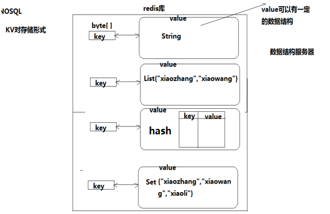

# Redis

Redis 与其他key - value缓存产品有以下三个特点：

- 支持数据的持久化，可以将内存中的数据保存在磁盘中，重启的时候可以再次加载进行使用。
- 不仅仅支持简单的key-value类型的数据，同时还提供list，set，zset，hash等数据结构的存储。
- 支持数据的备份，即master-slave模式的数据备份。

## Redis 优势

- 性能极高 – Redis能读的速度是110000次/s,写的速度是81000次/s 。
  - 数据在内存中，MySQL的数据在硬盘中
- 丰富的数据类型 – Redis支持二进制案例的 Strings, Lists, Hashes, Sets 及 Ordered Sets 数据类型操作。
- 原子 – Redis的所有操作都是原子性的。
- 丰富的特性 – Redis还支持 publish/subscribe, 通知, key 过期等等特性。

## Redis 应用场景

- 用来做缓存(ehcache/memcached)——redis的所有数据是放在内存中的（内存数据库）
- 可以在某些特定应用场景下替代传统数据库——比如社交类的应用
- 在一些大型系统中，巧妙地实现一些特定的功能：session共享、购物车

### 计数器

可以对 String 进行自增自减运算，从而实现计数器功能。

Redis 这种内存型数据库的读写性能非常高，很适合存储频繁读写的计数量。

### 缓存

将热点数据放到内存中，设置内存的最大使用量以及淘汰策略来保证缓存的命中率。

### 查找表

例如 DNS 记录就很适合使用 Redis 进行存储。

查找表和缓存类似，也是利用了 Redis 快速的查找特性。但是查找表的内容不能失效，而缓存的内容可以失效，因为缓存不作为可靠的数据来源。

### 消息队列

List 是一个双向链表，可以通过 lpush 和 rpop 写入和读取消息

不过最好使用 Kafka、RabbitMQ 等消息中间件。

### 会话缓存

可以使用 Redis 来统一存储多台应用服务器的会话信息。

当应用服务器不再存储用户的会话信息，也就不再具有状态，一个用户可以请求任意一个应用服务器，从而更容易实现高可用性以及可伸缩性。

### 分布式锁实现

在分布式场景下，无法使用单机环境下的锁来对多个节点上的进程进行同步。

可以使用 Redis 自带的 SETNX 命令实现分布式锁，除此之外，还可以使用官方提供的 RedLock 分布式锁实现。

### 其它

Set 可以实现交集、并集等操作，从而实现共同好友等功能。

ZSet 可以实现有序性操作，从而实现排行榜等功能。

## 数据淘汰策略

可以设置内存最大使用量，当内存使用量超出时，会施行数据淘汰策略。

Redis 具体有 6 种淘汰策略：

|      策略       |                         描述                         |
| :-------------: | :--------------------------------------------------: |
|  volatile-lru   | 从已设置过期时间的数据集中挑选最近最少使用的数据淘汰 |
|  volatile-ttl   |   从已设置过期时间的数据集中挑选将要过期的数据淘汰   |
| volatile-random |      从已设置过期时间的数据集中任意选择数据淘汰      |
|   allkeys-lru   |       从所有数据集中挑选最近最少使用的数据淘汰       |
| allkeys-random  |          从所有数据集中任意选择数据进行淘汰          |
|   noeviction    |                     禁止驱逐数据                     |

作为内存数据库，出于对性能和内存消耗的考虑，Redis 的淘汰算法实际实现上并非针对所有 key，而是抽样一小部分并且从中选出被淘汰的 key。

使用 Redis 缓存数据时，为了提高缓存命中率，需要保证缓存数据都是热点数据。可以将内存最大使用量设置为热点数据占用的内存量，然后启用 allkeys-lru 淘汰策略，将最近最少使用的数据淘汰。

Redis 4.0 引入了 volatile-lfu 和 allkeys-lfu 淘汰策略，LFU 策略通过统计访问频率，将访问频率最少的键值对淘汰。

## 持久化

Redis 是内存型数据库，为了保证数据在断电后不会丢失，需要将内存中的数据持久化到硬盘上。

### RDB 持久化

将某个时间点的所有数据都存放到硬盘上。

可以将快照复制到其它服务器从而创建具有相同数据的服务器副本。

如果系统发生故障，将会丢失最后一次创建快照之后的数据。

如果数据量很大，保存快照的时间会很长。

### AOF 持久化

将写命令添加到 AOF 文件（Append Only File）的末尾。

使用 AOF 持久化需要设置同步选项，从而确保写命令同步到磁盘文件上的时机。这是因为对文件进行写入并不会马上将内容同步到磁盘上，而是先存储到缓冲区，然后由操作系统决定什么时候同步到磁盘。有以下同步选项：

|   选项   |         同步频率         |
| :------: | :----------------------: |
|  always  |     每个写命令都同步     |
| everysec |       每秒同步一次       |
|    no    | 让操作系统来决定何时同步 |

- always 选项会严重减低服务器的性能；
- everysec 选项比较合适，可以保证系统崩溃时只会丢失一秒左右的数据，并且 Redis 每秒执行一次同步对服务器性能几乎没有任何影响；
- no 选项并不能给服务器性能带来多大的提升，而且也会增加系统崩溃时数据丢失的数量。

随着服务器写请求的增多，AOF 文件会越来越大。Redis 提供了一种将 AOF 重写的特性，能够去除 AOF 文件中的冗余写命令。

## NoSQL

- 泛指非关系型的数据库
- 不支持SQL语法
- 存储结构跟传统关系型数据库中的那种关系表完全不同，nosql中存储的数据都是KV形式
- NoSQL的世界中没有一种通用的语言，每种nosql数据库都有自己的api和语法，以及擅长的业务场景
- NoSQL中的产品种类相当多：
  - Redis
  - Mongodb
  - Hbase hadoop
  - Cassandra hadoop

### NoSQL和SQL数据库的比较

- 适用场景不同：sql数据库适合用于关系特别复杂的数据查询场景，nosql反之
- 事务特性的支持：sql对事务的支持非常完善，而nosql基本不支持事务
- 两者在不断地取长补短，呈现融合趋势

## Redis 安装和配置

### 使用指定配置文件

```bash
wget http://download.redis.io/releases/redis-6.0.6.tar.gz # 下载
tar xzf redis-4.0.9.tar.gz # 解压
sudo mv ./redis-4.0.9 /usr/local/redis/ # 放到usr/local⽬录下
cd /usr/local/redis/ # 进⼊redis⽬录
sudo make # 生成
sudo make test # 测试，这段运行时间会较长
sudo make install # 安装，将redis的命令安装到/usr/local/bin/⽬录
cd /usr/local/bin # 安装完成后，我们进入目录/usr/local/bin中查看
ls -all 
:<< BLOCK'
redis-server redis服务器
redis-cli redis命令行客户端
redis-benchmark redis性能测试工具
redis-check-aof AOF文件修复工具
redis-check-rdb RDB文件检索工具
'BLOCK
# 配置⽂件，移动到/etc/⽬录下
sudo cp /usr/local/redis/redis.conf /etc/redis/ # 配置文件目录为/usr/local/redis/redis.conf
----------------------------------配置文件说明------------------------------------------------------
bind 127.0.0.1 //绑定ip：如果需要远程访问，可将此⾏注释，或绑定⼀个真实ip
port 6379 //端⼝，默认为6379
:<< BLOCK'
是否以守护进程运行
如果以守护进程运行，则不会在命令行阻塞，类似于服务
如果以非守护进程运行，则当前终端被阻塞
设置为yes表示守护进程，设置为no表示非守护进程
推荐设置为yes
'BLOCK
daemonize yes # 以守护进程方式在后台启动Redis
dbfilename dump.rdb # 数据文件
dir /var/lib/redis # 数据文件存储路径
logfile "/var/log/redis/redis-server.log" # 日志文件
database 16 # 数据库，默认有16个
slaveof # 主从复制，类似于双机备份
----------------------------------其他一些未设置的配置------------------------------------------------------
bind 0.0.0.0 # 允许连接的IP (开放全部IP可能造成一些安全问题，可结合iptables进行控制访问)
requirepass 1djdgQL@ # 更改密码
----------------------------------关于注册服务------------------------------------------------------
可以参考一下博客如何在Ubuntu20.04上注册服务。虽然我将redis-6.0.6/utils/redis_init_script复制到了/etc/init.d/redis文件，但是我没有设置环境变量也没有配置服务
```

### 从软件仓库中安装的Redis使用init.d脚本启动

```bash
/etc/init.d/redis-server start
```

## Redis 运行

```bash
redis-server /etc/redis.conf # 指定加载的配置文件。开启客户端要确保服务端启动   
redis-cli # 等同于redis-cli -h 127.0.0.1 -p 6379 -a 1djdgQL@（默认设置）
ping # 测试连接。返回PONG表示畅通
redis-server --help
ps aux | grep redis # 查看redis服务器进程
sudo kill -9 pid # 杀死redis服务器进程。因为我设置了以守护进程方式在后台启动
/etc/init.d/redis-server stop # 软件仓库安装的Redis可采用init.d脚本关闭。或者直接sudo service redis stop/restart/start，在init.d下确认下服务名，可能不是redis
redis-cli --help
quit 或者 Ctrl+d 或者 Ctrl+c退出
# 切换数据库
# 数据库没有名称，默认有16个，通过0-15来标识，连接redis默认选择第一个数据库
select 15
```

## Redis 数据类型

### 数据结构和数据操作

redis是key-value的数据结构，每条数据都是一个键值对。键的类型是字符串。注意：键不能重复

值的类型分为五种：

- 字符串string
- 哈希hash
- 列表list
- 集合set
- 有序集合zset



数据操作

- 保存
- 修改
- 获取
- 删除

### 键命令

**在python redis库中的方法**

- exists
- type
- ==**delete**==
- expire
- getrange
- ttl
- keys()

```sql
-- 查找键，参数⽀持正则表达式
keys pattern
-- 例：查看所有键
keys *
-- 例：查看名称中包含a的键
keys a*
-- 判断键是否存在，如果存在返回1，不存在返回0
exists key1
-- 例：判断键a1是否存在
exists a1
-- 查看键对应的value的类型
type key
-- 例：查看键a1的值类型，为redis⽀持的五种类型中的⼀种
type a1

-- 删除键及对应的值
del key1 key2 ...
-- 例：删除键a2、a3
del a2 a3

-- 设置过期时间，以秒为单位
-- 如果没有指定过期时间则⼀直存在，直到使⽤DEL移除
expire key seconds
-- 例：设置键a1的过期时间为3秒
expire a1 3
-- 看有效时间，以秒为单位
ttl key
-- 例：查看键bb的有效时间
ttl bb
-- 修改key的名称
rename key newkey
```

### string

字符串类型是Redis中最为基础的数据存储类型，它在Redis中是二进制安全的，这便意味着该类型可以接受任何格式的数据，如JPEG图像数据或JSON对象描述信息等。在Redis中字符串类型的value最多可以容纳的数据长度是512M。

**在python redis库中的方法**

- set
- setex
- mset
- append
- get
- mget

```sql
-- 查看set帮助
help set
--------------------------------------修改/添加------------------------------------------------
-- 如果设置的键不存在则为添加，如果设置的键已经存在则修改
-- 设置键值
set key value
-- 例：设置键为name值为itcast的数据
set name itcast
-- 设置键值及过期时间，以秒为单位
setex key seconds value
-- 例：设置键为aa值为aa过期时间为3秒的数据
setex aa 3 aa
-- 设置多个键值
mset key1 value1 key2 value2 ...
-- 例：设置键为a1值为python、键为a2值为java、键为a3值为c
mset a1 python a2 java a3 c
-- 追加值
append key value
-- 例：向键为a1中追加值haha
append a1 haha
--------------------------------------获取------------------------------------------------
-- 获取：根据键获取值，如果不存在此键则返回nil
get key
-- 例：获取键name的值
get name
-- 根据多个键获取多个值
mget key1 key2 ...
-- 例：获取键a1、a2、a3的值
mget a1 a2 a3
```

### hash

hash用于存储对象，对象的结构为属性、值。值的类型为string

**在python redis库中的方法**

- hset
- hmset
- hkeys
- hget
- hmget
- hvals
- hdel

```sql
--------------------------------------修改/添加------------------------------------------------
-- 设置单个属性
hset key field value
-- 例：设置键 user的属性name为itheima
hset user name itheima
-- 设置多个属性
hmset key field1 value1 field2 value2 ...
-- 例：设置键u2的属性name为itcast、属性age为11
hmset u2 name itcast age 11
--------------------------------------获取------------------------------------------------
-- 获取指定键的所有属性
hkeys key
-- 例：获取键u2的所有属性
hkeys u2
-- 获取指定键所有的属性和值
hgetall key
-- 获取所有属性的值
hvals key
-- 例：获取键u2所有属性的值
hvals u2
-- 获取⼀个属性的值
hget key field
-- 例：获取键u2属性name的值
hget u2 name
-- 获取多个属性的值
hmget key field1 field2 ...
-- 例：获取键u2属性name、age的值
hmget u2 name age
--------------------------------------删除------------------------------------------------
-- 删除整个hash键及值，使⽤del命令
-- 删除属性，属性对应的值会被⼀起删除
hdel key field1 field2 ...
-- 例：删除键u2的属性age
hdel u2 age
```

### list

列表的元素类型为string。按照插入顺序排序

**在python redis库中的方法**

- lpush
- rpush
- linsert
- lrange
- lset
- lrem

```sql
--------------------------------------修改/添加------------------------------------------------
-- 在左侧插⼊数据
lpush key value1 value2 ...
-- 例：从键为a1的列表左侧加⼊数据a 、 b 、c
lpush a1 a b c
-- 在右侧插⼊数据
rpush key value1 value2 ...
-- 例：从键为a1的列表右侧加⼊数据0、1
rpush a1 0 1
-- 在指定元素的前或后插⼊新元素
linsert key before/after 现有元素 新元素
-- 例3：在键为a1的列表中元素b前加⼊3
linsert a1 before b 3
--------------------------------------获取------------------------------------------------
-- 返回列表⾥指定范围内的元素
-- start、stop为元素的下标索引
-- 索引从左侧开始，第⼀个元素为0
-- 索引可以是负数，表示从尾部开始计数，如-1表示最后⼀个元素
lrange key start stop
-- 例：获取键为a1的列表所有元素
lrange a1 0 -1
-- 设置指定索引位置的元素值
-- 索引从左侧开始，第⼀个元素为0
-- 索引可以是负数，表示尾部开始计数，如-1表示最后⼀个元素
lset key index value
-- 例：修改键为a1的列表中下标为1的元素值为z
lset a 1 z
-- 获取指定索引的值
lindex key index
--------------------------------------删除------------------------------------------------
-- 删除指定元素
-- 将列表中前count次出现的值为value的元素移除
-- count > 0: 从左往右删
-- count < 0: 从右往左删
-- count = 0: 移除所有
lrem key count value
-- 例1：向列表a2中加⼊元素a、b、a、b、a、b
lpush a2 a b a b a b
-- 例2：从a2列表右侧开始删除2个b
lrem a2 -2 b
-- 例3：查看列表a2的所有元素
lrange a2 0 -1
-- 移除第一个(最左边)的值，返回移除的值
lpop key
```

### set

- 无序集合
- 元素为string类型
- 元素具有唯⼀性，不重复
- 说明：对于集合没有修改操作

**在python redis库中的方法**

- sadd
- smembers
- srem

```sql
--------------------------------------添加------------------------------------------------
sadd key member1 member2 ...
--例：向键a3的集合中添加元素zhangsan、lisi、wangwu
sadd a3 zhangsan sili wangwu
--------------------------------------获取------------------------------------------------
-- 返回所有的元素
smembers key
-- 例：获取键a3的集合中所有元素
smembers a3
-- 获取元素是否在集合中，返回1/0
sismember key member
--------------------------------------删除------------------------------------------------
-- 删除指定元素
srem key member
-- 例：删除键a3的集合中元素wangwu
srem a3 wangwu
```

### zset

- sorted set，有序集合
- 元素为string类型
- 元素具有唯⼀性，不重复
- 每个元素都会关联⼀个double类型的score，表示权重，通过权重将元素从小到大排序
- 说明：没有修改操作

**在python redis库中的方法**

- zadd
- zrange
- zrangebyscore
- zscore
- zrem
- zremrangebyscore

```sql
--------------------------------------添加------------------------------------------------
zadd key score1 member1 score2 member2 ...
-- 例：向键a4的集合中添加元素lisi、wangwu、zhaoliu、zhangsan，权重分别为4、5、6、3
zadd a4 4 lisi 5 wangwu 6 zhaoliu 3 zhangsan
--------------------------------------获取------------------------------------------------
-- 返回指定范围内的元素
-- start、stop为元素的下标索引
-- 索引从左侧开始，第⼀个元素为0
-- 索引可以是负数，表示从尾部开始计数，如-1表示最后⼀个元素
zrange key start stop [withscores]
-- 例：获取键a4的集合中所有元素
zrange a4 0 -1 withscores
-- 返回score值在min和max之间的成员。包括min和max
zrangebyscore key min max [withscores]
-- 例：获取键a4的集合中权限值在5和6之间的成员
zrangebyscore a4 5 6 withscores
-- 返回成员member的score值
zscore key member
-- 例：获取键a4的集合中元素zhangsan的权重
zscore a4 zhangsan
--------------------------------------删除------------------------------------------------
-- 删除指定元素
zrem key member1 member2 ...
-- 例：删除集合a4中元素zhangsan
zrem a4 zhangsan
-- 删除权重在指定范围的元素，包括min和max
zremrangebyscore key min max
-- 例：删除集合a4中权限在5、6之间的元素
zremrangebyscore a4 5 6
```

## 与python交互

```python
import redis
if __name__ == '__main__':
    # 创建redis的连接实例
    # 我们在连接/获取外界资源的时候一定要注意使用try
    try:
    	rs = redis.Redis()
    except Exception as e:
        print(e)
    # 操作string
    result = rs.set('test','testinfo')
    info = rs.get('test')
    print(info)

# 集群
from rediscluster import RedisCluster
if __name__ == '__main__':
    nodes = [{'host':'192.168.157.128','port':'7000'},
             {'host':'192.168.157.128','port':'7001'},
             {'host':'192.168.157.128','port':'7002'}]
    
    try:
        # 创建集群实例
        src = RedisCluster(startup_nodes = nodes)
    except Exception as e:
        print(e)
        
    result = src.set('age', 15)
    print(result)
```

## 搭建主从

- ⼀个master可以拥有多个slave，⼀个slave又可以拥有多个slave，如此下去，形成了强大的多级服务器集群架构
- master用来写数据，slave用来读数据，经统计：网站的读写比率是10:1
- 通过主从配置可以实现读写分离。**从服务器上是只读的**
- master和slave都是一个redis实例(redis服务)

```bash
ifconfig # 查看当前主机的ip地址
# 修改/etc/redis/redis.conf文件
sudo vi redis.conf
bind 192.168.157.128 127.0.0.1

# 重启redis服务
sudo service redis stop # 用kill
sudo redis-server redis.conf
---------------------------------------配置从-------------------------------------------------
sudo cp redis.conf ./slave.conf # 复制/etc/redis/redis.conf文件
# 修改redis/slave.conf文件
sudo vi slave.conf
# 编辑内容
bind 192.168.157.128
slaveof 192.168.157.128 6379
port 6378

sudo redis-server slave.conf # 启动replica服务
redis-cli -h 192.168.157.128 info replication # 查看主从关系
---------------------------------------数据操作-------------------------------------------------
redis-cli -h 192.168.26.128 -p 6379 # 进入主客户端
redis-cli -h 192.168.26.128 -p 6378 # 进入从的客户端
```

## 搭建集群

**为什么要有集群**

- 之前我们已经讲了主从的概念，一主可以多从，如果同时的访问量过大(1000w),主服务肯定就会挂掉，数据服务就挂掉了或者发生自然灾难
- 大公司都会有很多的服务器(华东地区、华南地区、华中地区、华北地区、西北地区、西南地区、东北地区、台港澳地区机房)

**集群的概念**

- 集群是一组相互独立的、通过高速网络互联的计算机，它们构成了一个组，并以单一系统的模式加以管理。一个客户与集群相互作用时，集群像是一个独立的服务器。集群配置是用于提高可用性和可缩放性。 
- 当请求到来首先由负载均衡服务器处理，把请求转发到另外的一台服务器上

### redis集群

**分类**

- 软件层面：只有一台电脑，在这一台电脑上启动了多个redis服务
- 硬件层面：存在多台实体的电脑，每台电脑上都启动了一个redis或者多个redis服务

#### 配置机器

另一台机器更换ip即可

```bash
----------------------------------7000.conf-----------------------------
port 7000 # 端口号
bind 172.16.179.130 # 访问的ip
daemonize yes # 是否以守护进程方式后台运行
pidfile /var/run/redis_7000.pid # pid文件
cluster-enabled yes # 是否使用集群
cluster-config-file 7000_node.conf # 集群的文件
cluster-node-timeout 15000 # 集群的超过时间。默认15秒，可自行设置
appendonly yes # 备份相关 aof日志开启  有需要就开启，它会每次写操作都记录一条日志　
----------------------------------7001.conf-----------------------------
port 7001
bind 172.16.179.130
daemonize yes
pidfile /var/run/redis_7001.pid
cluster-enabled yes
cluster-config-file 7001_node.conf
cluster-node-timeout 15000
appendonly yes
----------------------------------7002.conf-----------------------------
port 7002
bind 172.16.179.130
daemonize yes
pidfile /var/run/redis_7002.pid
cluster-enabled yes
cluster-config-file 7002_node.conf
cluster-node-timeout 15000
appendonly yes
----------------------------------启动redis服务-----------------------------
redis-server 7000.conf
redis-server 7001.conf
redis-server 7002.conf
```

#### 创建集群

- redis的安装包中包含了**redis-trib.rb**，用于创建集群

- 接下来的操作在**172.16.179.130**机器上进行

- 将命令复制，这样可以在任何目录下调用此命令
  
  - `sudo cp /usr/share/doc/redis-tools/examples/redis-trib.rb /usr/local/bin/`
  
- 安装ruby环境，因为redis-trib.rb是用ruby开发的
  
  - `sudo apt-get install ruby`
  
- 运行如下命令创建集群

  - ```bash
  #  1表示创建的集群是1主1从
    redis-trib.rb create --replicas 1 172.16.179.130:7000 172.16.179.130:7001 172.16.179.130:7002 172.16.179.131:7003 172.16.179.131:7004 172.16.179.131:7005
    ```

- 执行上面这个指令在某些机器上可能会报错,主要原因是由于安装的ruby不是最新版本!

  - 天朝的防火墙导致无法下载最新版本,所以需要设置 gem的源

  - 解决办法如下

  - ```bash
    #  先查看自己的gem源是什么地址
    gem source -l # 如果是https://rubygems.org/就需要更换
    #  更换指令为
    gem sources --add https://gems.ruby-china.com/ --remove https://rubygems.org/
    #  通过gem安装redis的相关依赖
    sudo gem install redis
    #  然后重新执行指令
    redis-trib.rb create --replicas 1 172.16.179.130:7000 172.16.179.130:7001 172.16.179.130:7002 172.16.179.131:7003 172.16.179.131:7004 172.16.179.131:7005
    ```

- 在172.16.179.131机器上连接7002(slave)，加参数`-c`表示连接到集群

  - `redis-cli -h 172.16.179.131 -c -p 7002`

- 写入数据

  - `set name itheima`

- 自动跳到了7003(master对应的slave是7002)服务器，并写入数据成功

- 在7003(master)可以获取数据，如果写入数据又重定向到7000(master)(负载均衡)


#### 在哪个服务器上写数据：CRC16

- redis cluster在设计的时候，就考虑到了去中心化，去中间件，也就是说，集群中的每个节点都是平等的关系，都是对等的，每个节点都保存各⾃的数据和整个集群的状态。每个节点都和其他所有节点连接，而且这些连接保持活跃，这样就保证了我们只需要连接集群中的任意一个节点，就自可以获取到其他节点的数据
- Redis集群没有并使用传统的一致性哈希来分配数据，而是采用另外⼀种叫做哈希槽 (hash slot)的方式来分配的。redis cluster默认分配了16384个slot，当我们set一个key 时，会用CRC16算法来取模得到所属的slot，然后将这个key分到哈希槽区间的节点上，具体算法就是：CRC16(key)%16384。所以我们在测试的时候看到set和get的时候，直接跳转到了7000端口的节点
- Redis集群会把数据存在一个master节点，然后在这个master和其对应的salve之间进行数据同步。当读取数据时，也根据一致性哈希算法到对应的master节点获取数据。只有当一个master 挂掉之后，才会启动一个对应的salve节点，充当master
- 需要注意的是：必须要3个或以上的主节点，否则在创建集群时会失败，并且当存活的主节点数小于总节点数的一半时，整个集群就无法提供服务了

# 可能出现的错误

> MISCONF Redis is configured to save RDB snapshots, but is currently not able to persist on disk. Commands that may modify the data set are disabled. Please check Redis logs for details about the error.
>
> Redis被配置为保存数据库快照，但它目前不能持久化到硬盘。用来修改集合数据的命令不能用

原因： 强制关闭Redis快照导致不能持久化。

解决方案： 运行config set stop-writes-on-bgsave-error no命令后，关闭配置项stop-writes-on-bgsave-error解决该问题。