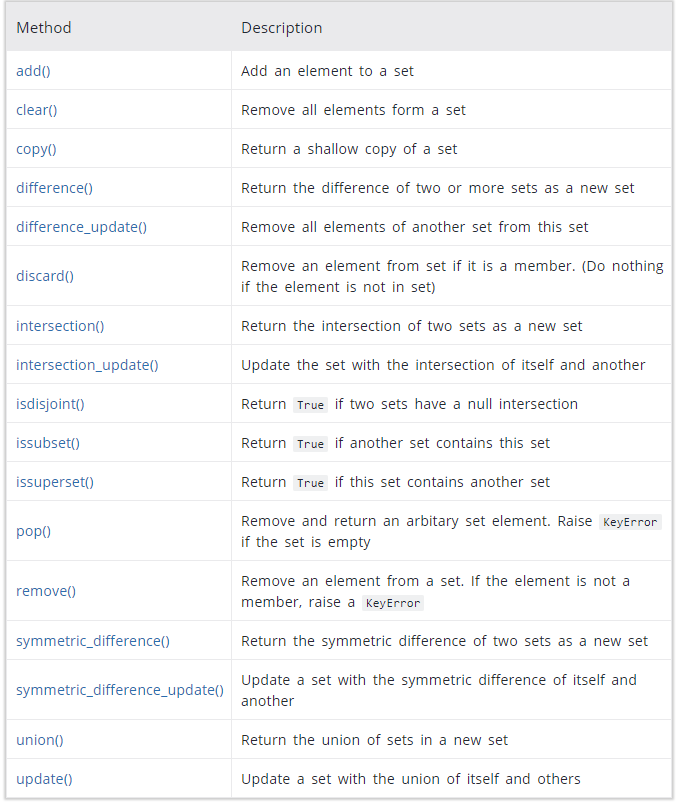
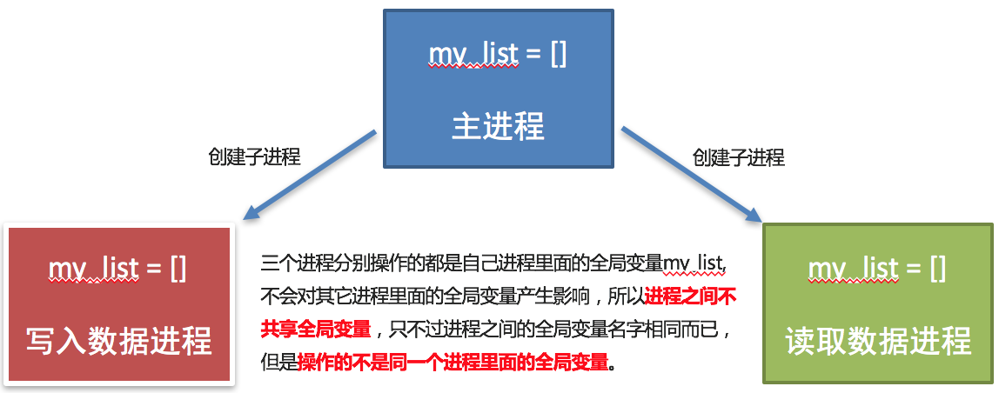

# Python基础

## 标识符

标识符命名规则是Python中定义各种名字的时候的统一规范，具体如下：

- 由数字、字母、下划线组成
- 不能数字开头
- 不能使用内置关键字
- 严格区分大小写

```python
False     None    True   and      as       assert   break     class  
continue  def     del    elif     else     except   finally   for
from      global  if     import   in       is       lambda    nonlocal
not       or      pass   raise    return   try      while     with  
yield
```

## 输入和输出

### 输入

```s = input('请输入你的姓名')```

在Python中，`input`会把接收到的任意用户输入的数据都当做字符串处理。

### 格式化输出

- ```%06d```，表示输出的整数显示位数，不足以0补全，超出当前位数则原样输出
- ```%.2f```，表示小数点后显示的小数位数。
- ```end=''```结尾, ```sep=''```分隔

| 格式符号 |          转换          |
| :------: | :--------------------: |
|  **%s**  |         字符串         |
|  **%d**  |   有符号的十进制整数   |
|  **%f**  |         浮点数         |
|    %c    |          字符          |
|    %u    |    无符号十进制整数    |
|    %o    |       八进制整数       |
|    %x    | 十六进制整数（小写ox） |
|    %X    | 十六进制整数（大写OX） |
|    %e    | 科学计数法（小写'e'）  |
|    %E    | 科学计数法（大写'E'）  |
|    %g    |      %f和%e的简写      |
|    %G    |      %f和%E的简写      |

### f-字符串/```format```

```python
# 百分比
f = 0.42542352
print(f"百分比示例 {f:2.2%}") # 百分比示例 42.54%
print("百分比示例 {:2.2%}".format(f)) # 百分比示例 42.54%

print(f"小数示例{32.5645:.^20.4}") # 小数示例.......32.56........
print(f"整数示例{32:.^20d}") # 整数示例.........32.........
print("小数示例{0:.^20.4f}".format(32.5645)) # 小数示例......32.5645.......
x = 10
print(f"{x} is {'even' if x%2 == 0 else 'odd'}")

# 索引
d = [10, 15, 20]
print(f"小明今年{d[0]}岁，小红今年{d[1]}岁，小强今年{d[2]}岁")
print("小明今年{0[0]}岁，小红今年{0[1]}岁，小强今年{0[2]}岁".format(d))

print(1, 2, 3, 4, sep = '--', end = '/')
print(5, 6, 7, 8, sep = 'x', end = '**') #1--2--3--4/5x6x7x8**

msg=['wang',10]
'my name is {0}, {0} age is {1}'.format(*msg) # my name is wang, wang age is 10
msg={'name':'wang','age':10}
'my name is {name}, {name} age is {age}'.format(**msg) # my name is wang, wang age is 10
# 左对齐
'{:*<10}'.format('分割线')
# 居中
'{:*^10}'.format('分割线')
# 右对齐
'{:*>10}'.format('分割线')
# 输出二进制
'{0:b}'.format(10) # 1010
# 输出千分位分隔符
'{:,}'.format(12369132698) # 12,369,132,698

hw12 = '%s %s %d' % ('hello', 'world', 12) # hello world 12
```

## 数据转换类型

|         函数          |                             说明                             |
| :-------------------: | :----------------------------------------------------------: |
|  **int(x [,base])**   |                      将x转换为一个整数                       |
|       float(x)        |                     将x转换为一个浮点数                      |
| complex(real [,imag]) |             创建一个复数，real为实部，imag为虚部             |
|        str(x)         |                    将对象 x 转换为字符串                     |
|        repr(x)        | 用于生成解释器可读的表示（如果没有等效的语法，则会强制执行 SyntaxError） |
|     **eval(str)**     |     用来计算在字符串中的有效Python表达式,并返回一个对象      |
|       tuple(s)        |                   将序列 s 转换为一个元组                    |
|        list(s)        |                   将序列 s 转换为一个列表                    |
|        chr(x)         |               将一个整数转换为一个Unicode字符                |
|      **ord(x)**       |               将一个字符转换为它的ASCII整数值                |
|        hex(x)         |              将一个整数转换为一个十六进制字符串              |
|        oct(x)         |               将一个整数转换为一个八进制字符串               |
|      **bin(x)**       |               将一个整数转换为一个二进制字符串               |

```python
#eval() -- 将字符串中的数据转换成Python表达式原本类型
str1 = '10'
str2 = '[1, 2, 3]'
str3 = '(1000, 2000, 3000)'
print(type(eval(str1)))
print(type(eval(str2)))
print(type(eval(str3)))
```

## 运算符

### 算术运算符

混合运算优先级顺序：`()` > `**` > `*` `/` `//` `%` > `+` `-`

| 运算符 | 描述 |                  实例                  |
| :----: | :--: | :------------------------------------: |
|   /    |  除  |  1 / 9 输出结果为 0.1111111111111111   |
|   //   | 取整 |           9 // 4 输出结果为2           |
|   %    | 取余 |           9 % 4 输出结果为 1           |
|   **   | 指数 | 2 ** 4 输出结果为 16，即 2 * 2 * 2 * 2 |

### 赋值运算符

To do any parallel assignment, python

1. first computes all the values of the expressions/objects on the right
2. second binds each name on the left to these computed values/objects 

```python
l, (*m, n), *o = (1, ['a', 'b', 'c'], 2, 3, 4)
print(l, m, n, o) # 1 ['a', 'b'] c [2, 3, 4]
a, *b, c = [1, 2, 3, 4, 5]
print(a, b, c) # 1 [2, 3, 4] 5
a = b = 10 #多个变量赋相同值
```

### 复合赋值运算符

优先级

1. 先算复合赋值运算符右侧的表达式
2. 再算复合赋值运算的算数运算
3. 最后算赋值运算

| 运算符 |      描述      |            实例            |
| :----: | :------------: | :------------------------: |
|   /=   | 除法赋值运算符 |  c /= a 等价于 c = c / a   |
|  //=   | 整除赋值运算符 | c //= a 等价于 c = c // a  |
|   %=   | 取余赋值运算符 |  c %= a 等价于 c = c % a   |
|  **=   |  幂赋值运算符  | c ** = a 等价于 c = c ** a |

### 逻辑运算符

| 运算符 | 逻辑表达式 |                             描述                             |                   实例                   |
| :----: | :--------: | :----------------------------------------------------------: | :--------------------------------------: |
|  and   |  x and y   | 布尔"与"：如果 x 为 False，x and y 返回 False，否则它返回 y 的值。 |      True and False， 返回 False。       |
|   or   |   x or y   |  布尔"或"：如果 x 是 True，它返回 True，否则它返回 y 的值。  |       False or True， 返回 True。        |
|  not   |   not x    | 布尔"非"：如果 x 为 True，返回 False 。如果 x 为 False，它返回 True。 | not True 返回 False, not False 返回 True |
|   &    |            |                           bit and                            |                1 & 0 = 0                 |
|   \|   |            |                            bit or                            |                1 \| 0 = 1                |
|   ^    |            |                           bit xor                            |                1 ^ 1 = 0                 |
|   ~    |            |                           bit not                            |                ~1 =  -2?                 |
|   >>   |            |                         right shift                          |              128 >> 2 = 32               |
|   <<   |            |                          left shift                          |              32 << 2 = 128               |

### 数字之间的逻辑运算

```python
a = 0
b = 1
c = 2
# and运算符，只要有一个值为0，则结果为0，否则结果为最后一个非0数字
print(a and b)  # 0
print(b and a)  # 0
print(a and c)  # 0
print(c and a)  # 0
print(b and c)  # 2
print(c and b)  # 1
# or运算符，只有所有值为0结果才为0，否则结果为第一个非0数字
print(a or b)  # 1
print(a or c)  # 2
print(b or c)  # 1
# 这样记：and要看到最后一个是否为0，所以返回最后一个非0数字，or只要看第一个是否为0，所以第一个非0时，返回第一个非0数字
```

## 循环

- ```break```退出整个循环
- ```continue```退出本次循环，继续执行下一次循环的代码

### ```else: block-else```

指的是循环正常结束之后要执行的代码。如果是break终止循环的情况，else下方缩进的代码将不执行。而continue是退出当前一次循环，继续下一次循环，所以该循环在continue控制下是可以正常结束的，当循环结束后，则执行了else缩进的代码。

```python
# else:block-else in while loop
while 条件:
    条件成立重复执行的代码
else:
    循环正常结束之后要执行的代码
# else:block-else in for loop
for 临时变量 in 序列:
    重复执行的代码
else:
    循环正常结束之后要执行的代码
# 举例
for i in range(100):
    if special_property(i):
        print(f'{i} is the first value with the special property')
        break
else:
    print('No value in the range had the special property')
# 等价于
found_one = False
for i in range(100):
    if special_property(i):
        print(f'{i} is the first value with the special property')
        found_one = True
        break
if not found_one:
    print('No value in the range had the special property')
```

## 数据类型

```type()```查看数据类型

### 引用

Python中函数参数是引用传递（注意不是值传递）。对于不可变类型（数值型、字符串、元组），因变量不能修改，所以运算不会影响到变量自身；而对于可变类型（列表字典）来说，函数体运算可能会更改传入的参数变量

我们可以用`id()`来判断两个变量是否为同一个值的引用。 我们可以将id值理解为那块内存的地址标识。

```id(a) == id(b)```相当于```a is b```

```python
# 1. int类型
a = 10 ** 100
b = 10 ** 100
print(a is b) # False
print(id(a) == id(b)) # False

# 2. 列表
aa = [10, 20]
bb = aa
print(id(aa))  # 2325297783432
print(id(bb))  # 2325297783432
aa.append(30)
print(bb)  # [10, 20, 30], 列表为可变类型
print(id(aa))  # 2325297783432
print(id(bb))  # 2325297783432
```

### copy和deepcopy

- 浅拷贝使用`copy.copy`函数
- 深拷贝使用`copy.deepcopy`函数
- 不管是给对象进行深拷贝还是浅拷贝，只要拷贝成功就会开辟新的内存空间存储拷贝的对象。
- 浅拷贝和深拷贝的区别是:
  - 浅拷贝最多拷贝对象的一层，深拷贝可能拷贝对象的多层。

**浅拷贝**

- `copy`函数是浅拷贝，只对可变类型的第一层对象进行拷贝，对拷贝的对象开辟新的内存空间进行存储，不会拷贝对象内部的子对象。
- **不可变类型进行浅拷贝不会给拷贝的对象开辟新的内存空间，而只是拷贝了这个对象的引用。**

- Note that ```copy``` is shallow. That means the "copy" is a new object, but that object stores all the references from the "object being copied". 

- In a deep copy, all the mutable objects referred to are copied, but the immutable ones referred to are not copied.

```python
import copy  # 使用浅拷贝需要导入copy模块
# 对于不可变类型进行浅拷贝实际上是对引用的一个拷贝，两个变量指定的是一个内存地址
a1 = (1, 2)
c1 = (1, 2)
b1 = copy.copy(a1)  # 使用copy模块里的copy()函数就是浅拷贝了
# 等于直接b1=a1
print(a1 is b1) # True
print(a1 is c1) # False

l1 = [1, 2, 3, [14, 16, 19]]
l2 = [1, 2, 3, [14, 16, 19]]
l3 = copy.copy(l1)
print(id(l1) == id(l2)) # False
print(l1 is l2) # False
# 注意：只对最外层拷贝，里面的一层不拷贝
print(l1[3] is l3[3]) # True
l1[3].append(20)
print(l1, l3) # [1, 2, 3, [14, 16, 19, 20]] [1, 2, 3, [14, 16, 19, 20]]
```

**深拷贝**

- `deepcopy`函数是深拷贝, 只要发现对象有可变类型就会对该对象到最后一个可变类型的每一层对象就行拷贝, 对每一层拷贝的对象都会开辟新的内存空间进行存储。
- 不可变类型进行深拷贝**如果子对象没有可变类型则不会进行拷贝，而只是拷贝了这个对象的引用**，否则会对该对象到最后一个可变类型的每一层对象就行拷贝, 对每一层拷贝的对象都会开辟新的内存空间进行存储

```python
from copy import deepcopy
a1 = 12
b1 = 12
c1 = deepcopy(a1)
print(a1 is b1) # True
print(a1 is c1) # True

t1 = (1, [1, 2])
t2 = deepcopy(t1)
print(t1 is t2) # False
print(t1[0] is t2[0]) # True

l1 = [1, 2, 3, [4, 5]]
l2 = deepcopy(l1)
print(l1 is l2) # False
print(l1[3] is l2[3]) # False
```


### 可变(mutable)和不可变(hashable)类型

- small integer objects are unique in Python
  - if we write ```x=10**100``` and ```y=10**100``` then ```x is y``` is ```False```. 
  - To save space, Python allocates only one object for each small int. When a small int is computed, Python first looks to see if an object with that value already exists, and if it does, returns a reference to it; if it doesn't, it makes a new object storing that values and returns a  reference to it.
- lists always allocate new objects
  - if we write ```x=['a']``` and ```y=['a']```, then ```x is y``` evaluates to ```False```
- tuples have no mutator methods, but if a tuple contains mutable data, you can mutate the mutable data part.
- 因为列表是可变类型，可以在原有内存的基础上修改数据，并且修改后内存地址不变，所以不需要加上`global`关键字，加上`global`表示要修改全局变量的内存地址

### 切片

切片是指对操作的对象截取其中一部分的操作。**字符串、列表、元组**都支持切片操作。

语法：```序列[开始位置下标:结束位置下标:步长]```

注意

1. 不包含结束位置下标对应的数据， 正负整数均可；
2. 步长是选取间隔，正负整数均可，默认步长为1。

```python
name = "abcdefg"
print(name[2:5:1])  # cde
print(name[2:5])  # cde
print(name[:5])  # abcde
print(name[1:])  # bcdefg
print(name[:])  # abcdefg
print(name[::2])  # aceg
print(name[:-1])  # abcdef, 负1表示倒数第一个数据
print(name[-4:-1])  # def
print(name[::-1])  # gfedcba
lst = ['a', 'b', 'c', 'd', 'e'] 
print(lst[::2]) # ['a', 'c', 'e']
print(lst[1::2]) # ['b', 'd']
print(lst[3:1:-1]) # ['d', 'c']
print(lst[-1:1:-1]) # ['e', 'd', 'c']
```

### 公共运算符

| 运算符 |      描述      |      支持的容器类型      |
| :----: | :------------: | :----------------------: |
|   +    |      合并      |    字符串、列表、元组    |
|   *    |      复制      |    字符串、列表、元组    |
|   in   |  元素是否存在  | 字符串、列表、元组、字典 |
| not in | 元素是否不存在 | 字符串、列表、元组、字典 |

```python
# +
# 1. 字符串 
str1 = 'aa'
str2 = 'bb'
print(str1 + str2)  # aabb
# 2. 列表 
int_str_list = [1, 2, 'a', 'b']
int_list = [3, 4]
print(int_str_list + int_list) # [1, 2, 'a', 'b', 3, 4]
# 3. 元组 
t1 = (1, 2)
t2 = (10, 20)
print(t1 + t2)  # (1, 2, 10, 20)

# *
# 1. 字符串
print('-' * 10)  # ----------
# 2. 列表
list1 = ['hello']
print(list1 * 4)  # ['hello', 'hello', 'hello', 'hello']
# 3. 元组
t1 = ('world',)
print(t1 * 4)  # ('world', 'world', 'world', 'world')

# in/not in
# 1. 字符串
print('a' in 'abcd')  # True
print('a' not in 'abcd')  # False
# 2. 列表
list1 = ['a', 'b', 'c', 'd']
print('a' in list1)  # True
print('a' not in list1)  # False
# 3. 元组
t1 = ('a', 'b', 'c', 'd')
print('aa' in t1)  # False
print('aa' not in t1)  # True
```

### 公共方法

|          函数           |                             描述                             |
| :---------------------: | :----------------------------------------------------------: |
|          len()          |                      计算容器中元素个数                      |
|      del 或 del()       |                             删除                             |
|          max()          |                     返回容器中元素最大值                     |
|          min()          |                     返回容器中元素最小值                     |
| range(start, end, step) |      生成从start到end的数字，步长为 step，供for循环使用      |
|       enumerate()       | 函数用于将一个可遍历的数据对象(如列表、元组或字符串)组合为一个索引序列，同时列出数据和数据下标，一般用在 for 循环当中。 |

```python
# len()
# 4. 集合
s1 = {10, 20, 30}
print(len(s1))  # 3
# 5. 字典
dict1 = {'name': 'Rose', 'age': 18}
print(len(dict1))  # 2

# del
str1 = 'abcdefg'
del str1
print(str1) 

# min()/max()
str1 = 'abcdefg'
print(min(str1))  # a
print(min("abc", "abcd", key=lambda x: -len(x))) # 'abcd'

# range()
for i in range(20, 1, -2):
    print(i, end = " ") # 20 18 16 14 12 10 8 6 4 2 

# enumerate
for line_number, line in enumerate(open("file_name"), 1):
    process_file()
```

### string

- 控制台显示结果为`<class 'str'>`， 即数据类型为```str```(字符串)。
- 注意：数据按照是否能直接修改分为可变类型和不可变类型两种。字符串类型的数据修改的时候不能改变原有字符串，属于不能直接修改数据的类型即是不可变类型。
- In fact, we can not sort strings(they are immutable); we can not sort tuples(their order is immutable); we can not sort sets(they have no order, which actually allow them to operate more efficiently); we can not sort dicts(like sets, they have no order, which actually allow them to operate more efficiently)
- string的比较：先比较ASCII，若相同，则比较len。如```len(ant)```<```len(anteater)```，则```ant```<```anteater```

```python
# 三引号形式的字符串支持换行。
a = ''' i am Tom, 
        nice to meet you! '''

b = """ i am Rose, 
        nice to meet you! """

mystr = "hello world and itcast and itheima and Python"
# 判断
# startswith()：检查字符串是否是以指定子串开头，是则返回 True，否则返回 False。如果设置开始和结束位置下标，则在指定范围内检查。
# 字符串序列.startswith(子串, 开始位置下标, 结束位置下标)
print(mystr.startswith('hello', 5, 20)) # False
# endswith()：：检查字符串是否是以指定子串结尾，是则返回 True，否则返回 False。如果设置开始和结束位置下标，则在指定范围内检查。
# 字符串序列.endswith(子串, 开始位置下标, 结束位置下标)
print(mystr.endswith('Python', 2, 20)) # False
# isalpha()：如果字符串至少有一个字符并且所有字符都是字母则返回 True, 否则返回 False。
mystr2 = 'hello12345'
print(mystr2.isalpha()) # False
# isdigit()：如果字符串只包含数字则返回 True 否则返回 False。
print(mystr2.isdigit()) # False
# isalnum()：如果字符串至少有一个字符并且所有字符都是字母或数字则返回 True,否则返回 False。
print(''.isalnum()) # False
# isspace()：如果字符串中只包含空白，则返回 True，否则返回 False。
print(''.isspace()) # False

print('-------------------------------------------------------------------------------------------------------------------------')
# 查找
# find()：检测某个子串是否包含在这个字符串中，如果在返回这个子串开始的位置下标，否则则返回-1。
# 字符串序列.find(子串, 开始位置下标, 结束位置下标)
# 注意：开始和结束位置下标可以省略，表示在整个字符串序列中查找。
# 注意：index如果查找的数据不存在则报错，find则会返回-1。list没有find函数
# rfind()： 和find()功能相同，但查找方向为右侧开始。
print(mystr.find('and', 15, 30))  # 23
# index()：检测某个子串是否包含在这个字符串中，如果在返回这个子串开始的位置下标，否则则报异常。
# 字符串序列.index(子串, 开始位置下标, 结束位置下标)
# 注意：开始和结束位置下标可以省略，表示在整个字符串序列中查找。
# rindex()：和index()功能相同，但查找方向为右侧开始。
print(mystr.index('and', 15, 30))  # 23
# count()：返回某个子串在字符串中出现的次数
# 字符串序列.count(子串, 开始位置下标, 结束位置下标)
# 开始和结束位置下标可以省略，表示在整个字符串序列中查找。
print(mystr.count('and', 0, 20))  # 1

print('-------------------------------------------------------------------------------------------------------------------------')
# 修改
# replace()：替换
# 字符串序列.replace(旧子串, 新子串, 替换次数)
# 注意：替换次数如果超出子串出现次数，则替换次数为该子串出现次数。
print(mystr.replace('and', 'he')) # hello world he itcast he itheima he Python
print(mystr.replace('and', 'he', 1)) # hello world he itcast and itheima and Python
print(mystr) # hello world and itcast and itheima and Python
# split()：按照指定字符分割字符串。
# 字符串序列.split(分割字符, num)
# num表示的是分割字符出现的次数，即将来返回数据个数为num+1个。
# 注意：如果分割字符是原有字符串中的子串，分割后则丢失该子串。比如这里的and
print(mystr.split('and', 2)) # ['hello world ', ' itcast ', ' itheima and Python']
# join()：用一个字符或子串合并字符串，即是将多个字符串合并为一个新的字符串。
# 字符或子串.join(多字符串组成的序列)
list1 = ['chuan', 'zhi', 'bo', 'ke']
t1 = ('aa', 'b', 'cc', 'ddd') 
print('_'.join(list1)) # chuan_zhi_bo_ke
print('...'.join(t1)) # aa...b...cc...ddd
# 字符串序列.ljust(长度, 填充字符)
# ljust()：返回一个原字符串左对齐,并使用指定字符(默认空格)填充至对应长度的新字符串。
# rjust()：返回一个原字符串右对齐,并使用指定字符(默认空格)填充至对应长度的新字符串，语法和ljust()相同。
# center()：返回一个原字符串居中对齐,并使用指定字符(默认空格)填充至对应长度的新字符串，语法和ljust()相同。
'hello'.ljust(10) # 'hello     '
'hello'.center(10, '.') # '..hello...'
# 删除字符串/字符串左侧/字符串右侧字符
'AaA'.strip('A') # a
'AaA'.lstrip('A') # aA
'AaA'.rstrip('A') # Aa
mystr.lower() # 将字符串中大写转小写。
mystr.upper() # 将字符串中小写转大写。
mystr.capitalize() # 将字符串第一个字符转换成大写。注意：capitalize()函数转换后，只字符串第一个字符大写，其他的字符全都小写。
mystr.title() # 将字符串每个单词首字母转换成大写。
```

### list

- 列表追加数据的时候，直接在原列表里面追加了指定数据，即修改了原列表，故列表为可变类型数据。数据可以是不同的数据类型。

```python
# comprehension列表推导式
lst = [i**2 for i in range(10) if i%2==0]
lst = [(i, j) for i in range(1, 3) for j in range(3)]
print(list1) # [(1, 0), (1, 1), (1, 2), (2, 0), (2, 1), (2, 2)]

name_list = ['Tom', 'Lily', 'Rose']
print('-------------------------------------------------------------------------------------------------------------------------')
# 查找
# index()：返回指定数据所在位置的下标 。
# 列表序列.index(数据, 开始位置下标, 结束位置下标)
# 注意：index如果查找的数据不存在则报错，没有find函数
print(name_list.index('Lily', 0, 2))  # 1
# count()：统计指定数据在当前列表中出现的次数。
print(name_list.count('Lily'))  # 1

print('-------------------------------------------------------------------------------------------------------------------------')
# 增加
# append()：列表结尾追加数据。如果append()追加的数据是一个序列，则追加整个序列到列表
# extend()：列表结尾追加数据，如果数据是一个序列，则将这个序列的数据逐一添加到列表。
name_list.append(['xiaoming', 'xiaohong'])
print(name_list) # ['Tom', 'Lily', 'Rose', ['xiaoming', 'xiaohong']]
name_list.extend('xiaoming')
print(name_list) # ['Tom', 'Lily', 'Rose', 'x', 'i', 'a', 'o', 'm', 'i', 'n', 'g']
# insert()：指定位置新增数据。
# 列表序列.insert(位置下标, 数据)
name_list.insert(1, 'xiaoming')
print(name_list) # ['Tom', 'xiaoming', 'Lily', 'Rose']

print('-------------------------------------------------------------------------------------------------------------------------')
# 删除
del name_list[0]
print(name_list) # ['Lily', 'Rose']
# pop()：删除指定下标的数据(默认为最后一个)，并返回该数据。
# 列表序列.pop(下标)
print(name_list.pop(1)) 结果：Lily
# remove()：移除列表中某个数据的第一个匹配项。
# 列表序列.remove(数据)
name_list.remove('Rose')
print(name_list) ['Tom', 'Lily']
# clear()：清空列表
name_list.clear()
print(name_list) # []

print('-------------------------------------------------------------------------------------------------------------------------')
# 修改
# 逆置：reverse()
num_list.reverse()
'''
sort 与 sorted 区别：
sort 是应用在 list 上的方法，sorted 可以对所有可迭代的对象进行排序操作。
列表序列.sort( key=None, reverse=False)
list 的 sort 方法返回的是对已经存在的列表进行操作，无返回值，而内建函数 sorted 方法返回的是一个新的 list，而不是在原来的基础上进行的操作。
sorted 语法：
sorted(iterable, cmp=None, key=None, reverse=False)
参数说明：
iterable -- 可迭代对象。
cmp -- 比较的函数，这个具有两个参数，参数的值都是从可迭代对象中取出，此函数必须遵守的规则为，大于则返回1，小于则返回-1，等于则返回0。
key -- 主要是用来进行比较的元素，只有一个参数，具体的函数的参数就是取自于可迭代对象中，指定可迭代对象中的一个元素来进行排序。
reverse -- 排序规则，reverse = True 降序 ， reverse = False 升序（默认）。
when we sort with key = lambda x: x[1], we are telling sorted function to determine the order of values by calling the key function on each value
'''
L = [('b', 2), ('a', 1), ('c', 3), ('d', 4)]
L.sort(key=lambda x: x[1], reverse=True)
print(L)  # [('d', 4), ('c', 3), ('b', 2), ('a', 1)]
L=[('b',2),('a',1),('c',3),('d',4)]
b = sorted(L, key=lambda x:x[1]) 
print(b) # [('a', 1), ('b', 2), ('c', 3), ('d', 4)]

print('-------------------------------------------------------------------------------------------------------------------------')
# 复制
name_li2 = name_list.copy() # works like copy.copy()
```

### tuple

- 一个元组可以存储多个数据，元组内的数据是不能修改的，只支持查找。数据可以是不同的数据类型。

- 注意：
  1. 元组内的直接数据如果修改则立即报错。但是如果元组里面有列表，修改列表里面的数据则是支持的
  2. 如果定义的元组只有一个数据，那么这个数据后面也要添加逗号，否则数据类型为唯一的这个数据的数据类型。如：```t2 = (10,)```

```python
# comprehension
print(type((tuple)(i for i in range(10)))) # <class 'tuple'>
print(type((i for i in range(10)))) # <class 'generator'>
print(type(tuple(i for i in range(10)))) # <class 'tuple'>

tuple1 = ('aa', 'bb', 'cc', 'bb')
print(tuple1[0])  # aa
print(tuple1.index('aa'))  # 0
print(tuple1.count('bb'))  # 2
```

### dict / defaultdict / OrderedDict / Counter

- There is a type called ```defaultdict``` whose constructor generally takes an argument that is a reference to any object that CAN BE CALLED WITH NO ARGUMENTS. Very frequently we use a NAME OF A CLASS that when called will CONSTRUCT A NEW VALUE: if the argument is ```int```, it will call ```int()``` producing the value ```0```; if the argument is ```list```, it will call ```list()``` producing an empty list; if the argument is ```set```, it will call ```set()``` producing an empty set; etc.


```python
# comprehension字典推导式
dict1 = {k : len(k) for k in ['one', 'two', 'three', 'four', 'five']}
list1 = ['name', 'age', 'gender']
list2 = ['Tom', 20, 'man']
dict1 = {list1[i]: list2[i] for i in range(len(list1))}
print(dict1)
print(dict(zip(list1, list2))) # {'name': 'Tom', 'age': 20, 'gender': 'man'}

dict1 = {'name': 'Tom', 'age': 20, 'gender': '男'}
# 遍历键值对
for key, value in dict1.items():
    print(f'{key} = {value}')

print('-------------------------------------------------------------------------------------------------------------------------')
# 空字典
dict2 = {}
dict2 = dict()

print('-------------------------------------------------------------------------------------------------------------------------')
# 复制
dict3 = dict(dict1)
dict3 = dict(dict1.items())

print('-------------------------------------------------------------------------------------------------------------------------')
# 增加
# 注意：如果key存在则修改这个key对应的值 ；如果key不存在则新增此键值对。
dict1['id'] = 110
print(dict1) # {'name': 'Tom', 'age': 20, 'gender': '男', 'id': 110}
dict1 = {'name': 'Tom', 'age': 20, 'gender': '男'}
# setdefault用起来和defaultdict差不多
value = dict1.setdefault('id', 20) # 若键对应的值存在，则返回该值，若不存在则新增该键值对并返回新增的值
print(value) # 20
print(dict1) # {'name': 'Tom', 'age': 20, 'gender': '男', 'id': 20}

print('-------------------------------------------------------------------------------------------------------------------------')
# 删除
del dict1['gender']
print(dict1) # {'name': 'Tom', 'age': 20}
dict1.clear()
print(dict1)  # {}

print('-------------------------------------------------------------------------------------------------------------------------')
# 查找
# 如果当前查找的key存在，则返回对应的值；否则则报错。
print(dict1['name'])  # Tom
print(dict1['id'])  # 报错
# 字典序列.get(key, 默认值)
# 注意：如果当前查找的key不存在则返回第二个参数(默认值)，如果省略第二个参数，则返回None。不会新增
print(dict1.get('id'))  # None
print(dict1.get('id', 110))  # 110
print(dict1.keys())  # dict_keys(['name', 'age', 'gender'])
print(dict1.values())  # dict_values(['Tom', 20, '男'])
print(dict1.items())  # dict_items([('name', 'Tom'), ('age', 20), ('gender', '男')])

# defaultdict
from collections import defaultdict
dd = defaultdict(list)
for i in range(10):
    s = 'even' if i%2==0 else 'odd'
    dd[s].append(i)
print(dict(dd)) # {'even': [0, 2, 4, 6, 8], 'odd': [1, 3, 5, 7, 9]}
```

**Counter**

A Counter is a dict subclass for counting hashable objects. It is an unordered collection where elements are stored as dictionary keys and their counts are stored as dictionary values. Counts are allowed to be any integer value including zero or negative counts. The Counter class is similar to bags or multisets in other languages.

```python
from collections import Counter

c = Counter('gallahad')
print(c)
del c['a']
print(c)
c.update('good')
print(c)
# Counter objects have a dictionary interface except that they return a zero count for missing items instead of raising a KeyError
print(c['z'])
# Return a list of the n most common elements and their counts from the most common to the least. If n is omitted or None, most_common() returns all elements in the counter. Elements with equal counts are ordered arbitrarily
print(Counter('abracadabra').most_common(3))

c1 = Counter(a=3, b=1)
c2 = Counter(a=1, b=2)
# Addition
c3 = c1 + c2  # Counter({'a': 4, 'b': 3})
# Subtraction
c4 = c1 - c2  # Counter({'a': 2})
# Intersection (minimum of corresponding counts)
c5 = c1 & c2  # Counter({'a': 1, 'b': 1})
# Union (maximum of corresponding counts)
c6 = c1 | c2  # Counter({'a': 3, 'b': 2})

print("Addition:", c3)
print("Subtraction:", c4)
print("Intersection:", c5)
print("Union:", c6)
```


### set / frozenset

- 集合可以去掉重复数据；
- 集合数据是无序的，故不支持下标
- 创建集合使用`{1,2,3}`或`set()`， 但是如果要创建空集合只能使用`set()`，因为`{}`用来创建空字典。
- Frozenset is a new class that has the characteristics of a set, but its elements cannot be changed once assigned. While tuples are immutable lists, frozensets are immutable sets.
  
  Sets being mutable are unhashable, so they can't be used as dictionary keys. On the other hand, frozensets are hashable and can be used as keys to a dictionary.
  
  Frozensets can be created using the function `frozenset()`.
  
  This datatype supports methods like `copy()`, `difference()`, `intersection()`, `isdisjoint()`, `issubset()`, `issuperset()`, `symmetric_difference()` and `union()`. Being immutable it does not have method that add or remove elements.


```python
# comprehension集合推导式
list1 = [1, 1, 2]
set1 = {i ** 2 for i in list1}
print(set1)  # {1, 4}

s1 = {10, 20}
s2 = set('abcdefg')
print('-------------------------------------------------------------------------------------------------------------------------')
# 增加
# 因为集合有去重功能，所以，当向集合内追加的数据是当前集合已有数据的话，则不进行任何操作
s1.add(100)
print(s1)  # {100, 10, 20}
# update(), 追加的数据是序列
# s1.update(100)  # 报错
s1.update([100, 200])
s1.update('abc')
print(s1) # {'a', 100, 200, 10, 'b', 'c', 20}

print('-------------------------------------------------------------------------------------------------------------------------')
# 删除
# remove()，删除集合中的指定数据，如果数据不存在则报错。
s1.remove(100)  # 报错
# discard()，删除集合中的指定数据，如果数据不存在也不会报错。
s1.discard(100)
print(s1) # {10, 20}
# pop()，随机删除集合中的某个数据，并返回这个数据
print(s1.pop())

# frozenset
A = frozenset([1, 2, 3, 4])
B = frozenset([3, 4, 5, 6])
A.isdisjoint(B) # False
A.difference(B) # frozenset({1, 2})
# A.add(3) # error
```




```python
# these methods do not mutate the original set
# Union of A and B is a set of all elements from both sets
# Union is performed using | operator. Same can be accomplished using the method union()
A = {1, 2, 3, 4, 5}
B = {8, 7, 6, 5, 4}
# Output: {1, 2, 3, 4, 5, 6, 7, 8}
print(A | B)
print(A.union(B))
print(B.union(A))

# Intersection of A and B is a set of elements that are common in both sets.
# Intersection is performed using & operator. Same can be accomplished using the method intersection().
A = {1, 2, 3, 4, 5}
B = {4, 5, 6, 7, 8}
# Output: {4, 5}
print(A & B)
print(A.intersection(B))
print(B.intersection(A))

# Difference of A and B (A - B) is a set of elements that are only in A but not in B. Similarly, B - A is a set of element in B but not in A.
# Difference is performed using - operator. Same can be accomplished using the method difference().
A = {1, 2, 3, 4, 5}
B = {4, 5, 6, 7, 8}
# Output: {1, 2, 3}
print(A - B)
print(A.difference(B))
print(B.difference(A))

# Symmetric Difference of A and B is a set of elements in both A and B except those that are com mon in both.
# Symmetric difference is performed using ^ operator. Same can be accomplished using the method symmetric_difference().
A = {1, 2, 3, 4, 5}
B = {4, 5, 6, 7, 8}
# Output: {1, 2, 3, 6, 7, 8}
print(A ^ B)
print(A.symmetric_difference(B))
print(B.symmetric_difference(A))
```


## 生成器

数据不是一次性全部生成处理，而是使用一个，再生成一个，**可以节约大量的内存**

- 代码执行到`yield`会暂停，然后把结果返回出去，下次启动生成器会在暂停的位置继续往下执行
- 生成器如果把数据生成完成，再次获取生成器中的下一个数据会抛出一个`StopIteration`异常，表示停止迭代异常
- `while`循环内部没有处理异常操作，需要手动添加处理异常操作
- `for`循环内部自动处理了停止迭代异常，使用起来更加方便，推荐大家使用

```python
# 生成器推导式创建生成器
my_generator = (i * 2 for i in range(5))
print(my_generator) # <generator object <genexpr> at 0x000001A07BE94248>

# 遍历生成器
# for value in my_generator:
#     print(value, end = " ") # 0 2 4 6 8

while True:
    try:
        value = next(my_generator)
        print(value, end = " ")
    except StopIteration:
        break
        
# 使用yield关键字创建生成器
def my_generater(n):
    for i in range(n):
        print("开始执行生成器")
        yield i
        print("暂停开始生成下一个数据")


if __name__ == '__main__':
    # 可以看到代码执行到yield会暂停，然后把结果返回出去，下次启动生成器会在暂停的位置继续往下执行
    g = my_generater(5)
    print(next(g))
    print()
    print(next(g))
    print()
    for i in g:
        print(i)
```


## 函数

**函数的参数：**函数调用的时候可以传入真实数据，增大函数的使用的灵活性

- 形参：函数定义时书写的参数(非真实数据)
- 实参：函数调用时书写的参数(真实数据)

**函数的返回值**

1. `return a, b`写法，返回多个数据的时候，默认是元组类型。
2. ```return```后面可以连接列表、元组或字典，以返回多个值。

### 拆包和交换变量值

```python
# 拆包：元组
def return_num():
    return 100, 200
num1, num2 = return_num()

# 拆包：字典
dict1 = {'name': 'TOM', 'age': 18}
a, b = dict1
# 对字典进行拆包，取出来的是字典的key
print(a)  # name
print(b)  # age

# 交换变量值
a, b = 1, 2
a, b = b, a
print(a)  # 2
print(b)  # 1
```

### 局部变量和全局变量

变量作用域指的是变量生效的范围，主要分为两类：局部变量和全局变量。

- 局部变量
  - 所谓局部变量是定义在函数体内部的变量，即只在函数体内部生效。
  - 局部变量的作用：在函数体内部，临时保存数据，即当函数调用完成后，则销毁局部变量。
- 全局变量
  - 所谓全局变量，指的是在函数体内、外都能生效的变量。
- 更多内容可以阅读Python的namespace

```python
# 1. 定义全局变量
glo_num = 0

def test1():
    global glo_num # 没有这行test2结果是0
    glo_num = 100

def test2():
    print(glo_num)
    
test1()
test2()  # 100
```

### 参数传递

#### 位置参数

- 调用函数时根据函数定义的参数位置来传递参数。
- 注意：传递和定义参数的顺序及个数必须一致。

#### 关键字参数

- 函数调用，通过```键=值```形式加以指定。可以让函数更加清晰、容易使用，同时也清除了参数的顺序需求。
- 注意：函数调用时，如果有位置参数时，==**关键字参数必须在位置参数的后面**==，但关键字参数之间不存在先后顺序。

#### 缺省参数

- 缺省参数也叫默认参数，用于定义函数，为参数提供默认值，调用函数时可不传该默认参数的值（注意：**默认参数必须出现在所有位置参数后，包括函数定义和调用**）。
- 注意：函数调用时，如果为缺省参数传值则修改默认参数值；否则使用这个默认值。

#### 可变参数

- 不定长参数也叫可变参数。用于不确定调用的时候会传递多少个参数(不传参也可以)的场景。此时，可用包裹(packing)位置参数，或者包裹关键字参数，来进行参数传递，会显得非常方便。
- 注意点：参数```(arg, *args, **kwargs)```三个参数的位置必须是一定的。必须是```(arg,*args,**kwargs)```这个顺序，否则程序会报错。
- writing ```*``` and ```**``` when specifying parameters makes those parameters names bind to a tuple/dict respectively
- using the parameter names by themselves in the function is equivalent to using the tuple/dict respectively
- using ```*``` and ```**``` followed by the parameter name as arguments in function calls expands all the values in the tuple/dict respectively to represent all the arguments
  - 可以将加`*`和`**`理解为，将元组/字典解压为单独的元素

```python
# 这里对元组和字典进行拆包，仅限于结合不定长参数的函数使用

# 包裹位置传递
# *args：把元组里面的每一个元素，按照位置参数的方式进行传参
# 注意：传进的所有参数都会被args变量收集，它会根据传进参数的位置合并为一个元组(tuple)，args是元组类型，这就是包裹位置传递。
def f(x, y, *args):
    print(x, y, args)
f(1, 2, 3, 4, 5) # 1 2 (3, 4, 5)

# 包裹关键字传递 keyword arguments
# **kargs/**kwargs：把字典里面的每一个键值对，按照关键字的方式进行传参
# if we use it to specify this kind of parameter, it must occur as the last parameter
def f(a, b,**kwargs):
    print(a, b, kwargs)

def g(*args, **kwargs):
    print(args, kwargs)

f(1, 2, d = 3, c = 4) # 1 2 {'d': 3, 'c': 4}
f(c = 3, a = 1, b = 2, d = 4) # 1 2 {'d': 4, 'c': 3}
g(1, 2, c = 3, d = 4) # (1, 2) {'d': 4, 'c': 3}
g(a = 1, b = 2, c = 3, d = 4) # () {'d': 4, 'c': 3, 'a' : 1, 'b' : 2}
```

### 函数的说明文档

```python
# 实例
def sum_num(a, b):
    """ 求和函数 
    :param a:
    :param b:
    :return sum:
    """
    return a + b
help(sum_num)
```

### 递归函数

- 函数内部自己调用自己
- 必须有出口

### lambda表达式

如果一个函数有一个返回值，并且只有一句代码，可以使用 lambda简化。

语法：```lambda arg1, arg2, arg3, ... : expression```

注意：

- lambda表达式的参数可有可无，函数的参数在lambda表达式中完全适用。
- lambda表达式能接收任何数量的参数但只能返回一个表达式的值。

```python
# 默认参数
fn1 = lambda a, b, c=100: a + b + c
print(fn1(10, 20)) # 130
# 可变参数 *args
# remember parenthesis
print((lambda *args: args)(10, 20, 30)) # (10, 20, 30)
# 可变参数：**kwargs
print((lambda **kwargs: kwargs)(name='python', age=20)) # {'name': 'python', 'age': 20}
print((lambda a, b: a if a > b else b)(1000, 500)) # 1000
```

## 高阶函数

把函数作为参数传入，这样的函数称为高阶函数，高阶函数是函数式编程的体现。函数式编程就是指这种高度抽象的编程范式。

函数式编程大量使用函数，减少了代码的重复，因此程序比较短，开发速度较快。

```python
def sum_num(a, b, f):
    return f(a) + f(b)
result = sum_num(-1, 2, abs)
print(result)  # 3
```

### map()

- ```map()```会根据提供的函数对指定序列做映射。
- 语法：```map(function, iterable, ...)```
- 第一个参数```function```以参数序列中的每一个元素调用```function```函数，返回包含每次```function```函数返回值的新列表(Python2)/迭代器(Python3)。


``` python
f = lambda x: x**2
m = map(f, [i for i in range(10)])
print(m) # <map object at 0x000002446123F688>
print(list(m)) # [0, 1, 4, 9, 16, 25, 36, 49, 64, 81]

# 提供了两个列表，对相同位置的列表数据进行相加
f = lambda x,y: x+y
l = list(map(f, [1,2,3], [4,5,6]))
print(l) # [5, 7, 9]
```

### reduce()

- ```reduce()```函数会对参数序列中元素进行累积。
- 函数将一个数据集合（链表，元组等）中的所有数据进行下列操作：用传给```reduce```中的函数```function（有两个参数）```先对集合中的第 1、2 个元素进行操作，得到的结果再与第三个数据用```function```函数运算，最后得到一个结果。
- 语法：```reduce(function, iterable[, initializer])```
- 参数
  - ```function``` -- 函数，有两个参数
  - ```iterable``` -- 可迭代对象
  - ```initializer``` -- 可选，初始参数
- 返回值
  - 返回函数计算结果。

``` python
from functools import reduce
print(reduce((lambda x,y:x+y), [1,2,3,4,5]))  # 15
```

### filter()

- ```filter()```函数用于过滤序列，过滤掉不符合条件的元素，返回由符合条件元素组成的新列表。
- 该接收两个参数，第一个为函数，第二个为序列，序列的每个元素作为参数传递给函数进行判断，然后返回```True```或```False```，最后将返回```True```的元素放到新列表中。
- 语法：```filter(function, iterable)```
- 返回一个```filter```对象。

``` python
import math
f2 = lambda x:math.sqrt(x)%1 == 0
l = filter(f2, range(1,101))
print(l) # <filter object at 0x0000024E83575188>
print(list(l)) # [1, 4, 9, 16, 25, 36, 49, 64, 81, 100]
```

### zip()

- ```zip()```函数用于将可迭代的对象作为参数，将对象中对应的元素打包成一个个元组，然后返回由这些元组组成的列表。
- 如果各个迭代器的元素个数不一致，则返回列表长度与最短的对象相同，利用```*```号操作符，可以将元组解压为列表。
- 返回一个```zip```对象。

```python
raw_data = ('abcde', (1, 2, 3), ['1st', '2nd', '3rd', '4th'])
z = zip(*raw_data) 
# this is same as z = zip('abcde',(1, 2, 3),['1st', '2nd', '3rd', '4th'])
print(z) # <zip object at 0x000001EC2B1328C8>
# 元素个数与最短的列表一致
l = list(z)
print(l) # [('a', 1, '1st'), ('b', 2, '2nd'), ('c', 3, '3rd')]
# 我们可以将其转换成原来的数组
print(list(zip(*l))) # [('a', 'b', 'c'), (1, 2, 3), ('1st', '2nd', '3rd')]

# 可以换成dict
z2 = zip([1, 2, 3], ('a', 'b', 'c'))
# 只能使用两个zip()参数，前者产生key，后者产生value。
print(dict(z2)) # {1: 'a', 2: 'b', 3: 'c'}
```

<u>用JS语法记忆</u>

```python
def f(*args):
    print(*args)
# 很像js
f(1,2,3,4) # 1 2 3 4

def f(*args):
    print(args)

f(1,2,3,4) # (1, 2, 3, 4)
```


## 闭包

在函数嵌套的前提下，内部函数使用了外部函数的变量，并且外部函数返回了内部函数，我们把这个使用外部函数变量的内部函数称为闭包。

通过闭包的定义，我们可以得知闭包的形成条件:

1. 在函数嵌套(函数里面再定义函数)的前提下
2. 内部函数使用了外部函数的变量(还包括外部函数的参数)
3. 外部函数返回了内部函数

闭包可以保存外部函数内的变量，不会随着外部函数调用完而销毁。由于闭包引用了外部函数的变量，则外部函数的变量没有及时释放，消耗内寸

修改闭包内使用的外部函数变量使用`nonlocal`关键字来完成。

备注：这段不太适合通用装饰器，适用于想要在return内部函数之前在外部函数做一些操作的场景。

```python
def func_out(num1):
    def func_inner(num2):
        # 这里本意想要修改外部num1的值，实际上是在内部函数定义了一个局部变量num1
        # num1 = 10
        nonlocal num1  # 告诉解释器，此处使用的是外部变量num1
        # 修改外部变量num1
        num1 = 10
        # 内部函数使用了外部函数的变量(num1)
        result = num1 + num2
        print("内部函数求和:", result)
    print("外部函数1：", num1)
    func_inner(1)
    print("外部函数2：", num1)
    print()
    # 外部函数返回了内部函数，这里返回的内部函数就是闭包
    return func_inner
f = func_out(1)
f(2) # 仍然保留了外部函数的变量值
"""
外部函数1： 1
内部函数求和: 11
外部函数2： 10

内部函数求和: 12
"""
```

### currying

currying is a concept / idea, closures are implementation technique / detail.

Currying is the transformation of a function with multiple arguments into a sequence of single-argument functions. **That means converting a function like this `f(a, b, c, ...)` into a function like this `f(a)(b)(c)`**

in short, currying means f(a, b, c) => f(a)(b)(c)

## 装饰器   

装饰器就是在不修改已有函数下，增加额外功能的函数，它本质上就是一个闭包函数。

**装饰器的功能特点:**

1. 不修改已有函数的源代码
2. 不修改已有函数的调用方式
3. 给已有函数增加额外的功能

### 通用装饰器

```python
# 通用装饰器：添加输出日志的功能
# 装饰器的执行时机：当前模块加载完成后，装饰器会立即执行，对已有函数进行装饰
# !!如果闭包函数有且只有一个并且是函数类型，那么这个闭包函数称为装饰器
def logging(fn): 
    def inner(*args, **kwargs): # 应该是固定写法
        # 在内部函数里面对已有函数进行装饰
        # 使用装饰器装饰已有函数的时候，内部函数的类型和要装饰的已有函数的类型保持一致
        print("--正在努力计算--")
        result = fn(*args, **kwargs) # 执行被装饰的函数
        return result
    return inner

# 装饰器的语法糖写法：@装饰器名称，装饰器的语法糖就是在装饰函数的时候写法更加简单
# 等价于
# new_sum_num = logging(sum_num) 装饰器语法糖对改代码进行了封装
# new_sum_num()
@logging 
def sum_num(*args, **kwargs):
    result = 0
    for value in args:
        result += value
        
    for value in kwargs.values():
        result += value
    return result

@logging
def subtraction(a, b):
    result = a - b
    print(result)

result = sum_num(1, 2, a=10)
"""
--正在努力计算--
13
"""
print(result) 
"""
--正在努力计算--
2
"""
subtraction(4, 2)
```

### 多个装饰器的使用


```python
# 多个装饰器的装饰过程是: 离函数最近的装饰器先装饰，然后外面的装饰器再进行装饰，由内到外的装饰过程
def make_div(func):
    """对被装饰的函数的返回值 div标签"""
    def inner(*args, **kwargs):
        return "<div>" + func() + "</div>"
    return inner

def make_p(func):
    """对被装饰的函数的返回值 p标签"""
    def inner(*args, **kwargs):
        return "<p>" + func() + "</p>"
    return inner

# 装饰过程: 1 content = make_p(content) 2 content = make_div(content)
# content = make_div(make_p(content))
@make_div
@make_p
def content():
    return "人生苦短"

result = content()
print(result) # <div><p>人生苦短</p></div>
```

### 带有参数的装饰器

> 不是传给被装饰函数的参数，是传给装饰器的参数
>
> 简单的说就是最外层函数指传参，中间一层传递函数（相当于原来的最外层），最内层函数装饰并返回装饰的函数

```python
# 装饰器只能接收一个参数，并且还是函数类型。如果想要通过装饰器传参，在装饰器外面再包裹上一个函数，让最外面的函数接收参数，返回的是装饰器，用函数内部的装饰器对函数进行装饰，因为@符号后面必须是装饰器实例
# 添加输出日志的功能
def logging(flag):
    def decorator(fn):
        def inner(num1, num2):
            if flag == "+":
                print("--正在努力加法计算--")
            elif flag == "-":
                print("--正在努力减法计算--")
            result = fn(num1, num2)
            return result
        return inner
    # 返回装饰器
    return decorator

# 使用装饰器装饰函数
@logging("+") # decorator = logging("+") @logging => add = decorator(add)
def add(a, b):
    result = a + b
    return result

@logging("-")
def sub(a, b):
    result = a - b
    return result

result = add(1, 2)
print(result)

result = sub(1, 2)
print(result)
```

### 类装饰器

```python
class Check(object):
    # @Check 等价于 comment = Check(comment), 所以需要提供一个init方法，并多增加一个fn参数。
    def __init__(self, fn):
        self.__fn = fn # 私有的
    # 要想类的实例对象能够像函数一样调用，需要在类里面使用call方法，把类的实例变成可调用对象(callable)，也就是说可以像调用函数一样进行调用。
    # 例如，tom = Cat(), 如果有__call__方法，tom()可以调用
    def __call__(self, *args, **kwargs):
        # 添加装饰功能，在call方法里进行对fn函数的装饰，可以添加额外的功能。
        print("请先登陆...")
        self.__fn()

@Check 
def comment():
    print("发表评论")
comment()
# @Check => comment = Check(comment)
# 相当于comment是一个check的实例，comment()相当于这个实例调用了__call__。也就是说Check(comment)返回一个callable的类

# 扩展：函数之所以能够调用是因为函数内部使用__call__
def test():
    print("Hello World!")
print(dir(test)) # ['__annotations__', '__call__', '__class__', '__closure__',...]


# ---------------------------------
# 写法2
import time
class LogTime:
    def __init__(self, use_int=False):
        self.use_int = use_int
	
    def __call__(self, func):
        def _log(*args, **kwargs):
            beg = time.time()
            res = func(*args, **kwargs)
            if self.use_int:
                print('use time {}'.format( int(time.time()-beg) ))
            else:
                print('use time {}'.format( time.time()-beg) )
            return res
        return _log


# 对应写法2
@LogTime("1") # 这是类
def mysleep():
    time.sleep(1)
  
mysleep() # 相当于mysleep = LogTime(use_int = 1)(mysleep)

# ---------------------------------装饰类的装饰器

```

### `wraps`

```python
# 优化斐波那契数列
from functools import wraps
def cache(func):
    store = {}

    @wraps(func)  # Note that wraps should be called with the argument func
    def _(n):
        if n in store:
            return store[n]
        else:
            res = func(n)
            store[n] = res
            return res
    return _  # Return the correct function name

@cache
def f(n):
    """this is the doc"""

    if n <= 1:
        return 1
    return f(n-1) + f(n-2)


print(f(10)) # 89
print(f.__name__) # f
print(f.__doc__) # this is the doc

```

The `wraps` function ensures that the wrapper function has the same name, docstring, and other attributes as the original function.

Without `wraps(func)`, the `__name__` and `__doc__` attributes of `wrapper` would be `"wrapper"` and `None`, respectively. By using `wraps`, these attributes are copied from the original `func`, so they reflect the name and docstring of `add`.

> the underscore `_` is a valid identifier in Python and can be used as a function name. It's often used as a "throwaway" variable when you don't care about the value, but it's just a regular variable name and can be used as a function name or for any other purpose.
>
> In the code snippet you provided, the function with the name `_` is defined inside the `cache` function, and it's returned as the result of the `cache` function. The name `_` doesn't have any special significance in this context; it's just a concise name for the inner function.

## property属性

property属性就是负责把一个方法当做属性进行使用，这样做可以简化代码使用。定义property属性有两种方式：装饰器方式和类属性方式。

### 装饰器方式

- `@property`表示把方法当做属性使用，表示当获取属性时会执行下面修饰的方法
- `@方法名.setter`表示把方法当做属性使用，表示当设置属性时会执行下面修饰的方法
- 装饰器方式的property属性修饰的方法名一定要一样。

```python
class Person(object):
    def __init__(self):
        self.__age = 0 # 私有属性
    # 装饰器方式的property, 把age方法当做属性使用, 表示当获取属性时会执行下面修饰的方法
    @property
    def age(self):
        print("正在获取属性")
        return self.__age
    # 把age方法当做属性使用, 表示当设置属性时会执行下面修饰的方法
    @age.setter
    def age(self, new_age):
        if new_age >= 150:
            print("成精了")
        else:
            self.__age = new_age

# 创建person
p = Person()
print(p.age)
p.age = 100
print(p.age)
p.age = 1000
```

### 类属性方式

```python
class Person(object):
    def __init__(self):
        self.__age = 0
    def get_age(self):
        """当获取age属性的时候会执行该方法"""
		print("正在获取属性")
        return self.__age
    def set_age(self, new_age):
        """当设置age属性的时候会执行该方法"""
        if new_age >= 150:
            print("成精了")
        else:
            self.__age = new_age
    # 类属性方式的property属性。property是一个类
    age = property(get_age, set_age)

# 创建person
p = Person()
print(p.age)
p.age = 100
print(p.age)
p.age = 1000
```

## 类和对象

类是对一系列具有相同特征和行为的事物的统称，是一个抽象的概念，不是真实存在的事物。类是用来创建对象

对象是类创建出来的真实存在的事物

<u>面向对象三大特性</u>

- **封装**
  - 将属性和方法书写到类的里面的操作即为封装
  - 封装可以为属性和方法添加私有权限
- **继承**
  - 子类默认继承父类的所有属性和方法
  - 子类可以重写父类属性和方法
- **多态**
  - 传入不同的对象，产生不同的结果

### 魔法方法

在Python中，`__xx__()`的函数叫做魔法方法，指的是具有特殊功能的函数。

`__new__` / `__init__`

- `__init__`是初始化方法，在创建一个对象时默认被调用，不需要手动调用。有一个参数`self`，就是`__new__`返回的实例。`__init__`在`__new__`的基础上可以完成一些其它初始化的动作。`__init__`不需要返回值
- `__new__`是一个魔法方法或特殊方法，它是Python的内建方法，通常用于控制对象的创建过程。当你创建一个新的对象实例时，`__new__`方法会首先被调用。这是一个静态方法，其主要任务是创建并返回一个新的对象。它接收类作为`cls`第一个参数，代表当前类必须要有返回值，返回实例化出来的实例。其余参数会传给`__init__`方法。在自己实现`__new__`时要特别注意，可以return父类（通过`super(当前类名, cls).__new__`出来的实例，或者直接是object`__new__`出来的实例
- 如果`__new__`创建的是当前类的实例，会自动调用`__init__`函数。如果是其他类的类名，那么实际创建返回的就是其他类的实例，此时就会跳过当前类的`__init__`函数，也不会调用其他类的`__init__`函数。

```python
# 使用__new__实现单例模式
# 因为创建对象时__new__方法执行，并且必须return 返回实例化出来的对象所cls.__instance是否存在，不存在的话就创建对象，存在的话就返回该对象，来保证只有一个实例对象存在（单列）
class Singleton(object):
    __instance = None

    def __new__(cls):
        if not cls.__instance:
            cls.__instance = object.__new__(cls)
        return cls.__instance
```

```__str__()``` / `__repr__()`

- 当使用```print```输出对象的时候，默认打印对象的内存地址。如果类定义了`__str__`方法，那么就会打印从在这个方法中return的数据。

- `__repr__(self)`: 返回一个可以用来表示对象的字符串（通常可以通过`eval()`函数将这个字符串转换为这个对象）。

```__del__()```

当删除对象时，python解释器也会默认调用`__del__()`方法。

> Python 的魔法方法（也称为特殊方法或双下方法）是用于特殊目的的内建方法。以下是一些常用的魔法方法：
>
> 1. **算术运算符**:
>     - `__add__(self, other)`: 实现加法操作符`+`的行为。
>     - `__sub__(self, other)`: 实现减法操作符`-`的行为。
>    - `__mul__(self, other)`: 实现乘法操作符`*`的行为。
>     - 以此类推，还有`__div__`、`__mod__`、`__pow__`等等。
> 
> 2. **比较运算符**:
>    - `__eq__(self, other)`: 实现等于运算符`==`的行为。
>     - `__ne__(self, other)`: 实现不等于运算符`!=`的行为。
>     - `__lt__(self, other)`: 实现小于运算符`<`的行为。
>     - 以此类推，还有`__le__`、`__gt__`、`__ge__`等等。
> 
> 3. **描述符**:
>    - `__get__(self, instance, owner)`: 获取属性的行为。
>     - `__set__(self, instance, value)`: 设置属性的行为。
>     - `__delete__(self, instance)`: 删除属性的行为。
> 
> 4. **上下文管理**:
>     - `__enter__(self)`: 用于上下文管理器，当使用`with`语句时，会先调用此方法。
>    - `__exit__(self, exc_type, exc_value, traceback)`: 用于上下文管理器，当`with`语句块结束时，会调用此方法。
> 
> 还有许多其他的魔法方法，如`__getitem__`、`__setitem__`、`__delitem__`（用于实现容器类型）、`__iter__`、`__next__`（用于迭代器）等等。这些方法允许开发者定义类的行为，使其能够像内建类型那样工作。

### 继承

Python面向对象的继承指的是多个类之间的所属关系，即子类默认继承父类的所有属性和方法

在Python中，所有类默认继承object类，object类是顶级类或基类；其他子类叫做派生类。

子类和父类具有同名属性和方法时，默认使用子类的同名属性和方法

**注意：当一个类有多个父类的时候，默认使用第一个父类的同名属性和方法。**

```__mro__```

- python 类有多继承特性，如果继承关系太复杂，很难看出会先调用那个属性或方法。

- 为了方便且快速地看清继承关系和顺序，可以用```__mro__```方法来获取这个类的调用顺序。
- 使用`super()`可以自动查找父类。调用顺序遵循 `__mro__` 类属性的顺序。比较适合单继承使用。

#### 私有属性

在Python中，可以为实例属性和方法设置私有权限，即设置某个实例属性或实例方法不继承给子类。

设置私有权限的方法：在属性名和方法名前面加上两个下划线，如```self.__age```

私有属性和私有方法只能在类里面访问和修改。在Python中，一般定义函数名`get_xx`用来获取私有属性，定义`set_xx`用来修改私有属性值。

> - 单下划线前缀（如 `_var`）：这是一个约定，用来表示这个变量或函数是 "私有的"，不应该直接访问。然而，Python 不会阻止你直接访问它，这完全取决于开发者的自我约束。这表示该函数只能从该类内部或其子类访问。
> - 双下划线前缀（如 `__var`）：这会触发 Python 的名称改写（name mangling）。这是一种防止名称冲突的机制，特别是在类的继承中。例如，在类 `MyClass` 中的 `__var` 实际上会被改写为 `_MyClass__var`。这使得从类的外部直接访问这个变量变得更加困难，但仍然是可能的。这表示该函数只能从该类内部访问。
> - 双下划线前缀和后缀（如 `__var__`）：这是为特殊用途的方法和变量保留的，如 `__init__`、`__call__`、`__len__` 等。你应该避免为自己的变量和方法使用这样的名称，除非你想实现一些与这些特殊方法相关的自定义行为。
>
> 总的来说，Python 更注重“约定”而不是强制执行访问级别。这是 Python "我们都是成年人"的哲学的一部分：开发者应该能自己判断何时以及如何访问对象的属性和方法。

```python
class Doctor(object):
    def __init__(self):
        self._certif = 'Doctor'
        self.__biased = False

    def bias(self):
        print(f'{self._certif} student {"is" if self.__biased else "is not"} biased')

class Master(object):
    def __init__(self):
        self._certif = 'Master'
        self.__biased = False

    def bias(self):
        print(f'{self._certif} student {"is" if self.__biased else "is not"} biased')

class Undergraduate(Master, Doctor):
    def __init__(self):
        self._certif = 'Undergraduate'
        self.__biased = True
        self.__num = 100000

    def bias(self):
        print(f'{self._certif} student {"is" if self.__biased else "is not"} biased')

    # 获取私有属性
    def get_num(self):
        return self.__num

    # 修改私有属性
    def set_num(self, num):
        self.__num = num

    # 一次性调用父类的同名属性和方法
    def effort(self):
        # 方法一：代码冗余；父类类名如果变化，这里代码需要频繁修改
        # 但是可以指定继承类
        Master.__init__(self)
        Master.bias(self)
        Doctor.__init__(self)
        Doctor.bias(self)

        # 方法二: super()
        # 方法2.1 super(当前类名, self).函数()
        # super(Undergraduate, self).__init__()
        # super(Undergraduate, self).bias()

        # 方法2.2 super().函数()
        # super().__init__()
        # super().bias()

liu = Undergraduate()
liu.bias()
print(liu._certif) # undergraduate
print(liu.__num) # attribute error
liu.effort() # Master student is not biased Doctor student is not biased
print(liu._certif)# Doctor

print(Undergraduate.__mro__) # 有顺序的
```

<u>a more detailed example</u>

```python
import math
import time
import copy


class Grandfather(object):
    def __init__(self, age):
        self.__identity = "grandfather"
        self.gender = "male"
        self.age = age

    def showIdentity(self):
        identity = f"I am {self.__identity} {self.age} yrs. old"
        return identity

class Father(Grandfather):
    def __init__(self, age):
        self.__identity = "father"
        self.gender = "male"
        self.age = age

    def showIdentity(self):
        identity = f"I am {self.__identity} {self.age} yrs. old"
        return identity

class Mother(object):
    def __init__(self, age):
        self.__identity = "mother"
        self.gender = "female"
        self.age = age

    def showIdentity(self):
        identity = f"I am {self.__identity} {self.age} yrs. old"
        return identity

class Child(Father, Mother):
    def __init__(self, age):
        self.__identity = "child"
        self.gender = "male"
        self.age = age

    def __str__(self):
        return f"ClassObject: Child; Condition: good!"

    def __call__(self):
        print("HAHA you find me!!")

    def get_identity(self):
        return self.__identity

    def set_identity(self, new_idenitity):
        self.__identity = new_idenitity


    def showIdentity(self):
        identity = f"I am {self.__identity} {self.age} yrs. old"
        return identity

    def showFatherIdentity(self):
        # 当一个类有多个父类的时候，默认使用第一个父类的同名属性和方法
        super().__init__(40) # super(Father, self).__init__(40)
        identity = super().showIdentity() # super(Father, self).showIdentity()
        return identity

    def showMotherIdentity(self):
        Mother.__init__(self, 20)
        identity = Mother.showIdentity(self)
        return identity

grandfather = Grandfather(60)
father = Father(30)
mother = Mother(15)
child = Child(10)

print(father.showIdentity())
print(mother.showIdentity())
print(child.showIdentity())
print(child.showFatherIdentity())
print(child.showMotherIdentity())
print(child.gender)
print(child.age)
child()
print(Child.__mro__)
"""
I am father 30 yrs. old
I am mother 15 yrs. old
I am child 10 yrs. old
I am father 40 yrs. old
I am mother 20 yrs. old
female
20
HAHA you find me!!
(<class '__main__.Child'>, <class '__main__.Father'>, <class '__main__.Grandfather'>, <class '__main__.Mother'>, <class 'object'>)
"""
```

### 多态

多态指的是一类事物有多种形态（一个抽象类有多个子类，因而多态的概念依赖于继承）

- 定义：多态是一种使用对象的方式，子类重写父类方法，调用不同子类对象的相同父类方法，可以产生不同的执行结果
- 好处：调用灵活，有了多态，更容易编写出通用的代码，做出通用的编程，以适应需求的不断变化！
- 实现步骤：
  - 定义父类，并提供公共方法
  - 定义子类，并重写父类方法
  - 传递子类对象给调用者，可以看到不同子类执行效果不同

#### 类属性

- 类属性就是类对象所拥有的属性，它被该类的所有实例对象所共有
- 类属性可以使用类对象或实例对象访问

- 类属性的优点
  - 记录的某项数据始终保持一致时，则定义类属性。
  - 实例属性要求每个对象为其单独开辟一份内存空间来记录数据，而类属性为全类所共有，仅占用一份内存，**更加节省内存空间**
- **类属性只能通过类对象修改，不能通过实例对象修改，如果通过实例对象修改类属性，表示的是创建了一个实例属性**

#### 类方法(`@classmethod`)和静态方法(`@staticmethod`)

类方法需要用装饰器`@classmethod`来标识其为类方法，对于类方法，第一个参数必须是类对象，一般以`cls`作为第一个参数。

##### 类方法使用场景

- **当方法中需要使用类对象 (如访问私有类属性等)时**，定义类方法
- 类方法一般和类属性配合使用

***

静态方法需要通过装饰器`@staticmethod`来进行修饰，静态方法既不需要传递类对象也不需要传递实例对象（形参没有`self`/`cls`）。

静态方法也能够通过实例对象和类对象去访问

##### 静态方法使用场景

- 当方法中既不需要使用实例对象(如实例对象，实例属性)，也不需要使用类对象(如类属性、类方法、创建实例等)时，定义静态方法
- 取消不需要的参数传递，**有利于减少不必要的内存占用和性能消耗**

>classmethod是为了使用类变量，staticmethod是为了代码组织的需要，完全可以放到类之外
>

```python
class Dog(object):
    # private attribute
    __genre = "柯基"
    age = 9

    def __init__(self):
        pass

    @staticmethod
    def introduction():
        print("Here we are introducing dogs")

    @classmethod
    def get_genre(cls):
        return cls.__genre

d1 = Dog()
d2 = Dog()
d1.age = 10
print(d1.age) # 10
print(d2.age) # 9
print(Dog.age) # 9
# print(Dog.__genre) # Attribute Error
# print(d2.__genre) # Attribute Error
# 静态方法和类方法能够通过实例对象和类对象去访问
print(d2.get_genre())
print(Dog.get_genre())

print(d2.introduction())
print(Dog.introduction())
```

## 异常

**注意：**

1. 如果尝试执行的代码的异常类型和要捕获的异常类型不一致，则无法捕获异常。
2. 一般```try```下方只放一行尝试执行的代码。

### 自定义异常

在Python中，抛出自定义异常的语法为` raise 异常类对象`。

```python
try:
    f = open('test.txt', 'r')
# 捕获所有异常，Exception是所有程序异常类的父类。
except Exception as result: # 捕获异常描述信息
     print(result)
else:
    print('没有异常，真开心') # else表示的是如果没有异常要执行的代码。
finally:
    f.close() # finally表示的是无论是否异常都要执行的代码，例如关闭文件。
    
# 捕获多个异常
try:
    print(1/0)
except (NameError, ZeroDivisionError):
    print('有错误')

# 实例
class SpecificNumError(Exception):
    def __init__(self, num):
        self.num = num

    def __str__(self):
        return f"Error: the input num {self.num} is not allowed"

if __name__=='__main__':
    forbidden_num = [1, 3, 5, 7, 9]
    try:
        num = int(input())
        if num in forbidden_num:
            raise SpecificNumError(num)
    except Exception as e:
        print(e)
    else:
        print(f"the number {num} is accepted")
```


Namespace

- In Python, every data instance, module, function, and class is an object that has a dictionary that stores its namespace

- writing ```del x``` inside module m would remove ```x``` and its box from m's namespace/dictionary

- Name Spaces (for objects): ```__dict__```
  - Every object has a special variable named ```__dict__``` that stores all its namespace bindings in a dictionary. Writing ```x.a = 1``` is similar to writing ```x.__dict__['a'] = 1```; both associate a name with a value in the object.
- ```None``` is a value(object/instance) of ```NoneType```; it is the only value of that type. Sometimes we use it as a return value of a function: in fact, a Python function that terminates without executing a return statement automatically returns the value ```None```

## 模块和包

### 模块

Python模块(Module)，是一个Python文件，以```.py```结尾，包含了Python对象定义和Python语句。

模块能定义函数，类和变量，模块里也能包含可执行的代码。

#### 导入模块

导入模块的方式

```python
# 5 forms of import
import module-name {,module-name}
import module-name [as alt-name], {, module-name [as alt-name]}
from module-name import attr-name {,attr-name}
from module-name import attr-name [as alt-name], {attr-name [as alt-name]}
from module-name import * # 不推荐，如果导入的不同模块的方法名冲突，此时调用到的是后面导入的模块的功能。
```

在Python中，每个Python文件都可以作为一个模块，模块的名字就是文件的名字。**也就是说自定义模块名必须要符合标识符命名规则。**

当想导入某个模块，但不想执行该模块中的函数时

- ```if __name__ == '__main__':```
  - `main`指代当前文件的文件名，`main`之后的内容只会在运行当前文件时运行。其他文件导入该文件时，`main`以上的都会被导入运行，`main`以下的则不会


#### 模块定位顺序

当导入一个模块，Python解析器对模块位置的搜索顺序是：

1. 当前目录
2. 如果不在当前目录，Python则搜索在shell变量```PYTHONPATH```下的每个目录。
3. 如果都找不到，Python会察看默认路径。UNIX下，默认路径一般为```/usr/local/lib/python/```

模块搜索路径存储在system模块的sys.path变量中。变量里包含当前目录，```PYTHONPATH```和由安装过程决定的默认目录。

- 注意
  - 自己的文件名不要和已有模块名重复，否则导致模块功能无法使用
  - 使用`from 模块名 import 功能`的时候，如果功能名字重复，调用到的是最后定义或导入的功能
  - 所以尽量不要用重复的函数名，或定义一个类

#### ```__all__```

如果一个模块文件中有`__all__`变量，当使用`from xxx import *`导入时，只能导入这个列表中的元素。

```python
# my_module1
__all__ = ['testA']
def testA():
    print('testA')
def testB():
    print('testB')
# 导入 
from my_module1 import *
testA()
testB() # NameError: name 'testB' is not defined
```

>！！上面这个案例只对`from my_module1 import *`适用，对`inpoort my_module1`无影响。然而这个`my_module1`本身也不符合规范
>
>Import only needed names or import the module and then use its members.
>
>虽然不符合规范但是你可以用

### 包

包将有联系的模块组织在一起，即放到同一个文件夹下，并且在这个文件夹创建一个名字为`__init__.py` 文件，那么这个文件夹就称之为包。

**制作包**

- [New] — [Python Package] — 输入包名 — [OK] — 新建功能模块(有联系的模块)
- 注意：新建包后，包内部会自动创建`__init__.py`文件，这个文件控制着包的导入行为


### 导入包

以数字开头命名的包不能导入

**注意同一文件夹导入时也需要加包名**

<u>方法一</u>

```python
'''
import 包名.模块名
包名.模块名.目标
'''
import myPackage.test1
myPackage.test1.info_print1()
```

方法二

注意：必须在`__init__.py`文件中添加`__all__ = []`，控制允许导入的模块列表。

```python
'''
from 包名 import *
模块名.目标
'''
# __init__.py
__all__ = ['test1']
# test.py
from myPackage import *
test1.info_print1()
```

## 文件操作

### 打开文件模式

**注意：**

1. `w	`和`a`模式：如果文件不存在则创建该文件；如果文件存在，`w`模式先清空再写入，`a`模式直接末尾追加。
2. `r`模式：如果文件不存在则报错。

| 模式 | 描述                                                         |
| :--: | ------------------------------------------------------------ |
|  r   | 以只读方式打开文件，该文件必须存在。文件的指针将会放在文件的开头。这是默认模式。 |
|  rb  | 以二进制格式打开一个文件用于只读。文件指针将会放在文件的开头。这是默认模式。 |
|  r+  | 打开一个文件用于读写，该文件必须存在。文件指针将会放在文件的开头。 |
| rb+  | 以二进制格式打开一个文件用于读写。文件指针将会放在文件的开头。 |
|  w   | 打开一个文件只用于写入。如果该文件已存在则打开文件，并从开头开始编辑，即原有内容会被删除。如果该文件不存在，创建新文件。 |
|  wb  | 以二进制格式打开一个文件只用于写入。如果该文件已存在则打开文件，并从开头开始编辑，即原有内容会被删除。如果该文件不存在，创建新文件。 |
|  w+  | 打开一个文件用于读写。如果该文件已存在则打开文件，并从开头开始编辑，即原有内容会被删除。如果该文件不存在，创建新文件。 |
| wb+  | 以二进制格式打开一个文件用于读写。如果该文件已存在则打开文件，并从开头开始编辑，即原有内容会被删除。如果该文件不存在，创建新文件。 |
|  a   | 打开一个文件用于追加。如果该文件已存在，文件指针将会放在文件的结尾。也就是说，新的内容将会被写入到已有内容之后。如果该文件不存在，创建新文件进行写入。 |
|  ab  | 以二进制格式打开一个文件用于追加。如果该文件已存在，文件指针将会放在文件的结尾。也就是说，新的内容将会被写入到已有内容之后。如果该文件不存在，创建新文件进行写入。 |
|  a+  | 打开一个文件用于读写。如果该文件已存在，文件指针将会放在文件的结尾。文件打开时会是追加模式。如果该文件不存在，创建新文件用于读写。 |
| ab+  | 以二进制格式打开一个文件用于追加。如果该文件已存在，文件指针将会放在文件的结尾。如果该文件不存在，创建新文件用于读写。 |

### 文件操作

- ```read(num)```：```num```表示要从文件中读取的数据的长度（单位是字节），如果没有传入```num```，那么就表示读取文件中所有的数据。
- ```readline()``` 读取文件中的一行，然后返回整行，包括行结束符到字符串变量中 
- ```readlines()``` 读取整个文件，返回一个字符串```list```，列表中的每个元素都是一个字符串，代表一行，也包括行结束符
- ```文件对象.seek(偏移量, 起始位置)```：用来移动文件指针。
  - 起始位置：
    - 0：文件开头
    - 1：当前位置
    - 2：文件结尾
- 写文件：```文件对象.write(内容)```
- 关闭文件：```文件对象.close()```

### 使用`with`语句读写文件

执行完成以后自动调用关闭文件操作，即使出现异常也会自动调用关闭文件操作。使用`with`语句操作建立在上下文管理器(实现`__enter__`和`__exit__`)的基础上，**也就是说使用`open`函数创建的文件对象就是就是一个上下文管理器对象**

```python
with open('2.txt', 'w') as f1:
    with open('1.txt', 'r') as f2:
        f1.write(''.join(f2.readlines()))
```

#### 自定义上下文管理器类并模拟文件操作

一个类只要实现了`__enter__()`和`__exit__()`这个两个方法，通过该类创建的对象我们就称之为上下文管理器。

上下文管理器可以使用`with`语句，`with`语句之所以这么强大，背后是由上下文管理器做支撑的

定义一个File类，实现`__enter__()`和 `__exit__()`方法，然后使用`with`语句来完成操作文件， 示例代码:

```python
class File(object):
    # 初始化方法
    def __init__(self, file_name, file_model):
        # 定义变量保存文件名和打开模式
        self.file_name = file_name
        self.file_model = file_model
    def __enter__(self):
        print("表示上文方法，需要返回一个操作文件对象")
        self.file = open(self.file_name,self.file_model)
        return self.file
    def __exit__(self, exc_type, exc_val, exc_tb):
        print("表示下文方法，with语句执行完成会自动执行，即使出现异常也会执行该方法")
        self.file.close()

if __name__ == '__main__':
    with File("1.txt", "r") as file:
        file_data = file.read()
        print(file_data)
```

#### 使用`@contextmanager`装饰器简化上下文管理器的实现方式

假如想要让一个函数成为上下文管理器，Python还提供了一个`@contextmanager`的装饰器，更进一步简化了上下文管理器的实现方式。通过`yield`将函数分割成两部分，`yield`上面的语句在 `__enter__ `方法中执行，`yield`下面的语句在 `__exit__ `方法中执行，紧跟在 `yield`后面的参数是函数的返回值。

```python
from contextlib import contextmanager

# 装饰器装饰函数，让其称为一个上下文管理器对象
@contextmanager
def my_open(path, mode):
    try:
        file = open(file_name, file_mode)
        # yield之前的代码好比是上文方法
        yield file
    except Exception as e:
        print(e)
    finally:
        print("over")
        # yield下面的代码好比是下文方法
        file.close()
        
with my_open('out.txt', 'w') as f:
    f.write("hello , the simplest context manager")
```

# 进程和线程

## 并发和并行

- 并发: 在一段时间内交替去执行任务。
  - 例如: 对于单核cpu处理多任务,操作系统轮流让各个软件交替执行，假如:软件1执行0.01秒，切换到软件2，软件2执行0.01秒，再切换到软件3，执行0.01秒……这样反复执行下去。表面上看，每个软件都是交替执行的，但是，由于CPU的执行速度实在是太快了，我们感觉就像这些软件都在同时执行一样，这里需要注意单核cpu是并发的执行多任务的。

- 并行: 对于多核cpu处理多任务，操作系统会给cpu的每个内核安排一个执行的软件，多个内核是真正的一起执行软件。这里需要注意多核cpu是并行的执行多任务，始终有多个软件一起执行。

**任务数大于CPU的核数表示并发的去执行多任务，任务数小于等于CPU的核数表示并行的去执行多任务**

## 进程和线程对比

### 关系对比

- 线程是依附在进程里面的，没有进程就没有线程。
- 一个进程默认提供一条线程，进程可以创建多个线程。

### 区别对比

- 进程之间不共享全局变量

- 线程之间共享全局变量，但是要注意资源竞争的问题
  - 解决办法: 互斥锁
  - 线程同步
- 创建进程的资源开销要比创建线程的资源开销要大

- 进程是操作系统资源分配的基本单位，线程是CPU调度的基本单位

- 线程不能够独立执行，必须依存在进程中

- 多进程开发比单进程多线程开发稳定性要强，某个进程挂掉不会影响其它进程，但是占用资源多

### 优缺点对比

进程:

- 优点：可以用多核
- 缺点：资源开销大

线程:

- 优点：资源开销小
- 缺点：不能使用多核

和计算密集型相关操作使用多进程

文件写入，文件的下载，i/o使用多线程，因为这几个任务比较耗时，不会出现锁的问题

> 1. **GIL（全局解释器锁）**: GIL 是 Python 的全局解释器锁，是 Python 设计中的一个历史遗留问题。由于 GIL 的存在，Python 的线程在同一时间只能有一个线程在执行，即使在多核 CPU 的环境下，Python 也不能利用多核实现真正的并行计算。这对于 CPU 密集型的多线程程序来说，可能会导致性能问题。
> 2. **Python 的多线程和协程**：Python 的多线程并不是协程。它们是两种不同的并发处理技术：
>    - **多线程**：Python 的 threading 模块提供了基于线程的并行化。这是操作系统级别的真实线程，并且受到 GIL 的影响，所以在 CPU 密集型任务中可能不会带来明显的性能提升，但在 I/O 密集型任务中，多线程可以提高程序的并发性，提升性能。
>    - **协程**：Python 的 asyncio 模块提供了基于协程的并发。协程是一种用户空间的轻量级线程，不需要操作系统的介入就可以实现并发。协程适合于 I/O 密集型任务，可以提高程序的并发性，提升性能。协程的执行需要在事件循环中进行，可以实现复杂的并发编程模型。
>
> GIL（全局解释器锁）实际上对 Python 的多进程并没有直接的影响。这是因为每一个 Python 进程都有自己的 Python 解释器和内存空间，因此也有自己的 GIL。这意味着每个进程都可以独立地在各自的 CPU 核心上执行，而不会受到其他进程的 GIL 的影响。
>
> 因此，Python 的多进程可以真正地并行执行，即使在 CPU 密集型任务中，也可以利用多核 CPU 来提高性能。这是与多线程（受到 GIL 影响，在多核 CPU 上无法真正并行执行）的一个主要区别。
>
> 然而，多进程的开销（如进程创建和进程间通信的开销）通常比多线程大，而且进程间的数据共享也比线程间的数据共享更为复杂。因此，在选择使用多进程还是多线程时，需要根据应用的特性和需求进行权衡。

## 进程

在Python程序中，想要实现多任务可以使用进程来完成，进程是实现多任务的一种方式。

一个正在运行的程序或者软件就是一个进程，它是操作系统进行资源分配的基本单位，也就是说每启动一个进程，操作系统都会给其分配一定的运行资源(内存资源)保证进程的运行。

注意: 一个程序运行后至少有一个进程，一个进程默认有一个线程，进程里面可以创建多个线程，线程是依附在进程里面的，没有进程就没有线程。

### 获取进程编号

获取进程编号的目的是验证主进程和子进程的关系，可以得知子进程是由那个主进程创建出来的。

`os.getpid()`: 表示获取当前进程编号

`os.getppid()`: 表示获取当前父进程编号

`os.kill(pid, 9)`: 根据进程编号强制杀死指定进程

### ```multiprocessing```

`multiprocessing.current_process()`: 获取当前进程对象

#### ```Process```进程类

需要导包`import multiprocessing`

```Process([group [, target [, name [, args [, kwargs]]]]])```

- ```group```：指定进程组，目前只能使用```None```
- ```target```：执行的目标任务名，函数
- ```name```：进程名字，如果不设置，默认是```Process-N```
- ```args```：以元组方式给执行任务传参，元组里面的元素要和函数的参数顺序保持一致
- ```kwargs```：以字典方式给执行任务传参，字典里面的key要和函数里面的参数名保持一致，没有顺序要求

```Process```创建的实例对象的常用方法:

- ```start()```：启动子进程实例（创建子进程）
- ```join()```：等待当前子进程执行结束
- ```terminate()```：不管任务是否完成，立即终止子进程

```Process```创建的实例对象的常用属性:

- ```name```：当前进程的别名，默认为```Process-N```，```N```为从1开始递增的整数

### 注意点

- 进程之间执行是无序的
  - 它是由操作系统调度决定的，操作系统调度哪个进程，哪个进程就先执行，没有调度的进程不能执行。
- 进程之间不共享全局变量
  - 创建子进程其实是对主进程资源进行拷贝，子进程其实就是主进程的一个副本。在子进程中修改全局变量时，是在修改子进程副本的全局变量
  - 对于Linux和Mac主进程执行的代码不会进行拷贝，但是对于windows系统来说创建子进程时会拷贝执行主进程的代码，相当于递归无限制创建子进程，会报错
- 主进程会等待所有的子进程执行结束再结束
  - 解决办法1：将子进程设置成守护主进程，主进程退出子进程销毁，子进程会依赖主进程
    - ```sub_process.daemon = True    sub_process.start()```
  - 解决办法2：让主进程退出之前先让子进程销毁
    - ```time.sleep(0.5)    sub_process.terminate()```

进程之间不共享全局变量的解释效果图:



### 示例

```python
import multiprocessing
import time
import os
def dance(name, age):
    dance_process_id = os.getpid()
    print(f"进程{multiprocessing.current_process()}执行中，id: {dance_process_id}，父进程id: {os.getppid()}")
    for i in range(3):
        print(f"{name}（年龄{age}）第{i + 1}次跳舞中...")
        time.sleep(0.2)
        os.kill(dance_process_id, 9)
def sing():
    print(f"进程{multiprocessing.current_process()}执行中，id: {os.getpid()}，父进程id: {os.getppid()}")
    for i in range(3):
        print(f"第{i + 1}次唱歌中...")
        time.sleep(0.2)
# The "freeze_support()" line can be omitted if the program
# 对于Linux和Mac主进程执行的代码不会进行拷贝，但是对于windows系统来说主进程执行的代码也会进行拷贝执行，相当于递归无限制创建子进程，会报错
if __name__ == '__main__':
    print(f"{multiprocessing.current_process()}执行中，id: {os.getpid()}")
    dance_process = multiprocessing.Process(target=dance, name="dance_process", args=("张三",), kwargs={"age": 20})
    sing_process = multiprocessing.Process(target=sing, name="sing_process")
    # 主进程MainProcess先执行，子进程执行是无序的，具体哪个进程先执行是由操作系统调度决定
    sing_process.start()
    sing_process.join()
    dance_process.start()
```

## 线程

线程是进程中执行代码的一个分支，每个执行分支（线程）要想工作执行代码需要cpu进行调度，也就是说线程是cpu调度的基本单位，每个进程至少都有一个线程，而这个线程就是我们通常说的主线程。

### ```threading```

`threading.current_thread()`: 获取当前线程对象

#### ```Thread```线程类

需要导包`import threading`

```Thread([group [, target [, name [, args [, kwargs]]]]])```

- `group`: 线程组，目前只能使用`None`
- `target`: 执行的目标任务名，函数
- `name`: 线程名，如果不设置，默认是`Thread-N`
- `args`: 以元组的方式给执行任务传参，元组里面的元素要和函数的参数顺序保持一致
- `kwargs`: 以字典方式给执行任务传参，字典里面的key要和函数里面的参数名保持一致，没有顺序要求
- `daemon=True`: 表示创建的子线程守护主线程

```Thread```创建的实例对象的常用方法:

- `start()`: 启动线程执行任务
- ```join()```：等待当前子线程执行结束

### 注意点

- 线程之间执行是无序的
  - 它是由cpu调度决定的，cpu调度哪个线程，哪个线程就先执行，没有调度的线程不能执行。
- 主线程会等待所有的子线程执行结束再结束
  - 解决办法：将子线程设置成守护主线程，主线程退出子线程销毁，子线程会依赖主线程

    - `threading.Thread(target=task, daemon=True)`
    - `sub_thread.setDaemon(True)`
- 线程之间共享全局变量
  - 因为多线程在同一个线程里面，所以多线程可以共享全局变量
- 线程之间共享全局变量数据会出现错误问题，如，调用两个线程同时给全局变量`g_num`加上1,000,000，实际结果会小于2,000,000
  - 线程同步: 保证同一时刻只能有一个线程去操作全局变量 
    - 同步: 就是协同步调，按预定的先后次序进行运行。如:你说完，我再说, 好比现实生活中的对讲机
  - 线程同步的方式
    - 线程等待(`join()`)
    - 互斥锁
  - 线程等待和互斥锁都是把多任务改成单任务去执行，保证了数据的准确性，但是执行性能会下降

### 互斥锁

- 互斥锁: 对共享数据进行锁定，保证同一时刻只能有一个线程去操作。

- 互斥锁是多个线程一起去抢，抢到锁的线程先执行，没有抢到锁的线程需要等待，等互斥锁使用完释放后，其它等待的线程再去抢这个锁。
- 使用互斥锁的好处确保某段关键代码只能由一个线程从头到尾完整地去执行，能够保证全局变量的数据没有问题
- 使用互斥锁会影响代码的执行效率，多任务改成了单任务执行
- 互斥锁如果没有使用好容易出现死锁的情况

#### `Lock`

- `threading`模块中定义了`Lock`变量，这个变量本质上是一个函数，通过调用这个函数可以获取一把互斥锁。
- `acquire()`和`release()`方法之间的代码同一时刻只能有一个线程去操作
- 如果在调用`acquire()`方法的时候 其他线程已经使用了这个互斥锁，那么此时`acquire()`方法会堵塞，直到这个互斥锁释放后才能再次上锁。

> 查一下with lock怎么用
>
> ```python
> lock = threading.Lock()
> 
> def add():
>   with lock:
>     n[0] += 1
>     n[0] += 1
> ```
>
> 

#### 死锁

死锁: 一直等待对方释放锁的情景就是死锁

使用互斥锁的时候需要注意死锁的问题，**要在合适的地方注意释放锁。**

锁一旦产生就会造成应用程序的停止响应，应用程序无法再继续往下执行了。

### 示例

```python
import threading
import time
import os

# 创建互斥锁, Lock本质上是一个函数，通过调用函数可以创建一个互斥锁
lock = threading.Lock()

def dance(name, age):
    # 上锁
    lock.acquire()
    print(f"进程{threading.current_thread()}执行中")
    for i in range(3):
        print(f"{name}（年龄{age}）第{i + 1}次跳舞中...")
        time.sleep(0.2)
    # 释放锁
    lock.release()


def sing():
    lock.acquire()
    print(f"进程{threading.current_thread()}执行中")
    for i in range(3):
        print(f"第{i + 1}次唱歌中...")
        time.sleep(0.2)
    lock.release()

if __name__ == '__main__':
    print(f"{threading.current_thread()}执行中")
    dance_thread = threading.Thread(target=dance, name = "dance_thread", kwargs={"name": "张三", "age": 20})
    sing_thread = threading.Thread(target=sing, name = "sing_thread")
    dance_thread.start()
    sing_thread.start()
"""
<_MainThread(MainThread, started 41264)>执行中
进程<Thread(dance_thread, started 36412)>执行中
张三（年龄20）第1次跳舞中...
张三（年龄20）第2次跳舞中...
张三（年龄20）第3次跳舞中...
进程<Thread(sing_thread, started 26596)>执行中
第1次唱歌中...
第2次唱歌中...
第3次唱歌中...
"""
# 不用锁也不用join()
"""
<_MainThread(MainThread, started 42856)>执行中
进程<Thread(dance_thread, started 42960)>执行中
张三（年龄20）第1次跳舞中...
进程<Thread(sing_thread, started 42964)>执行中
第1次唱歌中...
张三（年龄20）第2次跳舞中...第2次唱歌中...

张三（年龄20）第3次跳舞中...第3次唱歌中...
"""
```

### 信号量Semphare

控制同一时刻多个线程访问同一个资源的线程数 

### 事件（信号）`threading.event`

通过通知的方式保持多个线程同步

## 进程间通信的方式

Inter-Process Communication

- 管道 / 匿名管道 / 有名管道（pipe）
- 信号signal：比如用户使用ctrl+c产生SIGINT程序终止信号
- 消息队列message：kafka，rabitMQ
- 共享内存shared memory
- 信号量Semphare
- socket：最常用的方式，我们的web应用都是这种方式

什么是Semaphore和event？

> 在 Python 的 threading 模块中，`Semaphore` 和 `Event` 是两种用于线程间同步的工具。
>
> 1. **Semaphore（信号量）**: 信号量是一个更为通用的线程同步工具。它维护了一个内部计数器，可以被任何数量的线程修改。通常，这个计数器表示一种资源的数量。线程在启动前会尝试获取信号量（`Semaphore.acquire()`），如果信号量的计数器大于0，那么计数器就会减1并且线程就可以执行；否则，线程将被阻塞，直到其他线程释放信号量（`Semaphore.release()`）为止。**因此，信号量可以用来控制同一时间可以访问某一资源（如文件或网络连接）的线程数量。**
> 2. **Event（事件）**: Event 是一个简单的线程同步工具。Event 对象内部有一个标志，可以被线程设置或清除。其他线程可以等待这个标志被设置。当线程调用 `Event.wait()` 时，如果标志已经被设置，那么 `wait()` 方法会立即返回；否则，线程将被阻塞，直到其他线程设置标志（`Event.set()`）为止。因此，Event 可以用来让一个或多个线程等待某个条件被满足，或者等待某个任务完成。
>
> 这两种工具都可以用来解决线程间的同步问题，但适用的场景不同。在具体的应用中，选择哪种工具需要根据任务的特性和需求进行决定。

使用python时，web应用间通信的方式有哪些？

> Python 中的 web 应用程序间通信方式主要有以下几种：
>
> 1. **HTTP/HTTPS 请求**：这是最常见的 web 应用程序间通信的方式。一个应用可以通过发送 HTTP 或 HTTPS 请求来访问另一个应用提供的 API 接口，以获取数据或者触发某些操作。Python 中有很多库可以用来发送 HTTP 请求，如 requests、http.client 和 urllib 等。
> 2. **WebSockets**：WebSockets 提供了一种在单个 TCP 连接上进行全双工通信的方式。这种方式对于需要实时交互的应用程序非常有用，因为它允许服务器主动向客户端发送数据。Python 中有很多库可以处理 WebSocket 连接，如 websocket-client 和 websockets 等。
> 3. **RESTful API**：RESTful API 是一种软件架构风格，它定义了一组约束和属性，用于设计可扩展的 web 服务。通过使用 RESTful API，一个 web 应用可以以一种结构化的方式提供服务，使其他应用更容易访问和使用。
> 4. **gRPC**：gRPC 是一个高性能、开源的通用 RPC 框架，它可以让客户端和服务器应用程序直接进行通信。gRPC 支持多种语言，包括 Python，并且可以在一种语言编写的客户端和另一种语言编写的服务器之间进行通信。
> 5. **消息队列**：消息队列是一种异步通信方式，允许应用程序通过将消息放入队列来进行通信，而不是直接发送请求。消息队列可以帮助应用程序处理并发或者大量的数据流。Python 中有很多消息队列的库，如 RabbitMQ、Kafka、Celery 等。
>
> 以上这些都是 Python 中常见的 web 应用程序间通信的方式，每种方式都有其适用的场景，需要根据具体的需求来选择适合的通信方式。


# 一些注意点

## raw字符串 / 字节字符串

如果一个字符串包含很多需要转义的字符，对每一个字符都进行转义会很麻烦。为了避免这种情况，

我们可以在字符串前面加个前缀```r```，表示这是一个"原始字符串"。在原始字符串中，反斜杠`\`不会被作为一个特殊字符处理。这在正则表达式中尤为有用，因为正则表达式通常会大量使用反斜杠。如果没有`r`前缀，我们需要在每个反斜杠前面再加一个反斜杠来进行转义，这样代码可读性就会大大降低。例如：```print(r"\r\n\t")```。

r在正则表达式字符串前面是一个前缀，

前缀加`b`表示字节字符串（byte string）。字节字符串是一种特殊的字符串，其中的每个字符都只占用一个字节，而unicode字符串占据多个字节。例如，`b"hello"` 是一个字节字符串。这与普通的字符串 `"hello"` 不同，python2中unicode表示字符串序列，str表示字节序列，python3中str表示字符串序列，byte表示字节序列。

字节字符串在处理二进制数据、与二进制文件交互、进行网络通信、加密和解密操作等场景中非常有用。例如，如果你正在从网络上接收数据，那么这些数据可能会作为字节流（即字节字符串）到达。在处理这些数据时，你需要使用字节字符串，而不是普通的字符串。由于字节序列表示的是原始的二进制数据，你可能需要使用更低级的操作来处理它，例如使用位操作符。

请注意，字节字符串和普通字符串有一些重要的差异。例如，字节字符串不能包含非 ASCII 字符（除非你明确地指定了编码），并且字节字符串和普通字符串之间的转换需要明确的编码和解码步骤：要将字节转换为字符串，你需要使用解码操作，要将字符串转换为字节，你需要使用编码操作。常用的编码包括UTF-8、ASCII、ISO-8859-1等

无论是bytes还是str，在Python中它们都是不可变的（immutable）。这意味着一旦创建了一个字节或字符串对象，你就不能修改其内容。但你可以基于现有的对象创建新的对象

```python
a = b"hello"
b = "哈哈".encode()
print(a, b)
print(type(a), type(b))
```


## 字符串类型

在python中字符串默认采用的ASCII编码，如果要显示声明为unicode类型的话，需要在字符串前面加上```u```或者```U```。

```python
# -*- coding: utf-8 -*-
s1 = "这是中文"
s2 = u"这是中文"
print(type(s1)) # <class 'str'>
print(type(s2)) # <class 'str'>
```

注意：如果中文字符串在Python环境下遇到```UnicodeDecodeError```，这是因为```.py```文件保存的格式有问题。可以在第一行添加注释：```# -*- coding: utf-8 -*-```，对于GBK，使用```# -*- coding: gbk -*-```

实际上加不加效果是一样的，因为Python2默认使用的是ASCII编码 (不支持中文)，Python3默认使用UTF-8编码(万国码, 支持中文)。

## Monkey Patch

> "Monkey patching" 是一种动态（在运行时）修改类或模块的技术，用于添加、修改或覆盖原始软件的行为。这种技术主要在 Python、Ruby 和 JavaScript 等动态语言中使用。 
>
> 举个例子，假设你正在使用一个库，但该库的某个函数并没有完全满足你的需求。你可以写一个新的函数来替换原有函数的行为，这就是一个 monkey patch。
>
> 虽然 monkey patching 是一种强大的工具，但应谨慎使用。这是因为它改变了正常的程序行为，可能导致不可预见的副作用或兼容性问题。在修改第三方库的行为时，最好的方式是提交一个补丁或者请求新功能，而不是使用 monkey patching。
>
> 在 Python 中，monkey patching 可以直接通过赋值语句来实现。例如，如果你想修改类 `A` 的方法 `foo`，你可以这样做：
>
> ```python
> def new_foo(self, arg):
>  print("new foo: ", arg)
>    
> A.foo = new_foo
> ```
> 
>这样，当你调用 `A().foo(arg)` 时，将会打印出 "new foo: arg"。

## ```#!/usr/bin/env python3```

[#!/usr/bin/python3 和 #!/usr/bin/env python3 的作用](https://www.jianshu.com/p/400c612381dd) 

在脚本中, 第一行以```#!```开头的代码, 在计算机行业中叫做 "shebang", 也叫做 sha-bang / hashbang / pound-bang / hash-pling, 其作用是"指定由哪个解释器来执行脚本".

在windows的powershell里不支持shebang


## 爬虫相关

很多网站都有反爬虫的措施，对于没有headers头信息的请求一律认为是爬虫，禁止该请求的访问。因此在每次爬取网页时都需要加上headers头信息。

对于访问过于频繁的请求，客户端的IP会被禁止访问，因此设置代理可以将请求伪装成来自不同的IP，前提是要保证代理的IP地址是有效的。

[bs4库的入门介绍-博客](https://www.cnblogs.com/yuanchenqi/articles/7617280.html)

[简单教学](https://www.cnblogs.com/airnew/p/9981599.html)

## 正则表达式

[知乎的详细解释](https://www.zhihu.com/question/48219401/answer/742444326)

[菜鸟教程](https://www.runoob.com/regexp/regexp-metachar.html)推荐

- `.`匹配任意1个字符（除了`\n`）
- `*`匹配前一个字符出现0次或者无限次
- `+`匹配前一个字符出现1次或者无限次，即至少有1次
- `?`匹配前一个字符出现1次或者0次
- `{m,}`匹配前一个字符至少出现m次
- `{m,n}`匹配前一个字符出现从m到n次
- `\w`匹配非特殊字符，即`a-z`、`A-Z`、`0-9`、`_`、汉字
- `|`匹配左右任意一个表达式
  - 注意`[]`不同，`|`类似逻辑或，左右都是pattern
  - `1|2|3` is matching three separate patterns (`1`, `2`, or `3`). This one is more efficient
  - `[123]` is matching any one character that is either `1`, `2`, or `3`.

- `(ab)` 将括号中字符作为一个分组.分组数是从左到右的方式进行分配的，**最左边的是第一个分组，依次类推**
  - `(?:exp)`是非捕获组
  - `?=`正向先行断言，`?!`负向先行断言
  - `?<=`正向后行断言，`?<!`负向后行断言

- 反向引用
  - `(?P<name>exp)`分组起别名`name`, `()`默认数字分组。
  - `\num`引用分组`num`匹配到的字符串。在数字分组中，第0组为整个表达式，第1组开始为分组
  - `(?P=name)`引用别名为name分组匹配到的字符串


```python
import re

string = "Python is fun"
pattern = "is"

# re.search
# 从头扫描整个字符串以匹配模式，只要中间有就能返回
# re.findall结果无需加group()，search match需要加group()提取
match = re.search(pattern, string) # found
if match:
  print("pattern found inside the string")
else:
  print("pattern not found")

# re.match
# 必须需要从头匹配，所以not found
# 返回Match object，match.group(1) 和 match.groups()[0] 是一样的
match = re.match(pattern, string)
string[match.start():match.end()]

# re.findall / re.finditer
# 在字符串中找到正则表达式所匹配的所有子串，并返回一个列表，如果有多个匹配模式，则返回元组列表，如果没有找到匹配的，则返回空列表
# 注意： match 和 search 是返回第一个匹配的Match object， findall 匹配所有，且findall返回字符串，若有多个group，则以[(group1, group2), (group1, group2)]的形式

# re.sub
# 找到所有符合的pattern并替换
# multiline string
string = 'abc 12\
de 23 \n f45 6'
# matches all whitespace characters
pattern = '\s+'
# empty string
replace = ''
new_string = re.sub(pattern, replace, string)
print(new_string) # abc12de23f456

# re.compile
# compile 函数用于编译正则表达式，生成一个正则表达式（ Pattern ）对象，供 match() 和 search() 或其他函数使用
# but using re.compile() and saving the resulting regular expression object for reuse is more efficient when the expression will be used several times in a single program。节省CPU时间
# 其他还有re.MULTILINE, re.DOTALL
re.compile(pattern, flags = re.IGNORECASE) # 不区分大小写

# re.group
#（.*）是贪婪匹配，会把满足正则的尽可能多的往后匹配
#（.*?）是非贪婪匹配，会把满足正则的尽可能少匹配
# # \1也是一个特殊字符，所以用\\1转义，表示引用第一个分组，但是推荐加r
html_tag = re.match("<([a-zA-Z1-6]+)>.*?</\\1>", "<html>hh</html>")
# \2和\1是对之前的捕获组的引用，分别指代第二个和第一个捕获组。这确保了我们匹配到的关闭标签与之前的打开标签相匹配
html_tag = re.match(r"<(\w*)><(\w*)>.*?</\2></\1>", "<html>hh</html>")
if html_tag:
    print(html_tag.group())
else:
    print("匹配失败")

# 分组起别名
pattern = r'([A-Z0-9._%+-]+)@([A-Z0-9.-]+)\.([A-Z]{2,4})'
regex = re.compile(pattern, flags=re.IGNORECASE)
text = """Dave dave@google.com
Steve steve@gmail.com
Rob rob@gmail.com
Ryan ryan@yahoo.com
"""

m = regex.match('wesm@bright.net')
m.groups() # ('wesm', 'bright', 'net')
regex.findall(text) # 对于带有分组功能的模式，findall会返回一个元组列表
print(regex.sub(r'Username: \1, Domain: \2, Suffix: \3', text)) # sub还能通过诸如\1、\2之类的特殊符号访问各匹配项中的分组。符号\1对应第一个匹配的分组，\2对应第二个匹配的分组，以此类推


# another example
match_obj = re.match("<(?P<name1>[a-zA-Z1-6]+)><(?P<name2>[a-zA-Z1-6]+)>.*</(?P=name2)></(?P=name1)>", "<html><h1>www.itcast.cn</h1></html>")
if match_obj:
    print(match_obj.group())
else:
    print("匹配失败")


# another example
string = '39801 356, 2102 1111'

# Three digit number followed by space followed by two digit number
pattern = '(\d{3}) (\d{2})' # 801 36 | 102 11

# match variable contains a Match object.
match = re.search(pattern, string)

if match:
  print(match.group()) # 801 35
  print(match.group(1)) # 801
  print(match.group(2)) # 35
  #  returns the index of the start of the matched substring
  print(match.start()) # 2
  # returns the end index of the matched substring
  print(match.end()) # 8
  # returns a tuple containing start and end index of the matched part
  print(match.span()) # (2, 8)
else:
  print("pattern not found")
```

### 贪心匹配

> 在正则表达式中，贪心匹配是指在满足表达式的情况下，匹配尽可能多的字符。
>
> 例如，你有一个正则表达式 `a.*b` 和一个字符串 `"acdcbefb"`，这个正则表达式会匹配最长的、以 `a` 开始以 `b` 结束的子串。因此，它会匹配整个字符串 "acdcbefb"，而不是 "acdc" 或 "befb"。
>
> 这是因为在正则表达式中，`*`、`+`、`?` 和 `{n,m}` 这样的量词默认是贪心的，它们会尽可能多地匹配字符。如果你想让它们变为非贪心的（也就是尽可能少地匹配字符），你可以在它们后面加上一个 `?`。例如，`a.*?b` 会匹配最短的、以 `a` 开始以 `b` 结束的子串，因此在上述例子中，它会匹配 "acdcb" 而不是整个字符串。
>
> 总结起来，贪心匹配会尽可能多地匹配字符，而非贪心匹配会尽可能少地匹配字符。你可以通过在量词后面加 `?` 来切换这两种模式。

### 前视断言

**一个正则匹配的例子**

> ```python
> import pandas as pd
> 
> # 假设你的数据是这样的
> df = pd.DataFrame({
>     '地址': ['小区A100号', '小区B200号', '小区C', '小区D300号']
> })
> 
> # 使用正则表达式提取小区名
> df['小区名'] = df['地址'].str.extract(r'(^.*?(?=\d)|^.*)')
> 
> ```
>
> 在这个正则表达式中:
>
> - `^.*?(?=\d)` 匹配从字符串开始到第一个数字之前的所有字符。`^` 表示字符串的开始，`.*?` 表示任何数量的任何字符（但尽可能少）。 `?` 是一个非贪婪（lazy）修饰符，它使得 `.*` 尽可能少地匹配字符。如果没有 `?`，`.*` 将尽可能多地匹配字符（这是默认行为，也称为贪婪匹配）。
> - `(?=\d)` 是一个前视断言，它要求接下来的字符是数字，但不包括在匹配结果中。
> - `^.*` 匹配从字符串开始到结束的所有字符。这是用来处理没有数字的情况的。
> - `|` 是"或"操作符，它意味着正则表达式会尝试匹配它左边或右边的模式。
>
> 所以这个正则表达式的意思是：匹配从字符串开始到第一个数字之前的所有字符，或者如果没有数字，就匹配整个字符串。
>
> 前视断言（lookahead assertion）是正则表达式中的一种高级特性，它允许我们在匹配一个模式时向前查看（但不消耗）输入字符串中的后续内容。这意味着正则表达式引擎将检查接下来的字符是否符合指定的模式，但在实际匹配中不会包含这些字符。
>
> 在正则表达式中，前视断言的语法是 `(?=...)`。在这个表达式中，括号内的省略号应该替换为你想要向前查看的模式。例如，表达式 `(?=\d)` 将查看接下来的字符是否是数字。
>
> 前视断言有两种形式：
>
> 1. 正向前视断言（Positive Lookahead）：`(?=...)`。它表示接下来的字符必须匹配括号内的模式。
> 2. 负向前视断言（Negative Lookahead）：`(?!...)`。它表示接下来的字符必须不匹配括号内的模式。
>
> 请注意，虽然前视断言可以让我们更精确地控制正则表达式的匹配行为，但并非所有的正则表达式引擎都支持前视断言。幸运的是，Python 的 `re` 模块和 Pandas 的字符串方法都支持前视断言。


# 编码经验

1. Generally, choose to write the simplest loop possible(the one with the fewest details) for all your code.

2. Note that exception handling is very powerful, but should be avoided if a boolean test can easily determine whether a computation will fail. For example.

   ```python
   l = [...]
   if (0 <= i < len(l))
   	print(l[i])
   # is preferred to
   try:
   	print(l[i])
   except IndexError:
   	pass
   ```


3. title for project in pycharm

   ```python
   # -*- coding: utf-8 -*-
   """
   Created on ${Date} ${Time}
   @author: ytl
   @project: ${PROJECT_NAME}
   @file: ${NAME}.py
   applications: 
   """
   ```


4. performance optimizaion
   1. data structures
   2. profile(`import cProfile`)
   3. think about under the hood

5. 列举3条以上PEP8编码规范
   1. 顶级定义之间空两行，比如函数或者类定义。
   2. 方法定义、类定义与第一个方法之间，都应该空一行
   3. 三引号进行注释
   4. 使用Pycharm、Eclipse一般使用4个空格来缩进代
