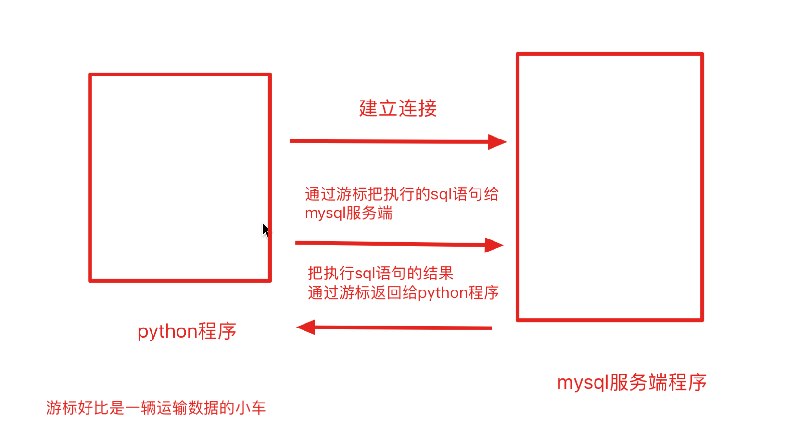

# 常用library

```python
from functools import reduce, accumulator
from functools import 
from collections import deque, Counter, OrderedDict

from itertools import 
import sys
import os
import calendar
import datetime

# import pyecharts
import cProfile
import Cython
# import PyPy
```


# math

```python
import math
math.sqrt(x)
math.ceil(x)/math.floor(x)
math.cos(x)/math.sin(x)
math.log(x, base)
math.pi/math.e
```


# `logging`日志

记录程序日志信息的目的是

1. 可以很方便的了解程序的运行情况
2. 可以分析用户的操作行为、喜好等信息
3. 方便开发人员检查bug

## 日志等级

日志等级可以分为5个，从低到高分别是:

1. DEBUG：程序调试bug时使用
2. INFO：程序正常运行时使用
3. WARNING：程序未按预期运行时使用，但并不是错误，如:用户登录密码错误
4. ERROR：程序出错误时使用，如:IO操作失败
5. CRITICAL：特别严重的问题，导致程序不能再继续运行时使用，如:磁盘空间为空，一般很少使用

默认的日志级别设置为WARNING，当在WARNING或WARNING之上等级的才记录日志信息。

日志等级从低到高的顺序是: DEBUG < INFO < WARNING < ERROR < CRITICAL

## 示例

在`logging`包中记录日志的方式有两种:

1. 输出到控制台
2. 保存到日志文件

**设置日志等级和输出日志格式**

- `level`表示设置的日志等级
- `format`表示日志的输出格式, 参数说明:
  - `%(levelname)s`: 打印日志级别名称
  - `%(filename)s`: 打印当前执行程序名
  - `%(lineno)d`: 打印日志的当前行号
  - `%(asctime)s`: 打印日志的时间
  - `%(message)s`: 打印日志信息

```python
import logging
logging.basicConfig(level=logging.DEBUG,
                    format='%(asctime)s - %(filename)s[line:%(lineno)d] - %(levelname)s: %(message)s',
                    filename="log.txt",
                    filemode="a")
logging.debug('这是一个debug级别的日志信息')
logging.info('这是一个info级别的日志信息')
logging.warning('这是一个warning级别的日志信息')
logging.error('这是一个error级别的日志信息')
logging.critical('这是一个critical级别的日志信息')
"""
运行结果在log.txt：
2021-03-28 23:40:34,837 - logging.py[line:6] - DEBUG: 这是一个debug级别的日志信息
2021-03-28 23:40:34,862 - logging.py[line:7] - INFO: 这是一个info级别的日志信息
2021-03-28 23:40:34,862 - logging.py[line:8] - WARNING: 这是一个warning级别的日志信息
2021-03-28 23:40:34,862 - logging.py[line:9] - ERROR: 这是一个error级别的日志信息
2021-03-28 23:40:34,862 - logging.py[line:10] - CRITICAL: 这是一个critical级别的日志信息
"""
# 注意，以上代码不能修改写入文件的编码格式，所以我找了下，这是修改后的代码
logger = logging.getLogger()
logger.setLevel(logging.DEBUG)
fh = logging.FileHandler(filename="log.txt", mode="a", encoding="utf-8")
logger.addHandler(fh)
formatter = logging.Formatter("%(asctime)s-%(filename)s[lineno:%(lineno)d]-%(levelname)s-%(message)s")
fh.setFormatter(formatter)
```

# os

```python
import os
# os模块中文件和文件夹的操作
os.rename(目标文件名, 新文件名) # 文件重命名
os.remove(目标文件名) # 删除文件
os.mkdir(文件夹名字) # 创建文件夹
os.rmdir(文件夹名字) # 删除文件夹
os.getcwd() # 获取当前目录
os.chdir(目录) # 改变默认目录
os.listdir(目录) # 获取目录列表
```

# time / datetime / calendar

```python
import time
time.time()
time.ctime()

a = str(datetime.datetime.now().strftime('%Y-%m-%d %H:%M:%S') + ' 星期' + str(datetime.datetime.now().isoweekday()) )
print('timestamp: ', a)
```


# pymysql

## 防止SQL注入

用户提交带有恶意的数据与SQL语句进行字符串方式的拼接，从而影响了SQL语句的语义，最终产生**数据泄露**的现象。例如：```sql = "select * from students where name = '%s';" % "黄蓉' or 1 = 1 or '"`会显示所有的数据

**如何防止SQL注入?**

SQL语句参数化

- SQL语言中的参数使用`%s`来占位，此处不是python中的字符串格式化操作
- 将SQL语句中`%s`占位所需要的参数存在一个列表中，把参数列表传递给`execute`方法中第二个参数



```python
import pymysql
"""
*参数host：连接的mysql主机，如果本机是
'localhost'
*参数port：连接的mysql主机的端口，默认是3306
*参数user：连接的用户名
*参数password：连接的密码
*参数database：数据库的名称
*参数charset：通信采用的编码方式，推荐使用utf8
"""
# 创建连接对象
"""
连接对象操作说明:
    - 关闭连接 conn.close()
    - 提交数据 conn.commit() 表示将修改操作提交到数据库
    - 撤销数据 conn.rollback() 表示回滚数据
"""
conn = pymysql.connect(host="localhost",
                       port=3306,
                       user="root",
                       password="1djdgQL@",
                       database="self_practice",
                       charset="utf8")
# 获取游标对象
"""
游标操作说明:
    - 使用游标执行SQL语句: execute(operation [parameters ]) 执行SQL语句，
      返回受影响的行数，主要用于执行insert、update、delete、select等语句
    - 获取查询结果集中的一条数据:cur.fetchone()返回一个元组, 如 (1,'张三')
    - 获取查询结果集中的所有数据: cur.fetchall()返回一个元组,如((1,'张三'),(2,'李四'))
    - 关闭游标: cur.close(),表示和数据库操作完成
"""
cursor = conn.cursor();
sql = "insert into goods values(%s, %s, %s, %s, %s, %s, %s);"
try:
    cursor.execute(sql, (0, 'test_laptop1', 'alienware', '戴尔', 16888.000, 1, 0))
    # 如果是查询的sql语句，可以不用提交
    conn.commit()
except Exception as e:
    print(e)
    conn.rollback()
"""
# 查询语句
sql = "select * from goods where cate_name = %s and price > %s;"
# 返回的数据类型是一个元组，其中元组里面的每条数据还是元组
cursor.execute(sql, ("超级本", 1000))
result = cursor.fetchall()
for row in result:
    print(row)
"""
cursor.close()
conn.close()
```

# xlrd 

python操作excel主要用到```xlrd```和```xlwt```这两个库，即```xlrd```是读excel，```xlwt```是写excel的库。

## 常用单元格中的数据类型

- 0: empty（空的

- 1: string（text）
- 2: number

- 3: date: 日期需要做特殊处理
- 4: boolean
- 5: error

- 6: blank（空白表格）

```python
# -*- coding: utf-8 -*-
import xlrd
data = xlrd.open_workbook(filename)#文件名以及路径，如果路径或者文件名有中文给前面加一个r表示原生字符。需要输入Excel的名称，程序会在Python程序所在目录下找到该文件，如果文件不存在，会返回FileNotFoundError错误
names = data.sheet_names()    #返回book中所有工作表的名字
table = data.sheets()[0]          #通过索引顺序获取
table = data.sheet_by_index(sheet_indx) #通过索引顺序获取
table = data.sheet_by_name(sheet_name)#通过名称获取
'''以上三个函数都会返回一个xlrd.sheet.Sheet()对象'''
data.sheet_loaded(sheet_name or indx)   # 检查某个sheet是否导入完毕

print(sheet1.name, sheet1.nrows, sheet1.ncols)
# sheet1的名称、行数、列数
print(sheet1.row_values(0), sheet1.col_values(0), sheet1.cell_value(0, 0))
# sheet1的某一行/某一列所有值的列表，某行某列的值
nrows = table.nrows  #获取该sheet中的有效行数
table.row(rowx)  #返回由该行中所有的单元格对象组成的列表
table.row_slice(rowx)  #返回由该列中所有的单元格对象组成的列表
table.row_types(rowx, start_colx=0, end_colx=None)    #返回由该行中所有单元格的数据类型组成的列表
table.row_values(rowx, start_colx=0, end_colx=None)   #返回由该行中所有单元格的数据组成的列表
table.row_len(rowx) #返回该列的有效单元格长度
ncols = table.ncols   #获取列表的有效列数
table.col(colx, start_rowx=0, end_rowx=None)  #返回由该列中所有的单元格对象组成的列表
table.col_slice(colx, start_rowx=0, end_rowx=None)  #返回由该列中所有的单元格对象组成的列表
table.col_types(colx, start_rowx=0, end_rowx=None)    #返回由该列中所有单元格的数据类型组成的列表
table.col_values(colx, start_rowx=0, end_rowx=None)   #返回由该列中所有单元格的数据组成的列表
table.cell(rowx,colx)   #返回单元格对象

table.cell_type(rowx,colx)    #返回单元格中的数据类型
table.cell_value(rowx,colx)   #返回单元格中的数据
table.cell_xf_index(rowx, colx)   # 暂时还没有搞懂

#日期的处理
'''
excel中的日期时间通过xlrd读取到数据后，会转换成一串数字
2018/07/10会转换为43291.0
2018/7/10  18:15:02 会转换成43291.76043981482
'''
cell_0_0_tuple = xlrd.xldata_as_tuple(cell_0_0.value, datemode=0)
# 首先要判断ctype属于日期，然后才能转换为tuple（年，月，日，时，分，秒）
# datemode在此处的含义是从1900年开始，如果等于1，则是从1904年开始（使用0即可）

from datetime import datetime, date
date(*cell_0_0_tuple[:3]）.strftime('%Y/%m/%d')
# 使用date模块，将tuple的年月日转换为date对象（只支持三位参数），使用strftime方法格式化。
```

# xlwt

```python
# -*- coding: utf-8 -*-
#导入xlwt模块
import xlwt
# 创建一个Workbook对象，这就相当于创建了一个Excel文件
book = xlwt.Workbook(encoding='utf-8', style_compression=0)
'''
Workbook类初始化时有encoding和style_compression参数
encoding:设置字符编码，一般要这样设置：w = Workbook(encoding='utf-8')，就可以在excel中输出中文了。
默认是ascii。当然要记得在文件头部添加：
#!/usr/bin/env python
# -*- coding: utf-8 -*-
style_compression:表示是否压缩，不常用。
'''
#创建一个sheet对象，一个sheet对象对应Excel文件中的一张表格。
# 在电脑桌面右键新建一个Excel文件，其中就包含sheet1，sheet2，sheet3三张表
sheet = book.add_sheet('test', cell_overwrite_ok=True)
# 其中的test是这张表的名字,cell_overwrite_ok，表示是否可以覆盖单元格，其实是Worksheet实例化的一个参数，默认值是False
# 向表test中添加数据
sheet.write(0, 0, 'EnglishName')  # 其中的'0-行, 0-列'指定表中的单元，'EnglishName'是向该单元写入的内容
sheet.write(1, 0, 'Marcovaldo')
txt1 = '中文名字'
sheet.write(0, 1, txt1.decode('utf-8'))  # 此处需要将中文字符串解码成unicode码，否则会报错
txt2 = '马可瓦多'
sheet.write(1, 1, txt2.decode('utf-8'))
 
# 最后，将以上操作保存到指定的Excel文件中
book.save(r'e:\test1.xls')  # 在字符串前加r，声明为raw字符串，这样就不会处理其中的转义了。否则，可能会报错
# 这个真的很有用
```

# 