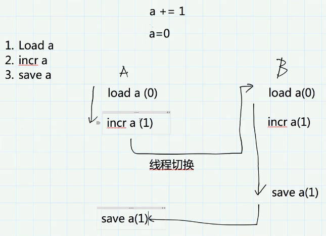

# python语言基础 

python是强类型动态语言（JS是弱类型）。强类型指的是不会发生隐式转换，动态指的是编译器还是运行期确定类型

**动态语言**

- duck typing：关注对象的行为，而不是类型
- monkey patch：运行时替换，比如gevent库需要修改内置的socket
- introspection：运行时判断一个对象的类型的能力
  - `type`/`id`/`isinstance`
  - `inspect`模块提供了更多获取对象 信息的函数

**作为后端语言的优缺点**

- 胶水语言，轮子多
- 语言灵活
- 性能问题，代码维护问题

**the Zen of Python**

`import this`

## python2/python3差异

 `pyenv shell 2.7.13 `手动测试查看差异

### python3改进

1. `print`成为函数
2. 编码问题。python3不再有unicode对象，默认str就是unicode
3. 除法变化。python3除号返回浮点数
4. 类型注解(type hint)。帮助ide实现类型检查
   - `def hello(name: str) -> str:`
5. 优化的`super()`方便直接调用父类函数
   - `super.hello()`
6. 高级解包操作。`a, b, *rest = range(10)`
   - `a, b, *_ = range(5)`
7. keyword only arguments。限定关键字参数
   - `def add(a, b, *, c)`
   - `add(1, 2, c=3)`
8. chained exceptions。python3重新抛出异常不会丢失栈信息
   - error -> error 
9. 一切返回迭代器(iterators)：`range`/`zip`/`map`/`dict.values`
   - 懒加载迭代器**节省内存**
10. `yield from`链接子生成器
11. `asyncio`内置库，`async/await`原生协程支持异步编程
12. 新的内置库`enum`/`mock`/`asyncio`/`ipaddress`/`concurrent.futures`
13. 生成的pyc文件统一放到`__pycache__`
14. 一些内置库的修改。`urllib`/`selector`

```python
s = u'中文'
type(s) # unicode

s = '中文'
type(s) # str
```

### 兼容2、3的工具

`six`模块，2to3等工具转换代码，`__future__`模块

## python函数常考题

### python如何传递参数？

python不是通过引用传递也不是通过值传递，唯一支持的参数传递是共享传参(call by object/call by sharing/call by object reference)。函数形参获得实参中各个引用的副本

默认参数只计算一次

```python
def flist(l=[1]):
    l.append(1)
    print(l)


flist() # [1,1]
flist() # [1,1,1]
```

### python中`*args`,`**kwargs`含义是什么

用来处理可变参数

`*args`被打包成tuple。`**kwargs`被打包成dict

```python
def printf(*args, **kwargs):
    if args: print(args)
    if kwargs: print(kwargs)

printf(a=1,b=2)
printf(**dict(a=1,b=2))
printf(1,2)
printf(*[1,2])

```

### python异常处理

- BaseException
- SystemExit/KeyboardInterrupt/GeneratorExit
- Exception, other exceptions are inherted from this, and our custom exception

常见异常

- 网络请求（超时，连接错误）
- 资源访问（权限问题，资源不存在）
- 代码逻辑（越界访问，KeyError等）

### 性能分析与优化和GIL

GIL: Global Interpreter Lock

- Cpython解释器的内存管理并不是线程安全的，为了保护多线程情况下对Python对象的访问，Cpython使用简单的锁机制避免多个线程同时执行字节码
- 限制了程序的多核执行，同一个时间只能有一个线程执行字节码。CPU（计算）密集程序难以利用多核优势。IO（网络传输，耗时，不密集）期间会释放GIL，对IO密集程序影响不大
  - CPU密集可以使用多进程+进程池。IO密集使用多线程/协程

-  一个操作如果是一个字节码指令可以完成就是原子的，原子的是可以保证线程安全的
  - 使用dis模块来分析字节码: `dis.dis(函数名)`
  - 非原子操作不是线程安全的，可以加`lock`



可以使用内置的`profile`/`cprofile`，或者uber开源的pyflame分析程序性能

#### 服务端性能优化措施

1. 数据结构与算法优化
2. 数据库层：索引优化，慢查询消除，批量操作减少IO，NoSQL
3. 网络IO：批量操作，pipeline操作 减少IO
4. 缓存：使用内存数据库 redis/memcached
5. 异步：asyncio，celery
6. 并发：gevent/多线程

### python函数式编程

- 私有属性`self._age`，魔法函数`__len__`
- 静态变量由所有示例共享，实例对象由实例单独占有  
- 类方法`@classmethod`和静态方法`@staticmethod`
- 元类
  - 了解使用`type`方法等价定义
  - 自己写一个元类`class LowercaseMeta(type)`并重写`__new__`方法
  - 使用`class LowercaseClass(metaclass=LowercaseMeta)`
  - `print(dir(LowercaseClass))`

### 装饰器
