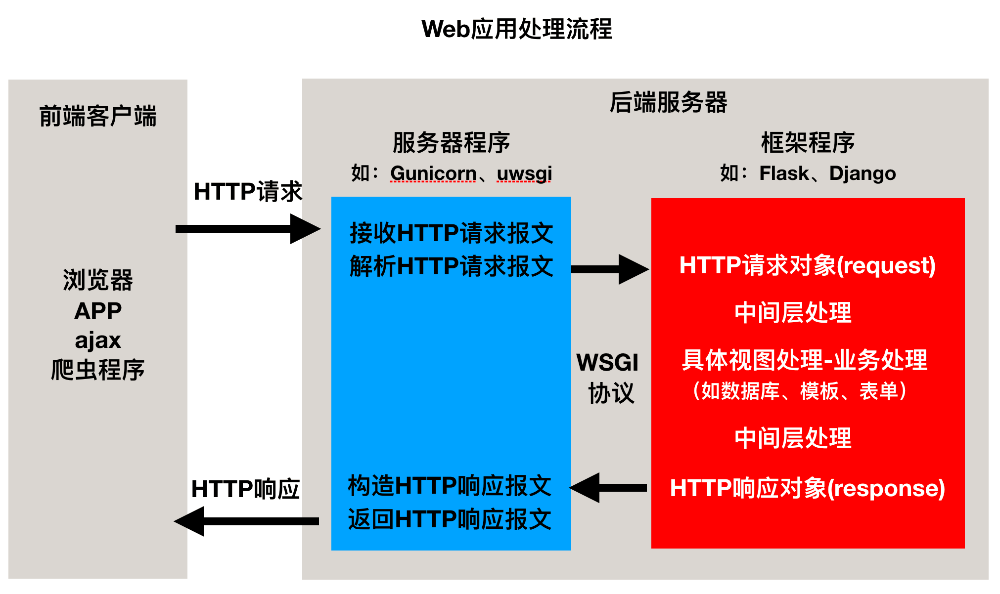
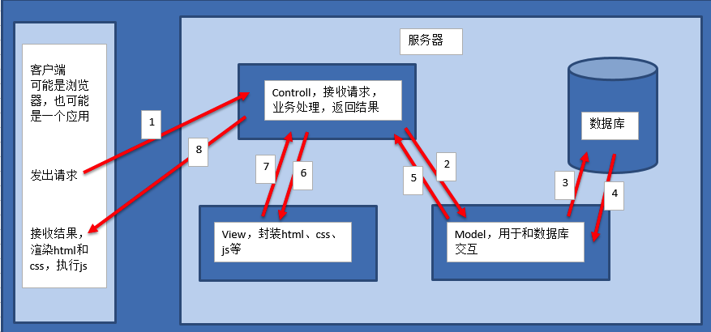
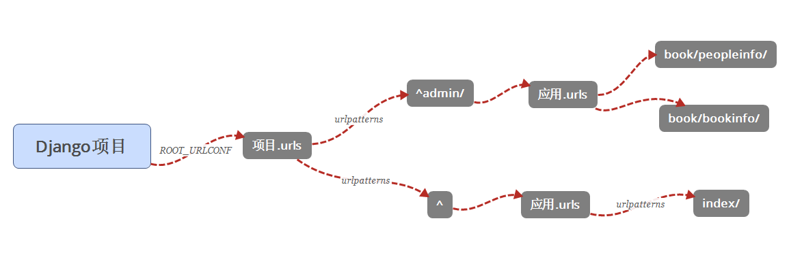

# mini-Web框架

web框架是专门为web服务器处理动态资源请求的一个应用程序。web框架和web服务器的关系是web框架专门服务于web服务器，给web服务器提供处理动态资源请求的服务。

WSGI协议：它是web服务器和web框架之间进行协同工作的一个规则，WSGI协议规定web服务器把动态资源的请求信息传给web框架处理，web框架把处理好的结果返回给web服务器。

## 框架程序开发

根据请求资源路径的后缀名进行判断

- 如果请求资源路径的后缀名是.html则是动态资源请求, 让web框架程序进行处理。
  - 创建web框架程序
  - 接收web服务器的动态资源请求
  - 处理web服务器的动态资源请求并把处理结果返回给web服务器
  - web服务器把处理结果组装成响应报文发送给浏览器
- 否则是静态资源请求，让web服务器程序进行处理。

### 使用带有参数的装饰器添加路由

路由功能：路由就是请求的URL到处理函数的映射，也就是说提前把请求的URL和处理函数关联好。

# Python Web 框架要点

## Web应用程序处理流程



## Web程序框架的意义

- 用于搭建Web应用程序
- 免去不同Web应用相同代码部分的重复编写，只需关心Web应用核心的业务逻辑实现

## Web应用程序的本质

- 接收并解析HTTP请求，获取具体的请求信息
- 处理本次HTTP请求，即完成本次请求的业务逻辑处理
- 构造并返回处理结果——HTTP响应

# Django简介

Django的主要目的是简便、快速的开发数据库驱动的网站。它强调代码复用，多个组件可以很方便的以"插件"形式服务于整个框架，Django有许多功能强大的第三方插件，你甚至可以很方便的开发出自己的工具包。这使得Django具有很强的可扩展性。它还强调快速开发和DRY(DoNotRepeatYourself)原则。

## 特点

### 重量级框架

对比Flask框架，Django原生提供了众多的功能组件，让开发更简便快速。

- 提供项目工程管理的自动化脚本工具
- 数据库ORM支持（对象关系映射，英语：Object Relational Mapping）
- 模板
- 表单
- Admin管理站点
- 文件管理
- 认证权限
- session机制
- 缓存

### MVT模式

有一种程序设计模式叫**MVC**，其核心思想是**分工、解耦，让不同的代码块之间降低耦合，增强代码的可扩展性和可移植性，实现向后兼容**。

> MVC的全拼为**Model-View-Controller**，最早由TrygveReenskaug在1978年提出，是施乐帕罗奥多研究中心(Xerox PARC)在20世纪80年代为程序语言Smalltalk发明的一种软件设计模式，是为了将传统的输入（input）、处理（processing）、输出（output）任务运用到图形化用户交互模型中而设计的。随着标准输入输出设备的出现，开发人员只需要将精力集中在业务逻辑的分析与实现上。后来被推荐为Oracle旗下Sun公司Java EE平台的设计模式，并且受到越来越多的使用ColdFusion和PHP的开发者的欢迎。现在虽然不再使用原来的分工方式，但是这种分工的思想被沿用下来，广泛应用于软件工程中，是一种典型并且应用广泛的软件架构模式。后来，MVC的思想被应用在了Ｗeb开发方面，被称为Ｗeb MVC框架。

#### MVC模式说明



- M全拼为Model，主要封装对数据库层的访问，对数据库中的数据进行增、删、改、查操作。
- V全拼为View，用于封装结果，生成页面展示的html内容。
- C全拼为Controller，用于接收请求，处理业务逻辑，与Model和View交互，返回结果。

#### Django的MVT


- M全拼为Model，与MVC中的M功能相同，负责和数据库交互，进行数据处理。
- V全拼为View，与MVC中的C功能相同，接收请求，进行业务处理，返回应答。
- T全拼为Template，与MVC中的V功能相同，负责封装构造要返回的html。

**注：差异就在于黑线黑箭头标识出来的部分**

# 创建Django项目

## 创建工程

创建工程的命令为：`django-admin startproject bookmanager`

- 与项目同名的目录，此处为bookmanager。
  - **settings.py**是项目的整体配置文件，设置相关
    - `BASE_DIR = os.path.dirname(os.path.dirname(os.path.abspath(__file__)))`是当前工程的根目录，Django会依此来定位工程内的相关文件，我们也可以使用该参数来构造文件路径。``__file__``是文件名，`abspath`是绝对路径
    - `DEBUG = True`用于开发者调试，作用是修改代码文件，程序自动重启以及Django程序出现异常时，向前端显示详细的错误追踪信息。部署上线时改成`False`
    - `LANGUAGE_CODE = 'zh-Hans'`语言
    - `TIME_ZONE = 'Asia/Shanghai'`时区
    - 在项目根目录下创建**static**目录来保存静态文件，在**bookmanager/settings.py**中修改静态文件的两个参数为
      - `STATIC_URL = '/static/'`。Django是通过`STATIC_URL`来区分静态资源和动态资源的。我们在访问静态资源**http://ip:port+STATIC_URL+filename**时Django就会认为我们在访问静态资源，这个时候会去静态资源文件夹中进行匹配
      - `STATICFILES_DIRS = [
            os.path.join(BASE_DIR, 'static'),
        ]`告诉系统静态文件目录
      - 此时在**static**添加的任何静态文件都可以使用网址**/static/文件**在static中的路径来访问了
  - **urls.py**是项目的URL配置文件，路由相关
  - **wsgi.py**是项目与WSGI兼容的Web服务器入口，程序的入口
- **manage.py**是项目管理文件，通过它管理项目（例如创建子应用的时候会用到它）

运行：`python3 manage.py runserver 127.0.0.1:8000`（默认）

查看帮助：`python3 manage.py --help`

django默认工作在调式Debug模式下，如果增加、修改、删除文件，服务器会自动重启。

按`ctrl+c`停止服务器

## 创建子应用

在Web应用中，通常有一些业务功能模块是在不同的项目中都可以复用的，故在开发中通常将工程项目拆分为不同的子功能模块，各功能模块间可以保持相对的独立，在其他工程项目中需要用到某个特定功能模块时，可以将该模块代码整体复制过去，达到复用。

Django的视图编写是放在子应用中的。

创建：`python3 manage.py startapp book`（或`django-admin startapp book`）

- 执行后，可以看到工程目录中多出了一个名为book的子目录。
  - **admin.py**文件跟网站的*后台管理*站点配置相关
  - **apps.py**文件用于配置当前*子应用*的相关信息
    - 在创建应用时，Django会向apps.py文件中写入一个该应用的配置类，我们将此类添加到工程settings.py中的`INSTALLED_APPS`列表中，表明注册安装具备此配置属性的应用
    - `name`表示这个配置类是加载到哪个应用的，每个配置类必须包含此属性，默认自动生成
    - `verbose_name`用于设置该应用的直观可读的名字，此名字在Django提供的Admin管理站点中会显示。注册时用`book.apps.BookConfig`才能生效
  - **migrations**目录用于存放*数据库迁移*历史文件
  - **models.py**文件用户保存*数据库模型*类
  - **tests.py**文件用于*开发测试用例*，编写单元测试
  - **views.py**文件用于编写*Web应用视图*

### 注册安装子应用

创建出来的子应用目录文件虽然被放到了工程项目目录中，但是django工程并不能立即直接使用该子应用，需要注册安装后才能使用。注册安装一个子应用的方法，即是将子应用的配置信息文件apps.py中的Config类添加到**bookmanager\bookmanager\settings.py**中的INSTALLED_APPS(34行)列表中。不能重复注册，`book`和`book.apps.BookConfig`是相同的

# shell工具

Django的manage工具提供了shell命令，帮助我们配置好当前工程的运行环境（如连接好数据库等），以便可以直接在终端中执行测试python语句。类似iPython

通过如下命令进入shell：`python manage.py shell`

导入两个模型类，以便后续使用：`from book.models import BookInfo,PeopleInfo`

# 模型-models.py

- MVT设计模式中的Model， 专门负责和数据库交互，对应`(models.py)`
- 由于Model中内嵌了ORM框架，所以不需要直接面向数据库编程，而是定义模型类, 通过模型类和对象完成数据库表的增删改查
- ORM框架就是把数据库表的行与相应的对象建立关联, 互相转换，使得数据库的操作面向对象


## 使用Django进行数据库开发的步骤 

1. 定义模型类
2. 模型迁移
3. 操作数据库

### 1.定义模型类

- 根据书籍表结构设计模型类:

  - 模型类：BookInfo（对应表）
  - 书籍名称属性：name（对应字段）

- 根据人物表结构设计模型类：

  - 模型类：PeopleInfo
  - 人物姓名字段：name
  - 人物性别字段：gender
  - 外键约束：book
    - 外键要指定所属的模型类`book = models.ForeignKey(BookInfo)`
    - 在设置外键时，需要通过`on_delete`选项指明主表删除数据时，对于外键引用表数据如何处理，在django.db.models中包含了可选常量
      - CASCADE级联，删除主表数据时连通一起删除外键表中数据
      - PROTECT保护，通过抛出ProtectedError异常，来阻止删除主表中被外键应用的数据
      - SET_NULL设置为NULL，仅在该字段null=True允许为null时可用
      - SET_DEFAULT设置为默认值，仅在该字段设置了默认值时可用。Django提供的选项
      - SET()设置为特定值或者调用特定方法。Django提供的选项
      - DO_NOTHING不做任何操作，如果数据库前置指明级联性，此选项会抛出IntegrityError异常。Django提供的选项

- 说明 :

  - BookInfo - PeopleInfo的关系为一对多。一本书中可以有多个英雄。
  - **不需要定义主键字段，在生成表时会自动添加**，并且值为自增长。每个模型只能有一个主键列，如果使用选项设置某属性为主键列后django不会再创建自动增长的主键列
  - 不要使用python，mysql中的关键字
  - 不要使用连续的下划线(`__`)。因为查询时会用到

- 根据数据库表的设计

  - 在`models.py`中定义模型类，必须继承模型类`models.Model`

  - ```python
    from django.db import models
    class BookInfo(models.Model):
        name = models.CharField(max_length = 10, unique = True, verbose_name="书名")
        pub_date = models.DateField(null = True, verbose_name='发布日期') # default null
        readCount = models.IntegerField(default = 0, verbose_name='阅读量')
        commentCount = models.IntegerField(default = 0, verbose_name='评论量')
        is_deleted = models.BooleanField(default = False, verbose_name='逻辑删除')
    
        def __str__(self):
            return self.name
        class Meta:
            # 修改表名。模型类如果未指明表名，Django默认以小写app应用名_小写模型类名为数据库表名
            db_table = "bookInfo"
            # 修改后台admin的显示信息的配置
            verbose_name = '图书'  # 在admin站点中显示的名称
    
    class PeopleInfo(models.Model):
        # 有序字典，对应枚举类型
        GENDER_CHOICES = (
            (0, 'male'),
            (1, 'female')
        )
        gender = models.SmallIntegerField(choices=GENDER_CHOICES, default=0, verbose_name='性别')
        book = models.ForeignKey(BookInfo, on_delete=models.CASCADE, verbose_name='图书')  # 外键
    
        class Meta:
            ...
        def __str__(self):
            ...
    ```

#### 字段类型

| 类型             | 说明                                                         |
| :--------------- | :----------------------------------------------------------- |
| AutoField        | 自动增长的IntegerField，通常不用指定，不指定时Django会自动创建属性名为id的自动增长属性 |
| BooleanField     | 布尔字段，值为True或False                                    |
| NullBooleanField | 支持Null、True、False三种值                                  |
| CharField        | 字符串，参数max_length表示最大字符个数                       |
| TextField        | 大文本字段，一般超过4000个字符时使用                         |
| IntegerField     | 整数                                                         |
| DecimalField     | 十进制浮点数， 参数max_digits表示总位数， 参数decimal_places表示小数位数 |
| FloatField       | 浮点数                                                       |
| DateField        | 日期， 参数auto_now表示每次保存对象时，自动设置该字段为当前时间，用于"最后一次修改"的时间戳，它总是使用当前日期，默认为False； 参数auto_now_add表示当对象第一次被创建时自动设置当前时间，用于创建的时间戳，它总是使用当前日期，默认为False; 参数auto_now_add和auto_now是相互排斥的，组合将会发生错误 |
| TimeField        | 时间，参数同DateField                                        |
| DateTimeField    | 日期时间，参数同DateField                                    |
| FileField        | 上传文件字段                                                 |
| ImageField       | 继承于FileField，对上传的内容进行校验，确保是有效的图片      |

#### 选项

| 选项        | 说明                                                         |
| :---------- | :----------------------------------------------------------- |
| null        | 如果为True，表示允许为空，默认值是False                      |
| blank       | 如果为True，则该字段允许为空白，默认值是False。null是数据库范畴的概念，blank是表单验证范畴的 |
| db_column   | 字段的名称，如果未指定，则使用属性的名称                     |
| db_index    | 若值为True, 则在表中会为此字段创建索引，默认值是False        |
| default     | 默认                                                         |
| primary_key | 若为True，则该字段会成为模型的主键字段，默认值是False，一般作为AutoField的选项使用 |
| unique      | 如果为True, 这个字段在表中必须有唯一值，默认值是False        |

### 2. 模型迁移 （建表）

- 迁移由两步完成 :

  - 生成迁移文件，根据模型类生成创建表的语句：

    - `python manage.py makemigrations`(注意要注册)
    - 迁移之后会在**migrations**文件中生成文件
    - 不会在数据库中生成表，只会创建一个数据表和模型的对应关系

  - 执行迁移，根据第一步生成的语句在数据库中创建表：

    - `python manage.py migrate`
- 运行一次Django工程，将目录下的db.sqlite3拖动到PyCharm下的Database视图中（还有SciView）可以看到效果

## 使用MySQL数据库

Django默认初始配置使用sqlite数据库。sqlite是一种嵌入式的关系型数据库，主要在移动端使用。

```python
DATABASES = {
    'default': {
        'ENGINE': 'django.db.backends.sqlite3',
        'NAME': os.path.join(BASE_DIR, 'db.sqlite3'),
    }
}
```

1. 使用MySQL数据库首先需要安装驱动程序：

```
pip install PyMySQL
pip install cryptography
```

2. 在Django的工程同名子目录的**init.py**文件中添加如下语句。作用是让Django的ORM能以mysqldb的方式来调用PyMySQL

```python
import pymysql
pymysql.install_as_MySQLdb()
```

3. 修改DATABASES配置信息

```python
DATABASES = {
    'default': {
        'ENGINE': 'django.db.backends.mysql',
        'HOST': '127.0.0.1',  # 数据库主机
        'PORT': 3306,  # 数据库端口
        'USER': 'root',  # 数据库用户名
        'PASSWORD': '1djdgQL@',  # 数据库用户密码
        'NAME': 'book'  # 数据库名字
    }
}
```

4. 在MySQL中创建数据库`create database book charset=utf8;`

### 数据库操作

#### 增加

会返回新生成的对象

##### save

```python
>>> from book.models import BookInfo,PeopleInfo
>>> book = BookInfo(
...         name='python入门',
...         pub_date='2010-1-1'
...     )
>>> book.save()
>>> book
<BookInfo: python入门>
```

##### create

`PeopleInfo.objects`类似模型的管理类，用于模型的增删改查

```python
>>> PeopleInfo.objects.create(
...         name='itheima',
...         book=book
...     )
<PeopleInfo: itheima>
```

#### 修改

##### save

修改模型类对象的属性，然后执行`save()`方法

```python
>>> person = PeopleInfo.objects.get(name='itheima')
>>> person.readCount = 205
>>> person.save()
>>> person.readCount
>>> 205
```

##### update

使用模型类`.objects.filter().update()`，会返回受影响的行数

```python
>>> PeopleInfo.objects.filter(name='itcast').update(name='传智播客', readCount=200, commentCount=100)
1
```

#### 删除

##### 模型类对象delete

```python
>>> person = PeopleInfo.objects.get(name='传智播客')
>>> person.delete()
(1, {'book.PeopleInfo': 1})
```

##### 模型类`.objects.filter().delete()`

```python
>>> BookInfo.objects.filter(name='python入门').delete()
(1, {'book.BookInfo': 1, 'book.PeopleInfo': 0})
```

### 数据库查询

#### 基本查询

```python
# get查询单一结果，如果不存在会抛出模型类.DoesNotExist异常。返回一个对象
>>> BookInfo.objects.get(id=1)
<BookInfo: 射雕英雄传>
>>> BookInfo.objects.get(pk=2)
<BookInfo: 天龙八部>
>>> BookInfo.objects.get(pk=20)
Traceback (most recent call last):
  File "<console>", line 1, in <module>
  File "/home/python/.virtualenvs/py3_django_1.11/lib/python3.5/site-packages/django/db/models/manager.py", line 85, in manager_method
    return getattr(self.get_queryset(), name)(*args, **kwargs)
  File "/home/python/.virtualenvs/py3_django_1.11/lib/python3.5/site-packages/django/db/models/query.py", line 380, in get
    self.model._meta.object_name
book.models.DoesNotExist: BookInfo matching query does not exist.

# all查询多个结果。返回结果的列表
>>> BookInfo.objects.all()
<QuerySet [<BookInfo: 射雕英雄传>, <BookInfo: 天龙八部>, <BookInfo: 笑傲江湖>, <BookInfo: 雪山飞狐>]>

# count查询结果数量
>>> BookInfo.objects.count() # BookInfo.objects.all().count()
4
```

# 站点管理

站点：分为**内容发布**和**公共访问**两部分

**内容发布**的部分由网站的管理员负责查看、添加、修改、删除数据

Django能够根据定义的模型类自动地生成管理模块

使用Django的管理模块, 需要按照如下步骤操作 

- 管理界面本地化

  - 本地化是将显示的语言、时间等使用本地的习惯，这里的本地化就是进行中国化
  - 中国大陆地区使用**简体中文**, 时区使用**亚洲/上海时区**, 注意这里不使用北京时区
  - 在工程的**settings.py**下，修改
    - `LANGUAGE_CODE = 'zh-Hans'`
    - `TIME_ZONE = 'Asia/Shanghai'`

- 创建管理员：`python manage.py createsuperuser`

  - 重置密码：`python manager.py changepassword 用户名`

- 注册模型类

  - 在子应用的**admin.py**文件中注册模型类
    - `from book.models import BookInfo,PeopleInfo`
    - `admin.site.register(BookInfo)`
    - `admin.site.register(PeopleInfo)`

- 发布内容到数据库

  - 登录**localhost:8000/admin/**后，添加内容

  - ```python
    # 准备书籍列表信息的模型类
    class BookInfo(models.Model):
        # 创建字段，字段类型...
        name = models.CharField(max_length=10)
    
        def __str__(self):
            """将模型类以字符串的方式输出"""
            return self.name
    ```

  - 在PyCharm自带的Database下，可以看到增加的数据和管理员信息

# 视图和URL-views.py

站点管理页面做好了, 接下来就要做公共访问的页面了

对于Django的设计框架MVT

- 用户在URL中请求的是视图
- 视图接收请求后进行处理
- 并将处理的结果返回给请求者

使用视图时需要进行两步操作

- 定义视图
  - 视图就是一个Python函数，被定义在应用的**views.py**中
  - 需要导入`HttpResponse`模块：`from django.http import HttpRequest, HttpResponse`
  - 视图的第一个参数是`HttpRequest`类型的对象`reqeust`，包含了所有请求信息
  - 视图必须返回`HttpResponse`对象，包含返回给请求者的响应信息
  - 定义视图函数：响应字符串`index`给客户端：`return HttpResponse('index')`
- 配置URLconf
  - 查找视图的过程 
    - 请求者在浏览器地址栏中输入URL, 请求到网站
    - 网站获取URL信息
    - 然后与编写好的URLconf逐条匹配
    - 如果匹配成功则调用对应的视图
    - 如果所有的URLconf都没有匹配成功则返回404错误
  - URLconf入口
    - 项目的**settings.py**中，`ROOT_URLCONF = 'bookmanager.urls'`是我们工程的url入口，默认是`工程名.urls`
  - 需要两步完成URLconf配置
    - 在项目中定义URLconf。在settings.py设置为工程中的**urls.py**文件
    - 在应用中定义URLconf。在项目的urls.py中设置为子应用的**urls.py**文件


## URLconf配置



### 在项目中定义URLconf

==注意`urlpatterns`是固定写法==

```python
# bookmanger\urls.py
from django.conf.urls import url, include
from django.contrib import admin
from book.views import index
"""
1. urlpatterns是固定写法，它的值是列表
2. 我们在浏览器中输入的路径会和urlpatterns中的每一项顺序进行匹配
    如果匹配成功则直接引导到相应的子应用中继续匹配，之后匹配成功则停止匹配返回相应的视图，之后匹配不成功则继续和后面的每一项的url继续匹配，直到匹配完每一项
    如果匹配不成功（把urlspatterns中的每一项都匹配过了）则直接返回404
3. urlpatterns中的元素是url
    url中的第一个参数是正则表达式，r是转义字符
    http://ip:port/和get，post参数不参与正则匹配
"""
urlpatterns = [
    url(r'^admin/', admin.site.urls),
    # 只要不是admin/..，都会引导到index/
    url(r'^', include('book.urls')),
    # 可以直接这么写，不引导到子应用去，但是引导方便管理
    # url(r'^index/$', index)
]
```

### 在应用中定义URLconf

```python
# book\urls.py
from django.conf.urls import url
from book.views import index
"""
第一个参数是正则，第二个是视图函数名
"""
urlpatterns = [
    # 前面的已经匹配过了
    url(r'^index/$', index)
]

# book\views.py
from django.shortcuts import render
from django.http import HttpRequest, HttpResponse
# Create your views here.
def index(request):
    return HttpRequest('index')
```

# 模板templates

在Django中, 将前端的内容定义在模板中, 然后再把模板交给视图调用, 各种漂亮、炫酷的效果就出现了。模板是专门定义前端页面的地方，效果可以及时展示，错误可以及时发现并且可以降低模块间耦合度

模板使用步骤

- 创建模板
  - 在应用同级目录下创建模板文件夹**templates**，==文件夹名称固定写法==
  - 在**templates**文件夹下，创建应用同名文件夹。例：Book
  - 在应用同名文件夹下创建网页模板文件。例：index.html
- 在工程目录下的**settings.py**设置模板查找路径
  - `TEMPLATES = {...'DIRS': [os.path.join(BASE_DIR, 'templates')],}`
- 子应用**views.py**中模板接收视图传入的数据
  - `context = {'year':10,}`
- 对应的html文件中利用模板处理数据
  - `<h1>I have learned for over {{year}} years. </h1>`

```python
# book\views.py
from django.shortcuts import render
from django.http import HttpRequest, HttpResponse
# Create your views here.
def index(request):
    context = {
        'year': 10,
    }
    # 参数1：当前的请求 参数2：模板文件 context：传递参数
    return render(request, 'Book\index.html', context)
```

