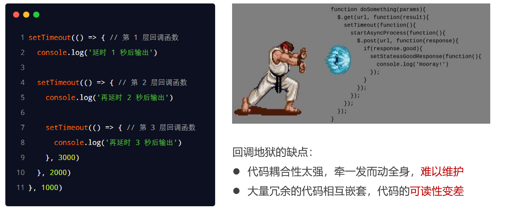
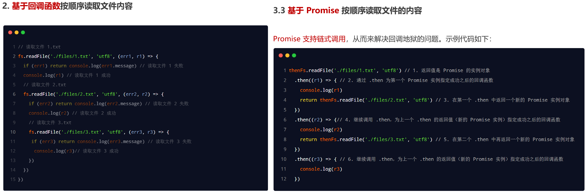
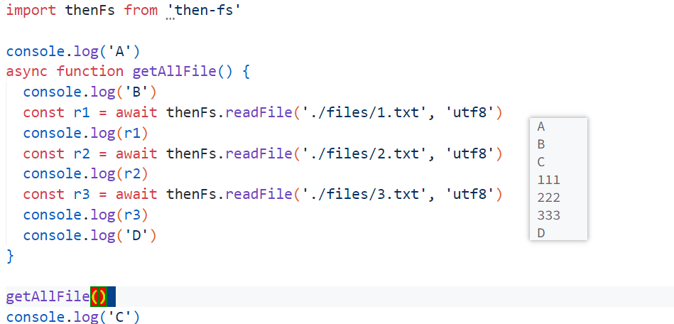
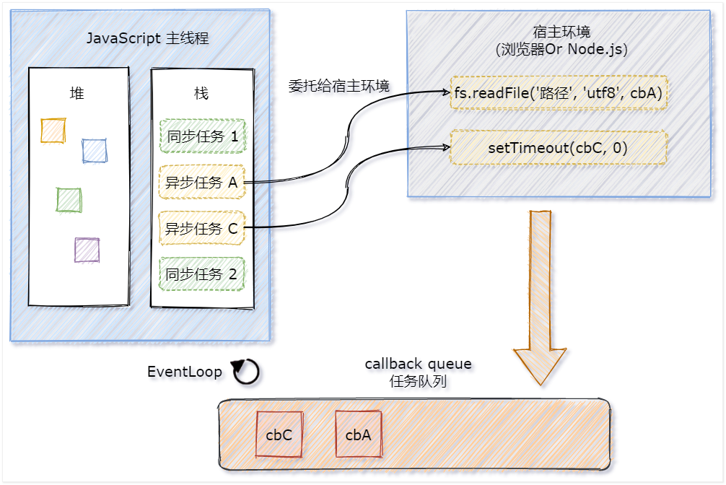
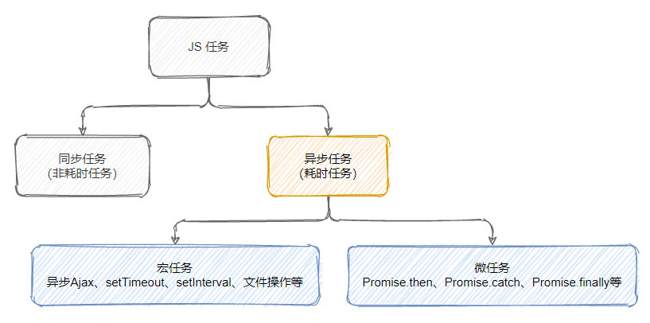
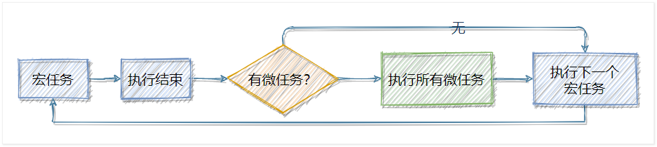
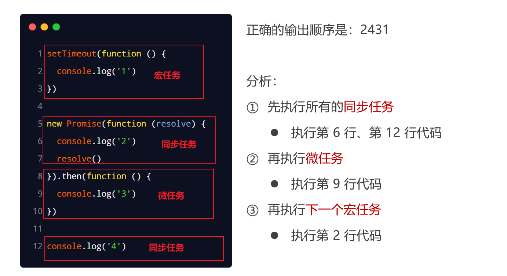
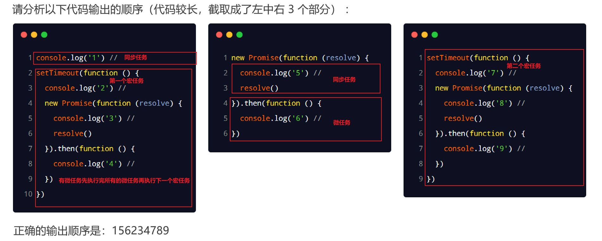

# ES6模块化

node.js 遵循了 CommonJS 的模块化规范。其中：

1. 导入其它模块使用`require()`方法
2. 模块对外共享成员使用`module.exports`对象

在 ES6 模块化规范诞生之前，JavaScript 社区已经尝试并提出了 AMD、CMD、CommonJS 等模块化规范。但是，这些由社区提出的模块化标准，还是存在一定的差异性与局限性、并不是浏览器与服务器通用的模块化标准，例如：

1. AMD 和 CMD 适用于**浏览器端**的 Javascript 模块化
2. CommonJS 适用于**服务器端**的 Javascript 模块化

太多的模块化规范给开发者增加了学习的难度与开发的成本。因此，大一统的 ES6 模块化规范诞生了！ES6 模块化规范是**浏览器端与服务器端通用**的模块化开发规范。它的出现极大的降低了前端开发者的模块化学习成本，开发者不需再额外学习 AMD、CMD 或 CommonJS 等模块化规范。

ES6 模块化规范中定义：

- 每个 js 文件都是一个独立的模块
- 导入其它模块成员使用`import`关键字
- 向外共享模块成员使用`export`关键字

ES6 的模块化主要包含如下 3 种用法：

1. 默认导出与默认导入
2. 按需导出与按需导入
3. 直接导入并执行模块中的代码

## 在 node.js 中体验 ES6 模块化

node.js 中默认仅支持 CommonJS 模块化规范，若想基于 node.js 体验与学习 ES6 的模块化语法，可以按照如下步骤进行配置：

在cmd中输入`node -v`，确保安装了 v14.15.1 或更高版本的 node.js

在空项目目录中输入`npm init -y`自动生成一个包管理配置文件 package.json 文件

在 package.json 的根节点中添加`"type": "module"`节点（默认是`"commonjs"`）

## 默认导出与默认导入

默认导出的语法：`export default 默认导出的成员`

- 每个模块中，只允许使用唯一的一次 export default，否则会报错

默认导入的语法：`import 接收名称 from '模块标识符'`

- 默认导入时的接收名称可以任意名称，只要是合法的成员名称即可

```javascript
// -------------------m1.js--------------------
let n1 = 10
let n2 = 20
function show() {}
export default {
    n1,
    show
}
// -------------------main.js--------------------
// 使用m1变量接收m1.js向外共享的成员
import m1 from './m1.js'
console.log(m1) // { n1: 10, show: [Function: show] }
```

## 按需导出与按需导入

按需导出的语法：`export 按需导出的成员`

- 每个模块中可以使用多次按需导出

按需导入的语法：`import { 按需导出的成员1, 2.. } from '模块标识符'`

- 按需导入的成员名称必须和按需导出的名称保持一致
- 按需导入时，可以使用`as`关键字进行重命名
- 按需导入可以和默认导入`info`一起使用，使用逗号隔开

```javascript
// -------------------m1.js--------------------
export let s1 = 'aaa'
export let s2 = 'ccc'
export function say() {}
// 默认导出
export default {
  a: 20
}
// -------------------main.js--------------------
import info, { s1, s2 as str2, say } from './m1.js'
console.log(s1) // aaa
console.log(str2) // ccc
console.log(say) // [Function: say]
console.log(info) // { a: 20 }
```

## 直接导入并执行模块中的代码

如果只想单纯地执行某个模块中的代码，并不需要得到模块中向外共享的成员。此时，可以直接导入并执行模块代码

```javascript
// -------------------m1.js--------------------
for (let i = 0; i < 3; i++) {
  console.log(i)
}
// -------------------main.js--------------------
import './m1,js' // 0 1 2
```

# Promise

多层回调函数的相互嵌套，就形成了回调地狱。为了解决回调地狱的问题，ES6（ECMAScript 2015）中新增了 Promise 的概念。



1. `Promise`是一个构造函数
   - 我们可以创建`Promise`的实例`const p = new Promise()`
   - `new`出来的`Promise`实例对象，代表一个异步操作
2. `Promise.prototype`上包含一个`.then()`方法
   - 每一次`new Promise()`构造函数得到的实例对象，都可以通过原型链的方式访问到`.then() `方法，例如`p.then()`
3. `.then()`方法用来预先指定成功和失败的回调函数
   - `p.then(成功的回调函数，失败的回调函数)`
   - `p.then(result => { }, error => { })`
   - 调用`.then()`方法时，成功的回调函数是必选的、失败的回调函数是可选的
4. 如果上一个`.then()`方法中返回了一个新的`Promise`实例对象，则可以通过下一个`.then()`继续进行处理。通过`.then()`方法的链式调用，就解决了回调地狱的问题
5. Promise 的链式操作中如果发生了错误，可以使用`Promise.prototype.catch`方法进行捕获和处理
   - 如果不希望前面的错误导致后续的`.then`无法正常执行，则可以将`.catch`的调用提前
6. `Promise.all()`方法会发起并行的 Promise 异步操作，等所有的异步操作全部结束后才会执行下一步的`.then 操作`（等待机制）
7. `Promise.race()`方法会发起并行的 Promise 异步操作，只要任何一个异步操作完成，就立即执行下一步的`.then`操作（赛跑机制）

## 基于 then-fs 读取文件内容

由于 node.js 官方提供的 fs 模块仅支持以回调函数的方式读取文件，不支持 Promise 的调用方式。因此，需要先运行安装 then-fs 第三方包`npm install then-fs`，从而支持我们基于 Promise 的方式读取文件的内容



### 通过 .catch 捕获错误

```javascript
import thenFs from "then-fs";

thenFs
  .readFile("./files/11.txt", "utf8")
  // 捕捉读取第一个文件发生的错误并打印错误信息
  // 由于错误被处理，不影响后续.then()的正常执行
  .catch((err) => {
    console.log(err.message);
  })
  .then((r1) => {
    console.log(r1); // undefined
    return thenFs.readFile("./files/2.txt", "utf8");
  })
  .then((r2) => {
    console.log(r2); // 222
    return thenFs.readFile("./files/3.txt", "utf8");
  })
  .then((r3) => {
    console.log(r3); // 333
  });
// 如果不希望前面的错误导致后续的 .then 无法正常执行，则可以将 .catch 的调用提前
// 第一个文件不存在会导致后续的3个then都不执行
/*   .catch((err) => {
    console.log(err.message);
  }); */

```

### Promise.all() / Promise.race() 方法

```javascript
import thenFs from "then-fs";
// 定义一个数组，存放3个读文件的异步操作
const promiseArr = [
  thenFs.readFile("./files/3.txt", "utf8"),
  thenFs.readFile("./files/2.txt", "utf8"),
  thenFs.readFile("./files/1.txt", "utf8"),
];
// 将Promise数组作为参数，等所有的异步操作全部结束后才会执行下一步的.then操作
Promise.all(promiseArr)
  /*   .then(([r1, r2, r3]) => {
    console.log(r1, r2, r3); // 333 222 111
  }) */
  // 注意：数组中 Promise 实例的顺序，就是最终结果的顺序
  .then((result) => {
    console.log(result); // [ '333', '222', '111' ]
  })
  .catch((err) => {
    console.log(err.message);
  });
// ---------------------------------------------------------------------------------
// 将Promise数组作为参数，只要有一个异步操作完成，就立即执行成功的回调函数
Promise.race(promiseArr)
  .then((result) => {
    console.log(result);
  })
  .catch((err) => {
    console.log(err.message);
  });
```

## 基于 Promise 封装读文件的方法

方法的封装要求：

1. 方法的名称要定义为`getFile`
2. 方法接收一个形参`fpath`，表示要读取的文件的路径
3. 方法的返回值为`Promise`实例对象

```javascript
import fs from "fs";

function getFile(fpath) {
  // 如果想要创建具体的异步操作，则需要在 new Promise() 构造函数期间，传递一个 function 函数，将具体的异步操作定义到 function 函数内部
  // 在Promise构造函数中，定义了fs.readFile()的异步操作
  // resolve是调用这个getFile方法时，通过.then指定的执行成功的回调函数；reject是调用这个getFile方法时，通过.then指定的执行失败的回调函数
  return new Promise(function (resolve, reject) {
    fs.readFile(fpath, "utf8", (err, dataStr) => {
      if (err) return reject(err); // 如果执行成功，调用成功的回调函数
      resolve(dataStr); // 如果失败调用失败的回调函数
    });
  });
}

getFile("./files/11.txt").then(
  (r1) => {
    console.log(r1);
  },
  (err) => {
    console.log(err.message);
  }
);
// 也可以通过cathch捕获
```

# async/await

`async/await`是 ES8（ECMAScript 2017）引入的新语法，用来简化 Promise 异步操作。在`async/await`出现之前，开发者只能通过链式`.then()`的方式处理 Promise 异步操作

`.then`链式调用的优点：解决了回调地狱的问题

`.then`链式调用的缺点：代码冗余、阅读性差、不易理解

`async/await`的使用注意事项

1. 如果在一个function中使用了`await`，则该function必须被`async`修饰

2. 在`async`方法中，第一个`await`之前的代码会同步执行，`await`之后的代码会异步执行




# EventLoop

## 同步任务和异步任务

JavaScript 是一门单线程执行的编程语言。也就是说，同一时间只能做一件事情。单线程执行任务队列的问题：
如果前一个任务非常耗时，则后续的任务就不得不一直等待，从而导致程序假死的问题。

为了防止某个耗时任务导致程序假死的问题，JavaScript 把待执行的任务分为了两类：

1. 同步任务（synchronous）：又叫做非耗时任务（任务不耗时），指的是在主线程上排队执行的那些任务。只有前一个任务执行完毕，才能执行后一个任务

2. 异步任务（asynchronous）：又叫做耗时任务，异步任务由 JavaScript 委托给宿主环境（如果是在浏览器端运行，浏览器就是宿主环境；如果是在node中执行，node就是宿主环境）进行执行。当异步任务执行完成后，会通知 JavaScript 主线程执行异步任务的回调函数

## 同步任务和异步任务的执行过程



1. 同步任务由 JavaScript 主线程次序执行
2. 异步任务委托给宿主环境执行
3. 已完成的异步任务对应的回调函数，会被加入到任务队列中等待执行
4. JavaScript 主线程的执行栈被清空后，会读取任务队列中的回调函数，次序执行
5. JavaScript 主线程不断重复上面的第 4 步

JavaScript 主线程从“任务队列”中读取异步任务的回调函数，放到执行栈中依次执行。这个过程是循环不断的，所以整个的这种运行机制又称为 EventLoop（事件循环）

# 宏任务和微任务



JavaScript 把异步任务又做了进一步的划分，异步任务又分为两类，分别是：

- 宏任务（macrotask）
  - 异步 Ajax 请求
  - `setTimeout`、`setInterval`
  - 文件操作
  - 其它宏任务
- 微任务（microtask）
  - `Promise.then`、`.catch`和`.finally`
  - `process.nextTick`
  - 其它微任务

## 宏任务和微任务的执行顺序



宏任务和微任务是交替执行的。每一个宏任务执行完之后，都会检查是否存在待执行的微任务，如果有，则**执行完所有微任务**之后，再继续执行下一个宏任务

## 面试题

**案例一**



**案例二**



# 补充阅读

## 异步任务，promise，async，await

>也就是说，`console.log()`所在的流水线为同步，即在主线程上执行的任务，，而`setTimeout`函数为异步任务，不进入主线程，而进入**任务队列**。程序先执行同步里的内容，执行完毕，**任务队列**开始通知主线程，请求执行任务，该任务才会进入主线程来执行。
>
>而任务队列是一个事件的队列，IO设备完成一项任务，就在任务队列中添加一个事件，表示相关的异步任务可以进入主线程了，主线程读取任务队列，就是读取里面就哪些事件。任务队列中的事件除了IO设备的事件以外，还包括用户产生的一些事件（比如鼠标点击、页面滚动等）。
>
>异步任务必须指定回调函数，当主线程开始执行异步任务，就是执行相应的回调函数。例如ajax的success，complete，error也都指定了各自的回调函数，这些函数就会加入任务队列中，等待执行。
>
>2、promise
>
>利用promise可以将异步操作以同步操作的流程表达出来，避免了层层嵌套的回调函数。此外，promise对象提供统一的接口，使得控制异步操作更加容易。
>
>但注意promise无法取消，一旦建立就会立即执行，无法中途取消。而且，如果不设置回调函数，promise内部抛出的错误不会反映到外部。当处于Pending状态时，无法得知进展到哪一个阶段。
>
>1）promise有三个状态：
>
>Pending-promise的初始状态，等到任务完成或是被拒绝；Resolved-执行完成并且成功的状态；Rejected-执行完成并且失败的状态。此三个状态不能相互逆转。
>
>2）promise对象必须实现then方法，可以说then是promise的核心，而且then方法必须返回一个promise对象，同一个promise对象可以注册多个then方法，并且回调的执行顺序和他们注册的顺序一致。
>
>3）then方法接收两个回调函数，他们分别是成功时的回调和失败时的回调。
>
>

I should say MDN tutorial is very detailed. Check[How to use promises](https://developer.mozilla.org/en-US/docs/Learn/JavaScript/Asynchronous/Promises)

some excerpt:

> Inside an async function you can use the await keyword before a call to a function that returns a promise
>
> 
>
> Keep in mind that just like a promise chain, `await` forces asynchronous operations to be completed in series. This is necessary if the result of the next operation depends on the result of the last one, but if that's not the case something like `Promise.all()` will be more performant.

