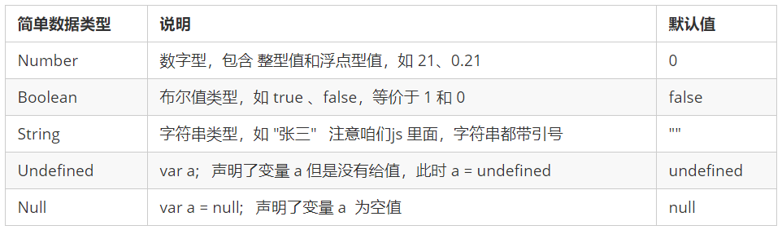
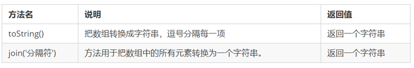
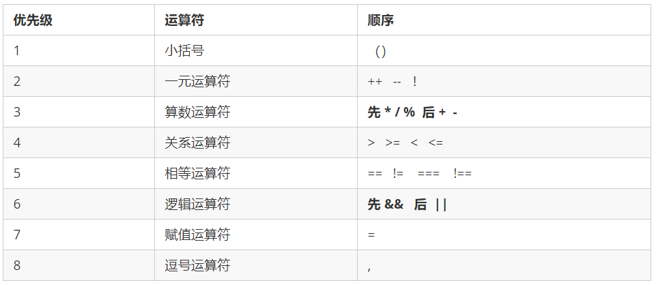
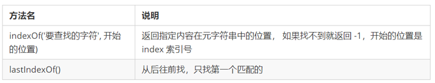
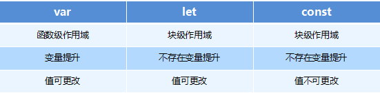

# JS介绍

浏览器本身并不会执行JS代码，而是通过内置JavaScript引擎(解释器) 来执行JS代码 。JS引擎执行代码时逐行解释每一句源码（转换为机器语言），然后由计算机去执行，所以JavaScript语言归为脚本语言，会逐行解释执行

## JS的组成

1. ECMAScript：ECMAScript是由ECMA国际（原欧洲计算机制造商协会）进行标准化的一门编程语言，这种语言在万维网上应用广泛，它往往被称为JavaScript或JScript，但实际上后两者是ECMAScript语言的实现和扩展
2. 文档对象模型（Document Object Model，简称DOM）：是W3C组织推荐的处理可扩展标记语言的标准编程接口。通过DOM提供的接口可以对页面上的各种元素进行操作（大小、位置、颜色等）
3. ECMAScript（Browser Object Model，简称BOM) ：是指浏览器对象模型，它提供了独立于内容的、可以与浏览器窗口进行互动的对象结构。通过BOM可以操作浏览器窗口，比如弹出框、控制浏览器跳转、获取分辨率等

## JS执行机制

### JS 是单线程


单线程就意味着所有任务需要排队，前一个任务结束，才会执行后一个任务。**如果前一个任务耗时很长，后一个任务就不得不一直等着**。这样所导致的问题是： 如果 JS 执行的时间过长，这样就会造成页面的渲染不连贯，导致页面渲染加载阻塞的感觉

###  同步任务和异步任务

单线程导致的问题就是后面的任务等待前面任务完成，如果前面任务很耗时（比如读取网络数据），后面任务不得不一直等待。为了解决这个问题，利用多核CPU的计算能力，HTML5提出Web Worker标准，允许JavaScript脚本创建多个线程，但是子线程完全受主线程控制。于是，JS中出现了同步任务和异步任务

同步任务：前一个任务结束后再执行后一个任务，程序的执行顺序与任务的排列顺序是一致的、同步的。比如做饭的同步做法：我们要烧水煮饭，等水开了（10分钟之后），再去切菜，炒菜

异步任务：你在做一件事情时，因为这件事情会花费很长时间，在做这件事的同时，你还可以去处理其他事情。比如做饭的异步做法，我们在烧水的同时，利用这10分钟，去切菜，炒菜

>JS中所有任务可以分成两种，一种是同步任务（synchronous），另一种是异步任务（asynchronous）
>
><u>同步任务</u>指的是：
>
>在主线程上排队执行的任务，只有前一个任务执行完毕，才能执行后一个任务；
>
><u>异步任务</u>指的是：
>
>不进入主线程、而进入**任务队列**的任务，当主线程中的任务运行完了，才会从任务队列取出异步任务放入主线程执行。


### 事件循环


## JavaScript的三种使用方式

- 内联式（主要用于事件）

  - `<input type="button" name="" onclick="alert('ok！');">`
  - 可以将单行或少量JS代码写在HTML标签的事件属性中（以`on`开头的属性），如：`onclick`
  - **注意单双引号的使用：在HTML中我们推荐使用双引号，JS中我们推荐使用单引号**
  - 可读性差， 在html中编写JS大量代码时，不方便阅读
  - 引号易错，引号多层嵌套匹配时，非常容易弄混
  - 特殊情况下使用

- 嵌入式

  - ```html
    <script type="text/javascript"> <!-- type=可以省略 --> 
        // 单行注释
        /* 多
        行
        注
        释 */
        alert('显示1');
        console.log('显示2');
        prompt('显示3');
    </script>
    ```

- 外部式css样式，写在单独的一个文件中

  - `<script type="text/javascript" src="js/index.js"></script>`
  - 利于HTML页面代码结构化，把大段JS代码独立到HTML页面之外，既美观，也方便文件级别的复用
  - 引用外部JS文件的script标签中间不可以写代码
  - 适合于JS代码量比较大的情况

**注意：**

我们可以将JavaScript代码放在html文件中任何位置，但是我们一般放在网页的`<head>`或者`<body>`部分。 <u>放在`<head>`部分最常用的方式是在页面中`<head>`部分放置`<script>`元素，浏览器解析`<head>`部分就会执行这个代码，然后才解析页面的其余部分。 放在`<body>`部分 JavaScript代码在网页读取到该语句的时候就会执行。</u>

javascript作为一种脚本语言可以放在html页面中任何位置，但是浏览器解释html时是按先后顺序的，所以前面的script就先被执行。比如进行页面显示初始化的js必须放在`<head>`里面，因为初始化都要求提前进行（如给页面body设置css等）；而如果是通过事件调用执行的`function`那么对位置没什么要求的。

比如使用`document.getElementById`时，该标签还没有定义，所以这个语句要写在这个标签后面

## 标志符，关键字和保留字

### 标识符

    标识(zhi)符：就是指开发人员为变量、属性、函数、参数取的名字。
    标识符不能是关键字或保留字。

### 关键字

```javascript
关键字：是指 JS本身已经使用了的字，不能再用它们充当变量名、方法名。

包括：break、case、catch、continue、default、delete、do、else、finally、for、function、if、in、instanceof、new、return、switch、this、throw、try、typeof、var、void、while、with 等。
```

### 保留字

    保留字：实际上就是预留的“关键字”，意思是现在虽然还不是关键字，但是未来可能会成为关键字，同样不能使用它们当变量名或方法名。
    
    包括：boolean、byte、char、class、const、debugger、double、enum、export、extends、fimal、float、goto、implements、import、int、interface、long、mative、package、private、protected、public、short、static、super、synchronized、throws、transient、volatile 等。
    
    注意：如果将保留字用作变量名或函数名，那么除非将来的浏览器实现了该保留字，否则很可能收不到任何错误消息。当浏览器将其实现后，该单词将被看做关键字，如此将出现关键字错误。

# 变量定义

JavaScript 是一种弱类型语言，也就是说不需要指定变量的类型，JavaScript的变量类型由它的值来决定， 定义变量需要用关键字`var`, 一条JavaScript语句应该以`;`结尾。使用该关键字声明变量后，计算机会自动为变量分配内存空间

在代码运行时，变量的数据类型是由 JS引擎根据`=`右边变量值的数据类型来判断的，运行完毕之后，变量就确定了数据类型。JavaScript拥有动态类型，同时也意味着相同的变量可用作不同的类型

定义变量的语法格式: `var 变量名 = 值;`

**声明变量特殊情况**

| 情况                           | 说明                    | 结果      |
| ------------------------------ | ----------------------- | --------- |
| var  age ; console.log (age);  | 只声明 不赋值           | undefined |
| console.log(age)               | 不声明 不赋值  直接使用 | 报错      |
| age   = 10; console.log (age); | 不声明   只赋值         | 10        |

## 数据类型

js中有六种数据类型，包括五种基本数据类型和一种复杂数据类型(object)。

5种基本数据类型：

1. `number`：数字类型，`21`（整数），`21.37`（小数），`010`（十进制8），`0xA`（十六进制10）

   - 在JS中八进制前面加`0`，十六进制前面加`0x`
   - JavaScript中数值的最大：`Number.MAX_VALUE` = 1.7976931348623157e+308
   - 最小：`Number.MIN_VALUE` = 5e-324
   - 无穷大：`Infinity`
   - 无穷小：`-Infinity`
   - 非数值Not a number：`NaN`
     - `isNaN('Junk')`的结果为`true`。用来判断一个变量是否为非数字的类型，返回`true`或者`false`

2. `string`：字符串类型，单引号或双引号，推荐单引号

   - `strMsg.length`获取字符串长度
   - 多个字符串之间可以使用`+`进行拼接，其拼接方式为`字符串 + 任何类型` = 拼接之后的新字符串。拼接前会把与字符串相加的任何类型转成字符串，再拼接成一个新的字符串

3. `boolean`：布尔类型true或false

   - 布尔型和数字型相加的时候，`true`的值为 1 ，`false`的值为 0
     - `true+1`的结果为2

4. `undefined`：undefined类型，变量声明未初始化，它的值就是undefined

   ```javascript
   var variable;
   console.log(variable);           // undefined
   console.log('你好' + variable);  // 你好undefined
   console.log(11 + variable);     // NaN
   console.log(true + variable);   //  NaN
   ```

5. `null`：null类型，表示空对象，如果定义的变量将来准备保存对象，可以将变量初始化为null，在页面上获取不到对象，返回的值就是null

```javascript
var vari = null;
console.log('你好' + vari);  // 你好null
console.log(11 + vari);     // 11
console.log(true + vari);   //  1
```



1种复合类型：

1. object 后面学习的**数组、函数和JavaScript对象**都属于复合类型

## `typeof`获取变量的类型

```javascript
/* 由于js历史原因，设计之前没有null类型，null值归属于object类型，后续js语言迭代后也没进行修改 */
var type = typeof(oObj); // typeof oObj用这个没有括号的版本
alert(type); // 返回string

var obj = {
    name: '张三',
    age: 16,
}
console.log(obj['age']);
console.log(typeof obj); // object
```

## 数据类型转换

1. 转换成string类型
   1. `toString()`：`var num=10; alert(num.toString());`
   2. `String()`强制转换：`var num=10; alert(String(num));`
   3. `+`号隐式转换：`var num=10; alert(num+'');`
2. 转换为number类型
   1. `parseInt(string)`转换为整数数值型：`parseInt('10')`
   2. `parseFloat(string)`转换为浮点型数值型：`parseFloat('10.5')`
   3. `Number()`强制转换：`Number('10')`
   4. 算术运算符隐式转换：`'10'-5`
3. 转换为boolean类型
   1. `Boolean()`：`Boolean('true')`
   2. 代表空、否定的值会被转换为`false`，如 `''`、`0`、`NaN`、`null`、`undefined`，其余值都会被转换为 `true`

## 变量命名规范

- 区分大小写
- 第一个字符必须是字母、下划线（`_`）或者美元符号（`$`），不能以数字开头
- 其他字符可以是字母(`A-Za-z`)、数字(`0-9`)、下划线(`_`)、美元符号(`$`)
- 不能使用JavaScript关键词与JavaScript保留字
- 变量虽然也可以不声明，直接使用，但不规范，需要先声明，后使用

### 标志符命名规范

- 变量、函数的命名必须要有意义
- 变量的名称一般用名词  
- 函数的名称一般用动词  

### 操作符规范

```javascript
// 操作符的左右两侧各保留一个空格
for (var i = 1; i <= 5; i++) {
   if (i == 3) {)
```

单行注释规范：单行注释前面注意有个空格

其他规范：关键词、操作符之间后加空格	

```javascript
for (var i = 1; i <= 5; i++) {
   if (i == 3) {
       break; // 单行注释前面注意有个空格
   }
   console.log('我正在吃第' + i + '个包子呢');
}
```

## JavaScript对象

JavaScript 中的所有事物都是对象：字符串、数值、数组、函数等都可以认为是对象，此外，JavaScript 允许自定义对象，对象可以拥有属性和方法，可以访问数据更语义化，数据结构清晰，表意明显，方便开发者使用。

### 创建对象

创建自定义javascript对象有三种方式:

1. 通过顶级Object类型来实例化一个对象：`var obj = new Object();`
2. 通过对象字面量创建一个对象：就是花括号`{}`里面包含了表达这个具体事物（对象）的属性和方法；`{}`里面采取键值对的形式表示 
3. 利用构造函数创建对象，通过`new`关键字创建对象的过程我们也称为对象实例化
   - 构造函数约定首字母大写
   - 函数内的属性和方法前面需要添加`this`，表示当前对象的属性和方法
   - 构造函数中不需要`return`返回结果
   - 当我们创建对象的时候，必须用`new`来调用构造函数
   - `new`关键字的作用
     - 在构造函数代码开始执行之前，在内存中创建一个新的空对象
     - 修改this的指向，把this指向创建出来的空对象
     - 执行构造函数里面的代码，给这个新对象添加属性和方法
     - 返回`this`这个新对象（所以构造函数里面不需要return）

```javascript
// Object类创建对象的示例代码:
<script>
    var oPerson = new Object();
    // 添加属性：
    oPerson.name = 'tom';
    oPerson.age = '25';
    // 添加方法：
    oPerson.sayName = function(){
        alert(this.name);
    }
    // 调用属性和方法：
    alert(oPerson.age);
    oPerson.sayName();

// 对象字面量创建对象的示例代码:
    var oPerson2 = {
        name:'Rose',
        age: 18,
        sayName:function(){
            alert('My name is' + this.name);
        }
    }
    // 调用属性和方法：
    alert(oPerson2.age);
	alert(oPerson2['age']);
    oPerson2.sayName();

	// JS在ES6之前没有类的概念，使用构造函数创建对象
	function 构造函数名(形参1,形参2,形参3) {
         this.属性名1 = 参数1;
         this.属性名2 = 参数2;
         this.属性名3 = 参数3;
         this.方法名 = 函数体;
	}

    function Student(name, age, grade) {
        this.name = name;
        this.age = age;
        this.grade = grade;
        this.showGrade = function () {
            console.log('i am ' + this.name + " and my scores are " + this.grade);
        }
    }

    s1 = new Student('张三', 12, [100, 99, 102]);
    // 调用对象
    s1.showGrade();
    // 遍历对象
    for (k in s1) {
        console.log(k);
        console.log(s1[k]);
    }

    // 1. 实例成员就是构造函数内部通过this添加的成员 如下列代码中name age grade showGrade 就是实例成员
    // 实例成员只能通过实例化的对象来访问
    document.write(s1.name);
    document.write(s1.age);
    document.write(s1.grade);
    document.write(Student.grade); // undefined 不可以通过构造函数来访问示例成员

    // 2. 静态成员是在构造函数本身上添加的成员。如下列代码中sex就是静态成员
    Student.sex = "男";
    console.log(Student.sex);
    console.log(s1.sex); // undefined 静态成员只能通过构造函数来访问
</script>
```

### 遍历对象

`for...in`语句用于对数组或者对象的属性进行循环操作

```javascript
for (变量 in 对象名字) {
    // 在此执行代码
}
```

### 变量和属性，方法和函数

属性是对象的一部分，而变量不是对象的一部分，变量是单独存储数据的容器。

- 变量：单独声明赋值，单独存在
- 属性：对象里面的变量称为属性，不需要声明，用来描述该对象的特征

方法是对象的一部分，函数不是对象的一部分，函数是单独封装操作的容器

- 函数：单独存在的，通过`函数名()`的方式就可以调用
- 方法：对象里面的函数称为方法，方法不需要声明，使用`对象.方法名()`的方式就可以调用，方法用来描述该对象的行为和功能

### ES5新增对象方法

```javascript
// Object.keys(对象) 获取到当前对象中的属性名，效果类似for..in，返回值是一个由属性名组成的数组
s1 = new Student('张三', 12, [100, 99, 102]);
console.log(Object.keys(s1)); // ['name', 'age', 'grade', 'showGrade']

// Object.defineProperty(obj, prop, descriptor)定义或修改对象中的属性
// obj: 必需，目标对象
// prop：必需，需定义或修改的属性名字
// descriptor：必需，目标属性所拥有的特性。对象形式
// - value:修改或新增的属性的值,
// - writable:true/false,//如果值为false 不允许修改这个属性值
// - enumerable: false,//enumerable 如果值为false 则不允许遍历
// - configurable: false  //configurable 如果为false 则不允许删除这个属性 属性是否可以被删除或是否可以再次修改特性，修改特性会报错
s1 = new Student('张三', 12, [100, 99, 102]);
Object.defineProperty(s1, 'id', {
    value: 1,
    writable: false,
    enumerable: false, // 默认为false
    configurable:false // 默认为false
})
s1.id = 10;
console.log(s1); // id:1
console.log(Object.keys(s1));
delete s1.id; 
console.log(s1); // 仍有id
```

## Array数组对象

数组是指一组数据的集合，其中的每个数据被称作元素，==数组存储的数据可以是任何类型（数字、字符、布尔值等）==。下标用来访问数组元素的序号（数组下标从0开始），不支持负数下标 ，如果访问时数组没有和索引值对应的元素，则得到的值是`undefined`

### 创建数组

1. 利用`new`创建数组
2. 利用数组字面量创建数组

注意，在使用`var arr = new Array();`创建数组时

- 如果没有传递参数，创建出的是空数组
- 如果只传入一个参数，则参数规定了数组的长度
- 如果传入了多个参数，则参数称为数组的元素

```javascript
// 创建数组的两种方式
// 1. 利用new创建数组  
var aList = new Array(1,2,3);
// 如果设置的length属性值大于数组的元素个数，则会在数组末尾出现空白元素（undefined）
var aList3 = new Array(8) // 即使指定了长度为8，仍然可以将元素存储在规定长度以外。
aList[6]=10;
document.write("数组的长度是："+aList.length); //数组的长度是：7
// 2. 利用数组字面量创建数组
var aList2 = [[1,2,3],['a','b','c']];
Array.isArray(aList2) // true
```

### 添加删除数组元素


### 数组排序


```javascript
var arr = [19, 21, 56, 73, 24, 66];
// arr.sort();
// arr.sort(function compareFn(a, b){return b-a;});、
// 若返回值<=-1，则表示a在排序后的序列中出现在b之前；若返回值>-1&&<1，则表示a和b具有相同的排列顺序；若返回值>=1，则表示a在排序后的序列中出现在b之后
arr.sort((a, b) => b - a)
console.log(arr.join(‘#’));

// arr1.concat(arr2, arr3)会创建一个新数组，不会改变原来的数组
var arr1 = [1, 2, 3];
var arr2 = ['a', 'b', 'c'];
var arr3 = ['d', 'e', 'f'];
console.log(arr1.concat(arr3, arr2)); // [1, 2, 3, 'd', 'e', 'f', 'a', 'b', 'c']
```

`sort()`方法可以传参也可以传函数

### 数组索引


### 数组转换为字符串



`join`方法如果不传入参数，则按照 `, `拼接元素

### 其他方法

`Array.isArray()`用于判断一个对象是否为数组，`isArray()`是HTML5中提供的方法


`slice()`并不会修改数组，而是返回一个子数组。可使用负值从数组的尾部选取元素，如果`end`未被规定，那么`slice()`方法会选取从`start`到数组结尾的所有元素

### *ES5新增数组方法-forEach/filter/some/every/map/reduce

```javascript
// forEach遍历数组，相当于数组遍历的for循环 没有返回值
// value:数组元素
// index:数组元素的索引
// array:当前的数组
var arr = ['a', 'b', 'c', 'd'];
arr.forEach(function (value, index, array) {
    document.write('数组的值：' + value + '<br>');
    document.write('数组的索引：' + index + '<br>');
    document.write('数组本身：' + array + '<br>');
})

// filter过滤数组，返回值是一个新数组
// value:数组元素
// index:数组元素的索引
// array:当前的数组
var arr = [12, 66, 4, 88, 3, 7];
var newArr = arr.filter(function(value, index, array) {
    return value >= 20;
});
console.log(newArr);// [66,88] 

// some查找数组中是否有满足条件的元素，返回值是布尔值。只要查找到满足条件的一个元素就立马终止循环。所以终止循环时必须执行return true，而在forEach里面return不会终止迭代
// value:数组元素
// index:数组元素的索引
// array:当前的数组
var arr = [10, 30, 4];
var flag = arr.some(function(value) { // 不用可以不写
    if (value===3){
        console.log('find it');
        return true; // return true表示已经找到了这个元素，终止循环
        //return false; // 表示没有找到这个元素，会一直找所以元素
    }
    alert(1); //some会执行一次，而forEach每次遍历都会执行
});
console.log(flag); // false

// The map() method creates a new array populated with the results of calling a provided function on every element in the calling array
const array1 = [1, 4, 9, 16];
// pass a function to map
const map1 = array1.map(x => x * 2);
console.log(map1); // [2, 8, 18, 32]

// The every() method tests whether all elements in the array pass the test implemented by the provided function. It returns a Boolean value
const isBelowThreshold = (currentValue) => currentValue < 40;
const array1 = [1, 30, 39, 29, 10, 13];
console.log(array1.every(isBelowThreshold)); // true

//T he reduce() method executes a user-supplied "reducer" callback function on each element of the array, in order, passing in the return value from the calculation on the preceding element. The final result of running the reducer across all elements of the array is a single value.
const array1 = [1, 2, 3, 4];
const initialValue = 0;
const sumWithInitial = array1.reduce(
  (previousValue, currentValue) => previousValue + currentValue,
  initialValue
);
console.log(sumWithInitial); // 10
```

### *ES6 Array的扩展运算符

扩展运算符可以将数组或者对象转为用逗号分隔的==参数序列==（`toString`是转换成`string`，在console是有逗号的）

可以和python类比记忆。对比[剩余参数](#剩余参数)

```python
data = [1, 2, 3, 4]
print(*data) # 1 2 3 4

let data = [1, 2, 3, 4]
console.log(...data) # 1 2 3 4
```


```javascript
let ary = ["a", "b", "c"];
// ...ary // "a", "b", "c"
/* 这个参数方法中的逗号，在传入console.log中后，参数序列中的逗号会被当做console.log方法的参数分隔符 */
console.log(...ary) // a b c 相当于下面的代码
console.log("a", "b", "c") //a b c

// 扩展运算符应用于数组合并
// 第一种方法
let ary1 = [1, 2, 3];
let ary2 = [4, 5, 6];
let ary3 = [...ary1, ...ary2];
console.log(ary3)

// 第二种方法
ary1.push(ary2); // [1, 2, 3, [4, 5, 6]]
ary1.push(...ary2); // [1, 2, 3, 4, 5, 6]
console.log(ary1) 

// 利用扩展运算符将伪数组转换为真正的数组，之后可以调用数组的方法
var oDivs = document.getElementsByTagName('div');
console.log(oDivs)
var ary = [...oDivs];
ary.push('a');
console.log(ary);
```

### *ES6 构造函数方法`Array.from()`

将伪数组或可遍历对象转换为真正的数组。方法还可以接受第二个参数，作用类似于数组的map方法，用来对每个元素进行处理，将处理后的值放入返回的数组

```javascript
// 注意一下这个length的值
var arrayLike = {
"0": "1",
"1": "2",
"length": 3
}
var ary = Array.from(arrayLike); // [1, 2, undefined]
console.log(ary)

var ary = Array.from(arrayLike, item => item * 2) // [2, 4, NaN]
console.log(ary)
```

### *ES6 实例方法find/findIndex/includes

- `find`方法对数组中的每一项元素执行一次`callback`函数，直至有一个`callback`返回`true`。当找到了这样一个元素后，该方法会立即返回这个元素的值，否则返回`undefined`
- `findIndex()`方法返回数组中满足提供的测试函数的第一个元素的索引。若没有找到对应元素则返回`-1`
- `includes()`方法用来判断一个数组是否包含一个指定的值，根据情况，如果包含则返回 `true`，否则返回 `false`

```javascript
// find()：用于找出第一个符合条件的数组成员，如果没有找到返回undefined
let ary = [{
     id: 1,
     name: '张三'
 }, { 
     id: 2,
     name: '李四'
 }]; 
// index是可选参数，表示当前遍历到的索引。和forEach中的index作用相同
 let target = ary.find((item, index) => item.id == 2);// 找数组里面符合条件的值，当数组中元素id等于2的查找出来，注意，只会匹配第一个

let ary = [1, 5, 10, 15];
let index = ary.findIndex((value, index) => value > 9); 
console.log(index); // 2

// fromIndex 可选
// 从fromIndex 索引处开始查找 valueToFind。如果为负值，则按升序从 array.length + fromIndex 的索引开始搜 （即使从末尾开始往前跳 fromIndex 的绝对值个索引，然后往后搜寻）。默认为 0
[1, 2, 3].includes(2) // true 
[1, 2, 3].includes(4) // false
```

# 运算符

## 算术运算符

`+`，`-`， `*`， `/`， `%`，`++`（自增），`--`（自减），`+=`，`-=`，`*=`，`/=`，`%=`

浮点数的精度问题：浮点数值的最高精度是17位小数，但在进行算术计算时其精确度远远不如整数，所以不要直接判断两个浮点数是否相等

## 比较运算符

假如 x = 5, 查看比较后的结果:

| 比较运算符 |                       描述                       |                 例子                 |
| :--------: | :----------------------------------------------: | :----------------------------------: |
|     ==     | 等于（比较的是值，比较时会自动进行数据类型转换） |           x == 8 为 false            |
|    ===     |                 全等（值和类型）                 | x =\== 5 为 true; x === "5" 为 false |
|     !=     |                      不等于                      |            x != 8 为 true            |
|     >      |                       大于                       |            x > 8 为 false            |
|     <      |                       小于                       |            x < 8 为 true             |
|     >=     |                    大于或等于                    |           x >= 8 为 false            |
|     <=     |                    小于或等于                    |            x <= 8 为 true            |

## 逻辑运算符

假如 x=6, y=3, 查看比较后的结果:

| 比较运算符 | 描述 |             例子              |
| :--------: | :--: | :---------------------------: |
|     &&     | and  |   (x < 10 && y > 1) 为 true   |
|    \|\|    |  or  | (x == 5 \|\| y == 5) 为 false |
|     !      | not  |       !(x == y) 为 true       |

### 短路逻辑

短路运算的原理：当有多个表达式（值）时，左边的表达式值可以确定结果时，就不再继续运算右边的表达式的值。和python相同

```javascript
console.log(123 && 456);        // 456
console.log(0 && 456);          // 0
console.log(123 && 456&& 789);  // 789
console.log(123 || 456);         //  123
console.log(0 ||  456);          //  456
console.log(123 || 456 || 789);  //  123
```

## 运算符优先级



- 一元运算符里面的逻辑非优先级很高
- 逻辑与比逻辑或优先级高

# 条件和循环语句

- `switch`语句进行条件判断后直接执行到程序的条件语句，效率更高。而`if…else`语句有几种条件，就得判断多少次。当分支比较少时，`if… else`语句的执行效率比`switch`语句高；当分支比较多时，`switch`语句的执行效率比较高，而且结构更清晰。 

```html
<script type="text/javascript">
    // if条件语句
	if(条件1) {条件1成立时执行的代码}
	else if(条件2) {条件2成立时执行的代码}
	...
	else if(条件n) {条件n成立时执行的代码}
	else {条件1、2至n不成立时执行的代码}
    // 三元表达式
    表达式1 ? 表达式2 : 表达式3;
    
    // switch条件语句，如果存在匹配全等(===) ，则与该case关联的代码块会被执行，并在遇到break时停止，整个switch语句代码执行结束，若所有的case的值都和表达式的值不匹配，则执行default里的代码
    switch (表达式或值){
        case 表达式/值1:
            执行代码块 1
            break;
        case 表达式/值2:
            执行代码块 2
            break;
        ...
        case 表达式/值n:
            执行代码块 n
            break;
        default:
            与 case值1 、 case值2...case值n 不同时执行的代码
    }
    
    // for循环 
    for (初始化变量;循环条件;循环迭代){
		循环语句
        continue; //break;
    }
    
	// while循环
    while (判断条件){
	    循环语句
    }
    
    // do...while循环: 它保证循环体至少被执行一次。因为它是先执行代码，后判断条件，如果条件为真，继续循环。
    do{
        循环语句
    }while (判断条件)
</script>

<script type="text/javascript">
    // 匿名函数的写法。页面标签和数据都加载完成以后会触发onload事件
	window.onload = function(){
		var oDiv = document.getElementById('div1');
    }
</script>
```

# 函数

在JavaScript中，形参的默认值是`undefined`。在函数形参和实参数量不匹配时

- 实参个数等于形参个数 ：输出正确结果
- 实参个数小于形参个数 ：多的形参定义为`undefined`，结果为`NaN`
- 实参个数大于形参个数 ：只取到形参的个数

在使用`return`语句时，函数会停止执行，并返回指定的值，如果函数没有`return`，返回的值是`undefined`

```javascript
// 声明函数，function 是声明函数的关键字，必须小写
function 函数名(形参1, 形参2 , 形参3...) { // 可以定义任意多的参数，用逗号分隔
  // 函数体
}

// 匿名函数
// 这是函数表达式写法，匿名函数后面跟分号结束
var fn = function(){...};
// 调用的方式，函数调用必须写到函数体下面。如果先调用fn，就会报错
fn();

// new Function()定义函数
/* Function 里面参数都必须是字符串格式
第三种方式执行效率低，也不方便书写，因此较少使用
所有函数都是 Function 的实例(对象)  
函数也属于对象
*/
var f = new Function('参数1','参数2'..., '函数体');
var f = new Function('a', 'b', 'console.log(a + b)');
f(1, 2);
console.dir(f);
console.log(f instance Object); 
                    
// 调用函数，调用的时候千万不要忘记添加小括号
函数名(实参1, 实参2, 实参3...);  // 通过调用函数名来执行函数体代码
f();
f.call();
// 绑定事件函数
btn.click = function() {}
// 定时器函数
setInterval(function(){}, 1000) // 每个1s调用一次
// 立即执行函数，自动调用
(function(){
	alert(1);

})()
```

## 函数内部的`this`指向


## 改变函数内部`this`指向

### `call()`方法

`call()`方法调用一个对象。简单理解为调用函数的方式，但是它可以改变函数的`this`指向

应用场景：经常做[继承](#子构造函数继承父构造函数中的属性)

```js
var o = {
    name: 'andy'
}
function fn(a, b) {
    console.log(this);
    console.log(a+b)
};
// call()方法
fn(1,2) // 此时的this指向的是window，运行结果为3
fn.call(o,1,2) // 此时的this指向的是对象o，参数使用逗号隔开，运行结果为3
// apply()方法
fn() // 此时的this指向的是window，运行结果为3
fn.apply(o,[1,2]) // 此时的this指向的是对象o，参数使用数组传递，运行结果为3
var max = Math.max.apply(Math, [10, 11, 21]);
// bind()方法
var f = fn.bind(o, 1, 2); // 此处的f是bind返回的新函数
f(); //调用新函数  this指向的是对象o，参数使用逗号隔开
```

### `apply()`方法

`apply()`方法调用一个函数。简单理解为调用函数的方式，但是它可以改变函数的`this`指向。第一个参数是需要`this`指向的对象，第二个参数是数组。

应用场景：经常跟数组有关系

### `bind()`方法

`bind()`方法不会调用函数，但是能改变函数内部`this`指向，返回由指定的`this`值和初始化参数改造的原函数拷贝

如果只是想改变`this`指向，并且不想调用这个函数的时候，可以使用`bind`

应用场景：如果有的函数我们不需要立即调用,但是又想改变这个函数内部的`this`指向此时用`bind`

```javascript
// 我们有一个按钮，当我们点击了之后就禁用这个按钮，3秒钟之后开启这个按钮
var btns = document.querySelectorAll('button');
    for (var i = 0; i < btns.length; i++) {
        btns[i].onclick = function() {
            this.disabled = true; // // 这个this 指向的是 btn 这个按钮
            setTimeout(function() {
                this.disabled = false; // 定时器函数里面的this本来指向的是window
            }.bind(this), 2000); // 使定时器函数里面的this指向btn，注意写在外面
        }
    }
```

## `arguments`的使用

当不确定有多少个参数传递的时候，可以用`arguments`来获取。JavaScript中，`arguments`实际上它是当前函数的一个内置对象。所有函数都内置了一个`arguments`对象，`arguments`对象中存储了传递的所有实参。`arguments`展示形式是一个伪数组，因此可以进行遍历。伪数组具有以下特点：

- 具有`length`属性
- 按索引方式储存数据
- 不具有数组的`push`，`pop`等方法

注意：在函数内部使用该对象，用此对象获取函数调用时传的实参。

```javascript
function showArgu(){
    for (var i=0; i<arguments.length;i++){
        document.write(arguments[i]+"<br \>");
    }
}
showArgu(1, 2, 3);
```

## 变量作用域

在JavaScript中，根据作用域的不同，变量可以分为两种：

- 局部变量：在局部作用域下声明的变量叫做局部变量（在函数内部定义的变量）
  - 局部变量只能在该函数内部使用
  - 在函数内部`var`声明的变量是局部变量
  - 函数的形参实际上就是局部变量
  - 局部变量只在函数内部使用，当其所在的代码块被执行时，会被初始化；当代码块运行结束后，就会被销毁，因此更节省内存空间
  
- 全局变量：在全局作用域下声明的变量叫做全局变量（在函数外部定义的变量）
  - 全局变量在代码的任何位置都可以使用
  - 在全局作用域下`var`声明的变量 是全局变量
  - 特殊情况下，在函数内不使用`var`声明的变量也是全局变量（不建议使用）
  - 全局变量在任何一个地方都可以使用，只有在浏览器关闭时才会被销毁，因此比较占内存


注意**在ES6之前**JS没有块级`{}`作用域。在`if`语句、循环语句中创建的变量，能全局使用

## 作用域链

只要是代码都一个作用域中，写在函数内部的是局部作用域，未写在任何函数内部即在全局作用域中。如果函数中还有函数，那么在这个作用域中就又可以诞生一个作用域；根据在【内部函数可以访问外部函数变量】的这种机制，用链式查找决定哪些数据能被内部函数访问，就称作作用域链

## 预解析

JavaScript代码是由浏览器中的JavaScript解析器来执行的。JavaScript解析器在运行JavaScript代码的时候分为两步：预解析和代码执行。

- 预解析：在当前作用域下，JS代码执行之前，浏览器会默认把带有`var`和`function`声明的变量在内存中进行提前声明或者定义
- 代码执行： 从上到下执行JS语句
- 预解析会把变量和函数的声明在代码执行之前执行完成

```javascript
// case 1。变量提升只提升声明，不提升赋值
console.log(num);  // undefined
var num = 10;   

// case 2。函数声明代表函数整体，所以函数提升后，函数名代表整个函数，但是函数并没有被调用
fn();
function fn() {
    console.log('打印');
} // 打印

// case 3。函数表达式创建函数，会执行变量提升，此时接收函数的变量名无法正确的调用
fn();
var  fn = function() {
    console.log('想不到吧');
} // 报错提示 "fn is not a function"
```

**案例**：注意区分全局变量、局部变量、块级作用域


```
a: 因为函数声明表示函数整体，在预解析fn时，num没有值，所以是undefined
b:
Q: num可以被声明两次吗
A: 在 JavaScript 中，你可以在同一个作用域内多次声明同一个变量，但是这通常是不被推荐的，因为它可能会导致代码的混乱和错误。在严格模式（'use strict'）下，试图重复声明变量将导致错误。

在你的代码示例中，你在全局作用域和函数 fn 的局部作用域中分别声明了变量 num。这是完全合法的，因为它们是在不同的作用域中声明的。这两个 num 变量是不同的变量，各自有自己的值。在函数 fn 内部，局部的 num 遮蔽了全局的 num。

所以，虽然在同一作用域内多次声明同一变量通常是不好的实践，但在不同的作用域中声明同名的变量是完全合法的。这是 JavaScript 作用域规则的一部分。
c:
这个现象与 JavaScript 的操作符优先级和变量声明有关。在这个语句 var a = b = c = 9; 中，赋值操作符 = 是从右到左执行的，所以这个语句实际上可以看作是：var a = (b = (c = 9));

首先，c = 9 创建了一个全局变量 c 并赋值为 9。然后 b = c 创建了一个全局变量 b 并赋值为 c 的值 9。最后，var a = b 在局部作用域（函数 f1）创建了一个变量 a 并赋值为 b 的值 9。

这里的关键在于 var 关键字只对 a 起作用，使 a 成为函数 f1 的局部变量。而 b 和 c 没有使用 var 关键字，所以它们是全局变量（除非你在 'use strict' 模式下，那样的话试图赋值未声明的变量将导致错误）。

这就是为什么在这个语句中，只有 a 是使用 var 关键字声明的。这也是一个很好的例子，说明为什么在 JavaScript 中，我们应该总是显式地声明我们的变量，以避免意外创建全局变量，可能会导致意想不到的结果。

d:
然而，只有 a 是在函数 f1 的局部作用域内声明的，b 和 c 没有使用 var 关键字，因此它们成为全局变量（如果 'use strict' 模式没有被启用）。这就是为什么在函数 f1 外部，你可以访问到 b 和 c 的值。
```


## 闭包

闭包（closure）指有权访问另一个函数作用域中变量的函数。简单理解就是 ，一个作用域可以访问另外一个函数内部的局部变量。 ==闭包可以延伸变量的作用范围==

本质即利用inner的函数访问outer的函数，inner的函数能访问outer里的变量。和python的闭包相同

案例：利用闭包，1. 点击`li`时可以获得当前`li`的索引号 2. 计算打车价格

```javascript
<body>
    <ul class="nav">
        <li>榴莲</li>
        <li>臭豆腐</li>
        <li>鲱鱼罐头</li>
        <li>大猪蹄子</li>
    </ul>
    <script>
        // 闭包应用 - 点击li输出当前li的索引号
        // 1. 我们可以利用动态添加属性的方式
        var lis = document.querySelector('.nav').querySelectorAll('li');
        for (var i = 0; i < lis.length; i++) {
            lis[i].index = i;
            lis[i].onclick = function() {
                // console.log(i); for循环立即执行，但是onclick是一个点击事件（异步），所以点击任意一个li都会输出4
                console.log(this.index); // 这个index是自定义属性
            }
        }
        // 2. 利用闭包的方式得到当前小li的索引号
        for (var i = 0; i < lis.length; i++) {
            // 利用for循环创建了4个立即执行函数
            // 立即执行函数也成为小闭包因为立即执行函数里面的任何一个函数都可以使用它的i这变量
            (function(i) {
                // console.log(i);
                lis[i].onclick = function() {
                    console.log(i);

                }
            })(i);
        }
    </script>
</body>

// 闭包应用 - 计算打车价格 
// 打车起步价13(3公里内)，之后每多一公里增加5块钱。用户输入公里数就可以计算打车价格
// 如果有拥堵情况，总价格多收取10块钱拥堵费
// function fn() {};
// fn();
var car = (function() {
    var start = 13; // 起步价  局部变量
    var total = 0; // 总价  局部变量
    return {
        // 正常的总价
        price: function(n) {
            if (n <= 3) {
                total = start;
            } else {
                total = start + (n - 3) * 5
            }
            return total;
        },
        // 拥堵之后的费用
        yd: function(flag) {
            return flag ? total + 10 : total;
        }
    }
})();
// 必须先调用price再调用yd
console.log(car); // object:(f(n), f(flag))
console.log(car.price(5)); // 23
console.log(car.yd(true)); // 33

console.log(car.price(1)); // 13
console.log(car.yd(false)); // 13
```

思考题

```javascript
// 思考题1：没有闭包产生，因为没有局部变量
var name = "The Window";
var object = {
    name: "My Object",
    getNameFunc: function () {
        return function () {
            return this.name;
        };
    }
};
console.log(object.getNameFunc()) // f(){return this.name;}
console.log(object.getNameFunc()()) // The Window;

// 思考题2：有闭包因为使用了局部变量
var name = "The Window";
var object = {
    name: "My Object",
    getNameFunc: function () {
        var that = this;
        return function () {
            return that.name;
        };
    }
};
console.log(object.getNameFunc()()) // My Object
```

## 高阶函数

高阶函数是对其他函数进行操作的函数，它接收函数作为参数或将函数作为返回值输出。函数也是一种数据类型，同样可以作为参数，传递给另外一个参数使用。最典型的就是作为回调函数。同理函数也可以作为返回值传递回来

```javascript
function fn(a, b, callback) {
    console.log(a + b);
    callback && callback();
}
fn(1, 2, function() {
    console.log('我是最后调用的');
});
// jQuery中大量使用了回调函数
$("div").animate({
    left: 500
}, function() {
    $("div").css("backgroundColor", "purple");
})
```

## 递归

如果一个函数在内部可以调用其本身，那么这个函数就是递归函数。递归函数的作用和循环效果一样，由于递归很容易发生“栈溢出错误”（stack overflow），所以必须要加退出条件return

# 深拷贝和浅拷贝

浅拷贝只是拷贝一层，更深层次对象级别的只拷贝引用。深拷贝拷贝多层，每一级别的数据都会拷贝。

```javascript
var obj = {...};
var o = {};

// 浅拷贝
for (var k in obj) {
	o[k] = obj[k] // 这是浅拷贝
}
// 浅拷贝语法糖
Object.assign(target, ...sources)
Object.assign(o, obj);

// 深拷贝
function deepCopy(newobj, oldobj) {
    for (var k in oldobj) {
        var item = oldobj[k];
        if (item instanceof Array) { // Array也属于Object，会覆盖
            newobj[k] =  [];
            deepCopy(newobj[k], item);
        } else if (item instanceof Object) {
            newobj[k] = {};
            deepCopy(newobj[k], item);
        } else {
            newobj[k] = item;
        }
    }
}
```

# JS内置对象

JavaScript中的对象分为3种：自定义对象 、内置对象、 浏览器对象

自定义对象和内置对象是JS基础内容，属于ECMAScript，浏览器对象属于JS独有的， JS API讲解内置对象就是指JS 语言自带的一些对象，这些对象供开发者使用，并提供了一些常用的或是最基本而必要的功能（属性和方法），内置对象最大的优点就是帮助我们快速开发。JavaScript提供了多个内置对象：`Math`、`Date` 、`Array`、`String`等

`instanceof`可以判断一个对象是否是某个构造函数的实例

## Math对象

Math对象不是构造函数，它具有数学常数和函数的属性和方法。跟数学相关的运算（求绝对值，取整、最大值等）可以使用Math中的成员

| 属性、方法名             | 功能                                                         |
| ------------------------ | ------------------------------------------------------------ |
| Math.PI                  | 圆周率                                                       |
| Math.floor()/Math.ceil() | 向下取整/向上取整                                            |
| Math.exp()/Math.log()    | e^x/ln(x)                                                    |
| Math.round()             | 四舍五入版 就近取整   注意-3.5结果是-3. 两侧相等会向正方向舍入 |
| Math.abs()               | 绝对值                                                       |
| Math.max() / Math.min()  | 求最大和最小值                                               |
| Math.random()            | 获取范围在[0,1)内的随机值                                    |
| Math.pow(x,y)            | x^y                                                          |
| Math.sqrt()              | x^(1/2)                                                      |

## Date对象

Date对象和Math对象不一样，`Date`是一个构造函数，所以**使用时需要实例化后才能使用其中具体方法和属性**。Date 实例用来处理日期和时间


```javascript
var d1 = new Date(); // 获取当前日期和时间
var d2 = new Date('2021/1/20'); // 指定日期
console.log(d1.getDay());
console.log(d1 instanceof Array); // false
console.log(d1 instanceof Date); // true

var t = new Date();
document.write(t.getDate() + "</br>");
document.write(t.getFullYear() + "</br>");
document.write(t.getYear() + "</br>");
document.write(t.getMonth() + "</br>");
document.write(t.getDay() + "</br>");
document.write(t.getTime() + "</br>");
document.write(t.getHours() + "</br>");
document.write(t.getMinutes() + "</br>");
document.write(t.getSeconds() + "</br>");
document.write(t.setMonth(12) + "</br>");
```

## String对象

### 基本包装类型

为了方便操作基本数据类型，JavaScript还提供了三个特殊的引用类型：`String`、`Number`和`Boolean`

基本包装类型就是把简单数据类型包装成为复杂数据类型，这样基本数据类型就有了属性和方法

类似Java的自动装箱和拆箱，JS的处理也是自动的

### 字符串的值不可变

虽然看上去可以改变内容，但其实是地址变了，内存中新开辟了一个内存空间

### 简单数据类型和复杂数据类型

简单类型（基本数据类型、值类型）在存储时变量中存储的是值本身，包括string，number，boolean，undefined，null；复杂数据类型（引用类型）在存储时变量中存储的仅仅是地址（引用），通过`new`关键字创建的对象（系统对象、自定义对象），如Object、Array、Date等。

栈由操作系统自动分配释放存放函数的参数值、局部变量的值等。其操作方式类似于数据结构中的栈；堆存储复杂类型（对象），一般由程序员分配释放，若程序员不释放，由垃圾回收机制回收。值类型变量的数据直接存放在变量（栈空间）中，引用类型变量（栈空间）里存放的是地址，真正的对象实例存放在堆空间中

> <u>函数的形参也可以看做是一个变量，当我们把一个值类型变量作为参数传给函数的形参时，其实是把变量在栈空间里的值**复制**了一份给形参，那么在方法内部对形参做任何修改，都不会影响到的外部变量；当我们把引用类型变量传给形参时，其实是把变量在栈空间里保存的堆地址复制给了形参，形参和实参其实保存的是同一个堆地址，所以操作的是同一个对象</u>

```javascript
function fn(a) {
    a++;
    console.log(a); 
}
var x = 10;
fn(x); // 11
console.log(x); //10 number是简单数据类型

function Person(name) {
    this.name = name;
}
function f1(x) { // x = p
    console.log(x.name); // 2 刘德华    
    x.name = "张学友";
    console.log(x.name); // 3 张学友  
}
var p = new Person("刘德华");
console.log(p.name);    // 1 刘德华  
f1(p);
console.log(p.name);    // 4 张学友
```

### 字符串方法

**字符串通过基本包装类型可以调用部分方法来操作字符串，以下是返回指定字符的位置的方法（查找）**



`indexOf(substring, startpos)`：

1. 区分大小写
2. 如果没有`startpos`参数则从string的开头开始查找
3. 如果没有找到，返回`-1`

**以下是根据位置返回指定位置上的字符（索引）**


`charAt(index)`：

1. 如果参数`index`不在`0`和`string.lentg-1`之间，该方法返回一个空字符串

**字符串操作方法**


`substring(startPos,stopPos)`：

1. 如果参数`startPos`与`stopPos`相等，那么该方法返回的就是一个空串
2. 如果参数`startPos`比`stopPos`大，那么该方法在提取子串之前会先交换这两个参数

`substr(startPos,length)`：

1. 如果参数`startPos`是负数，从字符串的尾部开始算起的位置。也就是说，`-1`指字符串的最后一个字符，以此类推
2. 如果`startPos`为负数且绝对值大于字符串长度`startPos`为`0`

#### replace/split/toLowerCase/trim/startsWith/endsWith/repeat

```javascript
// 转义字符
\b backspace 
\t tab 
\f form feed 
\' single quote 
\n newline 
\" double quote 
\r carriage return 
\\ backslash

var longString = 'shaonianzhangsanfeng';
var newString = longString.replace('shaonian','laonian');

writeP(newString);
writeP(longString.split('a'));
console.log("ABC".toLowerCase());


// es5中的新增方法
// trim方法去除字符串两端的空格。不会影响原来的字符串，返回的是一个新字符串
var str = '   hello   '
console.log(str.trim()）  //hello去除两端空格
var str1 = '   he l l o   '
console.log(str1.trim()）  //he l l o去除两端空格

// es6中的新增方法
// startsWith()：表示参数字符串是否在原字符串的头部，返回布尔值
// endsWith()：表示参数字符串是否在原字符串的尾部，返回布尔值
let str = 'Hello ECMAScript 2015';
let r1 = str.startsWith('Hello');
console.log(r1); // true
let r2 = str.endsWith('2016');
console.log(r2); // false
// repeat方法表示将原字符串重复n次，返回一个新字符串
console.log("y".repeat(5)); // yyyyy
```

### ES6 模板字符串

ES6新增的创建字符串的方式，使用反引号定义。和python的fstring类似

```javascript
// 模板字符串中可以解析变量
let name = `张三`;
let sayHello = `Hello, 我的名字叫${name}`;
console.log(sayHello); // Hello, 我的名字叫张三

// 模板字符串中可以换行
let result = {
    name: "zhangsan",
    age: 20
};
let html = `
			<div>
				<span>${result.name}</span>
				<span>${result.age}</span>
			</div>
		`;
console.log(html);

//在模板字符串中可以调用函数
const fn = () => {
    return '我是fn函数'
}
let html = `我是模板字符串 ${fn()}`;
console.log(html)
```


# (ES5)构造函数+原型对象组合继承

在ES6之前并没有并没有给我们提供`extends`继承。我们可以通过构造函数+原型对象模拟实现继承，被称为组合继承。

## (ES5)构造函数原型prototype

- 构造函数方法很好用，但是存在浪费内存的问题。我们希望所有的对象使用同一个函数，这样就比较节省内存
- 构造函数通过原型分配的函数是所有对象所共享的。
  - 对象都会有一个属性`__proto__`指向构造函数的`prototype`原型对象，之所以我们对象可以使用构造函数`prototype`原型对象的属性和方法，就是因为对象有`__proto__`原型的存在
  - `__proto__`对象原型和原型对象`prototype`是等价的
  - `__proto__`对象原型的意义就在于为对象的查找机制提供一个方向，或者说一条路线，但是它是一个非标准属性，因此实际开发中，不可以使用这个属性，它只是内部指向原型对象`prototype`
- JavaScript 规定，每一个构造函数都有一个`prototype`属性，指向另一个对象。注意这个`prototype`就是一个对象，这个对象的所有属性和方法，都会被构造函数所拥有。我们可以把那些不变的方法，直接定义在`prototype`对象上，这样所有对象的实例就可以共享这些方法


- 对象原型（ `__proto__`）和构造函数（`prototype`）原型对象里面都有一个`constructor`属性 ，我们称为构造函数，因为它指回构造函数本身。`constructor`主要用于记录该对象引用于哪个构造函数，它可以让原型对象重新指向原来的构造函数。一般情况下，对象的方法都在构造函数的原型对象中设置。**<u>如果有多个对象的方法，我们可以给原型对象采取对象形式赋值，但是这样就会覆盖构造函数原型对象原来的内容，这样修改后的原型对象`constructor`就不再指向当前构造函数了。此时，我们可以在修改后的原型对象中，添加一个 `constructor`指向原来的构造函数。</u>**


```javascript
function Student(name, age, grade) {
  this.name = name;
  this.age = age;
  this.grade = grade;
  this.showGrade = function () { ducument.write(grade); };
};

s1 = new Student('张三', 12, [100, 99, 102]);
s2 = new Student('李四', 20, [10, 2, 5]);

console.log(s1.__proto__ === Student.prototype); // true

// 这一部分是追加
Student.prototype.tell = function () {
  document.write("im a bad student");
}
console.log(Student.prototype); // 会出现tell:f(), constructor, 而showGrade则出现在constructor里
console.log(s1.__proto__);
s1.tell(); // 可以调用
console.log(Student.prototype.constructor); // 和原来的Student一样，不会出现tell
console.log(s1.__proto__.constructor);
```

以上四条会在控制台输出


```javascript
function Student(name, age, grade) {
  this.name = name;
  this.age = age;
  this.grade = grade;
  this.showGrade = function () { ducument.write(grade); };
};
// 很多情况下,我们需要手动的利用constructor这个属性指回原来的构造函数
Student.prototype = {
    // 如果我们修改了原来的原型对象，给原型对象赋值的是一个对象，则必须手动的利用constructor指回原来的构造函数
    constructor: Student,
    good: function () {
        document.write("im a bad student<br>");
    },
    bad: function () {
        document.write("im a good student<br>");
    }
}

s1 = new Student('张三', 12, [100, 99, 102]);
s2 = new Student('李四', 20, [10, 2, 5]);
s1.good(); // 可以调用
s1.bad(); // 可以调用
console.log(Student.prototype);
console.log(s1.__proto__);
console.log(Student.prototype.constructor); // 和原来的Student一样，不会出现good, bad
console.log(s1.__proto__.constructor);
```

以上四条会在控制台输出


### 原型链

每一个实例对象又有一个`__proto__`属性，指向的构造函数的原型对象，构造函数的原型对象也是一个对象，也有`__proto__`属性，这样一层一层往上找就形成了原型链


### 原型链和成员的查找机制

1. 当访问一个对象的属性（包括方法）时，首先查找这个对象自身有没有该属性
2. 如果没有就查找它的原型（也就是`__proto__`指向的`prototype`原型对象）
3. 如果还没有就查找原型对象的原型（`Object`的原型对象）
4. 依此类推一直找到`Object`为止（`null`）

`__proto__`对象原型的意义就在于为对象成员查找机制提供一个方向，或者说一条路线

例如，在`Object.prototype`对象里有一个方法`toString()`，但是在`Star.prototype`和`ldh.__proto__`中没有，我们仍然可以使用 

**视频可能有问题**


### 原型对象中this指向

```javascript
var temp;
function Student(name, age, grade) {
    this.name = name;
    this.age = age;
    this.grade = grade;
    this.showGrade = function () {
        console.log('i am ' + this.name + " and my scores are " + this.grade);
    }
}

Student.prototype.bad = function () {
    document.write("im a bad student<br>");
    temp = this;
}

Student.prototype.good = function () {
    document.write("im a good student<br>");
}
s1 = new Student('张三', 12, [100, 99, 102]);
s2 = new Student('李四', 20, [10, 2, 5]);
// 1. 在构造函数中，里面this指向的是对象实例
// 2. 原型对象函数里面的this指向的是实例对象
s1.bad();
console.log(temp === s1); // true
```

### 通过原型扩展内置方法

```javascript
// 通过原型对象，对原来的内置对象进行扩展自定义的方法。比如给数组增加自定义求偶数和的功能\
console.log(Array.prototype); // 查看数组的原型对象
Array.prototype.sum = function () {
    sum = 0;
    for (var i = 0; i < this.length; i++) {
        sum += this[i];
    }
    return sum;
}
var arr = [1, 2, 3];
console.log(arr.sum()); // 6
```

## 子构造函数继承父构造函数中的属性

1. 先定义一个父构造函数
2. 再定义一个子构造函数
3. 子构造函数继承父构造函数的属性，使用`call(this指向，arg1, arg2...)`方法

```javascript
function fn(x, y) {
    console.log(this);
    console.log(x + y);
}
var o = {
    name: 'andy'
};
fn.call(o, 1, 2); // fn里的this会由window变成o

// 让子类继承父类并有自己的属性和方法
// 1. 父构造函数
function Father(uname, age) {
    // this 指向父构造函数的对象实例
    this.uname = uname;
    this.age = age;
}
Father.prototype.talk = function () {
    document.write("i'm a good father.<br>");
};
// 2 .子构造函数 
function Son(uname, age, score) {
    // this指向子构造函数的对象实例
    Father.call(this, uname, age);
    this.score = score;
}
// Son.prototype = Father.prototype;  这样直接赋值，如果修改了子原型对象，父原型对象也会跟着一起变化
Son.prototype = new Father();
// 如果利用对象的形式修改了原型对象别忘了利用constructor指回原来的构造函数
Son.prototype.constructor = Son;
// 这个是子构造函数专门的方法
Son.prototype.talk = function () {
    document.write("i'm a good son.<br>");

}
var father = new Father('大黄', 90);
var son = new Son('二狗子', 18, 100);
console.log(father);
console.log(son);
```


# 类`class`

面向对象和面向过程

- 面向过程就是分析出解决问题所需要的步骤，然后用函数把这些步骤一步一步实现，使用的时候再一个一个的依次调用就可以了
- 面向对象是把事务分解成为一个个对象，然后由对象之间分工与合作

|      | 面向过程                                                     | 面向对象                                                     |
| ---- | ------------------------------------------------------------ | ------------------------------------------------------------ |
| 优点 | 性能比面向对象高，适合跟硬件联系很紧密的东西，例如单片机就采用的面向过程编程 | 易维护、易复用、易扩展，由于面向对象有封装、继承、多态性的特性，可以设计出低耦合的系统，使系统 更加灵活、更加易于维护 |
| 缺点 | 不易维护、不易复用、不易扩展                                 | 性能比面向过程低                                             |

## 创建类

```javascript
// 1. 创建类 class  创建一个类
class Student {
    // 类的共有属性放到constructor里面，constructor是构造器或者构造函数
    constructor(sname, score, sex) {
        this.sname = sname;
        this.score = score;
        this.sex = sex;
    }//------------------------------------------->注意,方法与方法之间不需要添加逗号

    showScore(subject) {
        document.write(this.sname + " has taken " + subject + " exam and get " + this.score + " points.")
    }
}
// 2. 利用类创建对象 new
var s1 = new Student("张三", 20, "male");
console.log(s1); // Student {sname: '张三', score: 20, sex: 'male'}
s1.showScore("English");
```

**注意**

1. 通过`class`关键字创建类，类名我们还是习惯性定义首字母大写
2. 类里面有个`constructor`函数，可以接受传递过来的参数，同时返回实例对象
3. ==`constructor`函数只要`new`生成实例时，就会自动调用这个函数，如果我们不写这个函数，类也会自动生成这个函数==
4. 在 ES6 中类没有变量提升，所以必须先定义类，才能通过类实例化对象
5. 类里面的共有的属性和方法一定要加`this`使用，时刻注意`this`的指向问题
   1. `constructor`中的`this`指向的是`new`出来的实例对象 
   2. 自定义的方法的`this`指向这个方法的调用者（实例对象）
   3. 绑定事件之后`this`指向的就是触发事件的事件源。可以用一个全局变量`a`存储`this`，再通过`a.属性`在事件函数内访问构造函数内的变量
6. 多个函数方法之间不需要添加逗号分隔
7. 生成实例`new`不能省略
8. 语法规范，创建类，类名后面不要加小括号；生成实例，类名后面加小括号。构造函数不需要加`function`

## 类的继承

使用`super`关键字调用父类的构造函数和普通函数

```javascript
// 父类有加法方法
class Father {
    constructor(x, y) {
        this.x = x;
        this.y = y;
    }
    sum() {
        console.log(this.x + this.y);
    }
}
// 子类继承父类加法方法 同时扩展减法方法
class Son extends Father {
    constructor(x, y) {
        // 利用super调用父类的构造函数 super必须在子类this之前调用,放到this之后会报错
        super(x, y);
        this.x = x;
        this.y = y;

    }
    subtract() {
        console.log(this.x - this.y);
    }
}
var son = new Son(5, 3);
son.subtract(); //2
son.sum(); //8
```

**注意：**

1. 继承中，如果实例化子类输出一个方法，先看子类有没有这个方法，如果有就先执行子类的。如果没有，就去查找父类有没有这个方法，如果有，就执行父类的这个方法。
2. 如果子类想要继承父类的方法同时在自己内部扩展自己的方法，利用`super`调用父类的构造函数。**`super`必须在子类`this`之前调用**

# (ES5)严格模式

JavaScript除了提供正常模式外，还提供了严格模式（strict mode）。ES5 的严格模式是采用具有限制性JavaScript变体的一种方式，即在严格的条件下运行 JS 代码。

严格模式在 IE10 以上版本的浏览器中才会被支持，旧版本浏览器中会被忽略。

严格模式对正常的 JavaScript 语义做了一些更改： 

1. 消除了 Javascript 语法的一些不合理、不严谨之处，减少了一些怪异行为

2. 消除代码运行的一些不安全之处，保证代码运行的安全

3. 提高编译器效率，增加运行速度

4. 禁用了在 ECMAScript 的未来版本中可能会定义的一些语法，为未来新版本的 Javascript 做好铺垫。比如一些保留字如：`class`，`enum`，`export`， `extends`，`import`，`super`不能做变量名

## 开启严格模式

严格模式可以应用到整个脚本或个别函数中。因此在使用时，我们可以将严格模式分为为脚本开启严格模式和为函数开启严格模式两种情况

### 为脚本开启严格模式

有的 script 脚本是严格模式，有的 script 脚本是正常模式，这样不利于文件合并，所以可以将整个脚本文件放在一个立即执行的匿名函数之中。这样独立创建一个作用域而不影响其他 script 脚本文件

```javascript
// 当前script标签未开启严格模式
<script>
  			
</script>

// 方法1，在立即执行函数中开启严格模式
(function (){
  // 在当前的这个自调用函数中有开启严格模式，当前函数之外还是普通模式
　　　　"use strict";
       var num = 10;
　　　　function fn() {}
})();


// 方法2，在当前script标签开启了严格模式
<script>
  　"use strict"; 
</script>
```

### 为函数开启严格模式

要给某个函数开启严格模式，需要把`'use strict';`声明放在函数体所有语句之前

```javascript
function fn(){
　　"use strict";
　　return "123";
} 
```

## 严格模式中的变化

```javascript
更多严格模式要求参考'use strict'
'use strict';
// 1. 我们的变量名必须先声明再使用
// num = 10;
// console.log(num);
var num = 10;
console.log(num);

// 2.我们不能随意删除已经声明好的变量，会报错
// delete num;

// 3. 严格模式下全局作用域中函数中的this是undefined，以前在全局作用域函数中的this指向window对象
// function fn() {
//     console.log(this); // undefined
// }
// fn();

// 4. 严格模式下,如果构造函数不加new调用, this指向的是undefined 如果给他赋值则会报错
// function Star() {
//     this.sex = '男';
// }
// // Star(); 会报错，因为全局模式下this指向的是undefined
var ldh = new Star();
console.log(ldh.sex);

// 5. 但是定时器里的this还是指向window，事件、对象还是指向调用者
// setTimeout(function() {
//     console.log(this);
// }, 2000);

// 6. 严格模式下函数里面的参数不允许有重名，会报错
// function fn(a, a) {
//     console.log(a + a);

// };
// fn(1, 2); // 结果是4，因为两个参数有重名产生了歧义
function fn() {}

// 7. 函数必须声明在顶层。新版本的javascript会引入块级作用域（es6中已引入）。为了与新版本接轨，不允许在新函数的代码块中声明函数
// if (true){
//     function f(){}
//     f();
// }

// for (...) {
//     function f2(){}
// 	f2();
// }

function baz(){
    function eit(){}
}
```

[更多严格模式要求参考](https://developer.mozilla.org/zh-CN/docs/Web/JavaScript/Reference/Strict_mode)

# ES6

ES6泛指 ES2015 及后续的版本

为什么使用 ES6 ?

每一次标准的诞生都意味着语言的完善，功能的加强。JavaScript语言本身也有一些令人不满意的地方

- 变量提升特性增加了程序运行时的不可预测性
- 语法过于松散，实现相同的功能，不同的人可能会写出不同的代码

## `let`关键字

1. 使用`let`关键字声明的变量才具有块级作用域，使用`var`声明的变量不具备块级作用域特性。大括号`{}`中的作用域就是块级作用域，例如`if`语句的块级作用域。好处是可以防止内层变量覆盖外层变量，例如在循环体中防止循环变量变为全局变量。
2. 使用`let`关键字声明的变量没有变量提升，变量必须先声明再使用。
3. 使用`let`关键字声明的变量没有变量提升存在暂时性死区，会绑定在这个块级作用域，不会受外界的影响

```javascript
if (true) {
    var temp = 1;
    let b = 20;
    console.log(b) // 20
    if (true) {
        let c = 30;
    }
    console.log(c); // undefined
}
console.log(temp); // 1
console.log(b) // undefined

console.log(a);
let a = 100; // undefined

var num = 10
if (true) {
    console.log(num); // num和这个块级作用域进行了绑定，和外部的num是没有关系的。所以先声明再使用会报错
    let num = 20;
}
```

## `const`关键字

1. `const`关键字具有块级作用域（这点和`let`一样）
2. 使用`const`关键字声明常量时必须同时赋值。声明后如果是基本数据类型，不能更改值，如果是复杂数据类型，不能更改地址值

```javascript
const PI; // Missing initializer in const declaration
const ary = [100, 200];
ary[0] = 123; // [123, 200]
// ary = [1, 2] // 报错
console.log(ary);
```



## 解构赋值

- 数组解构允许我们按照一一对应的关系从数组中提取值然后将值赋值给变量。如果解构不成功，变量跟数值个数不匹配的时候，变量的值为`undefined`
- 对象解构允许我们使用变量的名字匹配对象的属性。匹配成功将对象属性的值赋值给变量

```javascript
// 数组结构
let ary = [1, 2, 3];
let [a, b, c, d, e] = ary;
console.log(a); // 1
console.log(b); // 2
console.log(c); // 3
console.log(d); // undefined
console.log(e); // undefined

// python
ary = [1,2,3]
a,b,c = ary
print(a) # 1
print(b) # 2
print(c) # 3

// 变量匹配 
let person = {name: 'lisi', age: 30, sex: '男'};
// let { name, age, sex } = person;
// console.log(name)
// console.log(age)
// console.log(sex)
// 或是
let {name: myName} = person; // 左边的属性名只用于匹配，右边的是变量名
console.log(myName)
```

## 箭头函数

- 箭头函数中不绑定`this`，箭头函数中的`this`指向是它所定义的位置，可以简单理解成，定义箭头函数中的作用域的`this`指向谁，它就指向谁
  - 在 JavaScript 中，箭头函数并不绑定 `this`，也就是说，箭头函数中的 `this` 值由它所在的上下文决定，这被称为词法作用域或静态作用域。这与普通函数不同，普通函数的 `this` 值是在函数被调用时确定的，可以被改变（例如通过 `call`、`apply` 或 `bind` 方法）。

- 箭头函数的优点在于解决了`this`执行环境所造成的一些问题。比如：解决了匿名函数`this`指向的问题（匿名函数的执行环境具有全局性），包括`setTimeout`和`setInterval`中使用`this`所造成的问题

```javascript
() => {} //()：代表是函数； =>：必须要的符号，指向哪一个代码块；{}：函数体
// 函数
function sum(n1, n2) {
    return n1 + n2;
}

// 在箭头函数中，如果函数体中只有一句代码并且代码的执行结果就是函数的返回值，函数体大括号可以省略
const sum = (n1, n2) => n1 + n2;
const result = sum(10, 20);
console.log(result)

// 在箭头函数中，如果形参只有一个，形参外侧的小括号也是可以省略的
const fn = v => {
    alert(v);
}
fn(20);

// 箭头函数不绑定this。箭头函数没有自己的this关键字，如果在箭头函数中使用this，this关键字将指向箭头函数定义位置中的this
function fn() {
    console.log(this);
    return () => {
        console.log(this)
    }
}
const obj = { name: 'zhangsan' };
const resFn = fn.call(obj); // obj
resFn(); // obj

// 面试题
var age = 100;
var obj = {
	age: 20,
	say: () => {
		alert(this.age)
	}
}
obj.say(); // 100
// 箭头函数this指向的是被声明的作用域里面，而对象没有作用域的，所以箭头函数虽然在对象中被定义，但是this指向的是全局作用域，即window
```

## 剩余参数

剩余参数语法允许我们将一个不定数量的参数表示为一个数组，不定参数定义方式，这种方式很方便的去声明不知道参数情况下的一个函数。类似于`arguments`，但是箭头函数不支持`arguments`

还是和python很像。对比[*ES6 Array的扩展运算符](#*ES6 Array的扩展运算符)

```javascript
const sum = (...args) => {
    let total = 0;
    args.forEach(item => total += item);
    return total;
};

console.log(sum(10, 20)); // 30, args是10,20
console.log(sum(10, 20, 30)); // 60, args是10,20,30

// 剩余参数和解构配合使用
let ary1 = [1, 2, 3, 4, 5, 5, 7, 8];
let [s1, ...s2] = ary1;
console.log(s1); // 1
console.log(s2); // [2, 3, 4, 5, 5, 7, 8]
```

## Set数据结构

Set类似于数组，但是成员的值都是唯一的，没有重复的值

**实例方法**

- `add(value)`：添加某个值，返回 Set 结构本身
- `delete(value)`：删除某个值，返回一个布尔值，表示删除是否成功
- `has(value)`：返回一个布尔值，表示该值是否为 Set 的成员
- `clear()`：清除所有成员，没有返回值

**遍历**

Set 结构的实例与数组一样，也拥有`forEach`方法，用于对每个成员执行某种操作，没有返回值

```javascript
// 声明
// Set本身是一个构造函数，用来生成Set数据结构
const s1 = new Set();
console.log(s1.size)
// Set函数可以接受一个数组作为参数，用来初始化
const s2 = new Set(["a", "b"]);
console.log(s2.size) // 2
// 利用Set做数组去重
const s3 = new Set(["a", "a", "b", "b"]);
console.log(s3.size) // 2
const ary = [...s3];
console.log(ary) // ["a", "b"]

// 实例方法
const s4 = new Set();
// 向set结构中添加值 使用add方法
s4.add('a').add('b');
console.log(s4.size); // 2

// 从set结构中删除值 用到的方法是delete
const r1 = s4.delete('c');
console.log(s4.size) // 2
console.log(r1); // false

// 判断某一个值是否是set数据结构中的成员 使用has
const r2 = s4.has('d');
console.log(r2); //false

// 清空set数据结构中的值 使用clear方法
s4.clear();
console.log(s4.size); // 0

// 遍历
const s5 = new Set(['a', 'b', 'c']);
s5.forEach(value => {
    console.log(value)
})
```

# 正则表达式

正则表达式（Regular Expression）是用于匹配字符串中字符组合的模式。在JavaScript中，正则表达式也是对象

**正则表达式的创建**

```javascript
// 方式一：通过调用RegExp对象的构造函数创建 
var regexp = new RegExp(/123/);
console.log(regexp);

// 方式二：利用字面量创建正则表达式
var rg = /123/;
```

**测试正则表达式** 

`test()`正则对象方法，用于检测字符串是否符合该规则，该对象会返回`true`或`false`，其参数是测试字符串

```javascript
var rg = /123/;
console.log(rg.test(123));// true
console.log(rg.test('abc'));// false
```

**`exec()`检索字符串中的正则表达式的匹配**

`exec()`函数用于检索字符串中的正则表达式的匹配。如果字符串中有匹配的值，则返回该匹配值，否则返回`null`。

```javascript
var str = 'hello'
var pattern = /o/
// 输出的结果["o", index: 4, input: "hello", groups: undefined]
console.log(pattern.exec(str)) 
```

**正则表达式中`( )`包起来的内容表示一个分组，可以通过分组来提取自己想要的内容**

```javascript
var str = '<div>我是{{name}}</div>'
var pattern = /{{([a-zA-Z]+)}}/

// 得到name相关的分组信息
var patternResult = pattern.exec(str)
console.log(patternResult)
// ["{{name}}", "name", index: 7, input: "<div>我是{{name}}</div>", groups: undefined]

// 将内容替换为分组内容
str = str.replace(patternResult[0], patternResult[1]) //replace函数返回值为替换后的新字符串
console.log(str) // <div>我是name</div>
```

## 边界符

正则表达式中的边界符（位置符）用来提示字符所处的位置，主要有两个字符

| 边界符 | 说明                           |
| ------ | ------------------------------ |
| ^      | 表示匹配行首的文本（以谁开始） |
| $      | 表示匹配行尾的文本（以谁结束） |

如果`^`和`$`在一起，表示必须是精确匹配

## 量词符

量词符用来设定某个模式出现的次数。

| 量词  | 说明            |
| ----- | --------------- |
| *     | 重复0次或更多次 |
| +     | 重复1次或更多次 |
| ?     | 重复0次或1次    |
| {n}   | 重复n次         |
| {n,}  | 重复n次或更多次 |
| {n,m} | 重复n到m次      |

`{n,m}`中间不能有空格

## 预定义类


```javascript
// 案例-中文昵称验证
window.onload = function() {
    var regnc = /^[\u4e00-\u9fa5]{2,8}$/; // 正则表达式里面不需要加引号 不管是数字型还是字符串型
    // 这里表示unicode字符，代表中文的第一个字到最后一个字，可以在菜鸟教程上查找一些通用的正则表达式模板
    var nc = document.querySelector('#nc');
	var nc = document.querySelector('#nc');
    regexp(nc, regnc); // 昵称
    function regexp(ele, reg) {
            ele.onblur = function() {
                if (reg.test(this.value)) {
                    this.nextElementSibling.className = 'success';
                    this.nextElementSibling.innerHTML = '<i class="success_icon"></i> 恭喜您输入正确';
                } else {
                    this.nextElementSibling.className = 'error';
                    this.nextElementSibling.innerHTML = '<i class="error_icon"></i> 格式不正确，请从新输入 ';
                }
            }
        };
}
```

## 正则替换replace

和string的replace相同，但是原字符串可以是正则表达式

**正则表达式的参数**

| 参数名              | 作用 |
| ------------------- | ---- |
| 全局匹配            | /g   |
| 忽略大小写          | /i   |
| 全局匹配+忽略大小写 | /gi  |

案例1：屏蔽敏感词

案例2：简易模板引擎

```html
<textarea name="" id="message"></textarea> <button>提交</button>
<div></div>
<script>
    var text = document.querySelector('textarea');
    var btn = document.querySelector('button');
    var div = document.querySelector('div');
    btn.onclick = function() {
    	div.innerHTML = text.value.replace(/激情|gay/g, '**');
    }
</script>

<!-- 使用while循环替换 -->
<script>
    var data = { name: '张三', age: 20 }
    var str = '<div>{{name}}今年{{ age }}岁了</div>'
    var pattern = /{{\s*([a-zA-Z]+)\s*}}/

    var patternResult = null
    while ((patternResult = pattern.exec(str))) {
        str = str.replace(patternResult[0], data[patternResult[1]])
    }
    console.log(str) // <div>张三今年20岁了</div>
</script>
```

## 整理（摘自python re模块）

| 模式         | 描述                                                         |
| :----------- | :----------------------------------------------------------- |
| ^            | 匹配字符串的开头                                             |
| $            | 匹配字符串的末尾                                             |
| .            | 匹配任意字符，除了换行符，当re.DOTALL标记被指定时，则可以匹配包括换行符的任意字符。 |
| [...]        | 用来表示一组字符,单独列出：[amk] 匹配 'a'，'m'或'k'          |
| [^...]       | 不在[]中的字符：`[^abc]`匹配除了a,b,c之外的字符。            |
| re*          | 匹配0个或多个的表达式。                                      |
| re+          | 匹配1个或多个的表达式。                                      |
| re?          | 匹配0个或1个由前面的正则表达式定义的片段，非贪婪方式         |
| re{ n}       | 匹配n个前面表达式。例如，"o{2}"不能匹配"Bob"中的"o"，但是能匹配"food"中的两个o。 |
| re{ n,}      | 精确匹配n个前面表达式。例如，"o{2,}"不能匹配"Bob"中的"o"，但能匹配"foooood"中的所有o。"o{1,}"等价于"o+"。"o{0,}"则等价于"o*"。 |
| re{ n, m}    | 匹配 n 到 m 次由前面的正则表达式定义的片段，贪婪方式         |
| a\| b        | 匹配a或b                                                     |
| (re)         | 匹配括号内的表达式，也表示一个组                             |
| (?imx)       | 正则表达式包含三种可选标志：i, m, 或 x 。只影响括号中的区域。 |
| (?-imx)      | 正则表达式关闭 i, m, 或 x 可选标志。只影响括号中的区域。     |
| (?: re)      | 类似 (...), 但是不表示一个组                                 |
| (?imx: re)   | 在括号中使用i, m, 或 x 可选标志                              |
| (?-imx: re)  | 在括号中不使用i, m, 或 x 可选标志                            |
| (?#...)      | 注释.                                                        |
| (?= re)      | 前向肯定界定符。如果所含正则表达式，以 ... 表示，在当前位置成功匹配时成功，否则失败。但一旦所含表达式已经尝试，匹配引擎根本没有提高；模式的剩余部分还要尝试界定符的右边。 |
| (?! re)      | 前向否定界定符。与肯定界定符相反；当所含表达式不能在字符串当前位置匹配时成功。 |
| (?> re)      | 匹配的独立模式，省去回溯。                                   |
| \w           | 匹配数字字母下划线                                           |
| \W           | 匹配非数字字母下划线                                         |
| \s           | 匹配任意空白字符，等价于 [\t\n\r\f]。                        |
| \S           | 匹配任意非空字符                                             |
| \d           | 匹配任意数字，等价于 [0-9]。                                 |
| \D           | 匹配任意非数字                                               |
| \A           | 匹配字符串开始                                               |
| \Z           | 匹配字符串结束，如果是存在换行，只匹配到换行前的结束字符串。 |
| \z           | 匹配字符串结束                                               |
| \G           | 匹配最后匹配完成的位置。                                     |
| \b           | 匹配一个单词边界，也就是指单词和空格间的位置。例如， 'er\b' 可以匹配"never" 中的 'er'，但不能匹配 "verb" 中的 'er'。 |
| \B           | 匹配非单词边界。'er\B' 能匹配 "verb" 中的 'er'，但不能匹配 "never" 中的 'er'。 |
| \n, \t, 等。 | 匹配一个换行符。匹配一个制表符, 等                           |
| \1...\9      | 匹配第n个分组的内容。                                        |
| \10          | 匹配第n个分组的内容，如果它经匹配。否则指的是八进制字符码的表达式。 |

# 补充

## 常用函数方法

```javascript
a*b.toFixed(2) // 保留两位小数
```


## 代码习惯

变量不用时，重置为`null`

HTML用双引号，JS用单引号
