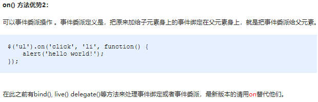
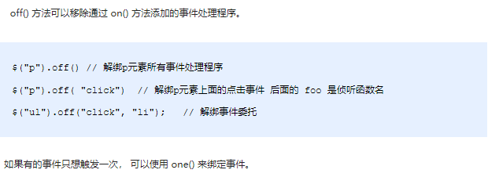

# jQuery

## jQuery介绍

常见的JavaScript库：jQuery、Prototype、YUI、Dojo、Ext JS、移动端的zepto等，这些库都是对原生JavaScript的封装，内部都是用JavaScript实现的

### jQuery的入口函数

下载`jquery-1.12.4.min.js`并在html页面中引入：`<script src="js/jquery-1.12.4.min.js"></script>`

```javascript
<script src="js/jquery-1.12.4.min.js"></script>
// 第一种: 简单易用，更推荐使用第一种方式
$(function () {   
    ...  // 此处是页面 DOM 加载完成的入口
}) ; 

// 第二种: 繁琐，但是也可以实现
$(document).ready(function(){
   ...  //  此处是页面DOM加载完成的入口
});
```

总结：

1. 等着DOM结构渲染完毕即可执行内部代码，不必等到所有外部资源加载完成，jQuery帮我们完成了封装
2. 相当于原生js中的DOMContentLoaded
3. 不同于原生js中的load事件是等页面文档、外部的js文件、css文件、图片加载完毕才执行内部代码

### jQuery中的顶级对象`$`

1.  `$`是jQuery的别称，在代码中可以使用`jQuery`代替，但一般为了方便，通常都直接使用`$` 
    - `$(function(){})=jQuery(function(){})`
2.  `$`是jQuery的顶级对象，相当于原生`JavaScript`中的`window`。把元素利用`$`包装成jQuery对象，就可以调用jQuery 的方法

### jQuery对象和DOM对象转换

使用jQuery方法和原生JS获取的元素是不一样的，总结如下 : 

1. 用原生JS获取来的对象就是DOM对象
2. jQuery方法获取的元素就是 jQuery对象
3. jQuery对象本质是：利用`$`对DOM对象包装后产生的对象（伪数组形式存储）

DOM对象与jQuery对象之间是可以相互转换的。因为原生js比jQuery更大，原生的一些属性和方法jQuery没有给我们封装。要想使用这些属性和方法需要把jQuery对象转换为DOM对象才能使用

```javascript
// 1. DOM对象：用原生js获取过来的对象就是DOM对象
var myDiv = document.querySelector('div'); // myDiv 是DOM对象
var mySpan = document.querySelector('span'); // mySpan 是DOM对象
console.dir(myDiv);
// 2. jQuery对象：用jquery方式获取过来的对象是jQuery对象。本质：通过$把DOM元素进行了包装
$('div'); // $('div')是一个jQuery对象
$('span'); // $('span')是一个jQuery对象
console.dir($('div'));
// 3. jQuery对象只能使用jQuery方法，DOM对象则使用原生的JavaScirpt属性和方法
myDiv.style.display = 'none';
// myDiv.hide(); myDiv是一个dom对象不能使用 jquery里面的hide方法
$('div').hide(); 
//---------------------------------------------------------------------------------
// 1. DOM对象转换成jQuery对象
var box = document.getElementById('box');  // 获取DOM对象
var jQueryObject = $(box);  // 把DOM对象转换为jQuery对象

// 2. jQuery对象转换为DOM对象有两种方法：
var myvideo = document.querySelector('video');
// $(myvideo).play(); jquery里面没有play这个方法

// (1) jQuery对象[索引值]
$('video')[0].play() // 1. 
// (2) jQuery对象.get(索引值)
$('video').get(0).play()
```

## jQuery选择器

### 知识铺垫

`$(this)`指jQuery当前元素，不用加引号

使用`length`属性来判断标签是否选择成功, 如果`length`大于0表示选择成功，否则选择失败：`$("div").length;`

#### 隐式迭代

- 遍历内部DOM元素（伪数组形式存储）的过程就叫做隐式迭代
- 给匹配到的所有元素进行循环遍历，执行相应的方法而不用我们再进行循环。简化我们的操作，方便我们调用
- `$('div').hide();` 页面中所有的div全部隐藏，不用循环操作

#### 链式编程

链式编程是为了节省代码量，看起来更优雅

` $(".tab_list li").click(function(){$(this).addClass("current").siblings().removeClass("current");}) `

使用`$(this)`可以方便绑定事件

### 基础选择器+层级选择器

可以和css选择器一起记忆

**基础选择器**


**层级选择器**


### 筛选选择器

==注意这里是索引号==


**筛选方法**

- `parent()`：最近的父级
- `children()`：最近的全部子级
- `parents("span")`：是父级（可以是非直系父级）且是span的元素。返回指定的祖先元素
- `$('#box').prev();` 表示选择id是box元素的上一个的同级元素
- `$('#box').next();` 表示选择id是box元素的下一个的同级元素
- `$('#box').find('.myClass');` 表示选择id是box元素的class等于myClass的元素
- `$(this).index();` 获取发生事件标签的索引
- `$('li').has('ul').css('background-color', 'red')`：给含有`ul`的`li`加上背景色


## jQuery样式操作

### 操作css方法

```javascript
// 1. 参数只写属性名，则是返回属性值
var strColor = $(this).css('color');

// 2. 参数是属性名，属性值，逗号分隔，是设置一组样式，**属性必须加引号，值如果是数字可以不用跟单位和引号（但是必须同时不加单位和引号）**
$(this).css("width", 300);
$("p").css("font-size": 250px); //错误！
// 3. 参数可以是对象形式，方便设置多组样式。属性名和属性值用冒号隔开，属性可以不用加引号
$(this).css({ "color":"white","font-size":"20px"});
// 如果是复合属性则必须采取驼峰命名法，如果值不是数字，则必须加引号
$(this).css({
    width:400,
    height: 400,
    backgroundColor: "red"
    
})
$("p").css({ color: "red", font- size: 250 }); //错误！"font-size"必须加引号
```

### 设置类样式方法（开发常用）

作用等同于以前的classList，可以操作类样式，注意操作类里面的参数不要加点

原生JS中className会覆盖元素原先里面的类名，jQuery里面类操作只是对指定类进行操作，不影响原先的类名

```javascript
/*
.current {
	font-size: 100px;
}
*/
// 1.添加类
$("div").addClass("current");
// 2.删除类
$("div").removeClass("current");
// 3.切换类
$("div").toggleClass("current");
```

## jQuery动画效果

jQuery 给我们封装了很多动画效果，最为常见的如下：

### 显示隐藏：`show()`/`hide()`/`toggle()` 

```javascript
<body>
    <button>显示</button>
    <button>隐藏</button>
    <button>切换</button>
    <div></div>
    <script>
    // 一般情况下，我们都不加参数直接显示隐藏就可以了
        $(function() {
            $("button").eq(0).click(function() {
                $("div").show(1000, function() {
                    alert(1);
                });
            })
            $("button").eq(1).click(function() {
                $("div").hide(1000, function() {
                    alert(1);
                });
            })
            $("button").eq(2).click(function() {
              $("div").toggle(1000);
            })           
        });
    </script>
</body>
```

### 划入划出：`slideDown()`/`slideUp()`/`slideToggle()`

```javascript
<body>
    <button>下拉滑动</button>
    <button>上拉滑动</button>
    <button>切换滑动</button>
    <div></div>
    <script>
        $(function() {
            $("button").eq(0).click(function() {
                $("div").slideDown();
            })
            $("button").eq(1).click(function() {
                $("div").slideUp(500);
            })
            $("button").eq(2).click(function() {
                // 滑动切换 slideToggle()
                $("div").slideToggle(500);
            });
        });
    </script>
</body>
```

### 淡入淡出：`fadeIn()`/`fadeOut()`/`fadeToggle()`/`fadeTo()`


```javascript
<body>
    <button>淡入效果</button>
    <button>淡出效果</button>
    <button>淡入淡出切换</button>
    <button>修改透明度</button>
    <div></div>
    <script>
        $(function() {
            $("button").eq(0).click(function() {
                $("div").fadeIn(1000);
            })
            $("button").eq(1).click(function() {
                $("div").fadeOut(1000);
            })
            $("button").eq(2).click(function() {
                // 淡入淡出切换 fadeToggle()
                $("div").fadeToggle(1000);
            });
            $("button").eq(3).click(function() {
                // 修改透明度 fadeTo() 这个速度和透明度要必须写
                $("div").fadeTo(1000, 0.5);
            });
        });
    </script>
</body>
```

### 自定义动画：`animate()`


```javascript
<body>
    <button>动起来</button>
    <div></div>
    <script>
        $(function() {
            $("button").click(function() {
                $("div").animate({
                    left: 500,
                    top: 300,
                    opacity: .4,
                    width: 500
                }, 500);
            })
        })
    </script>
</body>
```

### 停止动画排队

动画或者效果一旦触发就会执行，如果多次触发，就造成多个动画或者效果排队执行

停止动画排队的方法为`stop() `

- `stop()`方法用于停止动画或效果
- `stop()`写到动画或者效果的前面， 相当于停止结束上一次的动画

每次使用动画之前，先调用`stop()`，再调用动画

### 事件切换

jQuery中为我们添加了一个新事件`hover()`，功能类似css中的伪类`:hover` 

`hover([over,]out)`

- `over`鼠标移到元素上要触发的函数（相当于`mouseenter`）
- `out`鼠标移出元素要触发的函数（相当于`mouseleave`）
- 如果只写一个函数，则鼠标经过和离开都会触发它

```javascript
<body>
    <ul class="nav">
        <li>
            <a href="#">微博</a>
            <ul><li><a href="">私信</a></li><li><a href="">评论</a></li><li><a href="">@我</a></li></ul>
        </li>
        <li>
            <a href="#">微博</a>
            <ul><li><a href="">私信</a></li><li><a href="">评论</a></li><li><a href="">@我</a></li></ul>
        </li>
    </ul>
    <script>
        $(function() {
            // 鼠标经过
            // $(".nav>li").mouseover(function() {
            //     $(this).children("ul").slideDown(200);
            // });
            // 鼠标离开
            // $(".nav>li").mouseout(function() {
            //     $(this).children("ul").slideUp(200);
            // });
            // 1. 事件切换hover就是鼠标经过和离开的复合写法
            // $(".nav>li").hover(function() {
            //     $(this).children("ul").slideDown(200);
            // }, function() {
            //     $(this).children("ul").slideUp(200);
            // });
            // 2. 事件切换hover如果只写一个函数，那么鼠标经过和鼠标离开都会触发这个函数
            $(".nav>li").hover(function() {
                // stop方法必须写到动画的前面，这样可以把上一个动画效果停止，先执行下一个
                $(this).children("ul").stop().slideToggle();
            });
        })
    </script>
</body>
```

## jQuery属性

### 元素固有属性值`prop()`

- 所谓元素固有属性就是元素本身自带的属性，比如`<a>`元素里面的`href=`，比如`<input>`元素里面的`type=`
- `prop()`除了普通属性操作，更适合操作表单属性：`disabled`/`checked`/`selected`等

### 元素自定义属性值`attr()`

- 用户自己给元素添加的属性，我们称为自定义属性。 比如给`div`添加`index ="1"`
- `attr()`除了普通属性操作，更适合操作自定义属性（该方法也可以获取H5自定义属性）

### 数据缓存`data()`

- `data()`方法可以在指定的元素上存取数据，并不会修改DOM元素结构。一旦页面刷新，之前存放的数据都将被移除
- 在HTML5中添加了`data-*`的方式来自定义属性，所谓`data-*`实际上上就是`data-*`前缀加上自定义的属性名，使用这样的结构可以进行数据存放。使用`data-*`可以解决自定义属性混乱无管理的现状。可以看这篇[blog](https://blog.csdn.net/qq_27674439/article/details/90696837)

```javascript
// 元素固有属性prop()
prop("属性") // 获取
prop("属性", "属性值") // 设置

// 元素自定义属性attr()
attr("属性") // 类似原生getAttribute()，获取
attr("属性", "属性值") // 类似原生setAttribute()，设置

// 数据缓存data()
data("name") // 附加
data("name", "value") // 获取
//---------------------------------------------------------------------------------
<body>
    <a href="http://www.itcast.cn" title="都挺好">都挺好</a>
    <input type="checkbox" name="" id="" checked>
    <div index="1" data-index="2">我是div</div>
    <span>123</span>
    <script>
        $(function() {
            //1. element.prop("属性名") 获取元素固有的属性值
            console.log($("a").prop("href"));
            $("a").prop("title", "我们都挺好");
            $("input").change(function() {
                console.log($(this).prop("checked"));
            });
            // console.log($("div").prop("index"));
            // 2. 元素的自定义属性 我们通过 attr()
            console.log($("div").attr("index"));
            $("div").attr("index", 4);
            console.log($("div").attr("data-index"));
            // 3. 数据缓存 data() 这个里面的数据是存放在元素的内存里面
            $("span").data("uname", "andy");
            console.log($("span").data("uname"));
            // 这个方法获取data-index h5自定义属性 第一个 不用写data-  而且返回的是数字型
            console.log($("div").data("index"));
        })
    </script>
</body>
```

## jQuery文本属性值

jQuery的文本属性值常见操作有三种：`html()`/`text()`/`val()`，分别对应JS中的`innerHTML`、`innerText`和 `value`属性

```javascript
<body>
    <div>
        <span>我是内容</span>
    </div>
    <input type="text" value="请输入内容">
    <script>
        // 1. 获取设置元素内容 html()
        console.log($("div").html());
        $("div").html("123");
        // 2. 获取设置元素文本内容 text()
        console.log($("div").text());
        $("div").text("123");
        // 3. 获取设置表单值 val()
        console.log($("input").val());
        $("input").val("123");
    </script>
</body>
```

## jQuery元素操作

### 遍历元素

jQuery隐式迭代是对同一类元素做了同样的操作。如果想要给同一类元素做不同操作，就需要用到遍历

```javascript
/*
index：每个元素的索引号；domEle：dom对象
不是jQuery对象，所以需要把这个dom元素转换为jQuery对象
*/
$("div").each(function(index, domEle){})
/*
index：每个元素的索引号；Ele：内容
$.each()方法可用于遍历任何对象，主要用于数据处理，比如数组、对象
*/
$.each(object, function(index, Ele){})
//---------------------------------------------------------------------------------
<body>
    <div>1</div>
    <div>2</div>
    <div>3</div>
    <script>
        $(function() {
            // 如果针对于同一类元素做不同操作，需要用到遍历元素（类似for，但是比for强大）
            var sum = 0;
            var arr = ["red", "green", "blue"];
            // 1. each() 方法遍历元素 
            $("div").each(function(i, domEle) {
                // 使用jQuery方法需要转换 $(domEle)
                $(domEle).css("color", arr[i]);
                sum += parseInt($(domEle).text());
            })
            console.log(sum);
            
    		$.each({
                name: "andy",
                age: 18
            }, function(i, ele) {
                console.log(i); // 输出的是 name age 属性名
                console.log(ele); // 输出的是 andy  18 属性值
            })
        })
    </script>
</body>

```

### 创建、添加、删除元素

```javascript
/* 1. 创建 */
$("<li></li>"); // 动态地创建了一个li
/* 2.1 内部添加，生成之后，他们是父子关系 */
element.append(""); // 把内容放入匹配元素内部最后面，类似原生appendChild
element.prepend(""); // 把内容放入匹配元素内部最前面
/* 2.2 外部添加，生成之后，他们是兄弟关系 */
element.after(""); // 把内容放入匹配元素外部后面
element.before(""); // 把内容放入匹配元素外部前面
/* 3. 删除 */
element.remove(); // 删除匹配的元素（本身）
element.empty(); // 删除匹配的元素集合中的所有子节点
element.html(""); // 清空匹配的元素内容
//---------------------------------------------------------------------------------
<body>
    <ul>
        <li>原先的li</li>
    </ul>
    <div class="test">我是原先的div</div>
    <script>
        $(function() {
            // 1. 创建元素
            var li = $("<li>我是后来创建的li</li>");
      
            // 2. 添加元素
            // 	2.1 内部添加
            $("ul").append(li);  //内部添加并且放到内容的最后面 
            $("ul").prepend(li); // 内部添加并且放到内容的最前面
            //  2.2 外部添加
            var div = $("<div>我是后妈生的</div>");
            $(".test").after(div);
            $(".test").before(div);
      
            // 3. 删除元素
            $("ul").remove(); // 可以删除匹配的元素 自杀
            $("ul").empty(); // 可以删除匹配的元素里面的子节点 孩子
            $("ul").html(""); // 可以删除匹配的元素里面的子节点 孩子
        })
    </script>
</body>
```

## jQuery尺寸、位置操作

### jQuery尺寸操作

jQuery尺寸操作包括元素宽高的获取和设置，且不一样的API对应不一样的盒子模型


```javascript
<body>
    <div></div>
    <script>
        $(function() {
            // 1. width() / height() 获取设置元素 width和height大小 
            console.log($("div").width());
            $("div").width(300);
            // 2. innerWidth() / innerHeight()  获取设置元素 width和height + padding 大小 
            console.log($("div").innerWidth());

            // 3. outerWidth()  / outerHeight()  获取设置元素 width和height + padding + border 大小 
            console.log($("div").outerWidth());

            // 4. outerWidth(true) / outerHeight(true) 获取设置 width和height + padding + border + margin
            console.log($("div").outerWidth(true));
        })
    </script>
</body>
```

### jQuery位置操作

jQuery的位置操作主要有三个：`offset()`、`position()`、`scrollTop()`/`scrollLeft()`


```javascript
<body>
    <div class="father">
        <div class="son"></div>
    </div>
        
    <div class="back">返回顶部</div>
    <div class="container"></div>
   
    <script>
		$(function () {
			// 1. 获取设置距离文档的位置（偏移）offset
			console.log($(".son").offset());
			console.log($(".son").offset().top);
			$(".son").offset({
			    top: 200,
			    left: 200
			});

			// 2. 获取距离带有定位父级位置（偏移）position。如果没有带有定位的父级，则以文档为准
			// 这个方法只能获取不能设置偏移
			console.log($(".son").position());


			// 3. 被卷去的头部
			$(document).scrollTop(100);
			// 被卷去的头部 scrollTop()  / 被卷去的左侧 scrollLeft()
			// 页面滚动事件
			var boxTop = $(".container").offset().top;
			$(window).scroll(function () {
				console.log($(document).scrollTop());
				if ($(document).scrollTop() >= boxTop) {
					$(".back").fadeIn();
				} else {
					$(".back").fadeOut();
				}
			});
			// 返回顶部
			$(".back").click(function () {
				// $(document).scrollTop(0);
				$("body, html").stop().animate({
					scrollTop: 0
				});
				// $(document).stop().animate({
				//     scrollTop: 0
				// }); 不能是文档而是 html和body元素做动画
			})
		})
    </script>
</body>
```

## jQuery事件注册和处理

- `click()` 鼠标单击

- `blur()` 元素失去焦点

- `focus()` 元素获得焦点

- `mouseover()` 鼠标进入（进入子元素也触发）

- `mouseout()` 鼠标离开（离开子元素也触发）

- `ready()` DOM加载完成

- `change()`当元素的值发生改变时，会发生 change 事件。该事件仅适用于文本域（text field），以及 textarea 和 select 元素。当用于 select 元素时，change 事件会在选择某个选项时发生。当用于 text field 或 text area 时，该事件会在元素失去焦点时发生。

- `keydown()`当键盘或按钮被按下时，发生 keydown 事件

- `keyup()`当按钮被松开时，发生 keyup 事件。它发生在当前获得焦点的元素上。


  注释：如果在文档元素上进行设置，则无论元素是否获得焦点，该事件都会发生

- `resize()`当调整浏览器窗口的大小时，发生 resize 事件

- `scroll()`获取匹配元素相对滚动条顶部的偏移。此方法对可见和隐藏元素均有效

事件代理就是利用事件冒泡的原理(事件冒泡就是事件会向它的父级一级一级传递),把事件加到父级上，通过判断事件来源，执行相应的子元素的操作，事件代理首先可以极大减少事件绑定次数，提高性能；其次可以让新加入的子元素也可以拥有相同的操作。

事件冒泡：当一个元素接收到事件的时候 会把他接收到的事件传给自己的父级，一直到window（注意这里传递的仅仅是事件 并不传递所绑定的事件函数。所以如果父级没有绑定事件函数，就算传递了事件 也不会有什么表现 但事件确实传递了）点击事件给页面显示出来的位置是没关系的，而是跟html代码中的位置有关系

取消事件冒泡有两种方式：

- 标准的W3C方式：`event.stopPropagation();`这里的`stopPropagation`是标准的事件对象的一个方法，调用即可
- 非标准的IE方式：`event.cancelBubble=true;`这里的`cancelBubble`是IE事件对象的属性，设为`true`就可以了

```javascript
<script>
    // 普通事件注册
    /*
    element.事件(function{}())
    */
    $(function() {
        // 1. 单个事件注册
        $("div").click(function() {
        $(this).css("background", "purple");
        });
        $("div").mouseenter(function() {
        $(this).css("background", "skyblue");
        });
    })
</script>
```

​	因为普通注册事件方法的不足，jQuery又开发了多个处理方法，重点讲解如下：

- `on()`：用于事件绑定，目前最好用的事件绑定方法
- `off()`：事件解绑
- `trigger()`/`triggerHandler()`：事件触发

### 事件处理`on()`绑定事件

因为普通注册事件方法的不足，jQuery又创建了多个新的事件绑定方法`bind()`/`live()`/`delegate()`/`on()`等，其中最好用的是：`on()`





```javascript
<script>
    $(function() {
    // (1) on可以绑定1个或者多个事件处理程序
    // $("div").on({
    //     mouseenter: function() {
    //         $(this).css("background", "skyblue");
    //     },
    //     click: function() {
    //         $(this).css("background", "purple");
    //     }
    // });
    // 如果事件处理程序相同
    $("div").on("mouseenter mouseleave", function() {
        $(this).toggleClass("current");
    });

    // (2) on可以实现事件委托（委派）
    // click 是绑定在ul 身上的，但是 触发的对象是 ul 里面的小li
    // $("ul li").click();
    $("ul").on("click", "li", function() {
        alert(11);
    });

    // (3) on可以给未来动态创建的元素绑定事件
    $("ol").on("click", "li", function() {
        alert(11);
    })
    var li = $("<li>我是后来创建的</li>");
    $("ol").append(li);
//---------------------------------------------------------------------------------
    // 1. 事件解绑 off 
    // $("div").off();  // 这个是解除了div身上的所有事件
    $("div").off("click"); // 这个是解除了div身上的点击事件
    $("ul").off("click", "li"); // 解绑事件委托

    // 2. one() 但是它只能触发事件一次
    $("p").one("click", function() {
        alert(11);
    })
})
</script>
```

### 事件处理`off()`解绑事件

当某个事件上面的逻辑，在特定需求下不需要的时候，可以把该事件上的逻辑移除，这个过程我们称为事件解绑。jQuery为我们提供 了多种事件解绑方法：`die()`/`undelegate()`/`off()`等，甚至还有只触发一次的事件绑定方法`one()`，在这里我们重点讲解一下`off()`



### 事件处理`trigger()`自动触发事件

有些时候，在某些特定的条件下，我们希望某些事件能够自动触发, 比如轮播图自动播放功能跟点击右侧按钮一致。可以利用定时器自动触发右侧按钮点击事件，不必鼠标点击触发。由此jQuery为我们提供了两个自动触发事件 `trigger()`和`triggerHandler()`


```javascript
<script>
    $(function() {
      // 自动触发事件
      // 1. 元素.事件()
      $("div").click() // 会触发元素的默认行为
      
      // 2. 元素.trigger("事件")
      $("input").trigger("focus"); // 会触发元素的默认行为
      
      // 3. 元素.triggerHandler("事件") 就是不会触发元素的默认行为
      $("input").on("focus", function() {
        $(this).val("你好吗"); /
      });
      // 一个会获取焦点，一个不会
      // 获取焦点时，会出现文字但是光标不会闪烁
      $("div").triggerHandler("click");
    });
</script>
```

## jQuery事件对象

jQuery对DOM中的事件对象event进行了封装，兼容性更好，获取更方便，使用变化不大。事件被触发，就会有事件对象的产生


# JSON

json是JavaScript Object Notation的首字母缩写，翻译过来就是javascript对象表示法，这里说的json就是**类似于javascript对象的字符串**，它同时是一种**数据格式**，目前这种数据格式比较流行，逐渐替换掉了传统的xml数据格式，web开发的时候经常使用json数据格式

json有两种格式：

1. 对象格式：对象格式的json数据，使用一对大括号`{}`，大括号里面放入`key:value`形式的键值对，多个键值对使用逗号分隔。
   - json中的(key)属性名称和字符串值需要用==**双引号**==引起来，用单引号或者不用引号会导致读取数据错误。
2. 数组格式
   - 数组格式的json数据，使用一对中括号`[]`，中括号里面的数据使用逗号分隔。

```javascript
// 对象格式的json数据:
{
    "name":"tom",
    "age":18
}
// 数组格式的json数据:
["tom",18,"programmer"]

// json数据转换成JavaScript对象
// json本质上是字符串，如果在js中操作json数据，可以将json字符串转化为JavaScript对象
var sJson = '{"name":"tom","age":18}';
var oPerson = JSON.parse(sJson);
// 操作属性
alert(oPerson.name);
alert(oPerson.age)
var sJson2 = '[{"name":"张三","age":20},{"name":"李四","age":21}]'
var aArray = JSON.parse(sJson2);
console.log(aArray);
//通过下标获取js对象，然后通过js对象获取name属性
var oPerson = aArray[1];
document.write(oPerson.name);
```

# AJAX

ajax 是 Asynchronous JavaScript and XML的简写，ajax是一个前后台配合的技术，它可以让 javascript 发送**异步的http请求（同时发送多个请求，不用等待）**，与后台通信进行数据的获取，ajax 最大的优点是**实现局部刷新**，ajax可以发送http请求，当获取到后台数据的时候更新页面显示数据实现局部刷新，在这里大家只需要记住，当前端页面想和后台服务器进行数据交互就可以使用ajax了。

这里提示一下大家，**==在html页面使用ajax需要在web服务器环境下运行==, 一般向自己的web服务器发送ajax请求。**

## AJAX的使用

```html
<script>
    // 向服务器发送ajax请求，本质上是一个http协议的请求
    $.ajax({
        // 请求的资源地址，不指定ip地址和端口号表示请求的是自己的服务器资源数据
        url:"data.json",
        // 请求方式，默认是'GET'，常用的还有'POST'
        type:"GET",
        // 指定对服务器数据的解析格式，常用的是'json'格式
        dataType:"JSON",
        // data：表示发送给web服务器的数据, 没有数据不需要设置
        // 设置请求成功后的执行的函数
        success:function (response) {
            console.log(response.name);    
            // 数据请求回来以后可以绑定给html中的某个标签控件，实现局部刷新
        },
        // 设置请求失败后的执行的函数
        error:function () {
            alert("请求失败,请稍后再试!");
        },
        // async 设置是否异步，默认值是'true'，表示异步，一般不用写
        async:true
    });
</script>
```

### ajax的简写方式

`$.ajax`按照请求方式可以简写成`$.get`或者`$.post`方式

`$.get`和`$.post`方法的参数说明:

`$.get(url,data,success(data, status, xhr),dataType).error(func)`

`$.post(url,data,success(data, status, xhr),dataType).error(func)`

1. `url`请求地址
2. `data`设置发送给服务器的数据，没有数据不需要设置
3. `success`设置请求成功后的回调函数
   - `data`请求的结果数据
   - `status`请求的状态信息, 比如: `success`
   - `xhr`底层发送http请求XMLHttpRequest对象
4. `dataType`设置返回的数据格式
   - `xml`
   - `html`
   - `text`
   - `json`
5. `error`表示错误异常处理
   - `func`错误异常回调函数

```html
 <script>
    $(function(){
        /*
         1. url 请求地址
         2. data 设置发送给服务器的数据, 没有参数不需要设置
         3. success 设置请求成功后的回调函数
         4. dataType 设置返回的数据格式，常用的是'json'格式, 默认智能判断数据格式
        */ 
       // 使用get方式发送请求，name=李四会以?name=李四&..&..的形式出现在地址栏后
        $.get("data.json", {"name":"李四"}, function(dat,status){
            console.log(dat.name);
            console.log(status);
        }).error(function(){
            alert("网络异常");
        });

        /*
         1. url 请求地址
         2. data 设置发送给服务器的数据, 没有参数不需要设置
         3. success 设置请求成功后的回调函数
         4. dataType 设置返回的数据格式，常用的是'json'格式, 默认智能判断数据格式
        */ 
       // 使用post方式发送请求，name=李四会出现在请求体内
       // 这里没有指定http协议头和ip地址和端口号，那么默认ajax请求会自动帮我们加上
       // 如果请求的是自己的web服务器可以不要加上http协议地址，请求别人服务器的数据需要加上http协议地址
        $.post("http://localhost:8000/data.json", {"name":"李四"}, function(data){
            alert(data.name); 
            console.log(data.time); 
        }, "json").error(function(){
            alert("网络异常");
        }); 
    });
</script>
```


## 其他方法

```javascript
var price = (p * n).toFixed(2); // 保留两位小数
var p = $(this).parents(".p-num").siblings(".p-price").html().substr(1); // 取从索引1开始的子字符串
/*
当元素的值发生改变时，会发生 change 事件。
该事件仅适用于文本域（text field），以及 textarea 和 select 元素。当用于 select 元素时，change 事件会在选择某个选项时发生。当用于 text field 或 text area 时，该事件会在元素失去焦点时发生。
*/
$("input").change(function() {
    console.log($(this).prop("checked"));
});
/*
匹配所有选中的被选中元素(复选框、单选框等，select中的option)，对于select元素来说，获取选中推荐使用 :selected 
*/
if ($(".j-checkbox:checked").length === $(".j-checkbox").length) {
    $(".checkall").prop("checked", true);
}


```

