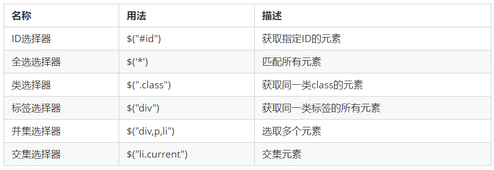
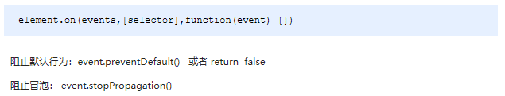

# jQuery

## jQuery介绍

常见的JavaScript库：jQuery、Prototype、YUI、Dojo、Ext JS、移动端的zepto等，这些库都是对原生JavaScript的封装，内部都是用JavaScript实现的

### jQuery的入口函数

下载`jquery-1.12.4.min.js`并在html页面中引入：`<script src="js/jquery-1.12.4.min.js"></script>`

```javascript
<script src="js/jquery-1.12.4.min.js"></script>
// 第一种: 简单易用，更推荐使用第一种方式
$(function () {   
    ...  // 此处是页面 DOM 加载完成的入口
}) ; 

// 第二种: 繁琐，但是也可以实现
$(document).ready(function(){
   ...  //  此处是页面DOM加载完成的入口
});
```

总结：

1. 等着DOM结构渲染完毕即可执行内部代码，不必等到所有外部资源加载完成，jQuery帮我们完成了封装
2. 相当于原生js中的DOMContentLoaded
3. 不同于原生js中的load事件是等页面文档、外部的js文件、css文件、图片加载完毕才执行内部代码

### jQuery中的顶级对象`$`

1.  `$`是jQuery的别称，在代码中可以使用`jQuery`代替，但一般为了方便，通常都直接使用`$` 
    - `$(function(){})=jQuery(function(){})`
2.  `$`是jQuery的顶级对象，相当于原生`JavaScript`中的`window`。把元素利用`$`包装成jQuery对象，就可以调用jQuery 的方法

### jQuery对象和DOM对象转换

使用jQuery方法和原生JS获取的元素是不一样的，总结如下 : 

1. 用原生JS获取来的对象就是DOM对象
2. jQuery方法获取的元素就是 jQuery对象
3. jQuery对象本质是：利用`$`对DOM对象包装后产生的对象（伪数组形式存储）

DOM对象与jQuery对象之间是可以相互转换的。因为原生js比jQuery更大，原生的一些属性和方法jQuery没有给我们封装。要想使用这些属性和方法需要把jQuery对象转换为DOM对象才能使用

```javascript
// 1. DOM对象：用原生js获取过来的对象就是DOM对象
var myDiv = document.querySelector('div'); // myDiv 是DOM对象
var mySpan = document.querySelector('span'); // mySpan 是DOM对象
console.dir(myDiv);
// 2. jQuery对象：用jquery方式获取过来的对象是jQuery对象。本质：通过$把DOM元素进行了包装
$('div'); // $('div')是一个jQuery对象
$('span'); // $('span')是一个jQuery对象
console.dir($('div'));
// 3. jQuery对象只能使用jQuery方法，DOM对象则使用原生的JavaScirpt属性和方法
myDiv.style.display = 'none';
// myDiv.hide(); myDiv是一个dom对象不能使用jquery里面的hide方法
$('div').hide(); 
//---------------------------------------------------------------------------------
// 1. DOM对象转换成jQuery对象
var box = document.getElementById('box');  // 获取DOM对象
var jQueryObject = $(box);  // 把DOM对象转换为jQuery对象

// 2. jQuery对象转换为DOM对象有两种方法：
var myvideo = document.querySelector('video');
// $(myvideo).play(); jquery里面没有play这个方法

// (1) jQuery对象[索引值]
$('video')[0].play() // 1. 
// (2) jQuery对象.get(索引值)
$('video').get(0).play()
```

## jQuery选择器

### 知识铺垫

`$(this)`指jQuery当前元素，不用加引号

使用`length`属性来判断标签是否选择成功, 如果`length`大于0表示选择成功，否则选择失败：`$("div").length;`

#### 隐式迭代

- 遍历内部DOM元素（伪数组形式存储）的过程就叫做隐式迭代
- 给匹配到的所有元素进行循环遍历，执行相应的方法而不用我们再进行循环。简化我们的操作，方便我们调用
- `$('div').hide();` 页面中所有的div全部隐藏，不用循环操作

#### 链式编程

链式编程是为了节省代码量，看起来更优雅

` $(".tab_list li").click(function(){$(this).addClass("current").siblings().removeClass("current");}) `

使用`$(this)`可以方便绑定事件

```javascript
$(function() {
    // 1. 隐式迭代 给所有的按钮都绑定了点击事件
    $("button").click(function() {
        // 2. 当前的元素变化背景颜色
        $(this).css("background", "pink");
        // 3. 其余的兄弟去掉背景颜色。修改兄弟元素的样式也是隐式迭代
        $(this).siblings("button").css("background", "");
    });
})
```

### 基础选择器+层级选择器

和dom，css选择器必须一致

**基础选择器**



**层级选择器**


### 筛选选择器

==注意这里是索引号==


`$(".j-checkbox:checked").parents(".cart-item").remove();`：删除所有`j-checkbox`中复选框类中选中的类的类名为`cart-item`的任意层级父级

**筛选方法**

- `parent()`：最近的父级
  - `.parentNode`

- `children()`：最近的全部子级
  - `.children`

- `parents("span")`：是父级（可以是非直系父级）且是span的元素。返回指定的祖先元素
- `$('#box').prev();` 表示选择id是box元素的上一个的同级元素
  - `.previousElementSibling`

- `$('#box').next();` 表示选择id是box元素的下一个的同级元素
  - `nextElementSibling`

- `$('#box').find('.myClass');` Given a jQuery object that represents a set of DOM elements, the `.find()` method allows us to search through the descendants of these elements in the DOM tree and construct a new jQuery object from the matching elements. The `.find()` and `.children()` methods are similar, except that the latter only travels a single level down the DOM tree.
- `$(this).index();` ==获取发生事件标签的索引（在事件中好用）==
- `$('li').has('ul').css('background-color', 'red')`：给含有`ul`的`li`加上背景色


index()的补充


## jQuery样式操作

### 操作css方法

```javascript
// 1. 参数只写属性名，则是返回属性值
var strColor = $(this).css('color');

// 2. 参数是属性名，属性值，逗号分隔，是设置一组样式，**属性必须加引号，值如果是数字可以不用跟单位和引号（但是必须同时不加单位和引号）**
$(this).css("width", 300);
$("p").css("font-size": 250px); //错误！
// 3. 参数可以是对象形式，方便设置多组样式。属性名和属性值用冒号隔开，属性可以不用加引号
$(this).css({ "color":"white","font-size":"20px"});
// 如果是复合属性则必须采取驼峰命名法，如果值不是数字，则必须加引号
$(this).css({
    width:400,
    height: 400,
    backgroundColor: "red"
    
})
$("p").css({ color: "red", font-size: 250 }); //错误！"font-size"必须加引号
```

### 设置类样式方法（开发常用）

作用等同于以前的classList，可以操作类样式，注意操作类里面的参数不要加点

原生JS中className会覆盖元素原先里面的类名，jQuery里面类操作只是对指定类进行操作，不影响原先的类名

```javascript
/*
.current {
	font-size: 100px;
}
*/
// 1.添加类
$("div").addClass("current");
// 2.删除类
$("div").removeClass("current");
// 3.切换类
$("div").toggleClass("current");
```

## jQuery动画效果

jQuery 给我们封装了很多动画效果，最为常见的如下：

### 显示隐藏：`show()`/`hide()`/`toggle()` 

```javascript
<body>
    <button>显示</button>
    <button>隐藏</button>
    <button>切换</button>
    <div></div>
    <script>
    // 一般情况下，我们都不加参数直接显示隐藏就可以了
        $(function() {
            $("button").eq(0).click(function() {
                $("div").show(1000, function() {
                    alert(1);
                });
            })
            $("button").eq(1).click(function() {
                $("div").hide(1000, function() {
                    alert(1);
                });
            })
            $("button").eq(2).click(function() {
              $("div").toggle(1000);
            })           
        });
    </script>
</body>
```

### 上下划入划出：`slideDown()`/`slideUp()`/`slideToggle()`

```javascript
<body>
    <button>下拉滑动</button>
    <button>上拉滑动</button>
    <button>切换滑动</button>
    <div></div>
    <script>
        $(function() {
            $("button").eq(0).click(function() {
                $("div").slideDown();
            })
            $("button").eq(1).click(function() {
                $("div").slideUp(500);
            })
            $("button").eq(2).click(function() {
                // 滑动切换 slideToggle()
                $("div").slideToggle(500);
            });
        });
    </script>
</body>
```

### 显示隐藏淡入淡出：`fadeIn()`/`fadeOut()`/`fadeToggle()`/`fadeTo()`


```javascript
<body>
    <button>淡入效果</button>
    <button>淡出效果</button>
    <button>淡入淡出切换</button>
    <button>修改透明度</button>
    <div></div>
    <script>
        $(function() {
            $("button").eq(0).click(function() {
                $("div").fadeIn(1000);
            })
            $("button").eq(1).click(function() {
                $("div").fadeOut(1000);
            })
            $("button").eq(2).click(function() {
                // 淡入淡出切换 fadeToggle()
                $("div").fadeToggle(1000);
            });
            $("button").eq(3).click(function() {
                // 修改透明度 fadeTo() 这个速度和透明度要必须写
                $("div").fadeTo(1000, 0.5);
            });
        });
    </script>
</body>
```

### 自定义动画：`animate()`


```javascript
<body>
    <button>动起来</button>
    <div></div>
    <script>
        $(function() {
            $("button").click(function() {
                $("div").animate({
                    left: 500,
                    top: 300,
                    opacity: .4,
                    width: 500
                }, 500);
            })
        })
    </script>
</body>
```

### 停止动画排队

动画或者效果一旦触发就会执行，如果多次触发，就造成多个动画或者效果排队执行

停止动画排队的方法为`stop() `

- `stop()`方法用于停止动画或效果
- `stop()`写到动画或者效果的前面， 相当于停止结束上一次的动画

每次使用动画之前，先调用`stop()`，再调用动画

### 事件切换

jQuery中为我们添加了一个新事件`hover()`，功能类似css中的伪类`:hover` 

`hover([over,]out)`

- `over`鼠标移到元素上要触发的函数（相当于`mouseenter`）
- `out`鼠标移出元素要触发的函数（相当于`mouseleave`）
- 如果只写一个函数，则鼠标经过和离开都会触发它

```javascript
<body>
    <ul class="nav">
        <li>
            <a href="#">微博</a>
            <ul><li><a href="">私信</a></li><li><a href="">评论</a></li><li><a href="">@我</a></li></ul>
        </li>
        <li>
            <a href="#">微博</a>
            <ul><li><a href="">私信</a></li><li><a href="">评论</a></li><li><a href="">@我</a></li></ul>
        </li>
    </ul>
    <script>
        $(function() {
            // 鼠标经过
            // $(".nav>li").mouseover(function() {
            //     $(this).children("ul").slideDown(200);
            // });
            // 鼠标离开
            // $(".nav>li").mouseout(function() {
            //     $(this).children("ul").slideUp(200);
            // });
            // 1. 事件切换hover就是鼠标经过和离开的复合写法
            // $(".nav>li").hover(function() {
            //     $(this).children("ul").slideDown(200);
            // }, function() {
            //     $(this).children("ul").slideUp(200);
            // });
            // 2. 事件切换hover如果只写一个函数，那么鼠标经过和鼠标离开都会触发这个函数
            $(".nav>li").hover(function() {
                // stop方法必须写到动画的前面，这样可以把上一个动画效果停止，先执行下一个
                $(this).children("ul").stop().slideToggle();
            });
        })
    </script>
</body>
```

## jQuery属性

### 元素固有属性值`prop()`

- 所谓元素固有属性就是元素本身自带的属性，比如`<a>`元素里面的`href=`，比如`<input>`元素里面的`type=`
- `prop()`除了普通属性操作，更适合操作表单属性：`disabled`/`checked`/`selected`等

### 元素自定义属性值`attr()`

- 用户自己给元素添加的属性，我们称为自定义属性。 比如给`div`添加`index ="1"`
- `attr()`除了普通属性操作，更适合操作自定义属性（该方法也可以获取H5自定义属性）

### 数据缓存`data()`

- `data()`方法可以在指定的元素上存取数据，并不会修改DOM元素结构。一旦页面刷新，之前存放的数据都将被移除
- 在HTML5中添加了`data-*`的方式来自定义属性，所谓`data-*`实际上就是`data-*`前缀加上自定义的属性名，使用这样的结构可以进行数据存放。使用`data-*`可以解决自定义属性混乱无管理的现状。可以看这篇[blog](https://blog.csdn.net/qq_27674439/article/details/90696837)

```javascript
// 元素固有属性prop()
prop("属性") // 获取
prop("属性", "属性值") // 设置

// 元素自定义属性attr()
attr("属性") // 类似原生getAttribute()，获取
attr("属性", "属性值") // 类似原生setAttribute()，设置

// 数据缓存data()
data("name") // 附加
data("name", "value") // 获取
//---------------------------------------------------------------------------------
<body>
    <a href="http://www.itcast.cn" title="都挺好">都挺好</a>
    <input type="checkbox" name="" id="" checked>
    <div index="1" data-index="2">我是div</div>
    <span>123</span>
    <script>
        $(function() {
            //1. element.prop("属性名") 获取元素固有的属性值
            console.log($("a").prop("href"));
            $("a").prop("title", "我们都挺好");
            $("input").change(function() {
                console.log($(this).prop("checked"));
            });
            // console.log($("div").prop("index"));
            // 2. 元素的自定义属性 我们通过 attr()
            console.log($("div").attr("index"));
            $("div").attr("index", 4);
            console.log($("div").attr("data-index"));
            // 3. 数据缓存 data() 这个里面的数据是存放在元素的内存里面
            $("span").data("uname", "andy");
            console.log($("span").data("uname"));
            // 这个方法获取data-index h5自定义属性 第一个 不用写data-  而且返回的是数字型
            console.log($("div").data("index"));
        })
    </script>
</body>
```

## jQuery文本属性值

jQuery的文本属性值常见操作有三种：`html()`/`text()`/`val()`，分别对应JS中的`innerHTML`、`innerText`和 `value`属性

```javascript
<body>
    <div>
        <span>我是内容</span>
    </div>
    <input type="text" value="请输入内容">
    <script>
        // 1. 获取设置元素内容 html()
        console.log($("div").html());
        $("div").html("123");
        // 2. 获取设置元素文本内容 text()
        console.log($("div").text());
        $("div").text("123");
        // 3. 获取设置表单值 val()
        console.log($("input").val());
        $("input").val("123");
    </script>
</body>
```

## jQuery元素操作

### 遍历元素

jQuery隐式迭代是对同一类元素做了同样的操作。如果想要给同一类元素做不同操作，就需要用到遍历

```javascript
/*
index：每个元素的索引号；domEle：dom对象
不是jQuery对象，所以需要把这个dom元素转换为jQuery对象
*/
$("div").each(function(index, domEle){})
/*
index：每个元素的索引号；Ele：内容
$.each()方法可用于遍历任何对象，主要用于数据处理，比如数组、对象
*/
$.each(object, function(index, Ele){})
//---------------------------------------------------------------------------------
<body>
    <div>1</div>
    <div>2</div>
    <div>3</div>
    <script>
        $(function() {
            // 如果针对于同一类元素做不同操作，需要用到遍历元素（类似for，但是比for强大）
            var sum = 0;
            var arr = ["red", "green", "blue"];
            // 1. each() 方法遍历元素 
            $("div").each(function(i, domEle) {
                // 使用jQuery方法需要转换 $(domEle)
                $(domEle).css("color", arr[i]);
                sum += parseInt($(domEle).text());
            })
            console.log(sum);
            
    		$.each({
                name: "andy",
                age: 18
            }, function(i, ele) {
                console.log(i); // 输出的是 name age 属性名
                console.log(ele); // 输出的是 andy 18 属性值
            })
        })
    </script>
</body>

```

### 创建、添加、删除元素

```javascript
/* 1. 创建 */
$("<li></li>"); // 动态地创建了一个li
/* 2.1 内部添加，生成之后，他们是父子关系 */
element.append(""); // 把内容放入匹配元素内部最后面，类似原生appendChild
element.prepend(""); // 把内容放入匹配元素内部最前面，类似原生insertBefore
/* 2.2 外部添加，生成之后，他们是兄弟关系 */
element.after(""); // 把内容放入匹配元素外部后面
element.before(""); // 把内容放入匹配元素外部前面
/* 3. 删除 */
element.remove(); // 删除匹配的元素（本身）
element.empty(); // 删除匹配的元素集合中的所有子节点
element.html(""); // 清空匹配的元素内容
//---------------------------------------------------------------------------------
<body>
    <ul>
        <li>原先的li</li>
    </ul>
    <div class="test">我是原先的div</div>
    <script>
        $(function() {
            // 1. 创建元素
            var li = $("<li>我是后来创建的li</li>");
      
            // 2. 添加元素
            // 	2.1 内部添加
            $("ul").append(li);  //内部添加并且放到内容的最后面 
            $("ul").prepend(li); // 内部添加并且放到内容的最前面
            //  2.2 外部添加
            var div = $("<div>我是后妈生的</div>");
            $(".test").after(div);
            $(".test").before(div);
      
            // 3. 删除元素
            $("ul").remove(); // 可以删除匹配的元素 自杀
            $("ul").empty(); // 可以删除匹配的元素里面的子节点 孩子
            $("ul").html(""); // 可以删除匹配的元素里面的子节点 孩子
        })
    </script>
</body>
```

## jQuery尺寸、位置操作

### jQuery尺寸操作

jQuery尺寸操作包括元素宽高的获取和设置，且不一样的API对应不一样的盒子模型


```javascript
<body>
    <div></div>
    <script>
        $(function() {
            // 1. width() / height() 获取设置元素 width和height大小 
            console.log($("div").width());
            $("div").width(300);
            // 2. innerWidth() / innerHeight()  获取设置元素 width和height + padding 大小 
            console.log($("div").innerWidth());

            // 3. outerWidth()  / outerHeight()  获取设置元素 width和height + padding + border 大小 
            console.log($("div").outerWidth());

            // 4. outerWidth(true) / outerHeight(true) 获取设置 width和height + padding + border + margin
            console.log($("div").outerWidth(true));
        })
    </script>
</body>
```

### jQuery位置操作

jQuery的位置操作主要有三个：`offset()`、`position()`、`scrollTop()`/`scrollLeft()`


```javascript
<body>
    <div class="father">
        <div class="son"></div>
    </div>
        
    <div class="back">返回顶部</div>
    <div class="container"></div>
   
    <script>
		$(function () {
			// 1. 获取设置距离文档的位置（偏移）offset
			console.log($(".son").offset());
			console.log($(".son").offset().top);
			$(".son").offset({
			    top: 200,
			    left: 200
			});

			// 2. 获取距离带有定位父级位置（偏移）position。如果没有带有定位的父级，则以文档为准
			// ！这个方法只能获取不能设置偏移
			console.log($(".son").position());


			// 3. 被卷去的头部
			$(document).scrollTop(100);
			// 被卷去的头部 scrollTop()  / 被卷去的左侧 scrollLeft()
			// 获取距离顶部的距离
			var boxTop = $(".container").offset().top;
            // 发生页面滚动事件时 
			$(window).scroll(function () {
				console.log($(document).scrollTop());
				if ($(document).scrollTop() >= boxTop) {
					$(".back").fadeIn();
				} else {
					$(".back").fadeOut();
				}
			});
			// 返回顶部
			$(".back").click(function () {
				// 给body和html元素做动画
				$("body, html").stop().animate({
					scrollTop: 0
				});
                // 不是给文档做动画，所以这个写法是错误的
				// $(document).stop().animate({
				//     scrollTop: 0
				// }); 
			})
		})
    </script>
</body>
```

## jQuery事件注册和处理

- `click()` 鼠标单击

- `blur()` 元素失去焦点

- `focus()` 元素获得焦点

- `mouseover()` 鼠标进入（进入子元素也触发）

- `mouseout()` 鼠标离开（离开子元素也触发）

- `ready()` DOM加载完成

- `change()`当元素的值发生改变时，会发生 change 事件。该事件仅适用于文本域（text field），以及 textarea 和 select 元素。当用于 select 元素时，change 事件会在选择某个选项时发生。当用于 text field 或 text area 时，该事件会在元素失去焦点时发生。

- `keydown()`当键盘或按钮被按下时，发生 keydown 事件

- `keyup()`当按钮被松开时，发生 keyup 事件。它发生在当前获得焦点的元素上。


注释：如果在文档元素上进行设置，则无论元素是否获得焦点，该事件都会发生

- `resize()`当调整浏览器窗口的大小时，发生 resize 事件

- `scroll()`获取匹配元素相对滚动条顶部的偏移。此方法对可见和隐藏元素均有效

事件代理就是利用事件冒泡的原理(事件冒泡就是事件会向它的父级一级一级传递)==把事件加到父级上==，通过判断事件来源，执行相应的子元素的操作，事件代理首先可以极大减少事件绑定次数，提高性能；其次可以让新加入的子元素也可以拥有相同的操作。

事件冒泡：当一个元素接收到事件的时候 会把他接收到的事件传给自己的父级，一直到window（注意这里传递的仅仅是事件 并不传递所绑定的事件函数。所以如果父级没有绑定事件函数，就算传递了事件 也不会有什么表现 但事件确实传递了）点击事件给页面显示出来的位置是没关系的，而是跟html代码中的位置有关系

取消事件冒泡有两种方式：

- 标准的W3C方式：`event.stopPropagation();`这里的`stopPropagation`是标准的事件对象的一个方法，调用即可
- 非标准的IE方式：`event.cancelBubble=true;`这里的`cancelBubble`是IE事件对象的属性，设为`true`就可以了

```javascript
<script>
    $(function() {
        // 单个事件注册
        $("div").click(function() {
        	$(this).css("background", "purple");
        });
        $("div").mouseenter(function() {
        	$(this).css("background", "skyblue");
        });
    })
</script>
```

因为普通注册事件方法的不足，jQuery又开发了多个处理方法，重点讲解如下：

- `on()`：用于事件绑定，目前最好用的事件绑定方法
- `off()`：事件解绑
- `trigger()`/`triggerHandler()`：事件触发

### 事件处理`on()`绑定事件

因为普通注册事件方法的不足，jQuery又创建了多个新的事件绑定方法`bind()`/`live()`/`delegate()`/`on()`等，其中最好用的是：`on()`


```javascript
<script>
    $(function() {
     // (1.1) on可以绑定1个或者多个事件处理程序
     $("div").on({
         mouseenter: function() {
             $(this).css("background", "skyblue");
         },
         click: function() {
             $(this) .css("background", "purple");
         }
     });
    // (1.2) 如果事件处理程序相同
    $("div").on("mouseenter mouseleave", function() {
        $(this).toggleClass("current");
    });

    // (2) on可以实现事件委托（委派）
    // click 是绑定在ul身上的，但是触发的对象是ul里面的li
    $("ul").on("click", "li", function() {
        alert(11);
    });

    // (3) on可以给未来动态创建的元素绑定事件
    $("ol").on("click", "a", function() {
        $(this).parent().slideUp(function(){
            $(this).remove();
        })
    })
    var a = $("<a href='javascript:;'>删除</a>");
    $("ol").append(a);
//---------------------------------------------------------------------------------
    // 1. 事件解绑 off 
     $("div").off();  // 解除了div身上的所有事件
    $("div").off("click"); // 解除了div身上的点击事件
    $("ul").off("click", "li"); // 解绑事件委托

    // 2. one() 但是它只能触发事件一次
    $("p").one("click", function() {
        alert(11);
    })
})
</script>
```

### 事件处理`off()`解绑事件

当某个事件上面的逻辑，在特定需求下不需要的时候，可以把该事件上的逻辑移除，这个过程我们称为事件解绑。jQuery为我们提供 了多种事件解绑方法：`die()`/`undelegate()`/`off()`等，甚至还有只触发一次的事件绑定方法`one()`，在这里我们重点讲解一下`off()`


### 事件处理`trigger()`自动触发事件

有些时候，在某些特定的条件下，我们希望某些事件能够自动触发, 比如轮播图自动播放功能跟点击右侧按钮一致。可以利用定时器自动触发右侧按钮点击事件，不必鼠标点击触发。由此jQuery为我们提供了两个自动触发事件 `trigger()`和`triggerHandler()`


```javascript
<script>
    $(function() {
      // 先使用on绑定事件 
      $("div").on("click", function(){
          alert(11);
      })
    
      // 自动触发事件
      // 1. 元素.事件()
      $("div").click() // 会触发元素的默认行为
      // 2. 元素.trigger("事件")
      $("input").trigger("focus"); // 会触发元素的默认行为
      
      // 3. 元素.triggerHandler("事件")，但是不会触发元素的默认行为。
      $("input").on("focus", function() {
        $(this).val("你好吗"); 
      });
      // 文本框的默认行为是获取焦点时会有光标闪烁
      $("input").trigger("focus"); 
      // 用triggerHandler会出现文字但是光标不会闪烁
      $("div").triggerHandler("click");
    });
</script>
```

## jQuery事件对象

jQuery对DOM中的事件对象event进行了封装，兼容性更好，获取更方便，使用变化不大。事件被触发，就会有事件对象的产生



```javascript
<div></div>
// 防止事件冒泡，不会出现两次
$(function() {
    $(document).on("click", function() {
        console.log("点击了document");
    })
    $("div").on("click", function(event) {
        // console.log(event);
        console.log("点击了div");
        event.stopPropagation();
    })
})
```

## jQuery拷贝对象

jQuery中分别为我们提供了两套快速获取和设置元素尺寸和位置的API，方便易用


```javascript
$(function() {
    // 1.合并数据
    var targetObj = {};
    var obj = {
        id: 1,
        name: "andy"
    };
    $.extend(targetObj, obj);
    console.log(targetObj);

    // 2. 会覆盖targetObj里面原来的数据
    // 3. 浅拷贝复制地址，深拷贝开辟新的内存空间（不冲突的属性，不会覆盖）
    var targetObj = {
        id: 0,
        msg:{
            sex: "男",
        }
    };
    var obj = {
        id: 1,
        name: "andy",
        msg:{
        	age: 18,
    	}
    };
    $.extend(true, targetObj, obj);
    console.log(targetObj); // msg:{sex:"男",age:18}
    targetObj.msg.age = 20;
    console.log(targetObj);  // msg:{sex:"男",age:20}
    console.log(obj); // msg:{age:18} 
})
```

## jQuery多库共存

实际开发中，很多项目连续开发十多年，jQuery版本不断更新，最初的 jQuery 版本无法满足需求，这时就需要保证在旧有版本正常运行的情况下，新的功能使用新的jQuery版本实现，这种情况被称为，jQuery 多库共存


```html
<script>
	$(function() {
  		// 让jquery 释放对$ 控制权 让用自己决定
  		var suibian = jQuery.noConflict();
  		console.log(suibian("span"));
	})
</script>
```

## jQuery插件

jQuery功能比较有限，想要更复杂的特效效果，可以借助于jQuery插件完成。 这些插件也是依赖于jQuery来完成的，所以必须要先引入jQuery文件

**jQuery插件常用的网站：**

1. [jQuery 插件库](http://www.jq22.com/)     
2. [jQuery 之家](http://www.htmleaf.com/)

**jQuery插件使用步骤：**

1. 引入相关文件（先引入jQuery文件再引用插件文件）    

2. 复制相关html、css、js（调用插件）

**示例**

1. 瀑布流插件
2. 图片懒加载插件
3. [全屏滚动插件](http://www.dowebok.com/demo/2014/77/)
4. bootstrap组件

### bootstrap组件

bootstrap是Twitter公司设计的基于HTML、CSS、JavaScript开发的简洁、直观、强悍的前端开发框架，他依靠jQuery实现，且支持响应式布局，使得Web开发更加方便快捷

凡是在软件开发中用到了软件的复用，被复用的部分都可以称为组件，凡是在应用程序中已经预留接口的组件就是插件。bootstrap组件使用非常方便:  1.引入bootstrap相关css和js2.去官网复制html

1. 引入bootstrap相关css和js

```javascript
<link rel="stylesheet" href="bootstrap/css/bootstrap.min.css">
<script src="bootstrap/js/jquery.min.js"></script>
<script src="bootstrap/js/bootstrap.min.js"></script>
```

2. 去官网复制html的功能模块

```javascript
<!-- Large modal -->
<button type="button" class="btn btn-primary" data-toggle="modal" data-target=".bs-example-modal-lg">Large modal</button>
<div class="modal fade bs-example-modal-lg" tabindex="-1" role="dialog" aria-labelledby="myLargeModalLabel">
    <div class="modal-dialog modal-lg" role="document">
        <div class="modal-content">
            里面就是模态框
        </div>
    </div>
</div>
```

3. 复制js代码，启动js插件

```javascript
<script>
	// 当我们点击了自己定义的按钮，就弹出模态框
	$(".myBtn").on("click", function() {
		$('#btn').modal()
	})
</script>
```

# 其他方法

```javascript
var price = (p * n).toFixed(2); // 保留两位小数
var p = $(this).parents(".p-num").siblings(".p-price").html().substr(1); // 取从索引1开始的子字符串
/*
当元素的值发生改变时，会发生 change 事件。
该事件仅适用于文本域（text field），以及 textarea 和 select 元素。当用于 select 元素时，change 事件会在选择某个选项时发生。当用于 text field 或 text area 时，该事件会在元素失去焦点时发生。
*/
$("input").change(function() {
    console.log($(this).prop("checked"));
});
/*
匹配所有选中的被选中元素(复选框、单选框等，select中的option)，对于select元素来说，获取选中推荐使用 :selected 
*/
if ($(".j-checkbox:checked").length === $(".j-checkbox").length) {
    $(".checkall").prop("checked", true);
}


```

 
