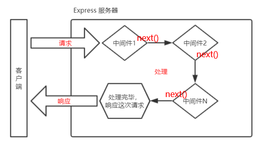

# Node.js介绍

Node.js是一个基于Chrome V8引擎的JavaScript运行环境

浏览器是一种运行环境（chrome的v8解析引擎性能最好），其中的DOM和BOM都是浏览器提供的接口，因此我们可以在浏览器中写前端代码。node.js也是一种运行环境，我们可以在node中做后端开发

浏览器是JavaScript的前端运行环境，Node.js是JavaScript的后端运行环境。Node.js中无法调用DOM和BOM等浏览器内置API

## Node.js学习路径

浏览器中的JavaScript学习路径：JavaScript基础语法 + 浏览器内置 API（DOM + BOM） + 第三方库（jQuery、art-template 等）

Node.js的学习路径：JavaScript基础语法 + Node.js内置 API 模块（fs、path、http等）+ 第三方 API 模块（express、mysql 等）

## Node.js可以用来做什么

Node.js作为一个JavaScript的运行环境，仅仅提供了基础的功能和API。然而，基于Node.js提供的这些基础能，很多强大的工具和框架如雨后春笋，层出不穷，所以学会了Node.js ，可以让前端程序员胜任更多的工作和岗位：

1. 基于[Express框架 ](http://www.expressjs.com.cn/)，可以快速构建Web应用
2. 基于[Electron框架](https://electronjs.org/)，可以构建跨平台的桌面应用
3. 基于[restify 框架](http://restify.com/)，可以快速构建API接口项目
4. 读写和操作数据库、创建实用的命令行工具辅助前端开发、etc…

# 模块化

模块化是指解决一个复杂问题时，自顶向下逐层把系统划分成若干模块的过程。对于整个系统来说，模块是可组合、分解和更换的单元，编程领域中的模块化，就是遵守固定的规则，把一个大文件拆成独立并互相依赖的多个小模块

**把代码进行模块化拆分的好处：**

1. 提高了代码的复用性
2. 提高了代码的可维护性
3. 可以实现按需加载

**Node.js中模块的分类**

Node.js 中根据模块来源的不同，将模块分为了 3 大类，分别是：

1. 内置模块（内置模块是由 Node.js 官方提供的，例如 fs、path、http 等），下载时就有
2. 自定义模块（用户创建的每个 .js 文件，都是自定义模块）
3. 第三方模块（由第三方开发出来的模块，并非官方提供的内置模块，也不是用户创建的自定义模块，使用前需要先下载）

**加载模块**

注意：使用`require()`方法加载其它模块时，会执行被加载模块中的代码

```javascript
// 1,加载内置的fs模块
const fs = require('fs');
// 2.加载用户的自定义模块
// 使用require()加载自定义模块时，必须指定以./或../开头的路径标识符。在加载自定义模块时，如果没有指定./或../这样的路径标识符，则node会把它当作内置模块或第三方模块进行加载
const custom = require("./custom.js"); // 注意：在使用require加载用户自定义模块期间，可以省略.js的后缀名
// 3.加载第三方模块
const moment = require("moment");
```

## 模块作用域（自定义模块）

和函数作用域类似，==在自定义模块中定义的变量、方法等成员，只能在当前模块内被访问==，这种模块级别的访问限制，叫做模块作用域

### module.exports和exports

- `module`对象：在每个.js自定义模块中都有一个module对象，它里面存储了和当前模块有关的信息
  - 在自定义模块中，可以使用`module.exports`对象，将模块内的成员共享出去，供外界使用。外界用`require()`方法导入自定义模块时，得到的就是`module.exports`所指向的对象（在一个自定义模块中，默认情况下， `module.exports = {}`）。

- `exports`对象：由于`module.exports`单词写起来比较复杂，为了简化向外共享成员的代码，Node提供了`exports`对象。
- 默认情况下，`exports`和`module.exports`指向同一个对象。最终共享的结果，还是以`module.exports`指向的对象为准

==使用`require()`方法导入模块时，导入的结果，永远以`module.exports`指向的对象为准==


```javascript
// main.js
// 在外界使用require导入一个自定义模块的时候，得到的成员就是那个模块中通过module.exports指向的那个对象
const m = require("./custom");
console.log(m); //{ username: 'zs', sayHello: [Function (anonymous)], age: 40 }

//custom.js
// 在一个自定义模块中，默认情况下， module.exports = {}
const age = 20;

exports.username = "zs";
exports.sayHello = function() {
    console.log("Hello!");
};
exports.age = age;

// 让module.exports指向一个全新的对象
module.exports = exports;
module.exports.age = 40;
```

### Node.js中的模块化规范

Node.js遵循了CommonJS模块化规范，CommonJS规定了模块的特性和各模块之间如何相互依赖

CommonJS规定：

1. 每个模块内部，`module`变量代表当前模块
2. `module`变量是一个对象，它的`exports`属性（即`module.exports`）是对外的接口
3. 加载某个模块，其实是加载该模块的`module.exports`属性。`require()`方法用于加载模块

## 内置模块

### fs文件系统模块

fs模块是Node.js官方提供的、用来操作文件的模块。它提供了一系列的方法和属性，用来满足用户对文件的操作需求

- `fs.readFile(path[, options], callback)`方法，用来读取指定文件中的内容
  - 参数1：必选参数，字符串，读取文件的存放路径
  - 参数2：可选参数，读取文件时候采用的编码格式，一般默认指定 utf8
  - 参数3：必选参数，文件读取完成后，通过回调函数拿到读取失败和成功的结果

- `fs.writeFile(file, data[, options], callback)`方法，用来向指定的文件中写入内容
  - 参数1：必选参数，需要指定一个文件路径的字符串，表示文件的存放路径
  - 参数2：必选参数，表示要写入的内容
  - 参数3：可选参数，表示以什么格式写入文件内容，默认值是 utf8
  - 参数4：必选参数，文件写入完成后的回调函数
  - `fs.writeFile()`方法只能用来创建文件，不能用来创建路径
  - 重复调用`fs.writeFile()`写入同一个文件，新写入的内容会覆盖之前的旧内容

```javascript
// fs模块，来操作文件
const fs = require('fs')
const path = require('path')

// __dirname表示当前文件所处的目录
console.log(__dirname); // C:\Users\admin\Documents\VSCProjects\nodeProjects

//fs.readFile
fs.readFile(
    path.join(__dirname, "./files/1.txt"),
    "utf8",
    // 如果读取成功，则err的值为null
    // 如果读取失败，则err的值为错误对象，dataStr的值为undefined
    function(err, dataStr) {
        if (err) {
            return console.log(err.message);
        }
        console.log(dataStr);
    }
);
//fs.writeFile
fs.writeFile(path.join(__dirname + '/files/3.txt'), 'ok123', function(err) {
  // 如果文件写入成功，则err的值等于null
  // 如果文件写入失败，则err的值等于一个错误对象
  if (err) {
    return console.log('文件写入失败！' + err.message)
  }
  console.log('文件写入成功！')
})
```

**路径动态拼接的问题**

在使用fs模块操作文件时，如果提供的操作路径是以`./`或`../`开头的相对路径时，很容易出现路径动态拼接错误的问题

原因：代码在运行的时候，会以<u>执行node命令时所处的目录</u>，动态拼接出被操作文件的完整路径

解决方案：在使用fs模块操作文件时，直接提供完整的路径，不要提供`./`或`../`开头的相对路径，从而防止路径动态拼接的问题。使用`__dirname`表示当前文件所处的目录进行拼接

### path路径模块

path模块是Node.js官方提供的、用来处理路径的模块。它提供了一系列的方法和属性，用来满足用户对路径的处理需求

- `path.join([...paths])`方法，用来将多个路径片段拼接成一个完整的路径字符串
  - `...paths`：路径片段的序列
  - 注意：` ../`会抵消前面的路径

- `path.basename(path[, ext])`方法，用来从路径字符串中，将文件名解析出来
  - `path`：必选参数，表示一个路径的字符串
  - `ext`：可选参数，表示文件扩展名
- `path.extname(path)`方法，可以获取路径中的扩展名部分
  - `path`：必选参数，表示一个路径的字符串

```javascript
const path = require('path')
const fs = require('fs')
//path.join
const pathStr = path.join("/a", "/b/c", "../../", "./d", "e");
console.log(pathStr); // \a\d\e

// 定义文件的存放路径
const fpath = "/a/b/c/index.html";
//path.basename
const fullName = path.basename(fpath);
console.log(fullName); //index.html
const nameWithoutExt = path.basename(fpath, ".html");
console.log(nameWithoutExt); //index

//path.extname
const fext = path.extname(fpath);
console.log(fext); //.html
```

### http模块

http模块是Node.js官方提供的、用来创建web服务器的模块。通过http模块提供的`http.createServer()`方法，就能方便的把一台普通的电脑，变成一台Web服务器，从而对外提供Web资源服务

在开发期间，自己的电脑既是一台服务器，也是一个客户端，为了方便测试，可以在自己的浏览器中输入127.0.0.1这个IP地址（对应的域名是localhost），就能把自己的电脑当做一台服务器进行访问了。IP地址和域名是一一对应的关系，这份对应关系存放在一种叫做域名服务器(DNS，Domain name server)的电脑中。使用者只需通过好记的域名访问对应的服务器即可，对应的转换工作由域名服务器实现。因此，域名服务器就是提供IP地址和域名之间的转换服务的服务器

在一台电脑中，可以运行成百上千个web服务。每个web服务都对应一个唯一的端口号。客户端发送过来的网络请求，通过端口号，可以被准确地交给对应的web服务进行处理。

注意：每个端口号不能同时被多个 web 服务占用。在实际应用中，URL 中的 80 端口可以被省略

#### 创建 web 服务器的基本步骤

1. 导入http模块
2. 创建web服务器实例
3. 为服务器实例绑定request事件，监听客户端的请求
4. 启动服务器

**解决中文乱码问题**

当调用`res.end()`方法，向客户端发送中文内容的时候，会出现乱码问题，此时，需要手动设置内容的编码格式

```javascript
// 1. 导入http模块
const http = require("http");
// 2. 创建web服务器实例
const server = http.createServer();
// 3. 为服务器实例绑定request事件，监听客户端的请求
// 使用服务器实例的.on()方法，为服务器绑定一个request事件。只要有客户端来请求我们的服务器，就会触发request事件，从而调用这个事件的处理函数
// req 是请求对象，包含了与客户端相关的数据和属性
server.on("request", (req, res) => {
    // req.url 是客户端请求的 URL 地址
    const url = req.url;
    // req.method 是客户端请求的 method 类型
    const method = req.method;
    // 置默认的响应内容
    let content = `您请求的URL地址是 ${url}，请求的method类型为 ${method}`;
    // 判断用户请求的url
    if (url === "/" || url === "/index.html") {
        content = "<h1>首页</h1>";
    } else if (url === "/about.html") {
        content = "<h1>关于页面</h1>";
    }
    // 调用 res.setHeader() 方法，设置 Content-Type 响应头，解决中文乱码的问题
    res.setHeader("Content-Type", "text/html; charset=utf-8");
    // 调用 res.end() 方法，向客户端发送指定的内容，并结束这次请求的处理过程
    res.end(content);
});

// 4. 启动服务器
// 调用server.listen(端口号，cb回调)方法，即可启动web服务器
server.listen(8080, function() {
    console.log("server running at http://127.0.0.1:8080");
});
```

## npm

参考[NodeJs 的安装及配置环境变量](https://blog.csdn.net/zimeng303/article/details/112167688)，包括了全平台安装和换源

## 包（第三方模块）

Node.js中的第三方模块又叫做包，包是由第三方个人或团队开发出来的，免费供所有人使用

**为什么需要包**

- 由于Node.js的内置模块仅提供了一些底层的API，导致在基于内置模块进行项目开发的时，效率很低
- 包是基于内置模块封装出来的，提供了更高级、更方便的API，极大的提高了开发效率
- 包和内置模块之间的关系，类似于jQuery和浏览器内置API之间的关系

**从哪里下载包**

npm, Inc. 这家公司旗下有一个非常著名的网站：https://www.npmjs.com/，它是全球最大的包共享平台，你可以从这个网站上搜索到任何你需要的包

npm, Inc. 公司提供了一个地址为https://registry.npmjs.org/的服务器，来对外共享所有的包，我们可以从这个服务器上下载自己所需要的包

**如何下载包**

npm, Inc. 公司提供了一个包管理工具，我们可以使用这个包管理工具，从https://registry.npmjs.org/服务器把需要的包下载到本地使用

这个包管理工具的名字叫做Node Package Manager（简称npm包管理工具），这个包管理工具随着Node.js的安装包一起被安装到了用户的电脑上。可以在终端中执行`npm -v`命令，来查看自己电脑上所安装的npm包管理工具的版本号

### 包的分类

使用npm包管理工具下载的包，共分为两大类，分别是：

- <u>项目包</u>：那些被安装到项目的**node_modules**目录中的包，都是项目包
  - <u>开发依赖包</u>（被记录到devDependencies节点中的包，只在开发期间会用到）
    - devDependencies节点：如果某些包只在项目开发阶段会用到，在项目部署之后不会用到，则建议把这些包记录到 devDependencies节点中。与之对应的，如果某些包在开发和运行都需要用到，则建议把这些包记录到dependencies节点中
    - `npm i 包名 -D`
  - <u>核心依赖包</u>（被记录到dependencies节点中的包，在开发期间和项目上线之后都会用到）
    - `npm i 包名`

- <u>全局包</u>：在执行`npm install`命令时，如果提供了` -g`参数，则会把包安装为全局包。全局包会被安装到 **C:\Users\用户目录\AppData\Roaming\npm\node_modules**（**/usr/local**）目录下
  - `npm i 包名 -g`或`npm i -g 包名`
  - `npm uninstall 包名 -g`
  - 只有工具性质的包，才有全局安装的必要性。因为它们提供了好用的终端命令
- 判断某个包是否需要全局安装，安装开发依赖包，安装核心依赖包后才能使用，可以在https://www.npmjs.com/查询具体的包

### 规范的包结构

一个规范的包，它的组成结构，必须符合以下 3 点要求：

1. 包必须以单独的目录而存在

2. 包的顶级目录下要必须包含**package.json**这个包管理配置文件
3. **package.json**中必须包含`name`，`version`，`main`这三个属性，分别代表包的名字、版本号、包的入口

### 在项目中安装包

- 安装包：`npm install 包1的完整名称 包2的完整名称`或`npm i 包的完整名称`
- 安装指定版本的包，默认情况下，使用`npm install`命令安装包的时候，会自动安装最新版本的包。如果需要安装指定版本的包，可以在包名之后，通过`@`符号指定具体的版本，例如：`npm i moment@2.22.2`
  - 会覆盖之前安装的包，所以不用卸载
  - `~`会匹配最近的小版本依赖包，比如`~1.2.3`会匹配所有`1.2.x`版本，但是不包括`1.3.0`
  - `^`会匹配最新的大版本依赖包，比如`^1.2.3`会匹配所有`1.x.x`的包，包括`1.3.0`，但是不包括`2.0.0`
  - 什么前缀也没有，比如`1.2.3`，指定特定的版本
  - `*`安装最新版本的依赖包。可能会造成版本不兼容，慎用
- 包的语义化版本规范
  - 包的版本号是以点分十进制形式进行定义的，总共有三位数字，例如2.24.0，其中每一位数字所代表的的含义如下：
  - 第1位数字：大版本
  - 第2位数字：功能版本
  - 第3位数字：Bug修复版本
  - 版本号提升的规则：只要前面的版本号增长了，则后面的版本号归零
- 快速创建**package.json**：`npm init -y`
  - 输入`npm init`后会弹出一堆问题，我们可以输入对应内容，也可以使用默认值。在回答一堆问题后输入`yes`就会生成**package.json**文件，如果嫌回答这一大堆问题麻烦，可以直接输入`npm init --yes`跳过回答问题步骤，直接生成默认值的**package.json**文件
  - 上述命令只能在英文的目录下成功运行！所以，项目文件夹的名称一定要使用英文命名，不要使用中文，不能出现空格
  - 运行`npm install`命令安装包的时候，npm包管理工具会自动把包的名称和版本号，记录到 **package.json**中

- 一次性安装**package.json**中dependencies节点中所有的包：`npm install`或`npm i`
  - 当我们拿到一个剔除了**node_modules**的项目之后，需要先把所有的包下载到项目中，才能将项目运行起来
  - 执行`npm install`命令时，npm包管理工具会先读取**package.json**中的dependencies节点，读取到记录的所有依赖包的名称和版本号之后，npm包管理工具会把这些包一次性下载到项目中
- 卸载包：`npm uninstall 包的完整名称`
  - `npm uninstall`命令执行成功后，会把卸载的包，自动从**package.json**的dependencies中移除掉
  - 不带包名表示卸载**package.json**里面的所有依赖
  - `npm uninstall 包名 --no-save`：卸载包，但是不会从**package.json**、**package-lock.json**中删除，仍保留
- 将包记录到devDependencies节点中：`npm i 包的完整名称 -D`或`npm install 包的完整名称 --save-dev`
  - 当另一个用户希望在下载包时去除掉在开发阶段使用而不需要在上线阶段使用的包时（在devDependencies节点中的包），使用`npm install -p`或`npm install --production`


**总结**

| 命令                                                    | 作用                                                         |
| ------------------------------------------------------- | ------------------------------------------------------------ |
| npm install 包名 --save \| npm install -S               | 表示将这个包名及对应的版本添加到**package.json**的 dependencies |
| npm install 包名 --save-dev \| npm install -D           | 表示将这个包名及对应的版本添加到**package.json**的 devDependencies |
| npm update 包名                                         | 更新模块。更新升级时应该把原本的**node-modules**文件夹删除，不然的话可能会报错。不带包名表示**package.json**里面的所有依赖更新 |
| npm update -g                                           | 升级全局安装的依赖包                                         |
| npm  list  包名                                         | 查看模块信息。不带包名表示查看当前目录下安装的所有安装包及其依赖包 |
| npm list --depth 0                                      | 查看当前目录下安装的所有安装包，其中`--depth`参数后面的数字表示的需要列出依赖包的层级 |
| npm -g list --depth 0                                   | 查看全局已安装的依赖包                                       |
| npm view 包名 [repository.url, versions]                | 查看模块信息                                                 |
| npm help                                                | 查看帮助信息                                                 |
| npm search 包名                                         | 搜索模块<br/>发布一个npm包的时候，需要检验某个模块是否已存在。如果存在就会显示其完整信息 |
| npm config get registry                                 | 查看npm源地址                                                |
| npm config get prefix                                   | 获取全局安装的默认目录                                       |
| npm config set prefix "directory"                       | 设置全局安装的默认目录                                       |
| npm config list                                         | 查看配置信息，比如npm源等                                    |
| npm config set prefix "C:\extension\nodejs\node_global" |                                                              |
| npm config set cache "C:\extension\nodejs\node_cache"   |                                                              |

初次装包完成后，在项目文件夹下多一个叫做**node_modules**的文件夹和**package-lock.json**的配置文件

**node_modules**文件夹用来存放所有已安装到项目中的包。`require()`导入第三方包时，就是从这个目录中查找并加载包

**package-lock.json**配置文件用来记录**node_modules**目录下的每一个包的下载信息，例如包的名字、版本号、下载地址等

==注意：程序员不要手动修改**node_modules**或pack**age-lock.json**文件中的任何代码，npm包管理工具会自动维护它们==

### 包管理配置文件package.json

npm规定，在项目根目录中，必须提供一个叫做**package.json**的包管理配置文件。用来记录与项目有关的一些配置信息。例如：

1. 项目的名称、版本号、描述等
2. 项目中都用到了哪些包
3. 哪些包只在开发期间会用到
4. 那些包在开发和部署时都需要用到

多人协作的问题：第三方包的体积过大，不方便团队成员之间共享项目源代码，所以我们在项目根目录中，创建一个叫做**package.json**的配置文件（安装包时会自动创建），即可用来记录项目中安装了哪些包。从而方便在**.gitignore**中剔除**node_modules**目录之后，在团队成员之间共享项目的源代码

**package.json的内容**

1. name - 包名。包名和文件夹的名字没有关系，npm下载包时会以这个name属性为包名下载。**包名具有唯一性**，所以可以先在官网上搜索是否有重复的包名
2. version - 包的版本号
3. description - 包的描述
4. homepage - 包的官网 url
5. author - 包的作者姓名
6. contributors - 包的其他贡献者姓名
7. dependencies - 依赖包列表。如果依赖包没有安装，npm 会自动将依赖包安装在 node_module 目录下
8. repository - 包代码存放的地方的类型，可以是 git 或 svn，git 可在 Github 上
9. main - main 字段指定了程序的主入口文件，require(‘moduleName’)
10. 就会加载这个文件。这个字段的默认值是模块根目录下面的 index.js
11. keywords - 关键字
12. "license": "ISC" - 默认的开源许可协议
13. scripts - 通过脚本可以快速的批量的执行相关的命令。npm run 脚本名称

### 使用淘宝镜像服务器解决下包速度慢的问题

切换npm的下包镜像源

```bash
# 查看当前的下包镜像源
npm config get registry
# 将下包的镜像源切换为淘宝镜像源
npm config set registry=https://registry.npm.taobao.org/
# 临时使用指定的下载地址
npm --registry https://registry.npm.taobao.org install express
```

为了更方便的切换下包的镜像源，我们可以安装nrm这个小工具，利用nrm提供的终端命令，可以快速查看和切换下包的镜像源

```bash
# 通过npm包管理器，将nrm安装为全局可用的工具
npm i nrm -g
# 查看所有可用的镜像源
nrm ls
# 将下包的镜像源切换为淘宝镜像源
nrm use taobao
```

### **开发属于自己的包**

1. 初始化包的结构
   1. 新建**itheima-tools**文件夹，作为包的根目录
   2. **itheima-tools**文件夹中，新建如下三个文件
      1. **package.json**（包管理配置文件）
      2. **index.js**（包的入口文件）
      3. **README.md**（包的说明文档）
2. 初始化**package.json**
3. **index.js**中定义格式化时间，转义HTML，还原HTML的方法
4. 将不同的功能进行模块化拆分
   1. 将格式化时间的功能，拆分到**src/dateFormat.js**中
   2. 将处理HTML字符串的功能，拆分到**src/htmlEscape.js**中
   3. 在**index.js**中，导入两个模块，得到需要向外共享的方法
   4. 在**index.js**中，使用`module.exports`把对应的方法共享出去

```javascript
// main.js
const itheima = require('./itheima-tools') // 不需要导入具体的index.js，npm会从packaga.json寻找入口函数
// 格式化时间的功能
const dtStr = itheima.dateFormat(new Date())
console.log(dtStr)
console.log('-----------')
const htmlStr = '<h1 title="abc">这是h1标签<span>123&nbsp;</span></h1>'
const str = itheima.htmlEscape(htmlStr)
console.log(str)
console.log('-----------')
const str2 = itheima.htmlUnEscape(str)
console.log(str2)

// package.json
{
    "name": "itheima-tools",
    "version": "1.0.0",
    "main": "index.js",
    "description": "提供了格式化时间，HTMLEscape的功能",
    "keywords": [
        "itheima",
        "dataFormat",
        "escape"
    ],
    "license": "ISC"
}

// index.js
const date = require('./src/dateFormat')
const escape = require('./src/htmlEscape')
// 向外暴露需要的成员
module.exports = {
  ...date,
  ...escape
}

// /src/dataFormat.js
// 定义格式化时间的函数
function dateFormat(dateStr) {
  const dt = new Date(dateStr)

  const y = dt.getFullYear()
  const m = padZero(dt.getMonth() + 1)
  const d = padZero(dt.getDate())

  const hh = padZero(dt.getHours())
  const mm = padZero(dt.getMinutes())
  const ss = padZero(dt.getSeconds())

  return `${y}-${m}-${d} ${hh}:${mm}:${ss}`
}

// 定义一个补零的函数
function padZero(n) {
  return n > 9 ? n : '0' + n
}

module.exports = {
  dateFormat
}

// /src/htmlEscape.js
// 定义转义 HTML 字符的函数
function htmlEscape(htmlstr) {
  return htmlstr.replace(/<|>|"|&/g, match => {
    switch (match) {
      case '<':
        return '&lt;'
      case '>':
        return '&gt;'
      case '"':
        return '&quot;'
      case '&':
        return '&amp;'
    }
  })
}

// 定义还原 HTML 字符串的函数
function htmlUnEscape(str) {
  return str.replace(/&lt;|&gt;|&quot;|&amp;/g, match => {
    switch (match) {
      case '&lt;':
        return '<'
      case '&gt;':
        return '>'
      case '&quot;':
        return '"'
      case '&amp;':
        return '&'
    }
  })
}

module.exports = {
  htmlEscape,
  htmlUnEscape
}

```

### 发布包

```bash
# 在运行npm login命令之前，必须先把下包的服务器地址切换为npm的官方服务器。否则会导致发布包失败
npm login
# 包名不能雷同
npm publish
# npm unpublish命令只能删除72小时以内发布的包
# npm unpublish删除的包，在24小时内不允许重复发布
# 发布包的时候要慎重，尽量不要往npm上发布没有意义的包
npm unpublish 包名 --force
```

### 模块的加载机制

模块在第一次加载后会被缓存。 这也意味着多次调用`require()`不会导致模块的代码被执行多次。不论是内置模块、用户自定义模块、还是第三方模块，它们都会优先从缓存中加载，从而提高模块的加载效率

#### 内置模块的加载机制

<u>内置模块</u>是由Node.js官方提供的模块，**内置模块的加载优先级最高**。例如，`require('fs') `始终返回内置的fs模块，即使在**node_modules**目录下有名字相同的包也叫做`fs`

#### 自定义模块的加载机制

使用`require()`加载<u>自定义模块</u>时，==必须指定以`./ `或` ../`开头的路径标识符==。在加载自定义模块时，如果没有指定`./`或`../`这样的路径标识符，则node会把它当作内置模块或第三方模块进行加载。

同时，在使用`require()`导入<u>自定义模块</u>时，如果省略了文件的扩展名，则Node.js会按顺序分别尝试加载以下的文件：

1. 按照确切的文件名进行加载

2. 补全 .js 扩展名进行加载

3. 补全 .json 扩展名进行加载

4. 补全 .node 扩展名进行加载
   - 该文件不能写js代码，是win32 application

5. 加载失败，终端报错

#### 第三方模块的加载机制

如果传递给`require()`的模块标识符不是一个内置模块，也没有以`./`或`../`开头，则Node.js会从**当前模块**的父目录开始，尝试从**/node_modules**文件夹中加载<u>第三方模块</u>

如果没有找到对应的第三方模块，则移动到再上一层父目录中，进行加载，直到文件系统的根目录

例如，假设在**C:\Users\itheima\project\foo.js**文件里调用了`require('tools')`，则Node.js会按以下顺序查找：

1. C:\Users\itheima\project\node_modules\tools
2. C:\Users\itheima\node_modules\tools
3. C:\Users\node_modules\tools
4. C:\node_modules\tools

#### 目录作为模块

当把目录作为模块标识符，传递给`require()`进行加载的时候，有三种加载方式：

1. 在被加载的目录下查找一个叫做**package.json**的文件，并寻找`main`属性，作为`require()`加载的入口
2. 如果目录里没有**package.json**文件，或者`main`入口不存在或无法解析，则Node.js将会试图加载目录下的**index.js**文件
3. 如果以上两步都失败了，则Node.js会在终端打印错误消息，报告模块的缺失：`Error: Cannot find module 'xxx'`

# Express

Express是基于Node.js平台，快速、开放、极简的Web开发框架

通俗的理解：Express的作用和Node.js内置的http模块类似，是专门用来创建Web服务器的

Express的本质：就是一个npm上的第三方包，提供了快速创建Web服务器的便捷方法

对于前端程序员来说，最常见的两种服务器，分别是：

1. Web网站服务器：专门对外提供 Web 网页资源的服务器
2. API接口服务器：专门对外提供 API 接口的服务器

使用Express，我们可以方便、快速的创建 Web 网站的服务器或 API 接口的服务器。

Express的基本使用参考html内置模块

## 托管静态资源

Express在指定的静态目录中查找文件，并对外提供资源的访问路径。因此，存放静态文件的目录名不会出现在URL中。如果希望在托管的静态资源访问路径之前，挂载路径前缀，则可以使用`app.use('/public', express.static('public'))`通过访问`http://localhost:3000/public/images/kitten.jpg`访问**public**目录中的**images/kitten.jpg**文件

如果要托管多个静态资源目录，多次调用`express.static() `函数。访问静态资源文件时，`express.static()`函数会根据先后顺序所需的文件

## Express路由

在Express中，路由指的是客户端的请求与服务器处理函数之间的映射关系。Express 中的路由分3部分组成，分别是请求的类型、请求的 URL 地址、处理函数，格式：`app.METHOD(PATH, HANDLER)`

每当一个请求到达服务器之后，需要先经过路由的匹配，只有匹配成功之后，才会调用对应的处理函数。在匹配时，**会按照路由的顺序进行匹配**，如果请求类型和请求的URL**同时**匹配成功，则Express会将这次请求，转交给对应的function函数进行处理


```javascript
// 导入express
const express = require("express");
// 创建web服务器
const app = express();

// 监听客户端的GET请求，并向客户端响应具体的内容
// req：请求对象（包含了与请求相关的属性和方法）
// res：响应对象（包含了与响应相关的属性和方法）
app.get("/user", (req, res) => {
    // 调用express提供的res.send()方法，向客户端响应一个JSON对象
    res.send({ url: "user", name: "zs", age: 20, gender: "男" });
});

// 通过express.json()这个中间件，解析表单中的JSON格式的数据
app.use(express.json())
// 通过express.urlencoded()这个中间件，来解析表单中的url-encoded格式的数据
app.use(express.urlencoded({ extended: false }))
// 监听客户端的POST请求
app.post("/user", (req, res) => {
    // 通过req.query可以获取到客户端发送过来的查询参数：?name=zs&age=20
    // 注意：默认情况下，req.query是一个空对象
    console.log(req.query);
    // 在服务器，可以使用req.body这个属性，来接收客户端发送过来的请求体数据
    // 默认情况下，如果不配置解析表单数据的中间件，则req.body默认等于undefined
    console.log(req.body) // 客户端发送的JSON格式的表单数据和url-encoded格式的数据都会显示
    res.send("/user 请求成功");
});

// 获取URL中的动态参数
// 注意：这里的 :id 是一个动态的参数，用posteman进行测试http://127.0.0.1/user/10
app.get("/user/:username/:password", (req, res) => {
  // req.params是动态匹配到的URL参数，默认也是一个空对象
  console.log(req.params); //{ username: 'zhangsan', password: '100' }
  res.send(req.params);
});

// 调用app.listen(端口号，启动成功后的回调函数)启动web服务器
app.listen(80, () => {
    console.log("express server running at http://127.0.0.1");
});
```

### 模块化路由（包含express全部代码）

为了方便对路由进行模块化的管理，Express不建议将路由直接挂载到app上，而是推荐将路由抽离为单独的模块。

将路由抽离为单独模块的步骤如下：

1. 创建路由模块对应的.js文件
2. 调用`express.Router()`函数创建路由对象
3. 向路由对象上挂载具体的路由
4. 使用`module.exports`向外共享路由对象
5. 使用`app.use()`函数注册路由模块。`app.use()`函数的作用，就是来注册全局中间件（看下文）

```javascript
// router.js
const express = require('express')
// 创建路由对象
const router = express.Router()
// 挂载具体的路由
router.get("/get", (req, res) => {
  const query = req.query;
  res.send({
    status: 0,
    msg: "GET请求成功",
    data: query,
  });
});

router.post("/post", (req, res) => {
  const body = req.body;
  res.send({
    status: 0,
    msg: "POST请求成功",
    data: body,
  });
});

router.delete("/delete", (req, res) => {
  res.send({
    status: 0,
    msg: "DELETE请求成功",
  });
});
// 这里也可以用router.use()绑定一个中间件
router.use(function(req, res, next){...next()})
// 向外导出路由对象
module.exports = router

// main.js
const express = require('express')
// 导入路由模块
const router = require('./router')
const app = express()
// 如果想要拿到客户端发送的post urlencoded表单数据，必须在路由之前配置中间件，否则是undefined
app.use(express.urlencoded({ extended: false }));
// 必须在配置cors中间件之前，配置JSONP的接口【这个接口不会被处理成CORS接口】
// 没有注册路由，这里手动写
app.get("/api/jsonp", (req, res) => {
  // 1. 获取客户端发送过来的回调函数的名字
  const funcName = req.query.callback;
  // 2. 得到要通过JSONP形式发送给客户端的数据
  const data = { name: "James", age: 100, id: 11 };
  // 3. 根据前两步得到的数据，拼接出一个函数调用的字符串
  const scriptStr = `${funcName}(${JSON.stringify(data)})`;
  // 4. 把上一步拼接得到的字符串，响应给客户端的<script>标签进行解析执行
  res.send(scriptStr);
});

// 在路由之前使用CORS中间件【后续的所有接口都会被处理成CORS接口】
const cors = require("cors");
app.use(cors());

// app.use('/files', express.static('./files'))
// 注册路由模块，添加访问前缀/api（客户端访问时，要先加/api再加router里定义的路由）
app.use("/api", router);

app.listen(80, () => {
  console.log('http://127.0.0.1')
})
```

## Express中间件

中间件（Middleware），特指业务流程的中间处理环节。当一个请求到达Express的服务器之后，可以连续调用多个中间件，从而对这次请求进行预处理。Express的中间件，本质上就是一个function处理函数



`next`函数是实现多个中间件连续调用的关键，它表示把流转关系转交给下一个中间件或路由


**注意：中间件函数的形参列表中，必须包含`next`参数**。而路由处理函数中只包含`req`和`res`。

### 中间件的作用

多个中间件之间，共享同一份`req`和`res`。基于这样的特性，我们可以在上游的中间件中，统一为`req`或`res`对象添加**自定义**的属性或方法，供下游的中间件或路由进行使用


中间件的5个使用注意事项

1. 一定要在路由之前注册中间件。因为路由的匹配是在代码中从上往下的，如果路由匹配了，之后的函数不会再执行
2. 客户端发送过来的请求，可以连续调用多个中间件进行处理
3. 执行完中间件的业务代码之后，不要忘记调用`next()`函数
4. 为了防止代码逻辑混乱，调用`next()`函数后不要再写额外的代码[把`next()`放在中间件函数的最后]
5. 连续调用多个中间件时，多个中间件之间，共享`req`和`res`对象

### 定义和使用全局生效的中间件函数

全局生效的中间件：客户端发起的任何请求，到达服务器之后，都会触发的中间件，叫做全局生效的中间件。
通过调用`app.use(中间件函数)`，即可定义一个全局生效的中间件

```javascript
// 定义一个最简单的中间件函数
const mw = function (req, res, next) {
  console.log('这是最简单的中间件函数')
  // 把流转关系，转交给下一个中间件或路由
  next()
}
// 将mw注册为全局生效的中间件
app.use(mw)
// ------------------------以上两步可以简化为----------------------------
// 这是定义全局中间件的简化形式
app.use((req, res, next) => {
  console.log('这是最简单的中间件函数')
  next()
})
// ------------------------先进入中间件函数，再进入路由处理函数----------------------------
const express = require("express");
const app = express();

// 定义第一个全局中间件
app.use((req, res, next) => {
  console.log("调用了第1个全局中间件");
  // 获取到请求到达服务器的时间
  const time = Date.now();
  // 为req对象挂载自定义属性，从而把时间共享给后面的所有路由
  req.startTime = time;
  next();
});
// 定义第二个全局中间件
app.use((req, res, next) => {
  console.log("调用了第2个全局中间件");
  console.log(req.startTime);
  next();
});
// 定义路由
app.get("/", (req, res) => {
  console.log("调用了 / 这个路由"); // 先打印中间件函数，再打印路由里的函数
  res.send("Home page." + req.startTime); // req.startTime是中间件共享的
});

app.get("/user", (req, res) => {
  console.log("调用了 /user 这个路由");
  res.send("User page." + req.startTime);
});
```

### 定义和使用局部生效的中间件函数

不使用`app.use()`定义的中间件，叫做局部生效的中间件

```javascript
// 定义中间件函数
const mw1 = (req, res, next) => {...next()}
const mw2 = (req, res, next) => {...next()}
// 定义路由，以下两个是等价的。中间件函数只会在 / 路由下局部生效
app.get('/', [mw1, mw2], (req, res) => {})
app.get('/', mw1, mw2, (req, res) => {})
// /user这个路由不会受到中间件影响
app.get('/user', (req, res) => {})
```

### 中间件的分类

为了方便大家理解和记忆中间件的使用，Express 官方把常见的中间件用法，分成了 5 大类，分别是：

1. 应用级别的中间件：通过`app.use()`或`app.get()`或`app.post()`绑定到 app 实例上的中间件。例如上面的全局中间件和局部中间件

2. 路由级别的中间件：绑定到`express.Router()`实例上的中间件叫做路由级别的中间件。它的用法和应用级别中间件没有任何区别。只不过，应用级别中间件是绑定到 app 实例上，路由级别中间件绑定到 router 实例上

   - ```javascript
     var app = express()
     var router = express.Router()
     // 路由级别的中间件
     router.use((req, res, next)=>{...next()})
     app.use('/', router)
     ```

3. 错误级别的中间件：专门用来捕获整个项目中发生的异常错误，从而防止项目异常崩溃的问题

   - 错误级别中间件的function处理函数中，必须有4个形参，形参顺序从前到后，分别是`(err, req, res, next)`

   - **<u>错误级别的中间件，必须注册在所有路由之后</u>**

   - ```javascript
     app.get('/', function(req, res){
         // 这里我们强制让他发生一个错误
         // 如果没有中间件处理函数会崩溃，但是下一行的res.send还是不会执行
         throw new Error('服务器内部发生了错误！')
         // 这个函数不会执行
         res.send('Home Page')
     })
     // 错误级别的中间件，捕获整个项目的异常错误，防止崩溃，必须注册在所有路由之后
     app.use(function(err, req, res, next){
         console.log('发生了错误' + err.message) // 在服务器打印错误消息
         res.send('Error! ' + err.message) // 向客户端响应错误相关的内容
     })
     ```

4. Express内置的中间件，自Express 4.16.0版本开始，Express 内置了3个常用的中间件，极大的提高了Express项目的开发效率和体验

   - `express.static`快速托管静态资源的内置中间件，例如：HTML文件、图片、CSS样式等（无兼容性）
   - `express.json`解析JSON格式的请求体数据（有兼容性，仅在4.16.0+版本中可用）
     - `app.use(express.json())`
   - `express.urlencoded`解析URL-encoded格式的请求体数据（有兼容性，仅在4.16.0+版本中可用）
     - `app.use(express.urlencoded({ extended: false }))`
   - 注意除了错误级别的中间件，其他的中间件必须在路由之前进行配置
   - 

5. 第三方的中间件：非Express官方内置的，而是由第三方开发出来的中间件，叫做第三方中间件

#### 使用body-parser第三方中间件解析请求体数据

1. 运行`npm install body-parser`安装中间件
2. 使用`require`导入中间件
3. 调用`app.use()`注册并使用中间件

Express内置的`express.urlencoded`中间件，就是基于`body-parser`这个第三方中间件进一步封装出来的

```javascript
// 1. 导入解析表单数据的中间件body-parser
const parser = require('body-parser')
// 2. 使用 app.use() 注册中间件
app.use(parser.urlencoded({ extended: false }))
// 使用Express内置的express.urlencoded中间件
// app.use(express.urlencoded({ extended: false }))
app.post(...)
```

### 自定义express.urlencoded中间件

```javascript
const express = require("express");
const qs = require("querystring");
const app = express();

app.use((req, res, next) => {
  /*
    监听req的data事件
    在中间件中，需要监听req对象的data事件，来获取客户端发送到服务器的数据
    如果数据量比较大，无法一次性发送完毕，则客户端会把数据切割后，分批发送到服务器。所以data事件可能会触发多次，每一次触发data事件时，获取到数据只是完整数据的一部分，需要手动对接收到的数据进行拼接
  */
  // 定义一个str字符串用来拼接客户端发送的请求体数据
  let str = "";
  req.on("data", (chunk) => {
    str += chunk;
  });
  /*
    监听req的end事件
    当请求体数据接收完毕之后，会自动触发req的end事件
    因此，我们可以在req的end事件中，拿到并处理完整的请求体数据
  */
  req.on("end", () => {
    console.log(str); // 此时在str中存放的是完整的请求体数据
    /*
      调用qs.parse()方法，把查询字符串解析为对象
      Node.js内置了一个querystring模块，专门用来处理查询字符串。通过这个模块提供的parse()函数，可以轻松把查询字符串，解析成对象的格式
    */
    const body = qs.parse(str);
    /*
      上游的中间件和下游的中间件及路由之间，共享同一份req和 res。
      因此，我们可以将解析出来的数据，挂载为req的自定义属性，命名为req.body，供下游使用
    */
    req.body = body;
    next();
  });
});

app.post("/user", (req, res) => {
  res.send(req.body);
});

// 指定端口号并开启服务器
app.listen(80, () => {
  console.log("Express server running at http://127.0.0.1");
});
```

### 使用express-session进行身份验证

`npm install express-session`

```javascript
const express = require("express");
const app = express();

// 配置Session中间件
const session = require("express-session");
app.use(
  session({
    secret: "itheima", // 自定义
    resave: false,
    saveUninitialized: true,
  })
);

// 托管静态页面
app.use(express.static("./pages"));
// 解析POST提交过来的表单数据
app.use(express.urlencoded({ extended: false }));

// 登录的 API 接口
app.post("/api/login", (req, res) => {
  // 判断用户提交的登录信息是否正确
  if (req.body.username !== "admin" || req.body.password !== "000000") {
    return res.send({ status: 1, msg: "登录失败" });
  }

  // 将登录成功后的用户信息，保存到Session中
  // 只有成功配置了express-session中间件之后，才能够通过req.session来访问和使用session对象
  req.session.user = req.body; // 用户的信息
  req.session.islogin = true; // 用户的登录状态

  res.send({ status: 0, msg: "登录成功" });
});

// 获取上一部分用户发送的信息并相应的改变username接口的内容
app.get("/api/username", (req, res) => {
  if (!req.session.islogin) {
    return res.send({ status: 1, msg: "fail" });
  }
  res.send({
    status: 0,
    msg: "success",
    username: req.session.user.username,
  });
});

// 退出登录的接口并清空**当前客户端**对应的session信息
app.post("/api/logout", (req, res) => {
  req.session.destroy();
  res.send({
    status: 0,
    msg: "退出登录成功",
  });
});

app.listen(80, function () {
  console.log("Express server running at http://127.0.0.1:80");
});
```

#### 使用express-jwt和jsonwebtoken进行身份验证

`npm install jsonwebtoken express-jwt`其中

- `jsonwebtoken`用于生成JWT字符串
- `express-jwt`用于将JWT字符串解析还原成JSON对象

```javascript
const express = require('express')
const app = express()

// 导入jsonwebtoken和express-jwt
const jwt = require('jsonwebtoken')
const expressJWT = require('express-jwt')

// 允许跨域资源共享
const cors = require('cors')
app.use(cors())

// 解析post表单数据的中间件
const bodyParser = require('body-parser')
app.use(bodyParser.urlencoded({ extended: false }))

// 定义secret密钥，建议将密钥命名为secretKey。secret密钥的本质就是一个字符串
/* 
  为了保证JWT字符串的安全性，防止JWT字符串在网络传输过程中被别人破解，我们需要专门定义一个用于加密和解密的secret密钥：
  当生成JWT字符串的时候，需要使用 ecret密钥对用户的信息进行加密，最终得到加密好的JWT字符串
  当把JWT字符串解析还原成JSON对象的时候，需要使用secret密钥进行解密 
*/
const secretKey = 'itheima No1 ^_^'

// 服务器可以通过express-jwt这个中间件，自动将客户端发送过来的Token解析还原成JSON对象
/* 
  客户端每次在访问那些有权限接口的时候都需要主动通过请求头中的Authorization字段，将Token字符串发送到服务器进行身份认证
  注意：只要成功配置了express-jwt这个中间件，就可以把解析出来的用户信息，挂载到req.user属性上
 */
// unless({ path: [/^\/api\//] }) 用来指定哪些接口不需要访问权限。正则+转义表示以/api/开头的
app.use(expressJWT({ secret: secretKey }).unless({ path: [/^\/api\//] }))

// 登录接口
app.post('/api/login', function (req, res) {
  const userinfo = req.body
  // 登录失败
  if (userinfo.username !== 'admin' || userinfo.password !== '000000') {
    return res.send({
      status: 400,
      message: '登录失败！',
    })
  }

  // 在登录成功之后，用jwt.sign()方法生成JWT字符串。并通过token属性发送给客户端
/*   
  参数1：用户的信息对象
  参数2：加密的秘钥
  参数3：配置对象，可以配置当前token的有效期 
  */
  // 记住：千万不要把重要信息类似用户密码加密到token字符中
  const tokenStr = jwt.sign({ username: userinfo.username }, secretKey, { expiresIn: '30s' }) // '3h'
  res.send({
    status: 200,
    message: '登录成功！',
    token: tokenStr, // 要发送给客户端的 token 字符串
  })
})

// 这是一个有权限的 API 接口
app.get('/admin/getinfo', function (req, res) {
  // 使用req.user获取用户信息
  // 当express-jwt这个中间件配置成功之后，即可在那些有权限的接口中使用req.user对象来访问从JWT字符串中解析出来的用户信息了
  console.log(req.user)
  res.send({
    status: 200,
    message: '获取用户信息成功！',
    data: req.user, // 要发送给客户端的用户信息
  })
})

// 使用全局错误处理中间件，捕获解析JWT失败后产生的错误
/* 当使用express-jwt解析Token字符串时，如果客户端发送过来的Token字符串过期或不合法，会产生一个解析失败的错误，影响项目的正常运行。我们可以通过Express的错误中间件，捕获这个错误并进行相关的处理 */
app.use((err, req, res, next) => {
  // 这次错误是由token解析失败导致的
  if (err.name === 'UnauthorizedError') {
    return res.send({
      status: 401,
      message: '无效的token',
    })
  }
  res.send({
    status: 500,
    message: '未知的错误',
  })
})

app.listen(8888, function () {
  console.log('Express server running at http://127.0.0.1:8888')
})
```

## CORS跨域资源共享

CORS （Cross-Origin Resource Sharing，跨域资源共享）由一系列HTTP响应头组成，这些HTTP响应头决定浏览器是否阻止**前端JS代码跨域获取资源**

**浏览器的同源安全策略默认会阻止网页跨域获取资源。但如果接口服务器配置了CORS相关的HTTP响应头，就可以解除浏览器端的跨域访问限制**


**注意**

1. CORS主要在服务器端进行配置。客户端浏览器无须做任何额外的配置，即可请求开启了CORS的接口
2. CORS在浏览器中有兼容性。只有支持XMLHttpRequest Level2的浏览器，才能正常访问开启了CORS的服务端接口（例如：IE10+、Chrome4+、FireFox3.5+）

**解决接口跨域问题的方案主要有两种：**

1. CORS（主流的解决方案，推荐使用）
2. JSONP（有缺陷的解决方案：只支持 GET 请求）：
   - 如果项目中已经配置了CORS跨域资源共享，为了防止冲突，必须在配置CORS中间件之前声明JSONP的接口。否则JSONP接口会被处理成开启了CORS的接口


### CORS响应头

#### Access-Control-Allow-Origin

响应头部中可以携带一个`Access-Control-Allow-Origin`字段：

- `Access-Control-Allow-Origin: <origin> | *`
  - `origin`参数的值指定了允许访问该资源的外域URL。例如，下面的字段值将只允许来自http://itcast.cn 的请求：`res.setHeader('Access-Control-Allow-Origin', 'http://itcast.cn')`
  - 如果指定了`Access-Control-Allow-Origin`字段的值为通配符`*`，表示允许来自任何域的请求：`res.setHeader('Access-Control-Allow-Origin', '*')`

#### Access-Control-Allow-Headers

默认情况下，CORS仅支持客户端向服务器发送如下的 9 个请求头：`Accept`、`Accept-Language`、`Content-Language`、`DPR`、`Downlink`、`Save-Data`、`Viewport-Width`、`Width`、`Content-Type `（值仅限于 `text/plain`、`multipart/form-data`、`application/x-www-form-urlencoded`三者之一）

如果客户端向服务器发送了额外的请求头信息，则需要在服务器端，通过`Access-Control-Allow-Headers`对额外的请求头进行声明，否则这次请求会失败！

- `res.setHeader('Access-Control-Allow-Headers', 'Content-Type, X-Custom-Header')`
  - 注意多个请求头之间使用英文逗号进行分隔

#### Access-Control-Allow-Methods

默认情况下，CORS仅支持客户端发起`GET`、`POST`、`HEAD`请求。如果客户端希望通过`PUT`、`DELETE`等方式请求服务器的资源，则需要在服务器端，通过`Access-Control-Alow-Methods`来指明实际请求所允许使用的HTTP方法

- `res.setHeader('Access-Control-Allow-Methods', 'POST, GET, DELETE, HEAD')`
- 允许请求所有的HTTP方法：`res.setHeader('Access-Control-Allow-Methods', '*')`

### CORS请求的分类

客户端在请求CORS接口时，根据请求方式和请求头的不同，可以将CORS的请求分为两大类，分别是：

1. 简单请求，同时满足以下两大条件的请求，就属于简单请求：
   1. 请求方式：`GET`、`POST`、`HEAD`三者之一
   2. HTTP头部信息不超过以下几种字段：不包含自定义头部字段、`Accept`、`Accept-Language`、`Content-Language`、`DPR`、`Downlink`、`Save-Data`、`Viewport-Width`、`Width`、`Content-Type`（只有三个值`application/x-www-form-urlencoded`、`multipart/form-data`、`text/plain`）
2. 预检请求：在浏览器与服务器正式通信之前，浏览器会先发送`OPTION`请求进行预检，以获知服务器是否允许该实际请求，所以这一次的`OPTION请求称为**预检请求**。服务器成功响应预检请求后，才会发送真正的请求，并且携带真实数据。只要符合以下任何一个条件的请求，都需要进行预检请求：
   1. 请求方式为`GET`、`POST`、`HEAD`之外的请求Method类型（例如`DELETE`，`PUT`）
   2. 请求头中包含自定义头部字段
   3. 向服务器发送了 application/json 格式的数据

**简单请求和预检请求的区别**

简单请求的特点：客户端与服务器之间只会发生一次请求

预检请求的特点：客户端与服务器之间会发生两次请求，`OPTION`预检请求成功之后，才会发起真正的请求

### 在服务器端中实现JSONP接口的步骤

1. 获取客户端发送过来的回调函数的名字
2. 得到要通过`JSONP`形式发送给客户端的数据
3. 根据前两步得到的数据，拼接出一个函数调用的字符串
4. 把上一步拼接得到的字符串，响应给客户端的`<script>`标签进行解析执行

```javascript
// 必须在配置cors中间件之前，配置JSONP的接口【这个接口不会被处理成CORS接口】
app.get("/api/jsonp", (req, res) => {
  // 1. 获取客户端发送过来的回调函数的名字
  const funcName = req.query.callback;
  // 2. 得到要通过JSONP形式发送给客户端的数据
  const data = { name: "James", age: 100, id: 11 };
  // 3. 根据前两步得到的数据，拼接出一个函数调用的字符串
  const scriptStr = `${funcName}(${JSON.stringify(data)})`;
  // 4. 把上一步拼接得到的字符串，响应给客户端的<script>标签进行解析执行
  res.send(scriptStr);
});
```

### 使用Express cors中间件解决跨域问题

cors是Express的一个第三方中间件。通过安装和配置cors中间件，可以很方便地解决跨域问题

使用步骤分为如下 3 步：

1. 运行`npm install cors`安装中间件
2. 使用`const cors = require('cors')`导入中间件
3. 在路由之前调用`app.use(cors())`配置中间件

# mysql

mysql模块是托管于npm上的第三方模块。它提供了在Node.js项目中连接和操作MySQL数据库的能力。运行`npm install mysql`安装模块

```javascript
// 导入mysql模块
const mysql = require("mysql");
// 建立与MySQL数据库的连接关系
const db = mysql.createPool({
  host: "127.0.0.1", // 数据库的IP地址
  user: "root", // 登录数据库的账号
  password: "1djdgQL@", // 登录数据库的密码
  database: "stock_db", // 指定要操作哪个数据库
});

// 查询语句
const selectQuery = "select * from info;";
db.query(selectQuery, (err, results) => {
  // mysql模块工作期间报错了
  if (err) return console.log(err.message);
  // 能够成功的执行SQL语句，返回的results是一个数组[ RowDataPacket { '1':1 } ]，里面包含查询的结果
  console.log(results);
});

// 插入语句，插入的内容
const company = {
  id: "94",
  code: "603993",
  short: "洛阳钼业",
  chg: "2.94%",
  turnover: "2.50%",
  price: "7.36",
  highs: "7.16",
  time: "2017-07-19",
};

// 插入语句使用数组对占位符填充
// ? 表示占位符
const insertQuery =
  "insert into info (id, code, short, chg, turnover, price, highs, time) values (?, ?, ?, ?, ?, ?, ?, ?);";
// 值会自动填充问号
// 如果sql语句中有多个占位符，则必须使用数组为每个占位符指定具体的值。如果只有一个占位符，可以省略数组直接插入数据
db.query(
  insertQuery,
  [
    company.id,
    company.code,
    company.short,
    company.chg,
    company.turnover,
    company.price,
    company.highs,
    company.time,
  ],
  (err, results) => {
    if (err) return console.log(err.message);
    // 注意：如果执行的是insert into插入语句，则results是一个对象。可以通过affectedRows属性来判断是否插入数据成功
    // results返回的是一个对象
    if (results.affectedRows === 1) {
      console.log("插入数据成功");
    }
  }
);

// 插入语句的便捷方式使用对象
// 向表中插入或更新数据时，如果插入或更新的对象的每个属性和数据表的字段一一对应，则可以通过如下方式快速插入或更新数据
const insertQuery = "insert into info set ?";
db.query(insertQuery, company, (err, results) => {
  if (err) return console.log(err.message);
  if (results.affectedRows === 1) {
    console.log("插入数据成功");
  }
});

// 更新语句
const newInfo = { price: "2.11", highs: "2.11", id: "94" };
const updateQuery = "update info set price=?, highs=? where id=94;";
db.query(updateQuery, [newInfo.price, newInfo.highs, newInfo.id], (err, results) => {
  if (err) return console.log(err.message);
  if (results.affectedRows === 1) {
    console.log("更新数据成功");
  }
});

// 更新的便捷方式使用对象
const updateQuery = "update info set ? where id = ?;";
db.query(updateQuery, [newInfo, newInfo.id], (err, results) => {
  if (err) return console.log(err.message);
  if (results.affectedRows === 1) {
    console.log("更新数据成功");
  }
});

// 删除语句
const deleteQuery = "delete from info where id=?;";
db.query(deleteQuery, 94, (err, results) => {
  if (err) return console.log(err.message);
  if (results.affectedRows === 1) {
    console.log("删除数据成功");
  }
});

```

# 问题处理

问题：global install express但是在运行的时候显示can't find module express

<u>解决方式</u>：Add an environment variable called `NODE_PATH` and set it to `C:\Users\admin\AppData\Roaming\npm\node_modules`. Add `C:\Users\admin\AppData\Roaming\npm` to PATH. You have to restart cmd/powershell/VSC

***

<u>问题：</u>安装`npm install mysql`并使用后，跳出错误

>ER_NOT_SUPPORTED_AUTH_MODE: Client does not support authentication protocol requested by server; consider upgrading MySQL client

<u>解决方式</u>

1. Execute the following query in MYSQL Workbench（命令行也行）
   - `ALTER USER 'root'@'localhost' IDENTIFIED WITH mysql_native_password BY '新的password';`
   - Where `root` as your user `localhost` as your URL and `password` as your password

2. Then run this query to refresh privileges:

   - `flush privileges;`
3. Try connecting using node after you do so.


If that doesn't work, try it without `@'localhost'` part.

