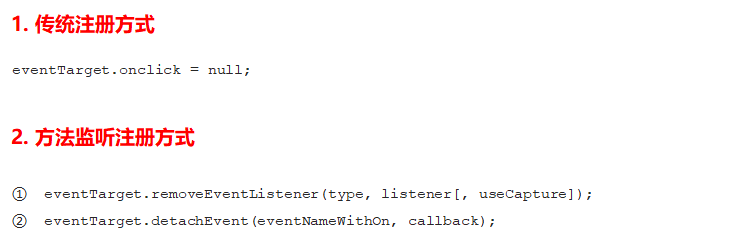
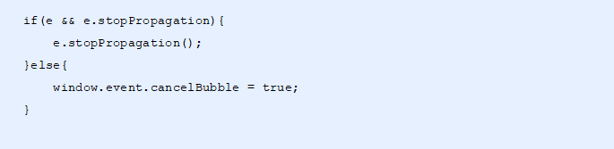
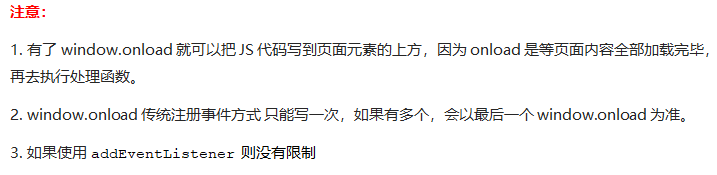
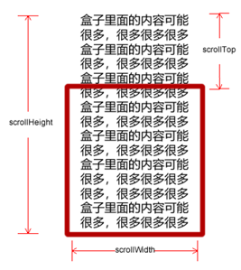

# Web API介绍

API（Application Programming Interface，应用程序编程接口）是一些预先定义的函数，目的是提供应用程序与开发人员基于某软件或硬件得以访问一组例程的能力，而又无需访问源码，无需理解其内部工作机制细节，只需直接调用使用即可。Web API是浏览器提供的一套操作浏览器功能和页面元素的API (BOM和DOM)

# 立即执行函数

立即执行函数最大的作用就是创建了一个独立的作用域，里面的变量都是局部变量

```javascript
var a = 1;
var b = 2;
(function(param1, param2) {})(a, b); // 多个立即执行函数必须用分号隔开 
(function(param1, param2){}(a, b));
// 举例
(function(window, document){}(window, document))
```

# DOM

文档对象模型（Document Object Model，简称DOM），是[W3C](https://baike.baidu.com/item/W3C)组织推荐的处理[可扩展标记语言](https://baike.baidu.com/item/%E5%8F%AF%E6%89%A9%E5%B1%95%E7%BD%AE%E6%A0%87%E8%AF%AD%E8%A8%80)（html或者xhtml）的标准[编程接口](https://baike.baidu.com/item/%E7%BC%96%E7%A8%8B%E6%8E%A5%E5%8F%A3)。

DOM树又称为文档树模型，把文档映射成树形结构，通过节点对象对其处理，处理的结果可以加入到当前的页面。

- 文档：一个页面就是一个文档，DOM中使用`document`表示
- 节点：网页中的所有内容，在文档树中都是节点（标签、属性、文本、注释等），使用`node`表示
- 标签节点：网页中的所有标签，通常称为元素节点，又简称为“元素”，使用`element`表示


## 获取元素

```javascript
document.getElementById(id)
/*作用：根据ID获取元素对象
参数：id值，区分大小写的字符串
返回值：元素对象或null*/

document.getElementsByTagName('标签名') / element.getElementsByTagName('标签名')
/*作用：根据标签名获取元素对象
参数：标签名
返回值：元素对象集合（伪数组，数组元素是元素对象）
注意：1. 因为得到的是一个对象的集合，所以需要遍历 2. 得到元素对象是动态的。当页面增加了标签，这个集合中也就增加了元素*/

document.getElementsByName();

// H5新增获取元素方式
document.getElementsByClassName('类名') // 根据类名返回元素对象集合
document.querySelector('选择器') or element.querySelector('选择器')// 根据指定选择器返回第一个元素对象，选择器需要加符号
document.querySelectorAll('选择器') // 根据指定选择器返回，选择器需要加符号

// 获取特殊元素
document.body // 返回body元素对象
document.documentElement // 返回html元素对象
```

## 操作元素

JavaScript的DOM操作可以改变网页内容、结构和样式，我们可以利用DOM操作元素来改变元素里面的内容、属性等。（注意：这些操作都是通过元素对象的属性实现的）

### 改变元素文本内容+修改元素属性+修改元素样式

```javascript
// 1. 改变元素内容
// 这两个属性是可读写的
element.innerText // 从起始位置到终止位置的内容，但它不会识别html，同时空格和换行也会去掉。
element.innerHTML // 从起始位置到终止位置的全部内容，包括html标签，同时保留空格和换行
var div = document.querySelector('div');
div.innerText = '<strong>今天是：</strong> 2019'; // <span>会以文本形式显示出来，不会被识别
div.innerHTML = '<strong>今天是：</strong> 2019'; // 文字会加粗
var p = document.querySelector('p');
console.log(p.innerText); // 没有空格，没有<span>
console.log(p.innerHTML); // 有空格，有<span>

// 2. 修改元素属性
// 2.1 获取和修改内置属性值（元素本身自带的属性）
element.属性名 // 获取属性的值
element.属性名 = 值 // 修改属性的值
// 利用dom可以操作如下表单元素的属性：type/value/checked/selected/disabled
zxy.onclick = function() {
    img.src = 'images/zxy.jpg';
    img.title = '张学友思密达';
}
ldh.onclick = function() {
    img.src = 'images/ldh.jpg';
    img.title = '刘德华';
}
// 2.2 获取,修改和移除自定义的属性
element.getAttribute('属性');
element.setAttribute('属性');
element.removeAttribute('属性');
<body>
    <div id="demo" index="1" class="nav"></div>
<script>
	var div = document.querySelector('div');
    console.log(div.id); // demo
    console.log(div.index); // undefined
    console.log(div.getAttribute('id')); // demo
    console.log(div.getAttribute('index')); // 1

    div.id = 'test';
    div.className = 'navs';
    console.log(div.id); // test
    console.log(div.className); // navs

    div.setAttribute('index', 2);
    div.setAttribute('class', 'footer');
    console.log(div.getAttribute('index')); // 2
    console.log(div.getAttribute('class')); // footer

	div.removeAttribute('index');
</script>
</body>


// 3. 修改元素样式
// 行内样式操作
element.style 
/*注意：1.JS里面的样式采取驼峰命名法，比如fontSize, backgroundColor 
2. 修改style样式操作，产生的是行内样式，css权重比较高*/
div.onclick = function() {
    this.style.backgroundColor = 'purple';
    this.style.width = '250px';
}


// 类名样式操作
element.className 
/*注意：1. 如果样式修改较多，可以采取操作类名方式修改元素样式 
2. class因为是个保留字，因此使用className来操作元素类名属性
3. className会直接更改元素的类名，会覆盖原先的类名*/
test.onclick = function() {
    // 如果想要保留原先的类名，我们可以用多类名选择器
    // this.className = 'change';
    this.className = 'first change';
}

// 使用classList添加，移除和切换类。注意所有类名不带点
focus.classList.add('current'); // 添加，在后面追加类名不会覆盖以前的类名
focus.classList.remove('current'); // 移除
focus.classList.toggle('current'); // 切换。如果没有就添加，如果有就删除这个类
```

#### 排他思想

如果有同一组元素，我们想要某一个元素实现某种样式， 需要用到循环的排他思想算法：

1. 所有元素全部清除样式

2. 给当前元素设置样式

3. 注意顺序不能颠倒，首先干掉其他人，再设置自己

```js
<button>按钮1</button>
<button>按钮2</button>
<button>按钮3</button>
<button>按钮4</button>
<button>按钮5</button>
<script>
    // 1. 获取所有按钮元素
    var btns = document.getElementsByTagName('button');
    // btns得到的是伪数组。里面的每一个元素btns[i]
    for (var i = 0; i < btns.length; i++) {
        btns[i].onclick = function() {
            // 我们先把所有的按钮背景颜色去掉
            for (var i = 0; i < btns.length; i++) {
                btns[i].style.backgroundColor = '';
            }
            // 然后才让当前的元素背景颜色为pink
            this.style.backgroundColor = 'pink';
        }
    }
</script>
```

### H5自定义属性

自定义属性目的：是为了保存并使用数据。有些数据可以保存到页面中而不用保存到数据库中

自定义属性获取是通过`getAttribute('属性')` 获取

但是有些自定义属性很容易引起歧义，不容易判断是元素的内置属性还是自定义属性。H5给我们新增了自定义属性：


```html
<body>
	<div getTime="20" data-index="2" data-list-name="andy"></div>
	<script>
		var div = document.querySelector('div');
		console.log(div.getTime); // undefined
		console.log(div.getAttribute('getTime')); // 20
		div.setAttribute('data-time', 20);
		console.log(div.getAttribute('data-index')); // 2
		console.log(div.getAttribute('data-list-name')); // andy
		// h5新增的获取自定义属性的方法 它只能获取data-开头的
		// dataset 是一个集合里面存放了所有以data开头的自定义属性
		console.log(div.dataset); // DOMStringMap
		console.log(div.dataset.index); // 2
		console.log(div.dataset['index']); //2  
		// 如果自定义属性里面有多个-链接的单词，我们获取的时候采取驼峰命名法。只能取data
		console.log(div.dataset.listName); // andy
		console.log(div.dataset['listName']); // andy
	</script>
</body>
```

## 节点

### 节点概述

网页中的所有内容都是节点（标签、属性、文本、注释等），在DOM 中，节点使用`node`来表示

HTML DOM 树中的所有节点均可通过JavaScrip 进行访问，所有HTML元素（节点）均可被修改，也可以创建或删除

一般地，节点至少拥有`nodeType`（节点类型）、`nodeName`（节点名称）和`nodeValue`（节点值）这三个基本属性

- 元素节点nodeType为1
- 属性节点nodeType为2
- 文本节点nodeType为3（包含文字、空格、换行等）

我们在实际开发中，节点操作主要操作的是元素节点

### 节点层级


### 节点操作

####  创建元素的三种方式及区别


```javascript
// innerHTML字符串拼接方式（效率低）
<script>
    function fn() {
        var d1 = +new Date();
        var str = '';
        for (var i = 0; i < 1000; i++) {
            document.body.innerHTML += '<div style="width:100px; height:2px; border:1px solid blue;"></div>';
        }
        var d2 = +new Date();
        console.log(d2 - d1);
    }
    fn();
</script>

// createElement方式（效率一般）
<script>
    function fn() {
        var d1 = +new Date();

        for (var i = 0; i < 1000; i++) {
            var div = document.createElement('div');
            div.style.width = '100px';
            div.style.height = '2px';
            div.style.border = '1px solid red';
            document.body.appendChild(div);
        }
        var d2 = +new Date();
        console.log(d2 - d1);
    }
    fn();
</script>

// innerHTML数组方式（效率高）
<script>
    function fn() {
        var d1 = +new Date();
        var array = [];
        for (var i = 0; i < 1000; i++) {
            array.push('<div style="width:100px; height:2px; border:1px solid blue;"></div>');
        }
        document.body.innerHTML = array.join('');
        var d2 = +new Date();
        console.log(d2 - d1);
    }
    fn();
</script>
```

#### DOM操作总结

| 创建           | 增           | 删          | 改                                    | 查                                                           | 属性操作        |
| -------------- | ------------ | ----------- | ------------------------------------- | ------------------------------------------------------------ | --------------- |
| document.write | appendChild  | removeChild | 修改元素属性：src/href/title          | getElementById/getElementsByTagName/getElementsByClassName/getElementsByName | getAttribute    |
| innerHTML      | insertBefore |             | 修改普通元素内容：innerHTML/innerText | querySelector/querySelectorAll(推荐)                         | setAttribute    |
| createElement  |              |             | 修改表单元素：value/type/disabled     | parentNode                                                   | removeAttribute |
|                |              |             | 修改元素样式：style/className         | childNodes/**children**(推荐)                                |                 |
|                |              |             | replaceChild                          | firstChild/lastChild**/firstElementChild**(推荐)/**lastElementChild**(推荐) |                 |
|                |              |             |                                       | previousSibling/nextSibling/**previousElementSibling**(推荐)/**nextElementSibling**(推荐) |                 |
|                |              |             |                                       |                                                              |                 |
|                |              |             |                                       |                                                              |                 |
|                |              |             |                                       |                                                              |                 |
|                |              |             |                                       |                                                              |                 |
|                |              |             |                                       |                                                              |                 |
|                |              |             |                                       |                                                              |                 |
|                |              |             |                                       |                                                              |                 |
|                |              |             |                                       |                                                              |                 |


```html
<body>
	<div class="box">
		<ul type="square">
			<li class="sbox-1">1</li>
			<li class="sbox-2">2</li>
			<li class="sbox-3">3</li>
			<li>4</li>
			<li>5</li>
			<li>6</li>
		</ul>
	</div>

	<script>

		// 节点属性
		var box = document.getElementsByTagName("ul")[0];
		// 节点的名称，是只读的。元素节点的nodeName与标签名相同，属性节点的nodeName是属性的名称，文本节点的nodeName是#text，文档节点的nodeName是#document
		document.write("<p>" + box.nodeName + "</p>"); // UL
		
        // 节点的类型，是只读的。1-元素；2-属性；3-文本；8-注释；9-文档
		document.write("<p>" + box.nodeType + "</p>"); // 1
		
        // 节点的值。元素节点的nodeValue是undefined或null，属性节点的nodeValue是属性的值，文本节点的nodeValue是文本自身
		document.write("<p>" + box.nodeValue + "</p>"); // null
		
        // 获取/修改元素节点的属性值
		console.log(box.getAttribute("type")); // square
		// 如果不存在具有指定名称的属性，该方法将创建一个新属性
		box.setAttribute("type", "circle");
// ----------------------------------------------------------------------------------------
		// 遍历节点树
		// 访问选定元素节点下的所有子节点的列表，返回的值可以看作是一个数组，他具有length属性。该集合为即时更新的集合
        // 包含了所有的子节点，包括元素节点，文本节点等。节点之间的空白符，在firefox、chrome、opera、safari浏览器是文本节点。
        // 如果只想获得里面的元素节点，则需要专门处理，所以不提倡使用childNodes
		console.log(box.childNodes); // NodeList(13){#text(\n\t\t\t), (li+#text)*6}
		
        // parentNode.children是一个只读属性，返回所有的子元素节点。它只返回子元素节点，其余节点不返回（这个是我们重点掌握的）。虽然是一个非标准，但是得到了各个浏览器的支持，因此我们可以放心使用
		console.log(box.children); // HTMLCollection(6)
        
        // firstChild属性返回childNodes数组的第一个子节点。如果选定的节点没有子节点，则该属性返回NULL。与elementNode.childNodes[0]是同样的效果
        console.log(box.firstChild); // #text "\n\t\t\t"
		
        // lastChild属性返回childNodes数组的最后一个子节点。如果选定的节点没有子节点，则该属性返回NULL。与elementNode.childNodes[elementNode.childNodes.length-1]是同样的效果
		console.log(box.lastChild); // #text "\n\t\t"
        
         // 实际开发中，firstChild和lastChild包含其他节点，操作不方便，而firstElementChild和lastElementChild又有兼容性问题，所以我们用parentNode.children[0]和parentNode.children[parentNode.children.length-1]获得第一个和最后一个元素节点
        // parentNode.firstElementChild返回第一个元素子节点，找不到则返回null
        console.log(box.firstElementChild); // li
		
        // parentNode.lastElementChild返回最后一个元素子节点，找不到则返回null
        console.log(box.lastElementChild); // li
		
        // 获取指定节点的最近的一个父节点，父节点只能有一个，如果指定的节点没有父节点则返回null
		console.log(box.parentNode); // class="box"
		
        // 获取当前元素的下一个兄弟节点，找不到则返回null
		console.log(box.nextSibling); // #text "\n\t"
        
        // 获取当前元素的下一个兄弟元素节点，找不到则返回null
        console.log(box.nextElementSibling);
		
        // 获取当前元素的上一个兄弟节点，找不到则返回null
		console.log(box.previousSibling); // #text "\n\t\t"
        
        // 获取当前元素的上一个兄弟元素节点，找不到则返回null
        console.log(box.previousElementSibling); 
        
        // 自己封装一个兼容性的函数解决.nextElementSibling和previousElementSibling的兼容性问题
        function getNextElementSibling(element) {
            var el = element;
            while (el = el.nextSibling) {
                if (el.nodeType === 1) {
                    return el;
                }
            }
            return null;
        }  

// ----------------------------------------------------------------------------------------
		// DOM操作
		appendChild(newnode); // 将一个节点添加到指定父节点的子节点列表末尾。类似于css里面的after伪元素
		insertBefore(newnode, node); // 将一个节点添加到父节点的指定子节点前面。类似于css里面的before伪元素
		nodeObject.removeChild(node); // 从子节点列表中删除某个节点。如删除成功，此方法可返回被删除的节点，如失败，则返回NULL
		node.replaceChild(newnode, oldnew); // 实现子节点(对象)的替换。返回被替换对象的引用。注意：1.当oldnode被替换时，所有与之相关的属性内容都将被移除 2. newnode必须先被建立
		node.cloneNode(); // 返回调用该方法的节点的一个副本。也称为克隆节点/拷贝节点。 1. 如果括号参数为空或者false，则是浅拷贝，即只克隆复制节点本身，不克隆里面的子节点 2. 如果括号参数为true，则是深度拷贝，会复制节点本身以及里面所有的子节点
        document.createElement(tagName); // 创建元素节点。此方法可返回一个Element对象。因为这个元素原先不存在，是根据我们的需求动态生成的，所以我们也称为动态创建元素节点
		document.createTextNode(data); // 创建新的文本节点，返回新创建的Text节点 */
		var newNode = document.createElement("p");
		newNode.className = "text";
		var textNode = document.createTextNode("Welcome to my page");
		newNode.appendChild(textNode);
		document.body.appendChild(newNode);
        var li = document.createElement('li');
        // 阻止链接跳转需要添加`javascript:void(0);`或者`javascript:;`
        li.innerHTML = text.value + "<a href='javascript:;'>删除</a>";

// ----------------------------------------------------------------------------------------
        // 一些没用过的
		insertAdjacentHTML(); //appendChild不支持追加字符串的子元素,insertAdjacentHTML支持追加字符串的元素，这个方法可以代替creadElement+innerHTML
		remove() // 可以直接删除指定的元素
		node.index
		node.click() // 手动调用点击事件，不用手动触发
		node && node.click() // callback，如果node存在再执行后续的点击操作


		window.getSelection ? window.getSelection().removeAllRanges() : document.selection.empty(); // 禁止双击
		input.select() // 让文本框里的文字处于选定状态

	</script>
</body>
```

## 事件

JavaScript使我们有能力创建动态页面，而事件是可以被JavaScript侦测到的行为。

简单理解： **触发--- 响应机制**。

网页中的每个元素都可以产生某些可以触发JavaScript的事件，例如，我们可以在用户点击某按钮时产生一个事件，然后去执行某些操作。

**事件三要素**

- 事件源：触发事件的元素
- 事件类型： 例如`click`点击事件
- 事件处理程序：事件触发后要执行的代码(函数形式)，事件处理函数

**执行事件的步骤**

- 获取事件源
- 注册事件（绑定事件）
- 添加事件处理程序（采取函数赋值形式）

### 注册事件（2种方式）


#### `addEventListener()`事件监听（IE9以后支持）


`eventTarget.addEventListener()`方法将指定的监听器注册到`eventTarget`（目标对象）上，当该对象触发指定的事件时，就会执行事件处理函数


#### `attacheEvent()`事件监听（IE678支持）


`eventTarget.attachEvent()`方法将指定的监听器注册到`eventTarget`（目标对象） 上，当该对象触发指定的事件时，指定的回调函数就会被执行


```javascript
<button>传统注册事件</button>
<button>方法监听注册事件</button>
<button>ie9 attachEvent</button>
<script>
    var btns = document.querySelectorAll('button');
    // 1. 传统方式注册事件，只会alert第二个function
    btns[0].onclick = function() {
        alert('hi');
    }
    btns[0].onclick = function() {
        alert('hao a u');
    }


   // 2. 事件侦听注册事件 addEventListener 
   // (1) 里面的事件类型是字符串。必定加引号，而且不带on
   // (2) 同一个元素，同一个事件可以添加多个侦听器（事件处理程序）
	// 以下两个都会执行
    btns[1].addEventListener('click', function() {
        alert(22);
    })
    btns[1].addEventListener('click', function() {
            alert(33);
    })
    // 3. attachEvent ie9以前的版本支持（我的浏览器不支持）
    btns[2].attachEvent('onclick', function() {
        alert(11);
    })
</script>
```

#### 删除事件（解绑事件）



```javascript
var btns = document.querySelectorAll('button');
btns[0].onclick = function () {
    alert('hao a u');
    btns[0].onclick = null; // 删除事件，但是上一条会执行一次
}
var func1 = () => alert(22);
var func2 = function () {
    alert(33);
    btns[1].removeEventListener('click', func2); // 事件会执行一次
}

btns[1].addEventListener('click', func1)
btns[1].addEventListener('click', func2)
btns[1].removeEventListener('click', func1); // 事件一次都不会执行

btns[2].attachEvent('onclick', func3);
function fn1() {
    alert(33);
    btns[2].detachEvent('onclick', func3);
}
```

### DOM事件流

事件流描述的是从页面中接收事件的顺序，事件发生时会在元素节点之间按照特定的顺序传播，这个传播过程即DOM事件流。比如：我们给页面中的一个`div`注册了单击事件，当你单击了`div`时，也就单击了`body`，单击了`html`，单击了`document`


DOM 事件流会经历3个阶段： 

1. 捕获阶段
2. 当前目标阶段
3. 冒泡阶段


#### 事件冒泡

```javascript
// 4. 冒泡阶段 如果addEventListener第三个参数是false或者省略那么则处于冒泡阶段  son -> father ->body -> html -> document
var son = document.querySelector('.son');
son.addEventListener('click', function () {
    alert('son');
}, false);
var father = document.querySelector('.father');
father.addEventListener('click', function () {
    alert('father');
}, false);
document.addEventListener('click', function () {
    alert('document'); // 点击son元素时，先alert son再alert father，document
})
```

#### 事件捕获

```javascript
// dom事件流 三个阶段
// 1. JS代码中只能执行捕获或者冒泡其中的一个阶段
// 2. onclick和attachEvent（ie）只能得到冒泡阶段
// 3. 捕获阶段。如果addEventListener第三个参数是true，那么则处于捕获阶段  document -> html -> body -> father -> son
var son = document.querySelector('.son');
son.addEventListener('click', function () {
    alert('son');
}, true);
var father = document.querySelector('.father');
father.addEventListener('click', function () {
    alert('father');
}, true); // 先alert father再alert son
```

### 事件对象

事件发生后，跟事件相关的一系列信息数据的集合都放到这个对象里面，这个对象就是事件对象

比如：  

1. 谁绑定了这个事件

2. 鼠标触发事件的话，会得到鼠标的相关信息，如鼠标位置

3. 键盘触发事件的话，会得到键盘的相关信息，如按了哪个键

#### 事件对象的使用

事件触发发生时就会产生事件对象，并且系统会以实参的形式传给事件处理函数。

所以，在事件处理函数中声明1个形参用来接收事件对象。


#### 事件对象的兼容性处理

事件对象本身的获取存在兼容问题：

1. 标准浏览器中是浏览器给方法传递的参数，只需要定义形参`e`就可以获取到
2. 在 IE6~8 中，浏览器不会给方法传递参数，如果需要的话，需要到`window.event`中获取查找


```javascript
<div>123</div>
<script>
    var div = document.querySelector('div');
div.onclick = function(e) {
    // 事件对象
    // // 只要||前面为false, 不管||后面是true还是false，都返回||后面的值
    // 只要||前面为true, 不管||后面是true还是false都返回 ||前面的值
    e = e || window.event; 
    console.log(e);
}
</script>
```

#### 事件对象的属性和方法


#### `e.target`和`this`的区别

-  `this`是事件绑定的元素（绑定这个事件处理函数的元素） 
-  `e.target`是事件触发的元素

>正常情况下`terget`和`this`是一致的，但有一种情况不同，那就是在事件冒泡时（父子元素有相同事件，单击子元素，父元素的事件处理函数也会被触发执行），这时候`this`指向的是父元素，因为它是绑定事件的元素对象，而`target`指向的是子元素，因为他是触发事件的那个具体元素对象

```javascript
<ul>
    <li>abc</li>
    <li>abc</li>
    <li>abc</li>
</ul>
<script>
    var ul = document.querySelector('ul');
	ul.addEventListener('click', function (e) {
    	console.log(this); // ul
    	// e.target 触发了事件的对象 我们点击的是li e.target 指向的就是li
    	console.log(e.target); // li
});
</script>
```

#### 阻止默认行为

```javascript
<a href="http://www.baidu.com">百度</a>
<script>
    // 2. 阻止默认行为 让链接不跳转 
    var a = document.querySelector('a');
	a.addEventListener('click', function(e) {
    e.preventDefault(); //  dom 标准写法
});
	// 3. 传统的注册方式
	a.onclick = function(e) {
    // 普通浏览器 e.preventDefault();  方法
    e.preventDefault();
    // 低版本浏览器 ie678  returnValue  属性
    e.returnValue = false;
    // 我们可以利用return false 也能阻止默认行为 没有兼容性问题
    return false;
}
</script>
```

#### 阻止事件冒泡


```javascript
<div class="father">
    <div class="son">son儿子</div>
</div>
<script>
    var son = document.querySelector('.son');
	// 给son注册单击事件
	son.addEventListener('click', function (e) {
    alert('son');
    e.stopPropagation();
    window.event.cancelBubble = true; // 非标准
	}, false); // 只会alert son

	var father = document.querySelector('.father');
	// 给father注册单击事件
	father.addEventListener('click', function () {
    alert('father');
	}, false);
	// 给document注册单击事件
	document.addEventListener('click', function () {
    alert('document'); // 会alert father和document
})
</script>
```



#### 事件委托

事件冒泡本身的特性，会带来的坏处，也会带来的好处。事件委托也称为事件代理，在 jQuery 里面称为事件委派。说白了就是，不给子元素注册事件，给父元素注册事件，把处理代码在父元素的事件中执行。

**事件委托的原理：**

==给父元素注册事件，利用事件冒泡，当子元素的事件触发，会冒泡到父元素，然后去控制相应的子元素==

**事件委托的作用：**

- 我们只操作了一次 DOM ，提高了程序的性能。

- 动态新创建的子元素，也拥有事件

```javascript
<ul>
    <li>1</li>
	<li>2</li>
	<li>3</li>
	<li>4</li>
	<li>5</li>
	<li>6</li>
</ul>
<script>
    // 事件委托的核心原理：给父节点添加侦听器，利用事件冒泡影响每一个子节点
    var ul = document.querySelector('ul');
	ul.addEventListener('click', function (e) {
    // e.target 这个可以得到我们点击的对象
    	e.target.style.backgroundColor = 'pink';
})
</script>
```

## 常见的事件

### 常见鼠标事件


当鼠标移动到元素上时就会触发`mouseenter`和`mouseover`事件，它们两者的区别是

- `mouseover`鼠标经过自身盒子会触发，经过子盒子还会触发。`mouseenter`只会经过自身盒子触发
- 之所以这样，就是因为`mouseenter`不会冒泡
- 跟`mouseenter`搭配鼠标离开`mouseleave`同样不会冒泡

### 鼠标事件对象


### 常用的键盘事件


### 键盘事件对象


# BOM

BOM（Browser Object Model）即浏览器对象模型，它提供了独立于内容而与浏览器窗口进行交互的对象，其核心对象是window

BOM由一系列相关的对象构成，并且每个对象都提供了很多方法与属性

BOM缺乏标准，JavaScript语法的标准化组织是ECMA，DOM的标准化组织是W3C，BOM最初是Netscape浏览器标准的一部分


**BOM的构成**


## 顶级对象window


## window对象的常见事件

### 加载页面（窗口）事件

<u>方法一</u>：


`window.onload`是窗口 (页面）加载事件，==当文档内容完全加载完成==会触发该事件（包括图像、脚本文件、CSS 文件等），就调用的处理函数



<u>方法二：</u>


`DOMContentLoaded`事件触发时，仅当DOM加载完成，不包括样式表，图片，flash等等。IE9以上才支持。

如果页面的图片很多的话，从用户访问到`onload`触发可能需要较长的时间，交互效果就不能实现，必然影响用户的体验，此时用`DOMContentLoaded`事件比较合适

### 调整窗口大小事件


`window.onresize`是调整窗口大小加载事件,  当触发时就调用的处理函数

注意：

1. 只要窗口大小发生像素变化，就会触发这个事件

2. 我们经常利用这个事件完成响应式布局。`window.innerWidth`当前屏幕的宽度

### 一次性定时器`setTimeout()`


>普通函数是按照代码顺序直接调用
>
>简单理解： 回调，就是回头调用的意思。上一件事干完，再回头再调用这个函数
>
>例如：定时器中的调用函数，事件处理函数，也是回调函数
>
>以前我们讲的`element.onclick = function(){}`或者`element.addEventListener(“click”, fn);`里面的函数也是回调函数。


```javascript
<button>点击停止定时器</button>
<script>
	var btn = document.querySelector('button');
	// 开启定时器
	var timer = setTimeout(function() {
    	console.log('爆炸了');
	}, 5000);
	// 给按钮注册单击事件
	btn.addEventListener('click', function() {
    	// 停止定时器
    	clearTimeout(timer);
})
</script>
```

### 间隔定时器`setInterval()`


```javascript
手机号码： <input type="number"> <button>发送</button>
<script>
    var btn = document.querySelector('button');
	// 全局变量，定义剩下的秒数
	var time = 3; 
	// 注册单击事件
	btn.addEventListener('click', function() {
    	// 禁用按钮
		btn.disabled = true;
        // 开启定时器
        var timer = setInterval(function() {
        // 判断剩余秒数
        	if (time == 0) {
            	// 清除定时器和复原按钮
            	clearInterval(timer);
            	btn.disabled = false;
            	btn.innerHTML = '发送';
        	} else {
            	btn.innerHTML = '还剩下' + time + '秒';
            	time--;
        	}
    	}, 1000);
	});
</script>
```

### `this`指向问题

`this`的指向在函数定义的时候是确定不了的，只有函数执行的时候才能确定`this`到底指向谁，一般情况下`this`的最终指向的是那个调用它的对象

现阶段，我们先了解一下几个`this`指向

1. 全局作用域或者普通函数中`this`指向全局对象`window`（注意定时器里面的`this`指向`window`）

2. 方法调用中谁调用`this`指向谁
3. 构造函数中`this`指向构造函数的实例

```javascript
<button>点击</button>
	<script>
		// this指向问题，一般情况下this的最终指向的是那个调用它的对象
		// 1. 全局作用域或者普通函数中this指向全局对象window（注意定时器里面的this指向window）
		console.log("全局作用域" + this); // Window
		function fn() {
			console.log("普通函数" + this);
		}
		window.fn(); // Window
		window.setTimeout(function () {
			console.log("定时器" + this);
		}, 0);  //<--不随机，总是最后一个显示

		// 2. 方法调用中谁调用this指向谁
		var o = {
			sayHi: function () {
				console.log("o方法调用" + this); // this指向的是o这个对象
			}
		}
		o.sayHi();
		var btn = document.querySelector('button');
		btn.addEventListener('click', function () {
			console.log("事件处理函数" + this); // 事件处理函数中的this指向的是btn这个按钮对象
		})
		// 3. 构造函数中this指向构造函数的实例
		function Fun() {
			console.log("构造函数实例" + this); // this指向的是fun实例对象
		}
		var fun = new Fun();
	</script>
```

## `location`对象


### url


### `location`对象属性


### location对象的常见方法


## `nevigator`对象

`navigator`对象包含有关浏览器的信息，它有很多属性，我们最常用的是`userAgent`，该属性可以返回由客户机发送服务器的`user-agent`头部的值

## `history`对象

window对象给我们提供了一个`history`对象，与浏览器历史记录进行交互。该对象包含用户（在浏览器窗口中）访问过的URL


## 元素偏移量offset

使用offset系列相关属性可以==动态==的得到该元素的位置（偏移）、大小。注意：返回的数值都不带单位


### offset与style区别 

**offset**

- offset 可以得到任意样式表中的样式值
- offset 系列获得的数值是没有单位的
- offsetWidth 包含padding+border+width
- offsetWidth 等属性是只读属性，只能获取不能赋值

**style**

- style 只能得到行内样式表中的样式值
- style.width 获得的是带有单位的字符串
- style.width 获得不包含padding和border 的值
- style.width 是可读写属性，可以获取也可以赋值

我们想要获取元素大小位置，用offset更合适，给元素更改值，则需要用style改变

## 元素可视区client

我们使用client系列的相关属性来获取元素可视区的相关信息。通过client系列的相关属性可以动态的得到该元素的边框大小、元素大小等


## 元素滚动scroll 

我们使用scroll系列的相关属性可以动态的得到该元素的大小、滚动距离等


页面被卷去的头部：如果浏览器的高（或宽）度不足以显示整个页面时，会自动出现滚动条。当滚动条向下滚动时，页面上面被隐藏掉的高度，我们就称为页面被卷去的头部。滚动条在滚动时会触发onscroll事件



页面被卷去的头部：`window.pageYOffset`，元素被卷去的头部：`element.scrollTop`

页面被卷去的左侧：`window.pageXOffset`，元素被卷去的左侧：`element.scrollWidth`

滚动至特定位置`window.scroll(x,y)`

## 其他事件对象

```javascript
onchange // 文本框内容改变
onselect // 文本框内容被选中

onunload // 关闭网页
ondblclick // 双击事件

transitionend // 过渡完毕发生

/* pageshow事件
下面三种情况都会刷新页面都会触发load事件
1.a标签的超链接
2.F5或者刷新按钮（强制刷新）
3.前进后退按钮

但是火狐中有个“往返缓存”，这个缓存中不仅保存着页面数据，还保存了DOM和JavaScript的状态；实际上是将整个页面都保存在了内存里。所以此时后退按钮不能刷新页面。

此时可以使用pageshow事件来触发。这个事件在页面显示时触发，无论页面是否来自缓存。在重新加载页面中，pageshow会在load事件触发后触发；根据事件对象中的persisted来判断是否是缓存中的页面触发的pageshow事件

注意这个事件给window添加。
*/
window.addEventListener('pageshow', function(e){
    if (e.persisted) {
        dosomething
    }
})


// 浏览器对象方法
alert() // 显示带有一段消息和一个确认按钮的警告框
prompt() // 显示可提示用户输入的对话框
confirm() // 显示带有一段消息以及确认按钮和取消按钮的对话框
open() // 打开一个新的浏览器窗口或查找一个已命名的窗口
close() // 关闭浏览器窗口
print() // 打印当前窗口的内容
focus() // 把键盘焦点给予一个窗口
blur() // 把键盘焦点从顶层窗口移开
moveBy() // 可相对窗口的当前坐标把它移动指定的像素
moveTo() // 把窗口的左上角移动到一个指定的坐标
resizeBy() // 按照指定的像素调整窗口的大小
resizeTo() // 把窗口的大小调整到指定的宽度和高度
scrollBy() // 按照指定的像素值来滚动内容
scrollTo() // 把内容滚动到指定的坐标

// history对象（window可省略）
window.history.length // 返回浏览器历史列表中的url数量
window.history.back() // 加载history列表中的前一个url，相当于go(-1)
window.history.forward() // 加载history列表中的下一个url，相当于go(1)
window.history.go() // 加载history列表中的某个具体的页面

// location对象
location.hash
location.host
location.hostname
location.href
location.pathname
location.port
location.protocol
location.search
location.assign() // 加载新的文档
location.reload() // 重新加载当前文档
location.replace() // 用新的文档替换当前文档

// navigator对象
navigator.appCodeName
navigator.appName
navigator.appVersion
navigator.platform
navigator.userAgent

// screen对象（window可省略）
window.screen.availHeight
window.screen.availWidth
window.screen.colorDepth
window.screen.pixelDepth
window.screen.height
window.screen.width
```

# 本地存储

随着互联网的快速发展，基于网页的应用越来越普遍，同时也变的越来越复杂，为了满足各种各样的需求，会经常性在本地存储大量的数据，HTML5规范提出了相关解决方案

## 本地存储特性

1. 数据存储在用户浏览器中

2. 设置、读取方便、甚至页面刷新不丢失数据

3. 容量较大，`sessionStorage`约5M、`localStorage`约20M

4. 只能存储字符串，可以将对象`JSON.stringify()`编码后存储

## window.sessionStorage

1. 生命周期为关闭浏览器窗口

2. 在**同一个窗口**（页面）下数据可以共享

3. 以键值对的形式存储使用

```javascript
sessionStorage.setItem(key, value) // 存储数据
sessionStorage.getItem(key) // 获取数据
sessionStorage.removeItem(key) // 删除数据
sessionStorage.clear() // 清空数据
```

## window.localStorage

1. 声明周期永久生效，除非手动删除 否则关闭页面也会存在

2. 可以多窗口（页面）共享（**同一浏览器**可以共享）

3. 以键值对的形式存储使用

```javascript
localStorage.setItem(key, value)  // 存储数据
localStorage.getItem(key) // 获取数据
localStorage.removeItem(key) // 删除数据
localStorage.clear() // 清空数据
```

# 移动端

## 触屏事件

移动端浏览器兼容性较好，我们不需要考虑以前JS的兼容性问题，可以放心的使用原生JS书写效果，但是移动端也有自己独特的地方。比如触屏事件touch（也称触摸事件），Android和IOS都有。

touch对象代表一个触摸点。触摸点可能是一根手指，也可能是一根触摸笔。触屏事件可响应用户手指（或触控笔）对屏幕或者触控板操作。

常见的触屏事件如下：


### 触摸事件对象（TouchEvent）

`TouchEvent`是一类描述手指在触摸平面（触摸屏、触摸板等）的状态变化的事件。这类事件用于描述一个或多个触点，使开发者可以检测触点的移动，触点的增加和减少，等等

`touchstart`、`touchmove`、`touchend`三个事件都会各自有事件对象


>因为平时我们都是给元素注册触摸事件，所以重点记住`targetTocuhes`

## click延时解决方案

移动端`click`事件会有300ms的延时，原因是移动端屏幕双击会缩放(double tap to zoom) 页面

解决方案：

1. 禁用缩放。 浏览器禁用默认的双击缩放行为并且去掉300ms 的点击延迟

```html
<meta name="viewport" content="user-scalable=no">
```

2. 利用`touch`事件自己封装这个事件解决300ms延迟

原理就是：

1.  当我们手指触摸屏幕，记录当前触摸时间
2.  当我们手指离开屏幕， 用离开的时间减去触摸的时间
3.  如果时间小于150ms，并且没有滑动过屏幕， 那么我们就定义为点击

代码如下:

```javascript
//封装tap，解决click 300ms 延时
function tap (obj, callback) {
        var isMove = false;
        var startTime = 0; // 记录触摸时候的时间变量
        obj.addEventListener('touchstart', function (e) {
            startTime = Date.now(); // 记录触摸时间
        });
        obj.addEventListener('touchmove', function (e) {
            isMove = true;  // 看看是否有滑动，有滑动算拖拽，不算点击
        });
        obj.addEventListener('touchend', function (e) {
            if (!isMove && (Date.now() - startTime) < 150) {  // 如果手指触摸和离开时间小于150ms 算点击
                callback && callback(); // 执行回调函数
            }
            isMove = false;  //  取反 重置
            startTime = 0;
        });
}
//调用  
  tap(div, function(){   // 执行代码  });
```

3. 使用插件。引入fastclick插件解决300ms延迟


## 移动端常用开发插件

### 什么是插件

移动端要求的是快速开发，所以我们经常会借助于一些插件来帮我完成操作，那么什么是插件呢？

JS插件是js文件，它遵循一定规范编写，方便程序展示效果，拥有特定功能且方便调用。如轮播图和瀑布流插件

特点：它一般是为了解决某个问题而专门存在，其功能单一，并且比较小

### 常见插件

**fastclick**插件解决300ms延迟：[GitHub地址](https://github.com/ftlabs/fastclick)

**Swiper**是纯javascript打造的滑动特效插件，面向手机、平板电脑等移动终端：[中文官网地址](https://www.swiper.com.cn/)

网站上常用的“焦点图/幻灯片”“Tab标签切换”“图片滚动”“无缝滚动”等只需要一个**SuperSlide**即可解决！[中文官网地址](http://www.superslide2.com/)

**iScroll** does not just scroll. It can handle any element that needs to be moved with user interaction. It adds scrolling, zooming, panning, infinite scrolling, parallax scrolling, carousels to your projects and manages to do that in just 4kb：[GitHub地址](https://github.com/cubiq/iscroll)

视频插件**zy.media.js**：[GitHub地址](https://github.com/ireaderlab/zyMedia)

### 插件的使用总结

1. 确认插件实现的功能
2. 去官网查看使用说明
3. 下载插件
4. 打开demo实例文件，查看需要引入的相关文件，并且引入
5. 复制demo实例文件中的结构html，样式css以及js代码

## 移动端常用开发框架

插件一般是为了解决某个问题而专门存在，其功能单一，并且比较小

前端常用的框架有Bootstrap、Vue、Angular、React等。既能开发PC端，也能开发移动端

前端常用的移动端插件有swiper、superslide、iscroll等

框架：大而全，一整套解决方案

插件：小而专一，某个功能的解决方案

