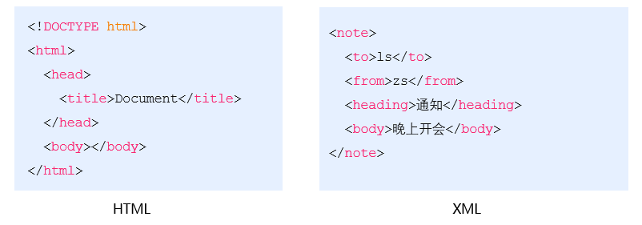
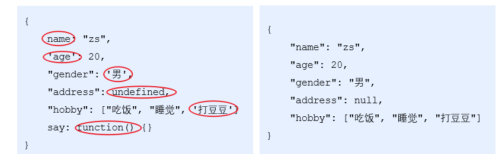
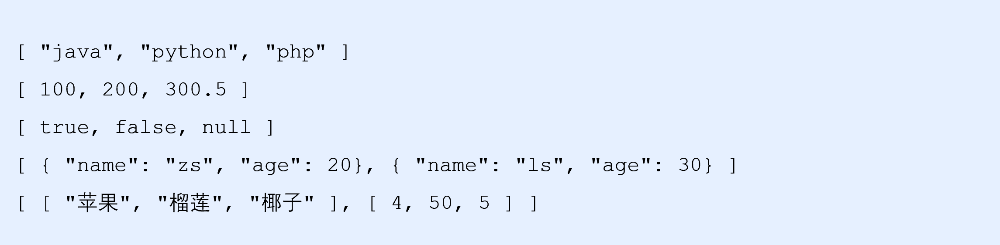
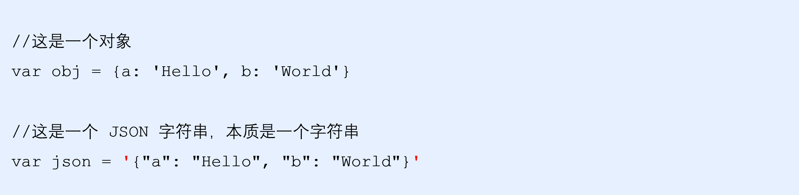
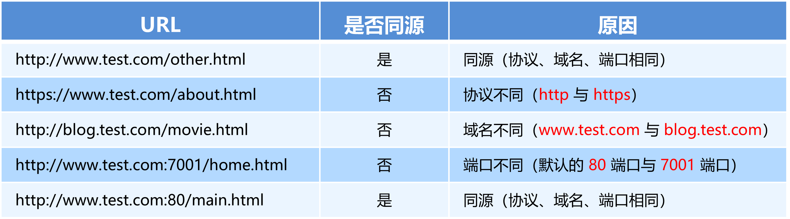
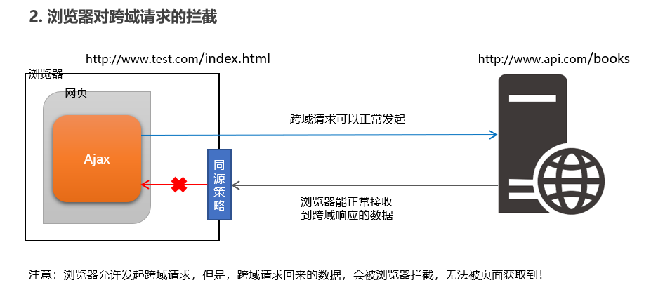
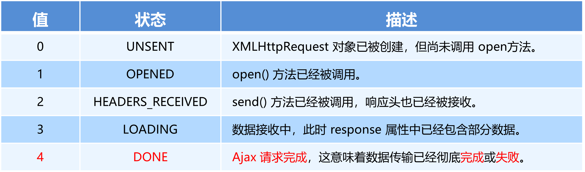
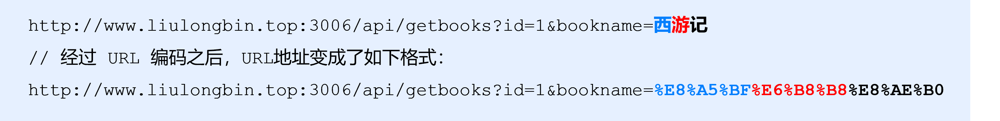
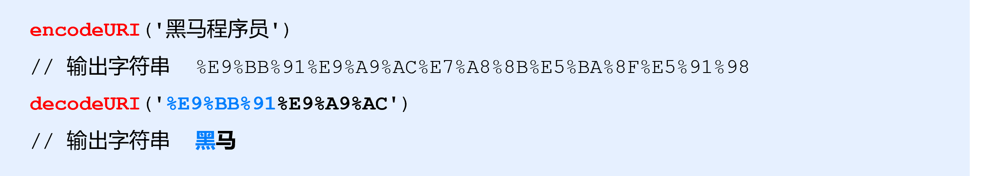
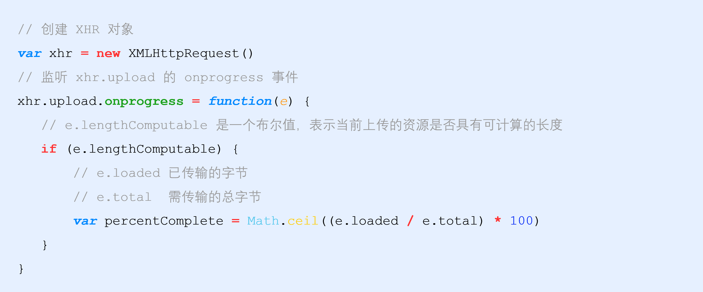

# 数据交换格式

>XHR(XMLHttpRequest) -> AJAX(Asynchronous JavaScript and XML核心是XHR) -> AXIOS(推荐，基于Promise，可以使用async/await语法，可以在浏览器中使用，也可以在node.js环境中使用)
>
>

数据交换格式，就是服务器端与客户端之间进行数据传输与交换的格式

前端领域，经常提及的两种数据交换格式分别是XML和JSON。其中XML用的非常少，所以，我们重点要学习的数据交换格式就是JSON

## XML

XML的英文全称是EXtensible Markup Language，即可扩展标记语言。因此，XML和HTML类似，也是一种标记语言

### XML的缺点

XML格式臃肿，和数据无关的代码多，体积大，传输效率低
在Javascript中解析XML比较麻烦



## JSON

JSON的英文全称是JavaScript Object Notation，即“JavaScript 对象表示法”。简单来讲，JSON就是Javascript对象和数组的**字符串表示法**，它使用文本表示一个JS对象或数组的信息，因此，JSON的本质是字符串

作用：JSON是一种轻量级的文本数据交换格式，在作用上类似于XML，专门用于存储和传输数据，但是JSON比XML更小、更快、更易解析

现状：JSON是在2001年开始被推广和使用的数据格式，到现今为止，JSON已经成为了主流的数据交换格式

### JSON的对象和数组结构

JSON就是用字符串来表示Javascript的对象和数组。所以，JSON中包含**对象**和**数组**两种结构，通过这两种结构的相互嵌套，可以表示各种复杂的数据结构

**对象结构**：对象结构在JSON中表示为`{ }`括起来的内容。数据结构为`{ key: value, key: value, … }`的键值对结构。其中，`key`必须是使用英文的**双引号**包裹的字符串，`value`的数据类型可以是**数字、字符串、布尔值、null、数组、对象**6种类型



**数组结构**：数组结构在JSON中表示为`[ ]`括起来的内容。数据结构为`[ "java", "javascript", 30, true … ]` 。数组中数据的类型可以是**数字、字符串、布尔值、null、数组、对象**6种类型



### JSON语法注意事项

1. 属性名必须使用双引号包裹
2. 字符串类型的值必须使用双引号包裹
3. JSON中不允许使用单引号表示字符串
4. JSON中不能写注释
5. JSON的最外层必须是对象或数组格式
6. 不能使用`undefined`或函数作为JSON的值

JSON的作用：在计算机与网络之间存储和传输数据

JSON的本质：用字符串来表示Javascript对象数据或数组数据

JSON和JS对象的关系

JSON是JS对象的字符串表示法，它使用文本表示一个JS对象的信息，本质是一个字符串。例如：



### JSON和JS对象的互转

要实现从JSON字符串转换为JS对象，使用`JSON.parse()`

要实现从JS对象转换为JSON字符串，使用`JSON.stringify()`

### 序列化和反序列化

把数据对象转换为字符串的过程，叫做序列化，例如：调用`JSON.stringify()`函数的操作，叫做JSON序列化

把字符串转换为数据对象的过程，叫做反序列化，例如：调用`JSON.parse()`函数的操作，叫做JSON反序列化

```javascript
var json = JSON.stringify({a: 'Hello', b: 'World'}) //'{"a": "Hello", "b": "World"}'

// json本质上是字符串，如果在js中操作json数据，可以将json字符串转化为JavaScript对象
var obj = JSON.parse('{"a": "Hello", "b": "World"}') //{a: 'Hello', b: 'World'}

var sJson2 = '[{"name":"张三","age":20},{"name":"李四","age":21}]'
var aArray = JSON.parse(sJson2);
console.log(aArray);
//通过下标获取js对象，然后通过js对象获取name属性
var oPerson = aArray[1];
document.write(oPerson.name);
```

# 同源和跨域

如果两个页面的协议，域名和端口都相同，则两个页面具有相同的源。例如，下表给出了相对于http://www.test.com/index.html页面的同源检测（不指定时默认端口号是80）：



## 同源策略

同源策略（Same origin policy）是浏览器提供的一个安全功能。同源策略限制了从同一个源加载的文档或脚本如何与来自另一个源的资源进行交互。这是一个用于隔离潜在恶意文件的重要安全机制。通俗的理解：浏览器规定，A网站的JavaScript不允许和非同源的网站C之间，进行资源的交互，例如：

1. 无法读取非同源网页的Cookie、LocalStorage和IndexedDB
2. 无法接触非同源网页的DOM
3. 无法向非同源地址发送Ajax请求

## 跨域

同源指的是两个URL的协议、域名、端口一致，反之，则是跨域。出现跨域的根本原因：浏览器的同源策略不允许非同源的URL之间进行资源的交互



## 跨域解决方案

现如今，实现跨域数据请求，最主要的两种解决方案，分别是JSONP和CORS

JSONP：出现的早，兼容性好（兼容低版本IE）。是前端程序员为了解决跨域问题，被迫想出来的一种临时解决方案。**缺点是只支持GET请求，不支持 POST、PUT、DELETE 等请求**

CORS：出现的较晚，它是W3C标准，属于跨域Ajax请求的根本解决方案。支持GET和POST请求。缺点是不兼容某些低版本的浏览器（详见node笔记）

# JSONP

JSONP (JSON with Padding) 是JSON的一种“使用模式”，可用于解决主流浏览器的跨域数据访问的问题。由于浏览器同源策略的限制，网页中无法通过Ajax请求非同源的接口数据。但是`<script>`标签不受浏览器同源策略的影响，可以通过`src`属性，请求非同源的js脚本

因此，JSONP的实现原理，就是通过`<script>`标签的`src`属性，请求跨域的数据接口，并通过函数调用的形式，接收跨域接口响应回来的数据

注意：JSONP和Ajax之间没有任何关系，不能把JSONP请求数据的方式叫做Ajax，因为JSONP没有用到XMLHttpRequest这个对象

## 简单的JSONP

```html
<!-- index.html -->
<body>
    <script>
        // 这里定义函数
        function success(data) {
            console.log(data);

        }
    </script>
    <!-- 这里引入函数的调用，用callback查询字符串的方式指定调用的函数是success，服务器返回的response是jsonpData.js里success的内容 -->
    <script src="js/jsonpData.js?callback=success&name=ls&age=30"></script>
</body>

<!-- jsonpData.js，在这个文件中调用success函数 -->
success([
  { name: "zs", age: 10 },
  { name: "ls", age: 30 },
  { name: "we", age: 50 },
]);
```

## jQuery中的JSONP

jQuery中的JSONP，也是通过`<script>`标签的`src`属性实现跨域数据访问的，只不过，jQuery采用的是动态创建和移除`<script> `标签的方式，来发起JSONP数据请求。

在发起JSONP请求的时候，动态向`<header>`中append一个`<script>`标签；在JSONP请求成功以后，动态从`<header>`中移除刚才append进去的`<script>`标签

**！目前用不了**

```html
<script>
    $(function () {
        $("#btn").on("click", function () {
            $.ajax({
                url: 'js/jsonpData.js?name=ls&age=30',
                // 表示我们要发起jsonp的数据请求
                dataType: 'jsonp',
                // 默认情况下，使用jQuery发起JSONP请求，会自动携带一个callback=jQueryxxx的参数，jQueryxxx是随机生成的一个回调函数名称
                // 如果想要自定义JSONP的参数以及回调函数名称，可以通过jsonp和jsonpCallback两个参数来指定
                jsonp: 'callback', // 发送到服务端的参数名称，默认值为callback
                jsonpCallback: 'success', // 自定义的回调函数名称，默认值为jQueryxxx格式
                success: function (res) {
                    console.log(res);
                }
            })
        })
    })
</script>
```

**Update：已解决**，问题是出在了服务器端。必须在服务器端进行配置解决跨域问题，这里补充一下（建议在node笔记中阅读CORS的部分），代码在nodeProjects/express目录下

如果项目中已经配置了CORS跨域资源共享，为了防止冲突，必须在配置CORS中间件之前声明JSONP的接口。否则JSONP接口会被处理成开启了CORS的接口

在node中实现JSONP接口的步骤

1. 获取客户端发送过来的回调函数的名字
2. 得到要通过JSONP形式发送给客户端的数据
3. 根据前两步得到的数据，拼接出一个函数调用的字符串
4. 把上一步拼接得到的字符串，响应给客户端的`<script>`标签进行解析执行

```javascript
// 服务器端 node main.js
app.get("/api/jsonp", (req, res) => {
  // 1. 获取客户端发送过来的回调函数的名字
  const funcName = req.query.callback;
  // 2. 得到要通过JSONP形式发送给客户端的数据
  const data = { name: "James", age: 100, id: 11 };
  // 3. 根据前两步得到的数据，拼接出一个函数调用的字符串
  const scriptStr = `${funcName}(${JSON.stringify(data)})`;
  // 4. 把上一步拼接得到的字符串，响应给客户端的<script>标签进行解析执行
  res.send(scriptStr);
});

// 客户端 ajax.html
$("#btnJSONP").on("click", function () {
    $.ajax({
        url: 'http://127.0.0.1/api/jsonp',
        type: "GET",
        dataType: "jsonp",
        success: function (res) {
            console.log(res);
        },
    });
})
```

# XHR

XMLHttpRequest（简称xhr）是浏览器提供的Javascript对象，通过它，可以请求服务器上的数据资源。之前所学的jQuery中的Ajax函数，就是基于xhr对象封装出来的

## 使用xhr发起GET请求

**步骤：**

1. 创建`xhr`对象：`var xhr = new XMLHttpRequest()`
2. 调用`xhr.open()`函数，使用xhr对象发起带参数的GET请求时，只需在调用`xhr.open`期间，为URL地址指定参数即可，这种在URL地址后面拼接的参数，叫做查询字符串：`xhr.open('GET', 'http://www.liulongbin.top:3006/api/getbooks?id=1')`
3. 调用`xhr.send()`函数：`xhr.send()`
4. 监听`xhr.onreadystatechange`事件：

```javascript
var xhr = new XMLHttpRequest()
xhr.open('GET', 'http://www.liulongbin.top:3006/api/getbooks?id=1')
xhr.send()
xhr.onreadystatechange = function () {
    if (xhr.readyState === 4 && xhr.status === 200) {
        console.log(xhr.responseText)
    }
}
```

### readyState

XMLHttpRequest对象的`readyState`属性，用来表示当前Ajax请求所处的状态。每个Ajax请求必然处于以下状态中的一个



### 查询字符串

定义：查询字符串（URL参数）是指在URL的末尾加上用于向服务器发送信息的字符串（变量）

格式：将英文的`?`放在URL的末尾，然后再加上`参数＝值`，想加上多个参数的话，使用`&`符号进行分隔。以这个形式，可以将想要发送给服务器的数据添加到URL中

例子：`http://www.liulongbin.top:3006/api/getbooks?id=1&bookname=西游记`

<u>GET请求携带参数的本质</u>：无论使用`$.ajax()`，还是使用`$.get()`，又或者直接使用xhr对象发起GET请求，当需要携带参数的时候，本质上，都是直接将参数以查询字符串的形式，追加到URL地址的后面，发送到服务器的

```javascript
$.get('url', {name: 'zs', age: 20}, function() {})
// 等价于
$.get('url?name=zs&age=20', function() {})

$.ajax({ method: 'GET', url: 'url', data: {name: 'zs', age: 20}, success: function() {} })
// 等价于
$.ajax({ method: 'GET', url: 'url?name=zs&age=20', success: function() {} })
```

### URL编码与解码

URL地址中，只允许出现英文相关的字母、标点符号、数字，因此，在URL地址中不允许出现中文字符。如果URL中需要包含中文这样的字符，则必须对中文字符进行编码（转义）

URL编码的原则：使用安全的字符（没有特殊用途或者特殊意义的可打印字符）去表示那些不安全的字符

URL编码原则的通俗理解：使用英文字符去表示非英文字符

在中文字符中，每一个中文字符对应三组百分号



由于浏览器会自动对 URL 地址进行编码操作，因此，大多数情况下，程序员不需要关心 URL 地址的编码与解码操作。更多关于URL编码的知识，请参考如下[博客](https://blog.csdn.net/Lxd_0111/article/details/78028889)

浏览器提供了 URL 编码与解码的 API，分别是：

`encodeURI()`：编码的函数

`decodeURI()`：解码的函数



## 使用xhr发起POST请求

**步骤：**

1. 创建`xhr`对象：`var xhr = new XMLHttpRequest()`
2. 调用`xhr.open()`函数：`xhr.open('POST', 'http://www.liulongbin.top:3006/api/addbook')`
3. **设置`Content-Type`属性（固定写法，必须放在open和send之间）**：`xhr.setRequestHeader('Content-Type', 'application/x-www-form-urlencoded')`
4. 调用`xhr.send()`函数，**同时将数据以查询字符串的形式，提交给服务器，没有问号**：`xhr.send('bookname=水浒传&author=施耐庵&publisher=天津图书出版社')`
5. 监听`xhr.onreadystatechange`事件：

```javascript
// 1. 创建 xhr 对象
var xhr = new XMLHttpRequest()
// 2. 调用 open()
xhr.open('POST', 'http://www.liulongbin.top:3006/api/addbook')
// 3. 设置 Content-Type 属性（固定写法）
xhr.setRequestHeader('Content-Type', 'application/x-www-form-urlencoded')
// 4. 调用 send()，同时将数据以查询字符串的形式，提交给服务器
xhr.send('bookname=水浒传&author=施耐庵&publisher=天津图书出版社')
// 5. 监听 onreadystatechange 事件
xhr.onreadystatechange = function() {
    if (xhr.readyState === 4 && xhr.status === 200) {
        console.log(xhr.responseText)
    }
}
```

## XHR Level2的新功能

1. 可以设置HTTP请求的时限
2. 可以使用FormData对象管理表单数据
3. 可以上传文件
4. 可以获得数据传输的进度信息

### 设置HTTP请求时限

有时，Ajax操作很耗时，而且无法预知要花多少时间。如果网速很慢，用户可能要等很久。新版本的 XMLHttpRequest对象增加了`timeout`属性，可以设置HTTP请求的时限：` xhr.timeout = 3000`

上面的语句将最长等待时间设为3000毫秒。过了这个时限就自动停止HTTP请求。与之配套的还有一个`timeout`事件，用来指定回调函数：`xhr.ontimeout = function(event){alert('请求超时！')}`

### FormData对象管理表单数据

Ajax操作往往用来提交表单数据。为了方便表单处理，HTML5新增了一个`FormData`对象，可以模拟表单操作。`FormData`对象也可以用来获取网页表单的值

```javascript
<body>
<form id="form1">
    <input type="text" name="uname" autocomplete="off" />
    <input type="password" name="upwd" />
    <button type="submit">提交</button>
</form>
    <script>
        /*
        // 一：手动append表单数据
        // 1) 新建FormData对象
        var fd = new FormData()
        // 2) 调用append函数，向fd中追加数据
        fd.append('uname', 'zs')
        fd.append('upwd', '123456')
        // 3) 创建xhr对象，open，send，onreadystatechange...
        */

        // 二：根据form表单创建FormData对象，会自动将表单数据填充到FormData对象中
        // 通过DOM操作获取到form表单元素
        var form = document.querySelector('#form1')
        form.addEventListener('submit', function (e) {
            // 阻止表单的默认提交行为
            e.preventDefault()
            // 创建FormData快速获取到form表单中的数据
            var fd = new FormData(form)
            var xhr = new XMLHttpRequest()
            // 设置超时时间
            xhr.timeout = 30
            // 设置超时以后的处理函数
            xhr.ontimeout = function () {
                alert('请求超时了！')
            }
            xhr.open('POST', 'http://www.liulongbin.top:3006/api/formdata')
            xhr.send(fd)
            xhr.onreadystatechange = function () {
                if (xhr.readyState === 4 && xhr.status === 200) {
                    console.log(JSON.parse(xhr.responseText))
                }
            }
        })
    </script>
</body>
```

### 上传文件

实现步骤：

1. 定义UI结构
2. 验证是否选择了文件
3. 向`FormData`中追加文件
4. 使用xhr/jQuery发起上传文件的请求
5. 监听`onreadystatechange`事件/监听`ajaxStart/ajaxStop`事件

#### 显示文件上传的进度

新版本的XMLHttpRequest对象中，可以通过监听`xhr.upload.onprogress`事件，来获取到文件的上传进度。语法格式如下



#### 监听上传完成的事件

`xhr.upload.onload = function() {}`

```html
<body>
    <!-- 1. 文件选择框 -->
    <input type="file" id="file1" />
    <!-- 2. 上传文件的按钮 -->
    <button id="btnUpload">上传文件</button>
    <!-- bootstrap 中的进度条 -->
    <div class="progress" style="width: 500px; margin: 15px 10px;">
        <div class="progress-bar progress-bar-striped active" style="width: 0%" id="percent">
            0%
        </div>
    </div>

    <br />
    <!-- 3. img 标签，来显示上传成功以后的图片 -->
    

    <script>
        // 1. 获取到文件上传按钮
        var btnUpload = document.querySelector('#btnUpload')
        // 2. 为按钮添加click事件监听
        btnUpload.addEventListener('click', function () {
            // 3. 获取到用户选择的文件列表
            var files = document.querySelector('#file1').files
            if (files.length <= 0) {
                return alert('请选择要上传的文件！')
            }
            // 向FormData中追加文件
            var fd = new FormData()
            fd.append('avatar', files[0])

            var xhr = new XMLHttpRequest()
            // 监听文件上传的进度
            xhr.upload.onprogress = function (e) {
                // e.lengthComputable 是一个布尔值，表示当前上传的资源是否具有可计算的长度
                if (e.lengthComputable) {
                    // e.loaded 已传输的字节
                    // e.total  需传输的总字节
                    var procentComplete = Math.ceil((e.loaded / e.total) * 100)
                    console.log(procentComplete)
                    // 动态设置进度条
                    $('#percent').attr('style', 'width: ' + procentComplete + '%;').html(procentComplete + '%')
                }
            }
            // 监听上传完成的事件
            xhr.upload.onload = function () {
                $('#percent').removeClass().addClass('progress-bar progress-bar-success')
            }

            xhr.open('POST', 'http://www.liulongbin.top:3006/api/upload/avatar')
            xhr.send(fd)
            xhr.onreadystatechange = function () {
                if (xhr.readyState === 4 && xhr.status === 200) {
                    var data = JSON.parse(xhr.responseText)
                    if (data.status === 200) {
                        document.querySelector('#img').src = 'http://www.liulongbin.top:3006' + data.url
                    } else {
                        console.log('图片上传失败！' + data.message)
                    }
                }
            }
        })
    </script>
</body>
```

# AJAX(jQuery)

ajax是Asynchronous JavaScript and XML的简写，ajax是一个前后台配合的技术，它可以让javascript发送**异步的http请求（同时发送多个请求，不用等待）**，与后台通信进行数据的获取，ajax最大的优点是**实现局部刷新**，ajax可以发送http请求，当获取到后台数据的时候更新页面显示数据实现局部刷新，在这里大家只需要记住，当前端页面想和后台服务器进行数据交互就可以使用ajax了。

这里提示一下大家，**==在html页面使用ajax需要在web服务器环境下运行==, 一般向自己的web服务器发送ajax请求。**

## AJAX的使用(jQuery)

浏览器中提供的XMLHttpRequest用法比较复杂，所以jQuery对XMLHttpRequest进行了封装，提供了一系列Ajax相关的函数，极大地降低了Ajax的使用难度。jQuery 中发起 Ajax 请求最常用的三个方法如下：

1. `$.get(url, [data], [callback], [type])`
   - get请求通常用于获取服务端资源（向服务器要资源）例如：根据URL地址，从服务器获取HTML文件、css文件、js文件、图片文件、数据资源等
   - `url`：待载入页面的URL地址
   - `data`：待发送 Key/value 参数
   - `callback`：载入成功时回调函数
   - `type`：返回内容格式，xml, html, script, json, text, _default
2. `$.post(url,[data],[callback],[type])`
   - post请求通常用于向服务器提交数据（往服务器发送资源）例如：登录时向服务器提交的登录信息、注册时向服务器提交的注册信息、添加用户时向服务器提交的用户信息等各种数据提交操作
   - `url`：发送请求地址。
   - `data`：待发送 Key/value 参数
   - `callback`：发送成功时回调函数
   - `type`：返回内容格式，xml, html, script, json, text, _default
3. `$.ajax({url: url, type: 'POST'/'GET', data: {}, success: function(){}, ...}})`
   - jQuery底层AJAX实现。简单易用的高层实现见`$.get`, `$.post`等。`$.ajax()`返回其创建的`XMLHttpRequest`对象。大多数情况下你无需直接操作该函数，除非你需要操作不常用的选项，以获得更多的灵活性。注意，所有的选项都可以通过`$.ajaxSetup()函数`来全局设置
   - `url`：一个用来包含发送请求的URL字符串
   - `type`：请求的方式，例如`GET`或`POST`。 默认为`GET`。注意：其它HTTP请求方法，如`PUT`和`DELETE`也可以使用，但仅部分浏览器支持
   - `data: { }`：这次请求要携带的数据
   - `success: function(data, textStatus, jqXHR)`：请求成功之后的回调函数
   - `async: boolean(默认true)`：默认设置下，所有请求均为异步请求。如果需要发送同步请求，请将此选项设置为 false。注意，同步请求将锁住浏览器，用户其它操作必须等待请求完成才可以执行
   - `dataType`：预期服务器返回的数据类型。如果不指定，jQuery将自动根据HTTP包MIME信息来智能判断，比如XMLMIME类型就被识别为XML
   - `error: function (XMLHttpRequest, textStatus, errorThrown)`：(默认: 自动判断 (xml 或 html)) 请求失败时调用此函数。有以下三个参数：`XMLHttpRequest`对象、错误信息、（可选）捕获的异常对象。如果发生了错误，错误信息（第二个参数）除了得到`null`之外，还可能是`timeout`, `error`, `notmodified`和`parsererror`
   - `contents`
   - `contentType`
   - `context`
   - ...

>MIME（Multipurpose Internet Mail Extensions）是一种互联网标准，它被设计出来为了解决不同的电子邮件系统之间如何安全可靠地发送和接收不同类型的数据的问题。
>
>在HTTP中，MIME类型被用于描述文档的性质和格式。这些类型影响浏览器如何处理接收到的内容，因此确保使用正确的MIME类型是非常重要的。
>
>一个MIME类型是一个标准化的方式来表示文档的性质和格式。MIME类型总是由两部分组成，这两部分由一个斜杠分隔，例如 "text/plain"，"image/png"，"application/json" 等。
>
>1. 第一部分称为 "类型" (type)，它告诉浏览器文档属于哪个大类，如 "text"，"image"，"application" 等。
>2. 第二部分称为 "子类型" (subtype)，它告诉浏览器具体的格式，如 "plain"，"png"，"json" 等。
>
>有时候，MIME类型可能还包含一个可选的 "charset" 参数来指示文档的字符集，例如 "text/html; charset=UTF-8"。
>
>在HTTP响应中，MIME类型被放在 "Content-Type" 标头字段中，告诉客户端实际返回的内容的数据类型。
>
>

```html
<!-- 待补充，该案例中CORS的问题至今未解决，猜测也许可以通过服务器端的api接口解决，如果是这样，那么我们先假设这个的api接口是没问题的 -->
<body>
    <button id="btnPOST">发起POST请求</button>
    <button id="btnGETINFO">发起带参数的GET请求</button>
    <script>
        $(function () {
            // 使用get方式发送请求，name=李四会以?name=李四&..&..的形式出现在地址栏后
            $('#btnGETINFO').on('click', function () {
                $.get('http://www.liulongbin.top:3006/api/getbooks', { id: 1 }, function (res) {
                    console.log(res)
                })
            })

            // 使用post方式发送请求，name=李四会出现在请求体内
            // 这里没有指定http协议头和ip地址和端口号，那么默认ajax请求会自动帮我们加上
            // 如果请求的是自己的web服务器可以不要加上http协议地址，请求别人服务器的数据需要加上http协议地址
            $('#btnPOST').on('click', function () {
                $.post('http://www.liulongbin.top:3006/api/addbook', { bookname: '水浒传', author: '施耐庵', publisher: '天津图书出版社' }, function (res) {
                    console.log(res)
                })
            })

            $('#btnPOST').on('click', function () {
                $.ajax({
                    // 请求的资源地址，不指定ip地址和端口号表示请求的是自己的服务器资源数据
                    url: 'http://www.liulongbin.top:3006/api/addbook',
                    // 请求方式，GET或POST，可以是小写
                    type: "GET",
                    // 指定对服务器数据的解析格式，常用的是'json'格式
                    dataType: "JSON",
                    // data：表示发送给web服务器的数据, 没有数据不需要设置
                    // 设置请求成功后的执行的函数
                    success: function (response) {
                        console.log(response);
                        // 数据请求回来以后可以绑定给html中的某个标签控件，实现局部刷新
                    },
                    // 设置请求失败后的执行的函数
                    error: function () {
                        alert("请求失败,请稍后再试!");
                    },
                    // async 设置是否异步，默认值是'true'，表示异步，一般不用写
                    async: true
                });
            })
        });
    </script>
</body>
```

## 使用Ajax提交表单数据到服务器

**如果使用表单提交数据，则会导致以下两个问题：1) 页面会发生跳转 2) 页面之前的状态和数据会丢失。因此我们使用表单只负责采集数据，Ajax负责将数据提交到服务器**

- 监听表单提交事件
  - 在jQuery中，可以使用如下两种方式，监听到表单的提交事件

- 阻止表单默认提交行为
  - 当监听到表单的提交事件以后，可以调用事件对象的`event.preventDefault()`函数，来阻止表单的提交和页面的跳转

- 快速获取表单中的数据

  - 为了简化表单中数据的获取操作，jQuery提供了`serialize()`函数：`$(selector).serialize()`

  - `serialize()`函数的好处：可以一次性获取到表单中的所有的数据

  - 注意：在使用`serialize()`函数快速获取表单数据时，必须为每个表单元素添加`name`属性，且`name`属性唯一的

 ```html
 <body>
     <form action="/login" id="form1">
         <input type="text" name="uname" />
         <input type="password" name="password" />
         <button type="submit">提交</button>
     </form>
     <button id="clear">清空内容</button>
     <script>
         $(function () {
             /*
             // 第一种方法
             $('#form1').submit(function(){
                 alert('监听到了表单提交事件');
                 e.preventDefault();
             })*/
             // 第二种方法
             $('#form1').on('submit', function (e) {
                 alert('监听到了表单提交事件');
                 // 阻止表单的默认提交行为
                 e.preventDefault();
                 // 获取所有的表单数据，必须为每个元素提供name属性，且name属性唯一的
                 var data = $(this).serialize();
                 console.log(data);
 
             });
             $('#clear').on('click', function (e) {
                 // 清空表单内容，需要将jQuery元素转换为DOM元素
                 $('#form1')[0].reset(); // reset是原生js方法
 
             });
 
         });
     </script>
 </body>
 ```

## 上传文件（AJAX）

注意：`$(document).ajaxStart()`函数会监听当前文档内所有的Ajax请求

```html
<body>
    <input type="file" id="file1" />
    <button id="btnUpload">上传文件</button>
    <br />
    <!-- loading的gif图片，通过ajaxStart和ajaxStop回调函数控制 -->
    

    <script>
        $(function () {
            // Ajax请求开始时，执行ajaxStart函数。可以在ajaxStart的callback中显示loading效果
            // 注意： ajaxStart()函数会监听当前文档内所有的Ajax请求
            // 自jQuery版本1.8起，该方法只能被附加到$(document)
            $(document).ajaxStart(function () {
                $('#loading').show()
            })
            // Ajax请求结束时，执行ajaxStop函数。可以在ajaxStop的callback中隐藏loading效果
            // 自jQuery版本1.8起，该方法只能被附加到$(document)
            $(document).ajaxStop(function () {
                $('#loading').hide()
            })

            // 验证是否选择了文件
            $('#btnUpload').on('click', function () {
                // 将jQuery对象转化为DOM对象，并获取选中的文件列表
                var files = $('#file1')[0].files
                if (files.length <= 0) {
                    return alert('请选择文件后再上传！')
                }

                // 向FormData中追加文件
                var fd = new FormData()
                fd.append('avatar', files[0])

                // 发起jQuery的Ajax请求
                $.ajax({
                    method: 'POST',
                    url: 'http://www.liulongbin.top:3006/api/upload/avatar',
                    data: fd,
                    // 不对FormData中的数据进行url编码，而是将FormData数据原样发送到服务器。固定写法
                    processData: false,
                    // 不修改Content-Type属性，使用FormData默认的Content-Type值。固定写法
                    contentType: false,
                    success: function (res) {
                        console.log(res)
                    }
                })
            })
        })
    </script>
</body>
```

# axios发起网络数据请求

Axios是专注于网络数据请求的库。相比于原生的XMLHttpRequest对象，axios简单易用。相比于jQuery，axios更加轻量化，只专注于网络数据请求

```html
<head>
	<script src="js/axios.min.js"></script>
</head>
<body>
    <button id="btn1">发起GET请求</button>
    <button id="btn2">发起POST请求</button>
    <button id="btn3">直接使用axios发起GET请求</button>
    <button id="btn4">直接使用axios发起POST请求</button>
    <script>
        // 发起get请求
        document.querySelector('#btn1').addEventListener('click', function () {
            // 请求的URL地址
            var url = 'http://www.liulongbin.top:3006/api/get'
            // 请求的参数
            var paramsObj = { name: 'zs', age: 20 }
            //  axios.get('url', { params: { /*参数*/ } }).then(callback)
            axios.get(url, { params: paramsObj }).then(function (res) {
                // res是axios封装好的，res.data是服务器响应的数据
                console.log(res.data)
            })
        })

        // 发起post请求
        document.querySelector('#btn2').addEventListener('click', function () {
            // 请求的URL地址
            var url = 'http://www.liulongbin.top:3006/api/post'
            // 要提交到服务器的数据
            var dataObj = { address: '北京', location: '顺义区' }
            // axios.post('url', { /*参数*/ }).then(callback)
            axios.post(url, dataObj).then(function (res) {
                console.log(res.data)
            })
        })

        // axios也提供了类似于jQuery中$.ajax()的函数，语法如下：
        /*
        axios({
            method: '请求类型',
            url: '请求的URL地址',
            data: { POST数据 },
            params: { GET参数 }
        }) .then(callback)
        */
        document.querySelector('#btn3').addEventListener('click', function () {
            var url = 'http://www.liulongbin.top:3006/api/get'
            var paramsData = { name: '钢铁侠', age: 35 }
            axios({
                method: 'GET',
                url: url,
                params: paramsData
            }).then(function (res) {
                console.log(res.data)
            })
        })
        document.querySelector('#btn4').addEventListener('click', function () {
            axios({
                method: 'POST',
                url: 'http://www.liulongbin.top:3006/api/post',
                data: {
                    name: '娃哈哈',
                    age: 18,
                    gender: '女'
                }
            }).then(function (res) {
                console.log(res.data)
            })
        })
    </script>
</body>
```

# Fetch API

待补充

