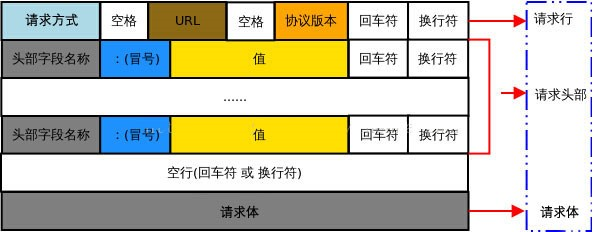
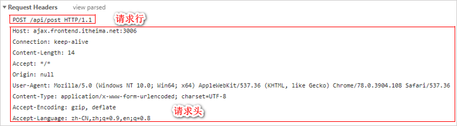
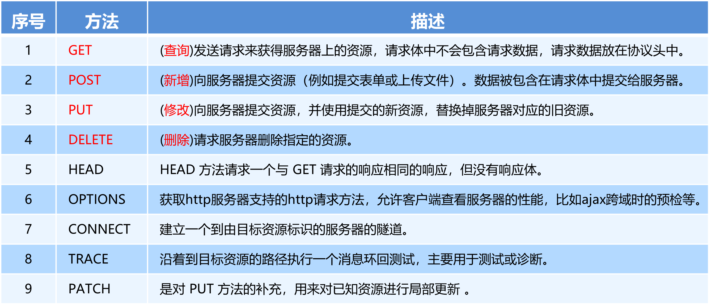
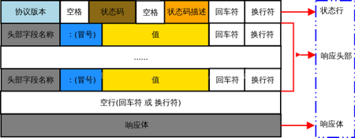
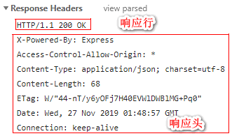
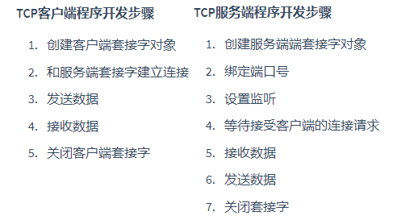
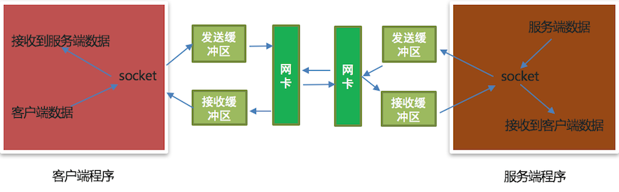

# ip地址

- IPv4 是由点分十进制组成
- IPv6 是由冒号十六进制组成
- 查看 IP 地址
  - Linux和mac OS使用`ifconfig`这个命令
  - Windows使用`ipconfig`这个命令
  - `127.0.0.1`表示本机地址，提示：如果和自己的电脑通信就可以使用该地址。该地址对应的域名是`localhost`
- 检查网络是否正常使用 ping 命令
  - `ping www.baidu.com` 检查是否能上公网
  - `ping 设备的ip地址` 检查是否在同一个局域网内
  - `ping 127.0.0.1` 检查本地网卡是否正常

# 端口号

知名端口号是指众所周知的端口号，范围从0到1023。

- 这些端口号一般固定分配给一些服务，比如21端口分配给FTP(文件传输协议)服务，25端口分配给SMTP（简单邮件传输协议）服务，80端口分配给HTTP服务。

一般程序员开发应用程序使用端口号称为动态端口号, 范围是从1024到65535。

- 如果程序员开发的程序没有设置端口号，操作系统会在动态端口号这个范围内随机生成一个给开发的应用程序使用。
- 当运行一个程序默认会有一个端口号，当这个程序退出时，所占用的这个端口号就会被释放。

# URL

URL的英文全拼是(Uniform Resoure Locator),表达的意思是统一资源定位符，通俗理解就是网络资源地址，也就是我们常说的网址。

## URL的组成部分

https://news.163.com/hello.html?page=1&count=10

- 协议部分: `https://`（加密，端口号443）、`http://`（端口号80）、`ftp://`
- 域名部分: `news.163.com`
  - 域名: 域名就是IP地址的别名，它是用点进行分割使用英文字母和数字组成的名字，使用域名目的就是方便的记住某台主机IP地址

- 资源路径部分: `hello.html`
- 查询参数部分: `?page=1&count=10`
  - 参数说明: `?`后面的`page`表示第一个参数，后面的参数都使用`&`进行连接
  - 第1页，显示10条记录

# 使用开发者工具分析通信过程

1. 打开Chrome浏览器

2. <kbd>Ctrl+Shift+I</kbd> 打开 Chrome 的开发者工具

开发者工具的标签选项说明:

- 元素（Elements）：用于查看或修改HTML标签
- 控制台（Console）：执行js代码
- 源代码（Sources）：查看静态资源文件，断点调试JS代码
- 网络（Network）：查看http协议的通信过程
  - 这里的每项记录都是请求+响应的一次过程
  - General: 主要信息
  - Request Headers: http的请求头信息
  - Response Headers: http的响应头信息
  - 切换到Network面板，选中Doc页签，刷新页面，分析客户端与服务器的通信过程
  - 切换到Network面板，选中Online页签，控制网速的快慢

# HTTP协议

- 客户端与服务器之间要实现网页内容的传输，则通信的双方必须遵守网页内容的传输协议

- HTTP协议的全称是(HyperText Transfer Protocol)，翻译过来就是超文本传输协议，它规定了客户端与服务器之间进行网页内容传输时，所必须遵守的传输格式。超文本是指超越文本限制或者超链接，图片、音乐、视频、超链接等等都属于超文本
- HTTP协议采用了请求/响应的交互模型
- 传输HTTP协议格式的数据是基于TCP传输协议的，发送数据之前需要先建立连接
- 它规定了浏览器和Web服务器通信数据的格式，也就是说浏览器和web服务器通信需要使用http协议

## HTTP请求报文

由于HTTP协议属于客户端浏览器和服务器之间的通信协议。因此，客户端发起的请求叫做HTTP请求，客户端发送到服务器的消息，叫做HTTP请求报文

### HTTP请求报文的组成



1. 请求行，请求行是由三部分组成，他们之间使用空格隔开

   1. 请求方式
   2. 请求资源路径URL

   3. HTTP协议版本

   

2. 请求头：请求头部用来描述客户端的基本信息，从而把客户端相关的信息告知服务器。比如：`User-Agent`用来说明当前是什么类型的浏览器；`Content-Type`用来描述发送到服务器的数据格式；`Accept`用来描述客户端能够接收什么类型的返回内容；`Accept-Language`用来描述客户端期望接收哪种人类语言的文本内容。请求头部由多行键/值对组成，每行的键和值之间用英文的冒号分隔。关于更多请求头字段的描述，可以查看[MDN 官方文档](https://developer.mozilla.org/zh-CN/docs/Web/HTTP/Headers)

| **头部字段**        | **说明**                                     |
| ------------------- | -------------------------------------------- |
| Host                | 要请求的服务器域名                           |
| Connection          | 客户端与服务器的连接方式(close 或 keepalive) |
| Content-Length      | 用来描述请求体的大小                         |
| **Accept**          | 客户端可识别的响应内容类型列表               |
| **User-Agent**      | 产生请求的浏览器类型                         |
| **Content-Type**    | 客户端告诉服务器实际发送的数据类型           |
| Accept-Encoding     | 客户端可接收的内容压缩编码形式               |
| **Accept-Language** | 用户期望获得的自然语言的优先顺序             |

3. 空行：最后一个请求头字段的后面是一个空行，通知服务器请求头部至此结束。请求消息中的空行，用来分隔请求头部与请求体

4. 请求体：请求体中存放的，是要通过 POST 方式提交到服务器的数据。注意：==只有POST请求才有请求体，GET请求没有请求体！==

### HTTP请求方法

HTTP请求方法，属于HTTP协议中的一部分，请求方法的作用是：用来表明要对服务器上的资源执行的操作。最常用的请求方法是GET和 POST



> HTTP 的 `OPTIONS` 方法用于描述目标资源可用的通信选项。它可以用来检查服务器支持哪些HTTP方法，或者对服务器的性能进行微调。这通常被用作一种网络诊断工具。
>
> 当一个客户端发起一个 `OPTIONS` 请求时，服务器应返回一个包含允许的 HTTP 方法的 `Allow` 头。例如，服务器可能会返回 `Allow: OPTIONS, GET, POST, PUT`，表明 `GET`、`POST` 和 `PUT` 方法都是允许的。
>
> 此外，`OPTIONS` 请求也在 CORS（跨源资源共享）预检请求中起重要作用。在进行可能对服务器数据有影响的跨域请求（例如 `POST`、`PUT`、`DELETE` 等）之前，浏览器会先发送一个 `OPTIONS` 请求来检查服务器是否允许这样的请求。这种情况下，服务器应返回适当的 CORS 相关头信息，如 `Access-Control-Allow-Origin`、`Access-Control-Allow-Methods` 等，来表明哪些源、哪些HTTP方法和哪些头信息是允许的。

> get put delete是幂等的，post是非幂等的。因为无论执行多少次get put delete的结果都是相同的

#### GET请求原始报文说明

`GET`方式的请求报文获取web服务器数据。`GET`方式的请求报文没有请求体，只有请求行、请求头、空行组成

注意：http协议规定每项信息后都要有`/r/n`，分割每项信息

```
---- 请求行 ----
GET / HTTP/1.1  # GET请求方式 请求资源路径（根路径index.html） HTTP协议版本
---- 请求头 -----
Host: www.itcast.cn  # 服务器的主机地址和端口号,默认是80
Connection: keep-alive # 和服务端保持长连接，发送完数据后，服务端不断开连接。当客户端和服务端有一段时间(3-5min)没有进行通信，那么服务器程序会主动向客户端断开连接
Upgrade-Insecure-Requests: 1 # 让浏览器升级不安全请求，使用https请求
User-Agent: Mozilla/5.0 (Macintosh; Intel Mac OS X 10_12_4) AppleWebKit/537.36 (KHTML, like Gecko) Chrome/69.0.3497.100 Safari/537.36  # 用户代理，也就是客户端的名称。可以根据是否有user-agent进行反爬机制
Accept:text/html,application/xhtml+xml,application/xml;q=0.9,image/webp,image/apng,*/*;q=0.8 # 告诉服务端程序可接受的数据类型
Accept-Encoding: gzip, deflate # 告诉服务端程序可接受的压缩格式
Accept-Language: zh-CN,zh;q=0.9 # 告诉服务端程序可接受的语言
Cookie: pgv_pvi=1246921728; # 登录用户的身份标识 
---- 空行 ----/r/n
```

#### POST请求报文说明

`POST`方式的请求报文向web服务器提交数据（也可以获取数据，更安全）。`POST`方式的请求报文可以有请求行、请求头、空行、请求体四部分组成，注意`POST`方式可以允许没有请求体，但是这种格式很少见

```
---- 请求行 ----
POST /xmweb?host=mail.itcast.cn&_t=1542884567319 HTTP/1.1 # POST请求方式 请求资源路径 HTTP协议版本
---- 请求头 ----
Host: mail.itcast.cn # 服务器的主机地址和端口号,默认是80
Connection: keep-alive # 和服务端保持长连接
Content-Type: application/x-www-form-urlencoded  # 告诉服务端请求的数据类型
User-Agent: Mozilla/5.0 (Macintosh; Intel Mac OS X 10_12_4) AppleWebKit/537.36 (KHTML, like Gecko) Chrome/69.0.3497.100 Safari/537.36 # 客户端的名称
---- 空行 ----
---- Form Data 请求体 ----
username=hello&pass=hello # 请求参数
```

## HTTP响应报文

响应消息就是服务器响应给客户端的消息内容，也叫作响应报文

### HTTP响应报文的组成



1. 响应行，他们之间使用空格隔开

   1. HTTP协议版本 
   2. 状态码 
   3. 状态描述，最常见的状态码是200

   

2. 响应头：响应头部用来描述服务器的基本信息。响应头部由多行键/值对组成，每行的键和值之间用英文的冒号分隔。关于更多响应头字段的描述，可以查看[MDN 官方文档](https://developer.mozilla.org/zh-CN/docs/Web/HTTP/Headers)

3. 空行：在最后一个响应头部字段结束之后，会紧跟一个空行，用来通知客户端响应头部至此结束。响应消息中的空行，用来分隔响应头部与响应体。

4. 响应体：响应体中存放的，是服务器响应给客户端的资源内容。

注意：http协议规定每项信息后都要有`/r/n`，分割每项信息

```
--- 响应行/状态行 ---
HTTP/1.1 200 OK # HTTP协议版本 状态码 状态描述
--- 响应头 ---
Server: Tengine # 服务器名称
Content-Type: text/html; charset=UTF-8 # 服务器发送给浏览器的内容类型及编码格式
Transfer-Encoding: chunked # 服务器发送给客户端（浏览器）的数据不确定内容长度，数据发送完成的接收标识：0\r\n, Content-Length表示服务端确定发送给客户端的内容大小，但是二者只能用其一。
Connection: keep-alive # 和客户端保持长连接
Date: Fri, 23 Nov 2018 02:01:05 GMT # 服务端的响应时间
--- 以下都是自定义响应头信息，字节定义响应头的名字和响应头的值，比如：is_login: True
提示：对于请求头和响应头信息程序员都可以进行自定义，按照客户端和服务器约定好的方式来制定即可。
--- 空行 ---
--- 响应体 就是真正意义上给浏览器解析使用的数据 ---
<!DOCTYPE html>
<html lang=“en”>
…
</html> # 响应给客户端的数据
```

#### HTTP响应状态码

HTTP响应状态码（HTTP Status Code），也属于HTTP协议的一部分，用来标识响应的状态。响应状态码会随着响应消息一起被发送至客户端浏览器，浏览器根据服务器返回的响应状态码，就能知道这次HTTP请求的结果是成功还是失败了。

HTTP状态码由三个十进制数字组成，第一个十进制数字定义了状态码的类型，后两个数字用来对状态码进行细分

HTTP状态码共分为5种类型，完整的HTTP响应状态码，可以参考[MDN 官方文档](https://developer.mozilla.org/zh-CN/docs/Web/HTTP/Status)

| **分类** | **分类描述**                                                 |
| -------- | ------------------------------------------------------------ |
| 1**      | 信息，服务器收到请求，需要请求者继续执行操作（实际开发中很少遇到  1**  类型的状态码） |
| 2**      | 成功，操作被成功接收并处理                                   |
| 3**      | 重定向，需要进一步的操作以完成请求                           |
| 4**      | 客户端错误，请求包含语法错误或无法完成请求                   |
| 5**      | 服务器错误，服务器在处理请求的过程中发生了错误               |

##### 常见的HTTP响应状态码

1** 服务器收到请求，需要请求者继续执行操作

2** 成功相关的响应状态码表示服务器已成功接收到请求并进行处理。常见的 2** 类型的状态码如下：

| **状态码** | **状态码英文名称** | **中文描述**                                                 |
| ---------- | ------------------ | ------------------------------------------------------------ |
| 200        | OK                 | 请求成功。一般用于  GET 与 POST  请求                        |
| 201        | Created            | 已创建。成功请求并创建了新的资源，通常用于  POST 或 PUT  请求 |

3** 重定向相关的响应状态码表示表示服务器要求客户端重定向，需要客户端进一步的操作以完成资源的请求。常见的 3** 类型的状态码如下：

| **状态码** | **状态码英文名称** | **中文描述**                                                 |
| ---------- | ------------------ | ------------------------------------------------------------ |
| 301        | Moved  Permanently | 永久移动。请求的资源已被永久的移动到新URI，返回信息会包括新的URI，浏览器会自动定向到新URI。今后任何新的请求都应使用新的URI代替 |
| 302        | Found              | 临时移动。与301类似。但资源只是临时被移动。客户端应继续使用原有URI |
| 304        | Not  Modified      | 未修改。所请求的资源未修改，服务器返回此状态码时，不会返回任何资源（响应消息中不包含响应体）。客户端通常会缓存访问过的资源。 |

4** 客户端错误相关表示客户端的请求有非法内容，从而导致这次请求失败。常见的 4** 类型的状态码如下：

| **状态码** | **状态码英文名称** | **中文描述**                                                 |
| ---------- | ------------------ | ------------------------------------------------------------ |
| 400        | Bad  Request       | 1、语义有误，当前请求无法被服务器理解。除非进行修改，否则客户端不应该重复提交这个请求。  2、请求参数有误。 |
| 401        | Unauthorized       | 当前请求需要用户验证。                                       |
| 403        | Forbidden          | 服务器已经理解请求，但是拒绝执行它。                         |
| 404        | Not Found          | 服务器无法根据客户端的请求找到资源（网页）。                 |
| 408        | Request  Timeout   | 请求超时。服务器等待客户端发送的请求时间过长，超时。         |

5** 服务端错误相关的响应状态码表示服务器未能正常处理客户端的请求而出现意外错误。常见的 5** 类型的状态码如下：

| **状态码** | **状态码英文名称**     | **中文描述**                                                 |
| ---------- | ---------------------- | ------------------------------------------------------------ |
| 500        | Internal  Server Error | 服务器内部错误，无法完成请求。                               |
| 501        | Not  Implemented       | 服务器不支持该请求方法，无法完成请求。只有  GET 和 HEAD  请求方法是要求每个服务器必须支持的，其它请求方法在不支持的服务器上会返回501 |
| 503        | Service  Unavailable   | 由于超载或系统维护，服务器暂时的无法处理客户端的请求。       |

***

# socket编程  -Python

socket(简称套接字)是进程之间通信一个工具，负责进程之间的网络数据传输，好比数据的搬运工。

## TCP程序开发流程

TCP 网络应用程序开发分为客户端程序开发和服务端程序开发。主动发起建立连接请求的是客户端程序，等待接受连接请求的是服务端程序




### 注意点

1. 当TCP客户端程序想要和TCP服务端程序进行通信的时候必须要先建立连接
2. TCP客户端程序一般不需要绑定端口号（可以绑定，绑定之后端口号是固定的），因为客户端是主动发起建立连接的。
3. TCP服务端程序必须绑定端口号，否则客户端找不到这个TCP服务端程序。
4. `listen`后的套接字是**被动套接字**，只负责接收新的客户端的连接请求，不能收发消息。
5. 当TCP客户端程序和TCP服务端程序连接成功后，TCP服务器端程序会产生一个新的套接字，收发客户端消息使用该套接字。
6. 关闭`accept`返回的套接字意味着和**这个客户端**已经通信完毕。
7. 关闭`listen`后的套接字意味着服务端的套接字关闭了，会导致**新的客户端不能连接服务端，但是之前已经接成功的客户端还能正常通信**。
8. 当客户端的套接字调用`close`后，服务器端的`recv`会解阻塞，返回的数据长度为0，服务端可以通过返回数据的长度来判断客户端是否已经下线，反之服务端关闭套接字，客户端的`recv`也会解阻塞，返回的数据长度也为0。

### `send`和`recv`原理剖析

当创建一个TCP socket对象的时候会有一个发送缓冲区和一个接收缓冲区，这个发送和接收缓冲区指的就是内存中的一片空间。

`send`: 要想发数据，必须得通过网卡发送数据，应用程序是无法直接通过网卡发送数据的，它需要调用操作系统接口，也就是说，应用程序把发送的数据先写入到发送缓冲区(内存中的一片空间)，再由操作系统控制网卡把发送缓冲区的数据发送给服务端网卡。

`recv`: 应用软件是无法直接通过网卡接收数据的，它需要调用操作系统接口，由操作系统通过网卡接收数据，把接收的数据写入到接收缓冲区(内存中的一片空间），应用程序再从接收缓存区获取客户端发送的数据。

不管是`recv`还是`send`都不是直接接收到对方的数据和发送数据到对方，发送数据会写入到发送缓冲区，接收数据是从接收缓冲区来读取，发送数据和接收数据最终是由操作系统控制网卡来完成。



## socket类的使用

1. 导入socket模块：`import socket`

2. 创建客户端socket对象：`socket.socket(AddressFamily, Type)`
   - ``AddressFamily`表示IP地址类型, 分为TPv4和IPv6
   - `Type`表示传输协议类型

3. 方法说明:

   - `connect((host, port))`表示和服务端套接字建立连接, `host`是服务器ip地址，`port`是应用程序的端口号

   - `send(data)`表示发送数据，`data`是二进制数据

   - `recv(buffersize)`表示接收数据, `buffersize`是每次接收数据的长度
     - `bind((host, port))`表示绑定端口号,`host`是ip地址，`port`是端口号，ip地址一般不指定，表示本机的任何一个ip地址都可以。
       - 多个有网卡


   - `listen (backlog)`表示设置监听，`backlog`参数表示最大等待建立连接的个数。单任务下，128是=最大等待连接数

   - `accept()`表示等待接受客户端的连接请求


>当客户端和服务端建立连接后，**服务端程序**退出后端口号不会立即释放，需要等待大概1-2分钟。解决办法有两种:
>
>1. 更换服务端端口号
>2. 设置端口号复用(推荐大家使用)，也就是说让服务端程序退出后端口号立即释放：`tcp_server_socket.setsockopt(socket.SOL_SOCKET, socket.SO_REUSEADDR, True)`
>   - 参数1: 表示当前套接字
>   - 参数2: 设置端口号复用选项
>   - 参数3: 设置端口号复用选项对应的值

## 代码

```python
# 客户端代码
import socket

if __name__ == '__main__':
    # 1. 创建tcp客户端套接字
    tcp_client_socket = socket.socket(socket.AF_INET, socket.SOCK_STREAM)
    # 提示: 客户端程序不强制要求绑定端口号
    # tcp_client_socket.bind(("", 9001))
    # 2. 和服务端套接字建立连接
    tcp_client_socket.connect(("192.168.1.8", 5001))
    send_content = input()
    # 对字符串进程编码成为二进制数据
    send_data = send_content.encode("utf-8")
    # 3. 发送数据到服务端
    # windows里面的网络调试助手使用的gbk编码
    # linux 里面的网络调试助手使用的utf-8编码
    tcp_client_socket.send(send_data)
    # 4. 接收服务端的数据
    # 1024：表示每次接收的最大字节数
    recv_data = tcp_client_socket.recv(1024)
    # 对二进制数据进行解码
    recv_content = recv_data.decode("utf-8")
    print("接收服务端的数据为:", recv_content)
    # 5. 关闭套接字
    tcp_client_socket.close()

# 服务端代码
import socket
import threading
def handle_client_request(new_client, ip_port):
    # 代码执行到此，说明客户端和服务端建立连接成功
    while True:
        # 5. 接收客户端的数据
        # 收发消息都使用返回的这个新的套接字, 接收数据的最大字节数是1024
        recv_data = new_client.recv(1024)
        if recv_data:
            # 对二进制数据进行解码变成字符串
            recv_content = recv_data.decode("utf-8")
            print(f"正在接收来自{threading.current_thread()}，端口号{ip_port}的数据...\n接收的数据：{recv_data}\n长度：{len(recv_data)}")
            send_content = f"服务端正在处理来自{threading.current_thread()}，端口号{ip_port}的问题...\n"
            # 对字符串进行编码
            send_data = send_content.encode("utf-8")
            # 6. 发送数据到客户端
            new_client.send(send_data)
        else:
            print(f"来自{threading.current_thread()}，端口号{ip_port}的数据接收已关闭\n")
            break
    # 关闭服务与客户端套接字，表示和客户端终止通信
    new_client.close()

if __name__ == '__main__':
    # 1. 创建tcp服务端套接字
    # AF_INET: ipv4 , AF_INET6: ipv6
    tcp_server_socket = socket.socket(socket.AF_INET, socket.SOCK_STREAM)
    # 设置端口号复用，让程序退出端口号立即释放
    tcp_server_socket.setsockopt(socket.SOL_SOCKET, socket.SO_REUSEADDR, True)
    # 2. 绑定端口号
    # 第一个参数表示ip地址，一般不用指定，表示本机的任何一个ip即可
    # 第二个参数表示端口号
    tcp_server_socket.bind(("", 5001))
    # 3. 设置监听
    # 128:最大等待建立连接的个数， 提示： 目前是单任务的服务端，同一时刻只能服务与一个客户端，后续使用多任务能够让服务端同时服务与多个客户端，
    # 不需要让客户端进行等待建立连接
    # listen后的这个套接字只负责接收客户端连接请求，不能收发消息，收发消息使用返回的这个新套接字来完成
    tcp_server_socket.listen(128)
    # 4. 等待接受客户端的连接请求
    # 注意点： 每次当客户端和服务端建立连接成功都会返回一个新的套接字
    # tcp_server_socket只负责等待接收客户端的连接请求，收发消息不使用该套接字。用接受的新的套接字和服务端通信，当有新的连接创建时，再创建新的套接字和新的连接通信
    while True:
        new_client, ip_port = tcp_server_socket.accept()
        sub_thread = threading.Thread(target = handle_client_request, args = (new_client, ip_port), daemon = True)
        sub_thread.start()
    # 7. 关闭服务端套接字， 表示服务端以后不再等待接受客户端的连接请求
    # tcp_server_socket.close()
```

# 客户端静态web服务器-Python

使用命令行接受服务端端口号，多线程处理来自客户端的请求，封装http响应报文并返回给客户端，并将这个过程封装成类。

```python
import socket
import threading
import sys

# http协议的web服务器类
class HttpWebServer():
    def __init__(self, server_bind_port):
        self.tcp_server_socket = socket.socket(socket.AF_INET, socket.SOCK_STREAM)
        self.tcp_server_socket.setsockopt(socket.SOL_SOCKET, socket.SO_REUSEADDR, True)
        self.tcp_server_socket.bind(("", server_bind_port))
        self.tcp_server_socket.listen(128)

    def start(self):
        while True:
            new_socket, ip_port = self.tcp_server_socket.accept()
            sub_thread = threading.Thread(target=self.handle_client_request, args=(new_socket,), daemon=True)
            sub_thread.start()

    @staticmethod
    def handle_client_request(new_socket):
        recv_data = new_socket.recv(4096).decode("utf-8")
        request_path = recv_data.split(" ", maxsplit=2)[1].lstrip("/")  # 长度为3
        # with open 关闭文件这步操作有系统帮我们完成。这里使用rb，兼容打开图片。favicon.ico是浏览器左上角的图标。可能因为我是PyCharm写的html代码，那个图标是PyCharm的图标
        # ValueError: binary mode doesn't take an encoding argument
        # with open(request_path, "rb", encoding = "utf-8") as file: 是错误的
        try:
            with open(request_path, "rb") as file:
                file_data = file.read()
                print(f"打开 {request_path} ...")
        except Exception as e:  # 文件无法打开
            print(f"{request_path}: 404 Not Found")
        else:
            # 响应行
            response_line = "HTTP/1.1 200 OK \r\n"
            # 响应头
            response_header = "Server: PWS/1.0\r\n"
            # 响应体
            response_body = file_data
            # 把数据封装成http响应报文格式的数据
            response = (response_line +
                        response_header +
                        "\r\n").encode("utf-8") + response_body
            new_socket.send(response)
        finally:
            new_socket.close()

if __name__ == '__main__':
    # 列表里的每项数据都是字符串类型
    # yating@ZZMF-20190903EB:~$ python3 check_args.py canshu1 canshu2
    # ['check_args.py', 'canshu1', 'canshu2'] <class 'list'>
    server_bind_port = int(sys.args[1])

    if not server_bind_port.isdigit():
        print("请输入端口号")
        sys.exit(0)

    web_server = HttpWebServer(server_bind_port)
    web_server.start()
```

> 这三个 Python 中的关键字和函数，`sys.exit(0)`、`return` 和 `pass`，在不同的上下文和场景中具有不同的作用。
>
> 1. **sys.exit(0)**: `sys.exit(0)` 是用来退出 Python 程序的。参数 `0` 通常用来表示成功退出，而非零值表示程序因为某种错误或问题而退出。这个函数会引发 `SystemExit` 异常，可以被捕获和处理，但如果没有被处理，那么 Python 解释器会正常终止。
> 2. **return**: `return` 是用在函数或方法内部的，它会结束当前的函数或方法，并且可以选择返回一个值。如果 `return` 后没有任何值，函数将返回 `None`。
> 3. **pass**: `pass` 是一个空操作 —— 当它被执行时，什么也不发生。它是为了满足语法需要而存在的，常常用在需要有语句，但又不做任何事情的场合，例如在定义一个空函数或类时。
>
> 总的来说，`sys.exit(0)`、`return` 和 `pass` 在功能和用途上是不同的。`sys.exit(0)` 用于退出程序，`return` 用于从函数返回，而 `pass` 则不做任何事情。

# socket和IO多路复用

## linux的`select`/`poll`/`epoll`

事件的轮询，回调


In Linux, `select`, `poll`, and `epoll` are mechanisms used for monitoring multiple file descriptors to see if they are ready for I/O operations like reading or writing. They are often used in network programming and other scenarios where an application needs to handle multiple simultaneous connections or I/O streams.


### 1. `select`

`select` allows a program to monitor multiple file descriptors, waiting until one or more of the descriptors is ready for some I/O operation.

### 2. `poll`

`poll` provides similar functionality to `select` but uses a different interface that some find more convenient. It also does not have some of the limitations of `select`, such as the maximum number of file descriptors that can be monitored.

### 3. `epoll`

`epoll` is a more scalable I/O event notification mechanism, specifically designed to handle a large number of monitored file descriptors. It's more efficient than `select` and `poll` for applications that need to monitor many file descriptors, especially on high-load systems.


## selectors模块

- 事件类型：`EVENT_READ` / `EVENT_WRITE`
- `DefaultSelector`：自动根据平台选取合适的IO模型
  - `register`
  - `unregister`
  - `modify `
  - `select`
  - `close`