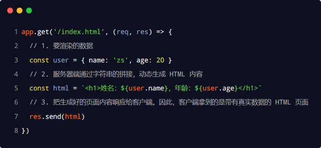

# web开发模式

目前主流的Web开发模式有两种，分别是：

**基于服务端渲染的传统Web开发模式**

- 服务器发送给客户端的HTML页面，是在服务器通过字符串的拼接动态生成的。因此，客户端不需要使用Ajax这样的技术额外请求页面的数据。在AJAX笔记中详细记录的内容如何通过拼接字符串发送数据
- 

- 优点：
  - 前端耗时少。因为服务器端负责动态生成HTML内容，浏览器只需要直接渲染页面即可。尤其是移动端，更省电
  - 有利于SEO。因为服务器端响应的是完整的HTML页面内容，所以爬虫更容易爬取获得信息，更有利于SEO

- 缺点：
  - 占用服务器端资源。即服务器端完成HTML页面内容的拼接，如果请求较多，会对服务器造成一定的访问压力。
  - 不利于前后端分离，开发效率低。使用服务器端渲染，则无法进行分工合作，尤其对于前端复杂度高的项目，不利于项目高效开发
- 不调用接口直接访问服务器，拿到的服务器返回的数据直接在html页面中渲染

***

**基于前后端分离的新型Web开发模式**

- 前后端分离的开发模式依赖于Ajax技术的广泛应用。简而言之，前后端分离的Web开发模式，就是后端只负责提供API接口，前端使用Ajax调用接口的开发模式
- 优点：
  - 开发体验好。前端专注于UI页面的开发，后端专注于api的开发，且前端有更多的选择性
  - 用户体验好。Ajax技术的广泛应用，极大的提高了用户的体验，可以轻松实现页面的局部刷新
  - 减轻了服务器端的渲染压力。因为页面最终是在每个用户的浏览器中生成的
- 缺点：
  - 不利于 SEO。因为完整的HTML页面需要在客户端动态拼接完成，所以爬虫对无法爬取页面的有效信息（解决方案：利用Vue、React等前端框架的SSR （server side render）技术能够很好的解决 SEO 问题！）
- 客户端访问的是接口，这就是为什么我们在后端要单独写路由（express, flask, django）

## 如何选择 Web 开发模式

比如企业级网站，主要功能是展示而没有复杂的交互，并且需要良好的 SEO，则这时我们就需要使用服务器端渲染

而类似后台管理项目，交互性比较强，不需要考虑 SEO，那么就可以使用前后端分离的开发模式

另外，具体使用何种开发模式并不是绝对的，为了同时兼顾了首页的渲染速度和前后端分离的开发效率，一些网站采用了首屏服务器端渲染 + 其他页面前后端分离的开发模式。

# 身份认证

对于服务端渲染和前后端分离这两种开发模式来说，分别有着不同的身份认证方案：

1. 服务端渲染推荐使用Session认证机制
2. 前后端分离推荐使用JWT认证机制

## Session认证机制

### HTTP协议的无状态性

HTTP协议的无状态性，指的是客户端的每次HTTP请求都是独立的，连续多个请求之间没有直接的关系，服务器不会主动保留每次HTTP请求的状态

### Cookie

Cookie是存储在用户浏览器中的一段不超过4 KB的字符串。它由一个名称（Name）、一个值（Value）和其它几个用于控制Cookie 有效期、安全性、使用范围的可选属性组成

不同域名下的Cooki各自独立，每当客户端发起请求时，会自动把当前域名下所有未过期的Cookie一同发送到服务器。
Cookie的几大特性：

1. 自动发送
2. 域名独立
3. 过期时限
4. 4KB 限制

#### Cookie 在身份认证中的作用

客户端第一次请求服务器的时候，服务器通过响应头的形式向客户端发送一个身份认证的Cookie，客户端会自动将Cookie保存在浏览器中

随后，当客户端浏览器每次请求服务器的时候，浏览器会自动将身份认证相关的Cookie通过请求头的形式发送给服务器，服务器即可验明客户端的身份

#### Cookie不具有安全性

由于**Cookie是存储在浏览器中的**，而且浏览器也提供了读写Cookie 的 API，因此Cookie很容易被伪造，不具有安全性。因此不建议服务器将重要的隐私数据，通过 Cookie 的形式发送给浏览器

#### Session的工作原理

#### Session认证的局限性

Session认证机制需要配合Cookie才能实现。由于Cookie默认不支持跨域访问，所以，当涉及到前端跨域请求后端接口的时候，需要做很多额外的配置，才能实现跨域Session认证
当前端请求后端接口不存在跨域问题的时候，推荐使用Session身份认证机制，反之推荐使用JWT认证机制

### JWT认证机制

JWT（英文全称：JSON Web Token）是目前最流行的跨域认证解决方案。用户的信息通过Token字符串的形式保存在客户端浏览器中。服务器通过还原Token字符串的形式来认证用户的身份

#### JWT的组成部分

JWT通常由三部分组成，分别是 Header（头部）、Payload（有效荷载）、Signature（签名）。三者之间使用英文的`.`分隔。例如：

其中：
`Payload`部分才是真正的用户信息，它是用户信息经过加密之后生成的字符串。`Header`和`Signature`是安全性相关的部分，只是为了保证Token的安全性

JWT的使用方式

客户端收到服务器返回的JWT之后，通常会将它储存在localStorage或sessionStorage中。此后，客户端每次与服务器通信，都要带上这个JWT的字符串，从而进行身份认证。推荐的做法是把JWT放在HTTP请求头的`Authorization`字段中：`Authorization: Bearer <token>`

