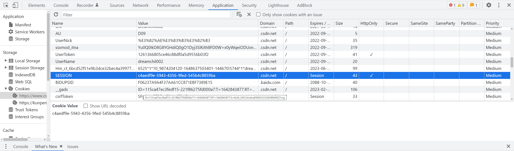
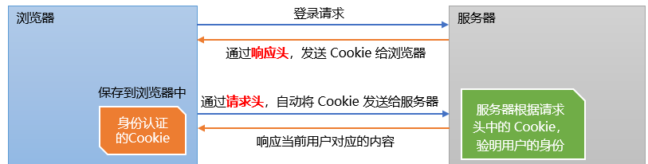
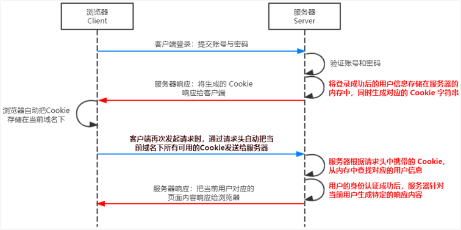
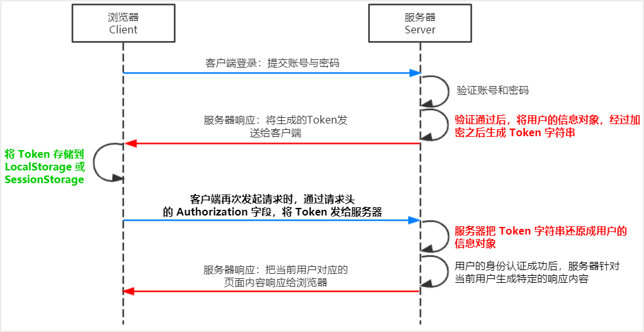
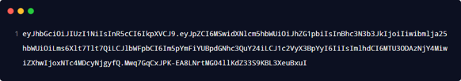

# 身份认证

对于服务端渲染和前后端分离这两种开发模式来说，分别有着不同的身份认证方案：

1. 服务端渲染推荐使用Session认证机制
2. 前后端分离推荐使用JWT认证机制

# Session认证机制

## HTTP协议的无状态性

HTTP协议的无状态性，指的是客户端的每次HTTP请求都是独立的，连续多个请求之间没有直接的关系，服务器不会主动保留每次HTTP请求的状态

## Cookie

Cookie是存储在用户浏览器中的一段不超过4 KB的字符串。它由一个名称（Name）、一个值（Value）和其它几个用于控制Cookie 有效期、安全性、使用范围的可选属性组成

不同域名下的Cooki各自独立，每当客户端发起请求时，会自动把当前域名下所有未过期的Cookie一同发送到服务器。
Cookie的几大特性：

1. 自动发送
2. 域名独立
3. 过期时限
4. 4KB 限制

### Cookie 在身份认证中的作用

客户端第一次请求服务器的时候，服务器通过响应头的形式向客户端发送一个身份认证的Cookie，客户端会自动将Cookie保存在浏览器中

随后，当客户端浏览器每次请求服务器的时候，浏览器会自动将身份认证相关的Cookie通过请求头的形式发送给服务器，服务器即可验明客户端的身份

### Cookie不具有安全性

由于**Cookie是存储在浏览器中的**，而且浏览器也提供了读写Cookie 的 API，因此Cookie很容易被伪造，不具有安全性。因此不建议服务器将重要的隐私数据，通过 Cookie 的形式发送给浏览器

## Session

### Session认证的局限性

Session认证机制需要配合Cookie才能实现。由于Cookie默认不支持跨域访问，所以，当涉及到前端跨域请求后端接口的时候，需要做很多额外的配置，才能实现跨域Session认证
当前端请求后端接口不存在跨域问题的时候，推荐使用Session身份认证机制，反之推荐使用JWT认证机制

## JWT认证机制

JWT（英文全称：JSON Web Token）是目前最流行的跨域认证解决方案。用户的信息通过Token字符串的形式保存在客户端浏览器中。服务器通过还原Token字符串的形式来认证用户的身份

### JWT的组成部分

JWT通常由三部分组成，分别是 Header（头部）、Payload（有效荷载）、Signature（签名）。三者之间使用英文的`.`分隔。例如：

其中：
`Payload`部分才是真正的用户信息，它是用户信息经过加密之后生成的字符串。`Header`和`Signature`是安全性相关的部分，只是为了保证Token的安全性

### JWT的使用方式

客户端收到服务器返回的JWT之后，通常会将它储存在localStorage或sessionStorage中。此后，客户端每次与服务器通信，都要带上这个JWT的字符串，从而进行身份认证。推荐的做法是把JWT放在HTTP请求头的`Authorization`字段中：`Authorization: Bearer <token>`

