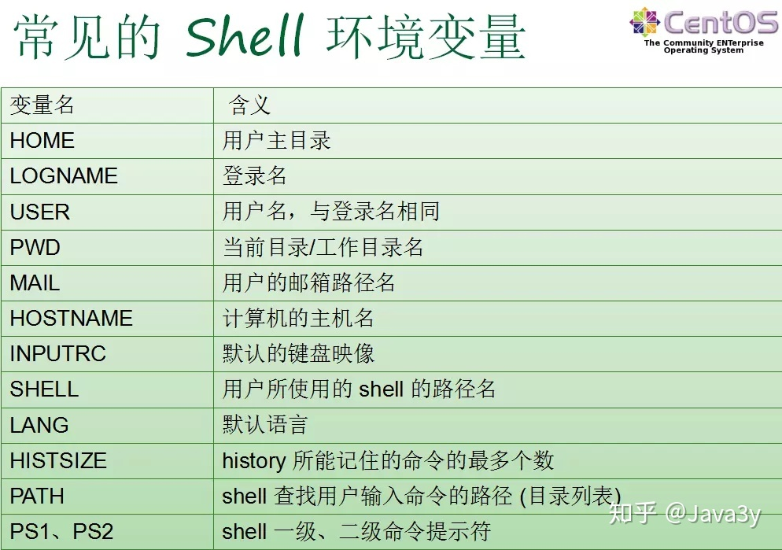
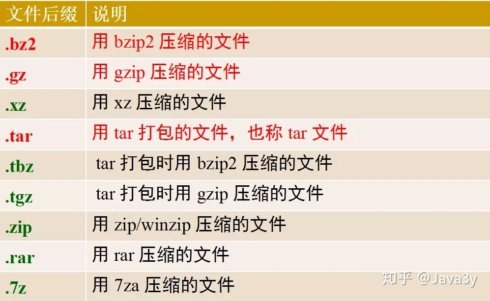

# 虚拟机

- 操作系统向下控制硬件向上支持软件的运行，具有承上启下的作用。
- 虚拟机软件是能够虚拟出来计算机的一个软件。
- 常用虚拟机软件:
  - ```Vmware```
  - ```VirtualBox```
- 说明:
  - 只有安装了虚拟机软件才可以创建虚拟机，当然通过虚拟机软件还可以创建多个虚拟机。
  - 虚拟机之间是相互独立的，删除虚拟机不会对其它虚拟机产生影响，当然也不会对电脑本身生影响


## Ubuntu操作系统

- Linux发行版是Linux内核与各种常用软件的组合产品，通俗来说就是我们常说的Linux操作系统。Linux内核是Linux操作系统管理硬件设备的核心程序

- 常用的Linux发行版:
  - Ubuntu
  - CentOS
  - Redhat
- 绝对路径和相对路径
  - 从根目录算起的路径叫做绝对路径
    - ```/home/python/Desktop```
    - ```/usr/bin```
  - 从当前目录算起的路径叫做相对路径
    - ```./test/hello```（```./```可以省略，因为默认是从当前目录切换的）
    - ```../static/images```
- 每一个盘符就是一个根目录，在Windows操作系统里面可能会出现多个根目录。Ubuntu没有盘符这个概念，只有一个根目录```/```。
- 主要目录说明:
  - ```/```：根目录
  - ```/bin```：可执行二进制文件的目录，如```cp```，```ls```命令
  - ```/etc```：系统配置文件存放的目录
  - ```/home```：用户目录。`~` 表示用户主目录的绝对路径名
  - `/usr` (unix software resource)：所有系统默认软件都会安装到这个目录；
  - `/var` (variable)：存放系统或程序运行过程中的数据文件。


## 文件类型

- 普通文件`-`
- 目录`d`
- 符号链接`l`
  - 硬链接： 与普通文件没什么不同，inode 都指向同一个文件在硬盘中的区块
  - 软链接： 保存了其代表的文件的绝对路径，是另外一种文件，在硬盘上有独立的区块，访问时替换自身路径(简单地理解为 Windows 中常见的快捷方式)。
- 字符设备文件` c`
- 块设备文件`b`
- 套接字`s`
- 命名管道`p`

## 终端命令格式的组成

```command [-options] [parameter]```

每项信息的说明:

- ```command```：命令名, 比如: ```ls```、```pwd```
- ```[-options]```：选项，**可以有零个、一个或者多个选项，多个选项可以合并**，比如使用的```-r```就是选项。
  - 短选项的格式: ```-```后面接单个字母, 比如:```-r```
  - 长选项的格式: ```--```后面接单词, 比如:```--help```
- ```[parameter]```：参数，**可以有零个、一个或者多个参数**， 比如:```touch 文件名1 文件名2```、```mkdir 目录名```、```cd 目标目录(路径)```，这些文件名和目录名都是参数。
- ```[]```：代表可选

对于命令，它的选项和参数一般情况下没有顺序要求，但是```scp```命令是必须先选项然后再跟上参数。

变量内容如果有空格，必须使用双引号或者单引号

## 通配符

- `*`：匹配任何字符和任何数目的字符
- `?`：匹配单一数目的任何字符
- `[ ]`：匹配[ ]之内的任意一个字符
- `[! ]`：匹配除了[! ]之外的任意一个字符，!表示非的意思

## 环境变量

Shell 变量大致可以分为三类：

- **内部变量**：由系统提供，用户只能使用不能修改。
  - ?
  - GROUPS
- **环境变量**：这些变量决定了用户工作的环境，它们不需要用户去定义，可以直接在 shell 中使用，其中某些变量用户可以修改。
- **用户变量**：由用户建立和修改，在 shell 脚本编写中会经常用到。
  - 变量赋值（定义变量）
    - `varName=Value`
    - `export varName=Value`
  - 引用变量`$varName`

### Shell变量的作用域

- **局部变量**的作用范围仅仅限制在其命令行所在的Shell或Shell脚本文件中
- **全局变量**的作用范围则包括本Shell进程及其所有子进程
- 可以使用`export`命令将自定义变量转成环境变量，环境变量可以在子程序中使用，所谓子程序就是由当前Bash而产生的子Bash

### export命令

- 显示当前Shell可见的全局变量
  - `export [-p]`
- 定义变量值的同时声明为全局变量。
  - `export <变量名1=值1> [<变量名2=值2> ...]`
- 声明已经赋值的某个（些）局部变量为全局变量。
  - `export <变量名1> [<变量名2> ...]`
- 声明已经赋值的某个（些）全局变量为局部变量。
  - `export -n <变量名1> [<变量名2> ...]`

### Shell环境变量

- 环境变量定义 Shell 的运行环境，保证 Shell 命令的正确执行。
- Shell用环境变量来确定查找路径、注册目录、终端类型、终端名称、用户名等。
- 所有环境变量都是全局变量（即可以传递给 Shell 的子进程），并可以由用户重新设置。



### Shell变量：查询、显示和取消：

- 显示当前已经定义的所有变量
  - 所有环境变量：`env`
  - 所有变量和函数（包括环境变量） ：`set`
- 显示某（些）个变量的值
  - `echo $NAME1 [$NAME2 ……]`
- 取消变量的声明或赋值
  - `unset <NAME>`

# 技巧

没有后缀默认```.txt```

```bash
xrandr # 查看可以使用的分辨率
xrandr -s 1920x1440 # 调整分辨率，推荐2560x1600
```

## 自动补全

- 当敲出文件或者目录或者命令的前几个字母之后，按下```tab```键，如果输入的没有歧义，系统会自动补全

- 当切换目录或者使用命令的时候，如果不确定当前目录下有那些子目录或者其它命令，可以通过两次```tab```键查看

## 查看命令帮助方式

查看命令帮助目的是查看命令选项信息的

- ```--help```使用说明: ```命令 --help```

- ```man``` 使用说明: ```man 命令```-这个更全

- `pip install tldr`+`$tldr tar`：更全更清楚

- 《鸟哥的linux私房菜》

```man```命令和```more```命令的说明:

| 操作键 |      说明      |
| :----: | :------------: |
|  空格  | 显示下一屏信息 |
|  回车  | 显示下一行信息 |
|   b    | 显示上一屏信息 |
|   f    | 显示下一屏信息 |
|   q    |      退出      |

## 快捷键

### 命令行编辑

- **Ctrl + Left/Right Arrow**: 向左/右移动一个词
- **Ctrl + A** / **Ctrl + E**: 移动光标到行首 / 行尾
- **Ctrl + U** / **Ctrl + K**: 删除光标到行首 / 行尾的内容。
- **Ctrl + W** / **Alt + D**:: 删除光标前 / 后的一个词。
- **Ctrl + Y**: 粘贴由 Ctrl + U、Ctrl + K 或 Ctrl + W 删除的文本。
- **Ctrl + C**: 中断当前命令。
- **Ctrl + D**: 退出当前 shell（如果命令行为空）。结束键盘输入（End Of File，EOF）
- **Ctrl + R**: 搜索历史命令。
- **Ctrl + L**: 清屏。

### 终端窗口管理

- **Ctrl + Alt + T**: 打开新的终端窗口。
- **Ctrl + Shift + T**: 在当前终端窗口中打开新的标签页。
- **Ctrl + Shift + W/C**: 关闭当前终端标签页/窗口。
- **Ctrl + PageUp/PageDown**: 在终端标签页之间切换。
- **Ctrl + +/-**: 增加/减小字体大小。
- **Ctrl + Shift + C/V**: 复制/粘贴。
- **Ctrl+G / Ctrl+Alt**：切入 / 切出虚拟机 

### Bash 历史快捷键

- **上/下箭头**: 在命令历史中向上/向下移动。
- **!!**: 重复上一条命令。
- **!n**: 重复历史中的第 n 条命令。
- **!-n**: 重复历史中的倒数第 n 条命令。
- **!string**: 重复最近以指定字符串开头的命令。
- **!?string?**: 重复最近包含指定字符串的命令。

这些快捷键可以帮助您更快地导航和编辑命令行，从而提高在 Ubuntu 终端中的工作效率。不同的 shell（如 Bash、Zsh 等）和终端模拟器可能会有一些差异，所以某些快捷键可能在特定配置下不适用。

## tmux快捷键

`tmux` 是一个流行的终端多路复用器，它允许用户在一个终端窗口中创建、访问和控制多个终端会话。这意味着你可以启动多个终端窗口，同时运行不同的进程，并在它们之间轻松切换，而无需使用多个物理终端或 GUI 窗口。`tmux` 还可以保持会话活跃，即使你从远程服务器断开连接，你也可以重新连接到同一个会话，这对于长时间运行的任务特别有用。

以下是一些常用的 `tmux` 快捷键：

1. **会话管理**:
   - `tmux new -s session_name`：创建新会话。
   - `tmux attach -t session_name`：连接到已有会话。
   - `tmux switch -t session_name`：切换到另一个会话。
   - `tmux list-sessions`：列出所有会话。
   - `tmux detach`：从当前会话中断开连接。
2. **窗口管理** (在 `tmux` 中，窗口类似于标签)：
   - `Ctrl-b c`：创建新窗口。
   - `Ctrl-b ,`：重命名当前窗口。
   - `Ctrl-b p`：切换到上一个窗口。
   - `Ctrl-b n`：切换到下一个窗口。
   - `Ctrl-b l`：切换到最后使用的窗口。
3. **窗格管理** (面板是窗口内的子窗口，常用)：
   - `Ctrl-b %`：垂直分割面板。
   - `Ctrl-b "`：水平分割面板。
   - `Ctrl-b arrow_keys`：在面板之间切换。
   - `Ctrl-b Ctrl-arrow_keys`：调整面板大小。
   - `Ctrl-b x`：关闭当前面板。
4. **其他快捷键**：
   - `Ctrl-b t`：显示时钟。
   - `Ctrl-b d`：从当前会话中断开连接，但保持会话活动。
   - `Ctrl-b [`：进入复制模式，允许你滚动和复制文本。

## Shell 工具

### tldr

有时候手册内容(`--help` / `man`)太过详实，让我们难以在其中查找哪些最常用的标记和语法。 [TLDR pages](https://tldr.sh/) 是一个很不错的替代品，它提供了一些案例，可以帮助您快速找到正确的选项。例如，自己就常常在tldr上搜索[`tar`](https://tldr.ostera.io/tar) 和 [`ffmpeg`](https://tldr.ostera.io/ffmpeg) 的用法。

### auto-suggestions

这一特性最初是由 [fish](https://fishshell.com/) shell 创建的，它可以根据您最近使用过的开头相同的命令，动态地对当前对shell命令进行补全。这一功能在 [zsh](https://github.com/zsh-users/zsh-autosuggestions) 中也可以使用，它可以极大的提高用户体验。

### fasd / autojump

之前对所有操作我们都默认一个前提，即您已经位于想要执行命令的目录下，但是如何才能高效地在目录间随意切换呢？有很多简便的方法可以做到，比如设置alias，使用 [ln -s](https://man7.org/linux/man-pages/man1/ln.1.html) 创建符号连接等。而开发者们已经想到了很多更为精妙的解决方案。

由于本课程的目的是尽可能对你的日常习惯进行优化。因此，我们可以使用[`fasd`](https://github.com/clvv/fasd)和 [autojump](https://github.com/wting/autojump) 这两个工具来查找最常用或最近使用的文件和目录。

Fasd 基于 [*frecency* ](https://developer.mozilla.org/en-US/docs/Mozilla/Tech/Places/Frecency_algorithm)对文件和文件排序，也就是说它会同时针对频率（*frequency*）和时效（*recency*）进行排序。默认情况下，`fasd`使用命令 `z` 帮助我们快速切换到最常访问的目录。例如， 如果您经常访问`/home/user/files/cool_project` 目录，那么可以直接使用 `z cool` 跳转到该目录。对于 autojump，则使用`j cool`代替即可。

还有一些更复杂的工具可以用来概览目录结构，例如 [`tree`](https://linux.die.net/man/1/tree), [`broot`](https://github.com/Canop/broot) 或更加完整的文件管理器，例如 [`nnn`](https://github.com/jarun/nnn) 或 [`ranger`](https://github.com/ranger/ranger)。

# 常用命令

|             命令              |                             说明                             | 示例                                                         |                             备注                             |
| :---------------------------: | :----------------------------------------------------------: | ------------------------------------------------------------ | :----------------------------------------------------------: |
|              ls               |                       查看当前目录信息                       |                                                              | 和```tree```相比只能查看一层目录信息。<br />```-l``` 以列表方式显示<br />```ll``` 相当于 ```ls -la```<br />```-lh``` 以列表方式显示并显示件大小单位，默认是K<br />```-a``` 显示隐藏文件和隐藏目录 |
|          tree 目录名          |                    以树状方式显示目录信息                    |                                                              |                                                              |
|              pwd              |                       查看当前目录路径                       |                                                              |                                                              |
|             clear             |                         清除终端内容                         |                                                              |                                                              |
|            cd 目录            |                        切换到指定目录                        |                                                              |          ```cd```命令切换目录时，这个目录必须存在。          |
|             cd ~              |         切换到当前用户的主目录（```/home/yating```）         |                                                              |             ```cd```后面不写目录等价于```cd ~```             |
|             cd ..             |                       切换到上一级目录                       |                                                              |            ```cd ../..```切换到上级目录的上级目录            |
|             cd .              |                        切换到当前目录                        |                                                              |                                                              |
|             cd -              |                       切换到上一次目录                       |                                                              |                                                              |
|             cd /              |                         切换到根目录                         |                                                              |                                                              |
| touch 路径/文件名 路径/文件名 |                   创建指定文件 / 修改时间                    |                                                              |                                                              |
|         mkdir 目录名          |                           创建目录                           |                                                              |            ```-p``` 创建嵌套文件夹时创建嵌套目录             |
|      rm 文件名或者目录名      |                     删除指定文件或者目录                     |                                                              | 想要删除目录需要加上 ```-r``` 选项表示递归删除目录及其内容<br />```-f``` 内容强制删除，忽略不存在的文件，无需提示<br />```-d``` 删除空目录，类似```rmdir```<br />```-i``` 交互式提示<br />```rm -r(recursive)f(force) \(home)```谨慎使用 |
|         rmdir 目录名          |                          删除空目录                          |                                                              |                          非空会失败                          |
|      cp 源文件 目标文件       |                      拷贝文件、拷贝目录                      |                                                              | 拷贝目录需要加上 ```-r``` 选项表示递归拷贝目录及其内容<br />```-v``` 显示拷贝后的路径描述<br />```-a``` 保留文件的原有权限（之前增加的权限会丢失），在用 ```-r``` 拷贝文件夹时，文件夹里的文件的权限也不会丢失<br />```-i``` 交互式提示防止拷贝文件覆盖 |
|      mv 源文件 目标文件       |                  移动文件、移动目录、重命名                  |                                                              | ```-v``` 显示拷贝后的路径描述<br />```-i``` 交互式提示防止移动文件覆盖 |
|        内容 > 目标文件        | 如果文件存在会覆盖原有文件内容，相当于文件操作中的**w**模式  |                                                              | 重定向命令<br />只要在终端能显示信息的命令都可以使用重定向保存到文件，比如: ```tree``` |
|       内容 >> 目标文件        | 如果文件存在会追加写入文件末尾，相当于文件操作中的**a**模式  |                                                              |                            同上。                            |
|              cat              |                         查看小型文件                         |                                                              | `cat file1 file2`依顺序显示file1,file2的内容<br />`-n`显示行号<br />`tac`倒序显示 |
|       head -20 filename       |                       查看文件开头内容                       | head -n (+)20/head -n -20                                    | 默认输出前10行<br />```-n``` 后跟负数表示输出第n行以前的内容<br />```-c n``` 指定输出前n个字符 |
|       tail -20 filename       |                       查看文件尾部内容                       | tail -n (-)20/tail -n +20                                    | 默认输出后10行<br />```-n``` 后跟正数表示输出第n行以后的内容 |
|             gedit             |               文件编辑命令，可以查看和编辑文件               |                                                              |                                                              |
|             more              |                分屏查看大型文件，推荐使用less                |                                                              |                                                              |
|              \|               | 一个命令的输出可以通过管道做为另一个命令的输入，可以理解成是一个容器，存放在终端显示的内容。比如：```ls -lh / | more``` |                                                              |                                                              |
| ln -s 源文件路径 目标文件路径 | 创建软链接，类似于Windows下的快捷方式，当一个源文件的目录层级比较深，我们想要方便使用它可以给源文件创建一个软链接。 |                                                              | 1.如果软链接和源文件不在同一个目录，源文件要使用绝对路径，不能使用相对路径。<br />2.删除源文件则软链接失效。<br />3.可以给目录创建软链接 |
|              ln               | 创建硬链接。类似于源文件的一个别名，也就是说这两个名字指向的是同一个文件数据。一般在防止误删时使用 |                                                              | 1.创建硬链接使用相对路径和绝对路径都可以。<br />2.删除源文件，硬链接还可以访问到数据。<br />3.创建硬链接，硬链接数会加1，删除源文件或者硬链接，硬链接数会减1。<br/>4.创建软链接，硬链接数不会加1<br/>5.不能给目录创建硬链接<br />6.硬链接数就是文件数据被文件名使用的次数, 好比引用计数 |
|    grep 文本搜索内容 文件     |                           文本搜索                           |                                                              | ```-i ```忽略大小写<br />```-n``` 显示匹配行号<br />```-v``` 显示不包含匹配文本的所有行<br /><br />`-c`统计匹配到行的个数<br />```grep``` 命令还可以文本搜索管道中的内容，比如: ```ls /bin | grep "sh"```<br />搜索内容的引号可以省略，比如： ```ls /bin | grep ^a..c$```<br />可以加入**正则表达式**，比如：```grep '^a..c' -i hello.py``` |
|       find 目录 文件名        |                在指定目录下查找文件(包括目录)                | ```find . -name "?.txt" -delete```                           | ```-name``` 根据文件名(包括目录名)字查找<br />可以加入通配符，```*``` 代表0个或多个任意字符，```?``` 代表任意一个字符。通配符不仅能结合```find```命令使用，还可以结合其它命令使用, 比如: ```ls```、```mv```、```cp``` 等，**这里需要注意只有```find```命令使用通配符需要加上引号。** |
|             alias             |                           显示别名                           |                                                              |                                                              |
|          file / stat          |                  查看文件类型或文件属性信息                  |                                                              |                                                              |
|              tar              | 压缩和解压缩命令（```.gz```和```.bz2```的压缩包，默认`/tar`） | ```tar -zcvf  test.tar.gz *.txt```/```tar -zxvf test.tar.gz -C 文件名```/```tar -jcvf test.bz2 *.txt```/```tar -jxvf test.bz2 -C 文件名``` | ```-c``` 创建打包文件<br/>```-v``` 显示打包或者解包的详细信息<br/>```-f``` 指定文件名称, 必须放到所有选项后面<br/>```-z``` 压缩或解压缩(```.gz```)<br/>```-j ``` 压缩或解压缩(```.bz2```)<br/>```-x``` 解包<br/>```-C``` 解压缩到指定目录，只有解压缩才有指定目录 |
|              zip              |                   压缩成```.zip```格式文件                   | ```zip test *.txt```                                         | 默认是```.zip```后缀，相对占用空间比较多。尽量使用```.gz```格式，占用空间比较少 |
|             unzip             |                   解压缩```.zip```格式文件                   | ```unzip test.zip -d 文件名```                               |                  ```-d``` 解压缩到指定目录                   |
|    ifconfig / ip addr show    |                          查看ip地址                          |                                                              |                                                              |
|           hostname            |                           查看域名                           |                                                              |                                                              |
|              ps               |                     查看当前系统中的进程                     | `ps -l`查看自己的进程                                        | `-a` 表示所有用户<br />`-u` 表示显示用户名<br />`-x` 表示显示所有的执行程序 |
|            netstat            |                      查看占用端口的进程                      | `netstat -anp | grep port`                                   |           需要安装`sudo apt-get install net-tools`           |
|          which 命令           |                           指令搜索                           |                                                              |             `-a`将所有指令列出，而不是只列第一个             |
|              cut              |    对数据进行切分，取出想要的部分。切分过程一行一行地进行    | `last | cut -d ' ' -f 1`                                     | `-d`分隔符<br/>`-f`经过`-d`分隔后，使用`-f n`取出第`n`个区间<br/>`-c`以字符为单位取出区间 |
|   diff 文件/目录 文件/目录    | 如果指定比较的是文件，则只有当输入为文本文件时才有效。以逐行的方式，比较文本文件的异同处。如果指定比较的是目录的的时候，diff 命令会比较两个目录下名字相同的文本文件 | `diff 1.txt 2.txt`                                           | ```-i ```忽略大小写<br />`-x`不比较选项中所指定的文件或目录<br />`-q`仅显示有无差异，不显示详细的信息<br />`-y`以并列的方式显示文件的异同之处<br />`-W`在使用-y参数时，指定栏宽 |
|              wc               |                          wordcount                           |                                                              |                                                              |
|            history            |                         使用过的命令                         | history 5                                                    |                                                              |
|              pv               | 通过管道操作查看数据的处理进度、传输速度、已传输数据量和预估完成时间等信息 | `pv source-file > destination-file`                          |                                                              |

# 命令详解

## find / fd / locate

程序员们面对的最常见的重复任务就是查找文件或目录。所有的类UNIX系统都包含一个名为 [`find`](https://man7.org/linux/man-pages/man1/find.1.html) 的工具，它是 shell 上用于查找文件的绝佳工具。`find`命令会递归地搜索符合条件的文件，例如：

```bash
# 查找所有名称为src的文件夹
find . -name src -type d
# 查找所有文件夹路径中包含test的python文件
find . -path '*/test/*.py' -type f # 这个/表示目录的/
# 查找前一天修改的所有文件
find . -mtime -1
# 查找所有大小在500k至10M的tar.gz文件
find . -size +500k -size -10M -name '*.tar.gz'
```

除了列出所寻找的文件之外，find 还能对所有查找到的文件进行操作。这能极大地简化一些单调的任务。

```bash
# 删除全部扩展名为.tmp 的文件
find . -name '*.tmp' -exec rm {} \;
# 查找全部的 PNG 文件并将其转换为 JPG
find . -name '*.png' -exec convert {} {}.jpg \;
```

尽管 `find` 用途广泛，它的语法却比较难以记忆。例如，为了查找满足模式 `PATTERN` 的文件，您需要执行 `find -name '*PATTERN*'` (如果您希望模式匹配时是不区分大小写，可以使用`-iname`选项）

您当然可以使用 alias 设置别名来简化上述操作，但 shell 的哲学之一便是寻找（更好用的）替代方案。 记住，shell 最好的特性就是您只是在调用程序，因此您只要找到合适的替代程序即可（甚至自己编写）。

例如，[`fd`](https://github.com/sharkdp/fd) 就是一个更简单、更快速、更友好的程序，它可以用来作为`find`的替代品。它有很多不错的默认设置，例如输出着色、默认支持正则匹配、支持unicode并且我认为它的语法更符合直觉。以模式`PATTERN` 搜索的语法是 `fd PATTERN`。

大多数人都认为 `find` 和 `fd` 已经很好用了，但是有的人可能想知道，我们是不是可以有更高效的方法，例如不要每次都搜索文件而是通过编译索引或建立数据库的方式来实现更加快速地搜索。

这就要靠 [`locate`](https://man7.org/linux/man-pages/man1/locate.1.html) 了。 `locate` 使用一个由 [`updatedb`](https://man7.org/linux/man-pages/man1/updatedb.1.html)负责更新的数据库，在大多数系统中 `updatedb` 都会通过 [`cron`](https://man7.org/linux/man-pages/man8/cron.8.html) 每日更新。这便需要我们在速度和时效性之间作出权衡。而且，`find` 和类似的工具可以通过别的属性比如文件大小、修改时间或是权限来查找文件，`locate`则只能通过文件名。 [这里](https://unix.stackexchange.com/questions/60205/locate-vs-find-usage-pros-and-cons-of-each-other)有一个更详细的对比。

## grep / rg / ack / ag

查找文件是很有用的技能，但是很多时候您的目标其实是查看文件的内容。一个最常见的场景是您希望查找具有某种模式的全部文件，并找它们的位置。

为了实现这一点，很多类UNIX的系统都提供了[`grep`](https://man7.org/linux/man-pages/man1/grep.1.html)命令，它是用于对输入文本进行匹配的通用工具。它是一个非常重要的shell工具，我们会在后续的数据清理课程中深入的探讨它。

`grep` 有很多选项，这也使它成为一个非常全能的工具。其中我经常使用的有 `-C` ：获取查找结果的上下文（Context）；`-v` 将对结果进行反选（Invert），也就是输出不匹配的结果。举例来说， `grep -C 5` 会输出匹配结果前后五行。当需要搜索大量文件的时候，使用 `-R` 会递归地进入子目录并搜索所有的文本文件。

但是，我们有很多办法可以对 `grep -R` 进行改进，例如使其忽略`.git` 文件夹，使用多CPU等等。

因此也出现了很多它的替代品，包括 [ack](https://beyondgrep.com/), [ag](https://github.com/ggreer/the_silver_searcher) 和 [rg](https://github.com/BurntSushi/ripgrep)。它们都特别好用，但是功能也都差不多，我比较常用的是 ripgrep (`rg`) ，因为它速度快，而且用法非常符合直觉。例子如下：

```bash
# 查找所有使用了 requests 库的文件
rg -t py 'import requests'
# 查找所有没有写 shebang 的文件（包含隐藏文件）
rg -u --files-without-match "^#!"
# 查找所有的foo字符串，并打印其之后的5行
rg foo -A 5
# 打印匹配的统计信息（匹配的行和文件的数量）
rg --stats PATTERN
```

与 `find`/`fd` 一样，重要的是你要知道有些问题使用合适的工具就会迎刃而解，而具体选择哪个工具则不是那么重要。

## history / fzf

目前为止，我们已经学习了如何查找文件和代码，但随着你使用shell的时间越来越久，您可能想要找到之前输入过的某条命令。首先，按向上的方向键会显示你使用过的上一条命令，继续按上键则会遍历整个历史记录。

`history` 命令允许您以程序员的方式来访问shell中输入的历史命令。这个命令会在标准输出中打印shell中的里面命令。如果我们要搜索历史记录，则可以利用管道将输出结果传递给 `grep` 进行模式搜索。 `history | grep find` 会打印包含find子串的命令。

对于大多数的shell来说，您可以使用 `Ctrl+R` 对命令历史记录进行回溯搜索。敲 `Ctrl+R` 后您可以输入子串来进行匹配，查找历史命令行。

反复按下就会在所有搜索结果中循环。在 [zsh](https://github.com/zsh-users/zsh-history-substring-search) 中，使用方向键上或下也可以完成这项工作。

`Ctrl+R` 可以配合 [fzf](https://github.com/junegunn/fzf/wiki/Configuring-shell-key-bindings#ctrl-r) 使用。`fzf` 是一个通用对模糊查找工具，它可以和很多命令一起使用。这里我们可以对历史命令进行模糊查找并将结果以赏心悦目的格式输出。

你可以修改 shell history 的行为，例如，如果在命令的开头加上一个空格，它就不会被加进shell记录中。当你输入包含密码或是其他敏感信息的命令时会用到这一特性。 为此你需要在`.bashrc`中添加`HISTCONTROL=ignorespace`或者向`.zshrc` 添加 `setopt HIST_IGNORE_SPACE`。 如果你不小心忘了在前面加空格，可以通过编辑。`bash_history`或 `.zhistory` 来手动地从历史记录中移除那一项。

## !

Q: 在vim中，输入`:.!where bash`会发生什么

A: 在 Vim 中，`.` 表示当前行，`!` 表示在 shell 中执行命令，因此 `:.!where bash` 会在 shell 中执行 `where bash` 命令，并将输出替换为当前行。

`where` 命令用于在 Windows 系统中定位可执行文件的位置。在 Unix-like 系统中，相应的命令是 `which`。

所以如果你在 Windows 上运行 Vim，并且你的系统路径中包含 bash（例如，如果你安装了 Git Bash 或 Windows Subsystem for Linux），那么 `:.!where bash` 将替换当前行为 bash 的路径。

如果你在 Unix-like 系统上运行 Vim，你应该使用 `:.!which bash` 来达到相同的效果。

Q: 在shell命令行中如何有技巧的使用`!`

A: 在 shell 命令行中，`!` 是一个非常强大的操作符，可以用于多种方式。

1. **引用历史命令**: `!n` 会执行历史列表中的第 `n` 个命令。例如，`!5` 会执行历史列表中的第 5 个命令。
2. **引用最近的命令**: `!!` 会执行最近的命令。这是一个非常有用的技巧，例如，如果你忘了在一个命令前加 `sudo`，你可以简单地输入 `sudo !!`。
3. **引用最近的参数**: `!$` 会引用最近命令的最后一个参数。这是一个很好的技巧，例如，如果你刚刚创建了一个目录 `mkdir mydir`，然后你可以输入 `cd !$` 来切换到这个目录。
4. **按字符串引用命令**: `!string` 会执行最近的以 `string` 开头的命令。例如，如果你刚刚执行了 `cat myfile.txt`，你可以输入 `!cat` 来再次执行这个命令。
5. **按命令搜索**: `!?string` 会执行最近的包含 `string` 的命令。例如，如果你刚刚执行了 `grep -r "mystring" *`，你可以输入 `!?grep` 来再次执行这个命令。
6. **忽略历史记录**: 在命令前加一个空格将不会将命令添加到历史记录中。这对于输入密码或其他敏感信息很有用。

注意：在使用 `!` 时要小心，因为它可能会导致意外的结果，尤其是当你不记得历史命令时。在执行任何带有 `!` 的命令之前，最好先检查历史记录，可以使用 `history` 命令来查看。

压缩文件




# 远程登录```ssh```

ssh是专门为远程登录提供的一个安全性协议，常用于远程登录，想要使用ssh服务，需要安装相应的服务端和客户端软件，当软件安装成功以后就可以使用ssh命令了，以后可以通过远程登录之间操作远程的服务器。

远程登录效果图:


## 软件安装步骤

- 假如Ubuntu作为服务端,需要安装ssh服务端软件. 执行命令: ```sudo apt-get install openssh-server```/```sudo apt-get install openssh-client```
  - 输入```apt list | grep openssh-server```查看是否已安装
- 客户端电脑如果是macOS系统则不需要安装ssh客户端软件，默认已经安装过了，直接可以使用```ssh```命令
- 客户端电脑如果是Windows系统则需要安装OpenSSH for Windows这个软件

## ssh命令

- ```ssh 用户名@ip地址```

- ```who```：查看远程控制用户

- ```Ctrl+b```：退出ssh

# 远程拷贝```scp```

scp是基于ssh进行远程文件拷贝的命令，也就是说需要保证服务端和客户端电脑安装了相应的ssh软件，以后可以把我们写代码远程拷贝到服务器。

大量的文件上传和下载可以通过可视化工具FileZilla来完成。FileZilla 是一个免费开源的FTP软件, 使用可视化方式进行上传和下载文件。

这里sftp的默认端口号是22，不填也可以


scp命令格式:

- 远程拷贝文件
  - ```scp 本地文件 远程服务器用户名@远程服务器ip地址:指定拷贝到远程服务器的路径```
    - ```scp 1.txt yating@192.168.xx.xx:/home/yating/test```
  - ```scp 远程服务器用户名@远程服务器ip地址:远程服务器文件 指定拷贝到本地电脑的路径```
    - ```scp yating@192.168.xx.xx:/home/yating/test/1.txt .```
- 远程拷贝目标
  - ```scp -r 本地目录 远程服务器用户名@远程服务器ip地址:指定拷贝到远程服务器的路径```
  - ```scp -r 远程服务器用户名@远程服务器ip地址:远程服务器目录 指定拷贝到本地电脑的路径```
    - ```scp yating@192.168.xx.xx:/home/yating/test .```
  - ```-r```表示递归拷贝整个目录，```scp```后必须跟参数

# SFTP

```bash
sftp -i 'tomcat.pem' your remote server address
> ls # remove server file system
> lls *.java # local file system
> cd ...
> pwd
> lpwd
> put xxx.txt # upload 
> get xxx.txt # download
```


# 文件权限命令

```ls -la```查看权限```-当前用户权限-同组用户权限-其他用户权限--```：

```drwxrwxr-x 2 yating test_group 4096 2月 30 23:24```表示当前用户和同组用户可读可写可执行，其他用户只能执行，d表示文件夹，2表示内存地址被使用的次数，当前用户是```yating```，当前用户组是```test_group```，占用空间是4k，修改时间是2月30日23:24

以```.```开头是隐藏文件/目录


```chmod```修改文件权限有两种方式:

- 字母法
- 数字法

## ```chmod```字母法的使用

### 角色说明

| 角色 | 说明                     |
| :--- | :----------------------- |
| u    | user, 表示该文件的所有者 |
| g    | group, 表示用户组        |
| o    | other, 表示其他用户      |
| a    | all, 表示所有用户        |

### 权限设置说明

| 操作符 | 说明     |
| :----- | :------- |
| +      | 增加权限 |
| -      | 撤销权限 |
| =      | 设置权限 |

### 权限说明

| 权限 | 说明       |
| :--- | :--------- |
| r    | 可读       |
| w    | 可写       |
| x    | 可执行     |
| -    | 无任何权限 |

### 示例

逗号后不能有空号

```bash
chmod u=rw,g=r,o=r 1.txt
chmod a=- 1.txt
```

执行python3文件，需要指定python3路径

```bash
yating@ZZMF-20190903EB:~/test$ ./HelloWorld.py
-bash: ./HelloWorld.py: Permission denied
yating@ZZMF-20190903EB:~/test$ chmod u+x HelloWorld.py
yating@ZZMF-20190903EB:~/test$ ll
total 12
drwxr-xr-x 1 yating yating  512 Feb 26 02:14 ./
drwxr-xr-x 1 yating yating  512 Feb 26 02:14 ../
-rw-r--r-- 1 yating yating   14 Feb 25 22:46 1.txt
-rw-r--r-- 1 yating yating 6764 Feb 25 23:26 2.txt
-rwxr--r-- 1 yating yating   21 Feb 26 02:14 HelloWorld.py*
-rw-r--r-- 1 yating yating  851 Feb 25 23:28 search.txt
yating@ZZMF-20190903EB:~/test$ which python3
/usr/bin/python3
yating@ZZMF-20190903EB:~/test$ vi HelloWorld.py
yating@ZZMF-20190903EB:~/test$ cat HelloWorld.py
#!/usr/bin/python3

print("Hello World")
yating@ZZMF-20190903EB:~/test$ ./HelloWorld.py
Hello World
```


## ```chmod```数字法的使用

数字法就是```rwx```这些权限也可以用数字来代替

### 权限说明

| 权限 | 说明                  |
| :--- | :-------------------- |
| r    | 可读，权限值是4       |
| w    | 可写，权限值是2       |
| x    | 可执行，权限值是1     |
| -    | 无任何权限，权限值是0 |

### 示例

当前用户可读可写，同组用户和其他用户可读

所有用户可读可写可执行

所有用户无权限

```
chmod 644 1.txt
chmod 777 1.txt
chmod 000 1.txt
```


## `chattr`

`chattr` 命令在 Linux 系统中用于改变文件或目录的属性。这些属性为文件或目录提供了额外的功能和特性，超出了基本的权限系统，比如 `read`、`write` 和 `execute`。

以下是一些常用的 `chattr` 命令选项：

- `+`：添加属性。
- `-`：删除属性。
- `=`：设置属性。

以及一些常见的文件或目录属性：

- `i`：设置文件或目录为不可修改（immutable）。设置此属性后，任何用户（包括 root）都不能删除、修改、重命名或者创建硬链接。

- `a`：设置文件或目录仅可追加（append only）。设置此属性后，只能向文件添加数据，不能删除和修改已有的数据。

- `s`：启用安全删除（secure deletion）。设置此属性后，当文件被删除时，其磁盘空间将被全面地填满，而不是只是删除文件的索引。

- `A`：禁用 atime 记录。设置此属性后，系统不会记录文件的最后访问时间。

以下是一个简单的 `chattr` 命令示例：

```
sudo chattr -R +i myfile
```

这条命令将 `myfile.txt` 设置为不可修改，即使 root 用户也不能修改它。

要查看文件或目录的当前属性，可以使用 `lsattr` 命令。例如：

```
lsattr myfile.txt
```

这条命令将显示 `myfile.txt` 的当前属性。


# 获取管理员权限的相关命令

| 命令            | 说明                                                       |
| :-------------- | :--------------------------------------------------------- |
| sudo -s         | 切换到root用户，获取管理员权限                             |
| sudo            | 某个命令的执行需要获取管理员权限可以在执行命令前面加上sudo |
| whoami          | 查看当前用户                                               |
| exit            | 退出登录用户                                               |
| who             | 查看所有的登录用户                                         |
| passwd          | 修改用户密码，不指定用户默认修改当前登录用户密码           |
| which           | 查看命令位置                                               |
| shutdown –h now | 立刻关机                                                   |
| reboot          | 重启                                                       |

以本机```ZZMF-20190903EB```安装的Ubuntu软件为例

- 管理员：```yating```

- 密码：```1djdgQL@```


```bash
yating@ZZMF-20190903EB:~/test$ sudo -s
[sudo] password for yating:
root@ZZMF-20190903EB:/home/yating/test$ ls
1.txt  2.txt  HelloWorld.py  search.txt
root@ZZMF-20190903EB:/home/yating/test$ whoami
root
root@ZZMF-20190903EB:/home/yating/test$ exit
exit
yating@ZZMF-20190903EB:~/test$ whoami
yating
yating@ZZMF-20190903EB:~/test$ passwd # 更换当前用户密码
```

# 用户相关操作

## 创建用户```useradd```

- 给其它用户设置密码，需要使用: ```sudo passwd 用户名```

- 切换用户```su - 用户名```


```useradd```命令选项:

| 选项 | 说明                                                       |
| :--- | :--------------------------------------------------------- |
| -m   | 自动创建用户主目录,主目录的名字就是用户名                  |
| -g   | 指定用户所属的用户组，默认不指定会自动创建一个同名的用户组 |

说明:

- ```useradd```命令的使用需要使用管理员权限，前面需要加上```sudo```
- 创建用户如果不指定用户组，默认会自动创建一个同名的用户组
- 查看用户是否创建成功，可以查看```/etc/passwd```这个文件或者```id 用户名```
- 查看用户组是否创建成功，可以查看```/etc/group```这个文件

```passwd```文件中的每项信息说明,以```root:x:0:0:root:/root:/bin/bash```为例:

- 第一个：用户名
- 第二个：密码占位符。```x```
- 第三个：```uid```, 用户id
- 第四个：```gid```, 用户所在组id
- 第五个：用户描述, 可选，
- 第六个：用户的主目录所在位置
- 第七个：用户所用shell的类型，一般由bash或者sh，默认不设置是sh类型

```group```文件中的每项信息说明, 以```laowang:x:1001:```为例:

- 第一个：用户组名
- 第二个：用户组密码占位符，一般Linux系统的用户组都没有密码的
- 第三个：组id

### 使用```id```查看用户信息

每项信息说明:

```uid=1001(laowang) gid=1001(laowang) 组=1001(laowang)```

- 第一个: ```uid``` 表示用户id
- 第二个: ```gid``` 表示用户组id
- 第三个: 组 表示用户所在的用户组

## 修改用户信息```usermod```

```usermod```选项:

| 命令 | 说明           |
| :--- | :------------- |
| -G   | 设置一个附加组 |
| -g   | 修改用户组     |

每个用户只有一个用户组（主组），可以有很多附加组。

### 删除附加组

| 命令    | 说明                 |
| :------ | :------------------- |
| gpasswd | 添加和删除附加组信息 |

```gpasswd```命令选项:

| 选项      | 说明             |
| :-------- | :--------------- |
| -a 用户名 | 给用户添加附加组 |
| -d 用户名 | 给用户删除附加组 |

## 删除用户```userdel```

```userdel```命令选项:

| 选项      | 说明                                                         |
| :-------- | :----------------------------------------------------------- |
| -r 用户名 | 删除用户主目录，必须要设置，否则用户主目录不会删除，默认会删除同名的用户组。 |

# 用户组相关操作

- 创建用户组使用: ```sudo groupadd 用户组名```

- 创建用户并指定用户组使用: ```sudo useradd -m -g 用户组 用户名```

- 修改用户组使用: ```sudo usermod -g 用户组 用户名```

- 删除用户组使用: ```sudo groupdel 用户组名```


## 示例

注意先删用户再删组

```bash
yating@ZZMF-20190903EB:/home$ sudo groupadd test_group
yating@ZZMF-20190903EB:/home$ sudo useradd -m -g test_group test_user
yating@ZZMF-20190903EB:/home$ cd /home
yating@ZZMF-20190903EB:/home$ ls
test_user  yating
yating@ZZMF-20190903EB:/home$ sudo passwd test_user
New password:
Retype new password:
passwd: password updated successfully
yating@ZZMF-20190903EB:/home$ su - test_user
Password:
Welcome to Ubuntu 20.04.1 LTS (GNU/Linux 4.4.0-18362-Microsoft x86_64)

 * Documentation:  https://help.ubuntu.com
 * Management:     https://landscape.canonical.com
 * Support:        https://ubuntu.com/advantage

  System information as of Fri Feb 26 03:41:04 CST 2021

  System load:           0.52
  Usage of /home:        unknown
  Memory usage:          41%
  Swap usage:            0%
  Processes:             10
  Users logged in:       0
  IPv4 address for eth0: 192.168.1.8
  IPv6 address for eth0: 240e:3a1:b40:ff0:3004:3627:aba:5c83
  IPv6 address for eth0: 240e:3a1:b40:ff0:2193:eeae:d8e:9c25

1 update can be installed immediately.
0 of these updates are security updates.
To see these additional updates run: apt list --upgradable


The list of available updates is more than a week old.
To check for new updates run: sudo apt update


This message is shown once once a day. To disable it please create the
/home/test_user/.hushlogin file.
$ id test_user
uid=1001(test_user) gid=1001(test_group) groups=1001(test_group)
yating@ZZMF-20190903EB:/home$ sudo userdel -r test_user
userdel: test_user mail spool (/var/mail/test_user) not found
yating@ZZMF-20190903EB:/home$ id test_user
id: ‘test_user’: no such user
yating@ZZMF-20190903EB:/home$ cat /etc/group
...
yating:x:1000:
test_group:x:1001:
yating@ZZMF-20190903EB:/home$ sudo groupdel test_group
yating@ZZMF-20190903EB:/home$ cat /etc/group
...
yating:x:1000:
```

# 软件安装

- mac：```.dmg```
- windows：```.exe```
- Ubuntu：```.deb```

Ubuntu软件安装有两种方式:

- 离线安装(```deb```文件格式安装）
  - deb文件格式是Ubuntu的安装包格式，可以使用```dpkg```命令进行软件的安装和卸载。```-i```离线安装deb安装包，
    - ```cd 安装包目录```
    - ```sudo dpkg -i mNetAssist-release-amd64.deb```
- 在线安装(```apt-get```方式安装)
  - 一定要联网
  - 是在线安装deb软件包的命令，主要用于在线从互联网的软件仓库中搜索、安装、升级、卸载软件。
    - ```sudo apt-get update```更新软件下载列表
    - ```sudo apt–get install 安装包 ```
    - `sudo apt list --installed`查看安装的包

## 更改镜像源
因为使用```apt-get```命令默认是从国外的服务器下载安装软件的，会导致下载安装速度很慢，所以需要更改成国内的镜像源服务器。

镜像源说明: 镜像源就是下载软件来源的服务器。

使用```cat /etc/apt/sources.list```查看镜像源网站

使用```系统设置-软件和更新-Ubuntu软件-下载自```可视化更改镜像源或者在清华大学镜像源网站根据指示手动在```sources.list```更改

镜像源效果图:


# 软件卸载

Ubuntu软件卸载有两种方式:

- 离线安装包的卸载(```deb```文件格式卸载）
  - ```sudo dpkg –r 安装包名```
- 在线安装包的卸载(```apt-get```方式卸载)
  - ```sudo apt-get remove 安装包名```

# Ubuntu有用的命令

```bash
apt list 
apt list upgradable
sudo apt update # 更新系统
sudo apt-get upgrade gcc # 更新安装包
sudo apt autoremove # 清理旧组件
sudo apt-get install make
sudo apt-get install gcc
sudo apt-get install net-tools # 这个是使用netstat，选装
sudo apt-get install ruby # 因为redis-trib.rb是⽤ruby开发的
sudo apt-get install fcitx # 因为搜狗输入法是建立在fcitx框架之上的，所以要将输入法框架选择为fictx
sudo apt-get install maven
sudo apt-get install openjdk-8-jdk
sudo apt-get install openssh-server
sudo apt-get install docker.io

service --status-all # 查看所有服务
ps -ef | grep mysql # 查看进程
jobs
# top: provides a real-time view of the system's performance, including CPU usage, memory usage, process information, and more.
top 
# htop: an interactive process viewer, similar to top, but with an improved user interface and additional features. It provides a real-time view of system processes, CPU usage, memory usage, and more
htop
sudo kill -9 3105 # 杀死进程3105
lsof -i:3306 # 查看3306端口号占用
netstat -ntlp # 查看端口占用
sz filename # 下载文件到本地

# chown: change the owner of a file or directory
sudo chown john file.txt # change the owner of a file named file.txt to user john

# chgrpx: change the group ownership of a file or directory
sudo chgrp developers file.txt # change the group of a file named file.txt to the group developers

# locate: find the location of files and directories based on their names. It uses a prebuilt database to search, making it faster than commands like find
# Note: The database used by locate is usually updated daily, so it might not find very recently created or modified files. You can update the database manually with sudo updatedb
locate file.txt # Find all files and directories with the name file.txt

# rename: rename files based on patterns, often using regular expressions
# The syntax for rename can vary between different Linux distributions, so refer to the man page (man rename) for the correct syntax on your system
rename 's/\.txt$/.bak/' *.txt # Rename all .txt files in the current directory to .bak extensions

# free: display the amount of free and used physical and swap memory in the system, as well as the buffers and caches used by the kernel
free -h # display memory usage in human-readable format
df -lh
du -sh *

# tcpdump: command-line utility that captures and displays network packets. It is a powerful tool for troubleshooting network issues and analyzing network behavior
# tcpdump can generate a lot of output, especially on a busy network. Use filters and options to limit the capture to the specific traffic you're interested in.
sudo tcpdump -i eth0 # capture packets on the eth0 interface and display them in standard output
sudo tcpdump -i eth0 port 80 -w capture.pcap # capture packets on port 80 and write them to a file called capture.pcap

nohup # 后台启动

```

# 读书笔记

## Bash

Shell 编程跟 JavaScript、php 编程一样，只要有一个能编写代码的文本编辑器和一个能解释执行的脚本解释器就可以了。

Linux 的 Shell 种类众多，常见的有：

- Bourne Shell（`/usr/bin/sh`或`/bin/sh`）
- Bourne Again Shell（`/bin/bash`）：详见笔记《[shell 编程](https://www.runoob.com/linux/linux-shell.html)》
- C Shell（`/usr/bin/csh`）
- K Shell（`/usr/bin/ksh`）
- Shell for Root（`/sbin/sh`）

The Bourne Again Shell

Bourne Again shell (bash), 正如它的名字所暗示的，是 Bourne shell 的扩展。bash 与 Bourne shell 完全向后兼容，并且在 Bourne shell 的基础上增加和增强了很多特性。bash 也包含了很多 C 和 Korn shell 里的优点。bash 有很灵活和强大的编程接口，同时又有很友好的用户界面。

为什么要用 bash 来代替 sh 呢？Bourne shell 最大的缺点在于它处理用户的输入方面。在 Bourne shell 里键入命令会很麻烦，尤其当你键入很多相似的命令时。而 bash 准备了几种特性使命令的输入变得更容易。 

### 提示符

缺省的一级提示符是字符`$`（如果是超级用户，则是`#`号）缺省的第二级提示符是`>`

### 用户化配置bash

为了保存这些用户化配置，你必须把它们保存到一个bash的初始化文件里。这个文件里最常见到的命令通常是`alias`和变量的初始化。bash的初始化文件叫做`profile`。每个使用bash的用户都有一个`.profile`文件在他的用户目录里（也可能是`.bash_profile`或`.bashrc`）。bash在每次启动时都读取这个文件，并执行所有包含的命令。

我的mac是`.bash_profile`，ubuntu是`.bashrc`文件

#### bash 命令概要

这是几个最有用的bash内部命令

- `alias`：设置bash别名。
- `bg`：使一个被挂起的进程在后台继续执行。
- `exit`：终止shell。
- `export`：使变量的值对当前shell的所有子进程都可见 。
- `fc`：用来编辑历史命令列表里的命令。
- `fg`：使一个被挂起的进程在前台继续执行。
- `help`：显示bash内部命令的帮助信息。
- `unalias`：删除已定义的别名。

bash还有许多命令，但这些是最常用的，想了解更详细的情况，请参考bash的手册--在提示符下键入`man bash`

#### bash 变量

这里是几个最有用的bash变量，包括变量名和简单描述

- `HISTFILE`：用于贮存历史命令的文件。
- `HISTSIZE`：历史命令列表的大小。
- `HOME`：当前用户的用户目录。
- `OLDPWD`：前一个工作目录。
- `PATH`：bash寻找可执行文件的搜索路径。
- `PS1`：命令行的一级提示符。
- `PS2`：命令行的二级提示符。
- `PWD`：当前工作目录。
- `SECONDS`：当前shell开始后所流逝的秒

### 注意点

1. 一定要写成`./test.sh`，而不是`test.sh`，运行其它二进制的程序也一样，直接写`test.sh`，linux系统会去**PATH**里寻找有没有叫`test.sh`的，而只有`/bin`, `/sbin`, `/usr/bin`，`/usr/sbin`等在**PATH**里，你的当前目录通常不在**PATH**里，所以写成`test.sh` 是会找不到命令的，要用`./test.sh`告诉系统说，就在当前目录找
2. <u>**变量名和等号之间不能有空格，这可能和你熟悉的所有编程语言都不一样**</u>


## (以下不知道从哪本书抄过来)Everything Is a File

To Linux, a file is just a stream of bits and bytes. Linux doesn't care what those bits and bytes form; instead, the programs running on Linux core. To Linux, a text document and a network connection are both files; it's your text editor that knows how to work with the text document, and your Internet applications that recognize the network connection.

- Linux (and Unix) filenames can be up to 255 characters in length. Unlike Windows and Mac OS machines, Linux boxes are **case-sensitive** when it comes to filenames. Case-sensitivity also means that commands and filenames **must be entered exactly to match their real command names or filenames**.
- **```/``` is never an option because that particular character is used to separate directories and files**. 
- For ```\ [] {} * ? ' ''``` must be escaped by placing a ```\``` in front of the characters, which tells the shell that it should ignore their special usage and treat them as simple characters. A simpler method that's a bit less onerous is to surround the filename with ```""```, which function similarly to the ```\```

## File System

```ls -R ~/iso``` The -R option traverses the iso directory recursively, showing you the contents of the main iso directory and every subdirectory as well. Each folder is introduced with its path relative to the directory in which you started followed by a colon, and then the items in that folder are listed.

```ls -r``` reverse the default output of the command and options you're inputting

```ls -X``` sort alphabetically by the file extension

```ls -t (or ls --sort=time)``` sort a directory's contents by date and time

```ls -S (or ls --sort=size)``` sort by size

```ls -h``` transform file size to kilobytes(K), megabytes(M) and gigabytes(G), a rounding is taken place

```ls -F```: ```*``` Executable ```/```Directory ```@```Symbolic link ```|```FIFO ```=```Socket

```ls -l```: ```-```  Regular file ```-```  Executable ```d``` Directory ```l``` Symbolic link ```s``` Socket ```b``` Block device ```c``` Character device ```p``` Named pipe

In each case, ```r``` means "yes, read is allowed"; ```w``` means "yes, write is allowed" (with "write" meaning both changing and deleting); and ```x``` means "yes, execute is allowed." A ```-```means "no, do not allow this action." If that ```-``` is located where an ```r``` would otherwise show itself, that means "no, read is not allowed." The same holds true for both ```w``` and ```x```. (Normally ```rwx``` means the file's owner, the file's group, and all the other users on the system can read, write or execute this file)

In the case of a directory, ```r``` means that the user can list the contents of the directory with the ```ls```command. A ```w``` indicates that users can add more files into the directory, rename files that are already there, or delete files that are no longer needed. That brings us to ```x```, which corresponds to the capability to access a directory in order to run commands that access and use files in that directory, or to access subdirectories inside that directory.

***

```echo $USER```

```echo $HOME```

```echo ~```

***

```touch```创建空文件

```touch``` can simultaneously update both the access and modification times for a file (or folder). You can be more specific, if you'd like. If you want to change just the access time, use the ```-a``` option (or ```--time=access```); to alter the modification time only, use``` -m``` (or ```--time=modify```).

You can only use the ```touch``` command on a file and change the times if you have write permission for that file. Otherwise, ```touch``` fails. 

```touch -t``` Instead, you can pick whatever date and time you'd like, as long as you use this option and pattern: ```-t [[CC]YY]MMDDhhmm[.ss]```. It's very important that you include the zeroes if the number you want to use isn't normally two digits or your pattern won't work. (check the book for more details)

***

```cp file1 file2``` copy ```file1``` named ```file2``` to the same directory 

```cp dir1/file1 .``` copy ```file1``` in ```dir1``` to current directory

```cp -R dir1 dirl2``` the directory, as well as its contents, are copied. 

```cp -a``` copy files as perfect backups in another directory. ```-a``` ensures that ```cp``` doesn't follow symbolic links (which could grossly balloon your copy), preserves key file attributes such as owner and timestamp, and recursively follows subdirectories.

***

```mkdir -pv``` tells you what ```mkdir``` is doing every step of the way, so you don't need to actually check to make sure ```mkdir``` has done its job.

`grep -n name *.[chS]`用于查找文件中符合字符串的哪行。