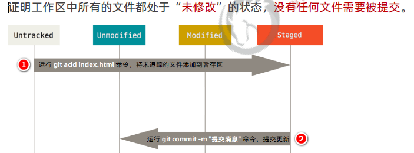
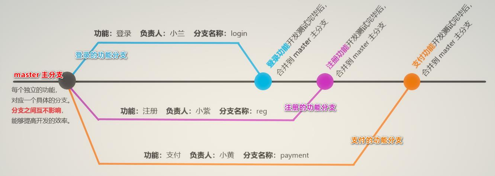
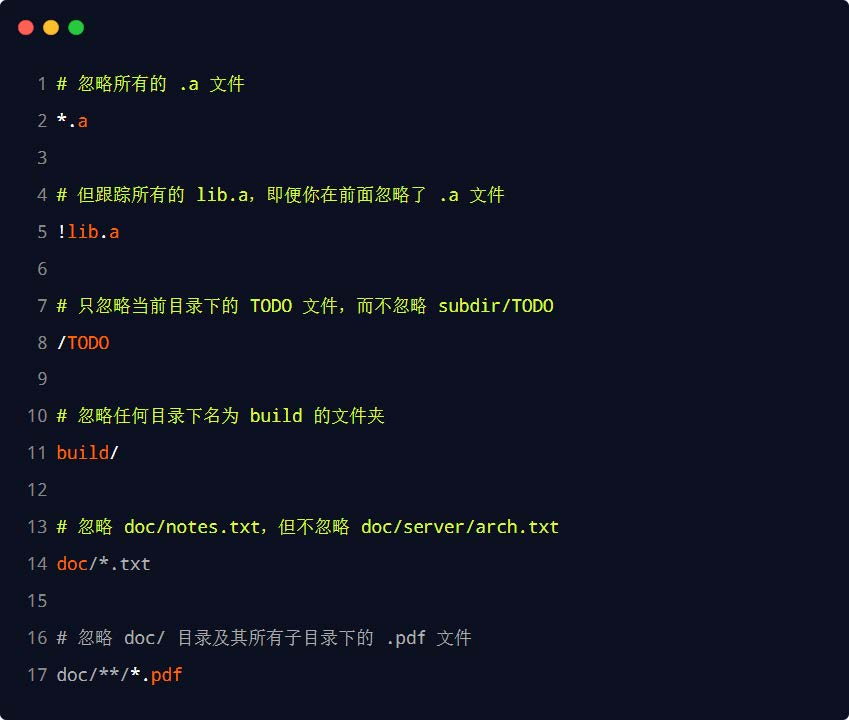

# 更新git

```
git --version
git update-git-for-windows
```

# git中的选项解释

```
-d --delete：删除
-D --delete --force的快捷键
-f --force：强制
-m --move：移动或重命名
-M --move --force的快捷键
-r --remote：远程
-a --all：所有
-s --short：精简
-v --verbose：详细
```

# git config

```bash
cd /c/Users/"Yating Liu"/Desktop/Inf43Hw3
# 配置的用户名和邮箱地址会被写入到C:/Users/用户名文件夹/.gitconfig文件中。这个是git的全局配置文件，配置一次即可永久生效
# --global表示该电脑下的所有仓库都会使用这个配置，在文件名有空格时，使用引号
git config --global user.name "AbyssV"
git config --global user.email "yatinl4@uci.edu"
git config --global -l # To look at all your configuration information

git help branch # 查看帮助手册
git branch -h # 更简洁的说明
```

# set up new repo locally

```bash
mkdir newProj
# make some changes
git init # create a local git repo

git status (branch master)
git status -s / git status --short # 更精简，未跟踪文件前面有红色的??标记，新添加到暂存区的有绿色的A标记，在暂存区但是修改过后没放入暂存区的文件前面有红色的M标记
# git add可以
# 跟踪新文件
# 把已跟踪的、且已修改的文件放到暂存区
# 把有冲突的文件标记为已解决状态
git add file1.txt file2.txt / git stage file1.txt # git stage is really just another name for git add
git add *.txt
git commit -a -m "Now has my major" / git commit -am "Now has my major" # git会自动把所有已经跟踪过的文件暂存起来一起提交，可以省略单独的git add步骤

# 如果已经有仓库了，可以直接到这步
git remote add origin https://gitee.com/AbyssV/newProj.git
git push -u origin master

```

## git add

when you `add` a file you are telling git to keep track of it.`add` also tells Git to stage the file, which means put it in the stage of being ready to be committed



>```git add .``` vs. ```git add -A``` vs. ```git add -p```
>
>The difference is that ```git add -A``` also stages files in higher directories that still belong to the same git repository. ```git add .``` only affects the current directory and subdirectories. 
>
>And better than ```git add .``` is ```git add -p``` because it will interactively ask what to stage, this will show you all the changes again and will show you comment/logging that you forgot to remove as well. Also commit often, as large changes tend to be hard to review/oversee.
>
>推荐`git add .`

## git commit

when you `commit`, you in effect copy all staged files to the repository. The `-m` is a flag (that's what the hyphen indicates) which tells git that the following string is a message to record with the commit.

```bash
git commit -m "Committing a new file with my name"
git commit -a -m "Now has my major"/git commit -am "Now has my major" # the power of the -a flag is that it tells git to automatically stage all tracked, modified files before the commit
git commit --amend -m "Added favorite restaurant and movie" # amend your commit message 
```

# 删除相关

## git rm

you use the `git add` command to stage a new or modified file. However, to stage the deletion of a file, you need to use then `git rm` So run the commands `git add file1.txt` and `git rm file2.txt` to set the stage

>从git仓库和工作区同时移除对应的文件, 可以使用`git rm [-f]`
>`git rm file` = `rm file`+ `git add file`
>`rm file`删除本地文件
>`git add file`提交删除的步骤同步到git仓库
>
>***
>
>从暂存区和git仓库中移除指定的文件，但是保留工作区的文件，可以使用`git rm --cached`
>
>`git rm --cached file`从暂存区删除该文件，并将其设置为未跟踪
>
>当我们需要删除暂存区或分支上的文件, 但本地又需要使用, 只是不希望这个文件被版本控制, 可以使用`git rm --cached`
>`git rm --cached`会从index里面删除该文件，下次commit的时候会修改git仓库，但是本地的文件还是保留
>
>***
>
>`git checkout -- 文件名`把对工作区对应文件的修改，还原成git仓库中所保留的版本。它会覆盖工作区中指定的文件。注意：所有的修改会丢失，且无法恢复！危险性较高，请谨慎操作！
>
>详见git checkout 文件层面
>
>***
>
>`git reset HEAD 文件名`会从缓存区移除对应的文件，而不会影响工作目录中的更改
>
>详见git reset 文件层面

# 重置提交

HEAD和HASH

replacing xxxx with the <u>**first**</u> four digits/characters from that hash (thankfully typing in the entire hash is not required). You will see a frightening message about a detached HEAD. git can keep track of separate, parallel, streams of edits to a project. Each stream of edits is called a branch, and a branch can have a name. For instance, multiple programmers who are working on and commiting changes to the same file will probably establish different branches. HEAD is git-ese for the current (not necessarily the last) commit in the current branch. 

## git reset

在提交层面上，reset将一个分支的末端指向另一个提交。这可以用来移除当前分支的一些提交

```bash
git checkout hotfix 
git reset HEAD~2 # 让hotfix分支向后回退了两个提交
```

hotfix分支末端的两个提交现在变成了悬挂提交。也就是说，下次Git执行垃圾回收的时候，这两个提交会被删除。换句话说，如果你想扔掉这两个提交，你可以这么做

The purpose of the ```git reset``` command is to move the current HEAD to the commit specified (in this case, the HEAD itself, one commit before HEAD and so on).

the version after xxxx will be deleted, to push to remote repo, you have to use ```git push -f``` because remote origin still has HEAD points to the deleted commit

```bash
# 其他参数
--soft – # 影响git仓库
--mixed – # 默认选项。影响git仓库和缓存区
--hard – # 影响git仓库，缓存区和工作目录

git reset --mixed HEAD # 将你当前的改动从缓存区中移除，但是这些改动还留在工作目录中
git reset --hard HEAD # 完全舍弃你没有提交的改动，**常用**
git reset --keep <commit> # 将HEAD重置到上一次提交的版本，并保留未提交的本地修改
# ------------------------------------------------------------------------------------
git reset --hard xxxx
git reset --hard HEAD       # going back to HEAD
git reset --hard HEAD^      # going back to the commit before HEAD
git reset --hard HEAD~2     # going back two commits before HEAD
git reset --hard HEAD@{1}   # undo a hard reset on Git
```

### 文件层面

当检测到文件路径时，`git reset` 将缓存区同步到你指定的那个提交。比如，下面这个命令会将倒数第二个提交中的foo.py加入到缓存区中，供下一个提交使用

```bash
git reset HEAD~2 foo.py
```

和提交层面的`git reset`一样，通常我们使用HEAD而不是某个特定的提交。运行`git reset HEAD foo.py` 会将当前的foo.py从缓存区中移除出去，而不会影响工作目录中对foo.py的更改

`--soft`、`--mixed`和`--hard`对文件层面的`git reset`毫无作用，因为**缓存区中的文件一定会变化，而工作目录中的文件一定不变**

## git checkout

对于快速查看项目旧版本来说非常有用

**This is useful for quickly inspecting an old version of your project.** However, since there is no branch reference to the current HEAD, this puts you in a detached HEAD state. **This can be dangerous if you start adding new commits because there will be no way to get back to them after you switch to another branch. **For this reason, you should always create a new branch before adding commits to a detached HEAD.

### 文件层面

checkout一个文件和带文件路径`git reset` 非常像，除了它更改的是工作目录而不是缓存区。不像提交层面的checkout命令，它不会移动HEAD引用，也就是你不会切换到别的分支上去

Unlike the commit-level version of this command, this does not move the `HEAD` reference, which means that you won’t switch branches.

比如，下面这个命令将工作目录中的foo.py同步到了倒数第二个提交中的foo.py

```bash
git checkout HEAD~2 foo.py
```

和提交层面相同的是，它可以用来检查项目的旧版本，但作用域被限制到了特定文件

如果你缓存并且提交了checkout的文件，它具备将某个文件回撤到之前版本的效果。注意它撤销了这个文件后面所有的更改

==**和`git reset` 一样，这个命令通常和HEAD一起使用。比如`git checkout HEAD foo.py`等同于舍弃foo.py没有缓存的更改。这个行为和`git reset HEAD --hard`很像，但只影响特定文件**==（确实很像）

Like `git reset`, this is commonly used with `HEAD` as the commit reference. For instance, `git checkout HEAD foo.py` has the effect of discarding unstaged changes to `foo.py`. This is similar behavior to `git reset HEAD --hard`, but it operates only on the specified file.

==**If you stage and commit the checked-out file, this has the effect of "reverting" to the old version of that file. Note that this removes all of the subsequent changes to the file, whereas the `git revert` command undoes only the changes introduced by the specified commit.**==

## git revert

revert撤销一个提交的同时会创建一个新的提交。这是一个安全的方法，因为它不会重写提交历史。比如，下面的命令会找出倒数第二个提交，然后创建一个新的提交来撤销这些更改，然后把这个提交加入项目中

```bash
git checkout hotfix
git revert HEAD~2
```

> 相比`git reset`，它不会改变现在的提交历史。因此，`git revert`可以用在公共分支上，`git reset`应该用在私有分支上。
>
> 你也可以把`git revert`当作撤销已经提交的更改，而`git reset HEAD`用来撤销没有提交的更改。
>
> 就像`git checkout` 一样，`git revert` 也有可能会重写文件。所以，Git会在你执行revert之前要求你提交或者缓存你工作目录中的更改。

in `git reset`, you delete the older commit and move the head backwards, in` git revert` you are introducing an order version to the current branch and move the head forward. When you merge with another branch, the changes may be introduced again in using reset, but will not be introduced if using revert. 

This method would not have the disadvantage of ```git reset```, it would point HEAD to newly created reverting commit and **it is ok to directly push the changes to remote without using the ```-f``` option**

## git restore


## 总结

| 命令         | 作用域   | 常用情景                                                     |
| ------------ | -------- | ------------------------------------------------------------ |
| git reset    | 提交层面 | 在私有分支上舍弃一些没有提交的更改                           |
| git reset    | 文件层面 | 将文件从缓存区中移除                                         |
| git checkout | 提交层面 | 切换分支或查看旧版本                                         |
| git checkout | 文件层面 | 舍弃工作目录中的更改                                         |
| git revert   | 提交层面 | 在公共分支上回滚更改（通过创建一个截然不同的新提交来重置一个提交） |
| git revert   | 文件层面 | 无                                                           |

>A `revert` is an operation that takes a specified commit and creates a new commit which inverses the specified commit. git revert can only be run at a commit level scope and has no file level functionality.
>
>A `reset` is an operation that takes a specified commit and resets the "three trees" to match the state of the repository at that specified commit. A reset can be invoked in three different modes which correspond to the three trees.
>
>`checkout` and `reset` are generally used for making local or private 'undos'. They modify the history of a repository that can cause conflicts when pushing to remote shared repositories. Revert is considered a safe operation for 'public undos' as it creates new history which can be shared remotely and doesn't overwrite history remote team members may be dependent on.

***

>我个人觉得checkout提交层面只是单纯的把HEAD到别的commit id（但是因为HEAD和当前的branch detached了，可能会回不去，适合看order version），```git checkout HEAD file```是将file恢复到git仓库中的记录（即放弃工作区未提交的修改），所有之后的修改都会丢失，无法撤销操作。reset提交层面是将HEAD往过去移，之后的提交都会被删除。reset的三种模式-hard，mix，soft分别对应工作区+stage snopshot+commit history，snopshot+commit hisotry(default)，commit history。 ```git reset file```是unstage某个file，reset file不会改变工作区的文件（只会同步缓存区）。revert是增加新的commit并且将HEAD向前移达到撤回操作的效果。git rm会先删除工作区的文件，然后commit该删除操作，而加上--cache则会在stage里删除，但是在working directory保留。每一个commit都对应一个log，每一个log都有HEAD做标记

推荐阅读 [Bitbucket Resetting, Checking Out & Reverting](https://www.atlassian.com/git/tutorials/resetting-checking-out-and-reverting)

# 合并提交

## git merge

```bash
git merge
# 如果有merge conflicts
git status # 查看哪些文件有conflict
git diff # 查看不一致的地方，>>>>>和======中间的是本地的，下面的是remote的
# 推荐使用ide merge，这个工具我不会用
git mergetool
# 解决之后提交修改
git add .
git commit -m "fix merge conflicts"
# 覆盖远程？
git fetch origin master
git merge commit_hash # 合并特定commit
git push --force origin # 强制覆盖
```

### git merge --abort

该命令仅仅在合并后导致冲突时才使用。`git merge --abort`将会抛弃合并过程并且尝试重建合并前的状态。但是，当合并开始时如果存在未commit的文件，`git merge --abort`在某些情况下将无法重现合并前的状态（特别是这些未commit的文件在合并的过程中将会被修改时）

>警告：运行`git-merge`时含有大量的未commit文件很容易让你陷入困境，这将使你在冲突中难以回退。因此非常不鼓励在使用`git-merge`时存在未commit的文件，建议使用`git-stash`命令将这些未commit文件暂存起来，并在解决冲突以后使用`git stash pop`把这些未commit文件还原出来。

### 关于合并的其他概念

#### 合并前的检测

**在合并外部分支时，你应当保持自己分支的整洁，否则的话当存在合并冲突时将会带来很多麻烦**

为了避免在合并提交时记录不相关的文件，如果有任何在index所指向的HEAD节点中登记的未提交文件，`git pull`和`git merge`命令将会停止

#### fast-forward合并

通常情况下分支合并都会产生一个合并节点，但是在某些特殊情况下例外。例如调用`git pull`命令更新远端代码时，如果本地的分支没有任何的提交，那么没有必要产生一个合并节点。这种情况下将不会产生一个合并节点，HEAD直接指向更新后的顶端代码，这种合并的策略就是fast-forward合并


## git rebase


```bash
git rebase 分支名 # 将当前版本重置到分支中
git rebase --abort # 退出重置
git rebase --continue # 解决冲突或继续重置
```

现在我们有这样的两个分支,test和master，提交如下：

```bash
       D---E test
      /
 A---B---C---F--- master
```

在master执行`git merge test`,然后会得到如下结果：

```bash
       D--------E
      /          \
 A---B---C---F----G---   test, master
```

在master执行`git rebase test`，然后得到如下结果：

```bash
A---B---D---E---C‘---F‘---   test, master
```

merge操作会生成一个新的节点，之前的提交分开显示。而rebase操作不会生成新的节点，是将两个分支融合成一个线性的提交

### rebase好处

想要更好的提交树，使用rebase操作会更好一点。这样可以线性的看到每一次提交，并且没有增加提交节点

merge操作遇到冲突的时候，当前merge不能继续进行下去。手动修改冲突内容后，add修改，commit就可以了。而rebase操作的话，会中断rebase，同时会提示去解决冲突。解决冲突后，将修改add后执行`git rebase –continue`继续操作，或者`git rebase –skip`忽略冲突

### When to rebase? When to Merge?

If the feature branch you are getting changes from is shared with other developers, rebasing is not recommended, because the rebasing process will create inconsistent repositories. For individuals, rebasing makes a lot of sense.
**If you want to see the history completely same as it happened, you should use merge. Merge preserves history whereas rebase rewrites it.**
Rebasing is better to streamline a complex history, you are able to change the commit history by interactive rebase. You can remove undesired commits, squash two or more commits into one or edit the commit message.
Rebase will present conflicts one commit at a time whereas merge will present them all at once. It is better and much easier to handle the conflicts but you shouldn’t forget that reverting a rebase is much more difficult than reverting a merge if there are many conflicts. You can find details of a basic rebase process from git — Basic Rebase .

总结就是推荐merge，rebase会让commit history变得简单，但是相对解决conflit也很麻烦


# git stash暂存修改

`git stash`（git储藏）可用于以下情形，简单来说就是对于当前工作区的内容，不想删也不想提交：

- 发现有一个类是多余的，想删掉它又担心以后需要查看它的代码，想保存它但又不想增加一个脏的提交。这时就可以考虑`git stash`。
- 使用git的时候，我们往往使用分支（branch）解决任务切换问题，例如，我们往往会建一个自己的分支去修改和调试代码, 如果别人或者自己发现原有的分支上有个不得不修改的bug，我们往往会把完成一半的代码`commit`提交到本地仓库，然后切换分支去修改bug，改好之后再切换回来。这样的话往往log上会有大量不必要的记录。其实如果我们不想提交完成一半或者不完善的代码，但是却不得不去修改一个紧急Bug，那么使用`git stash`就可以将你当前未提交到本地（和服务器）的代码推入到Git的栈中，这时候你的工作区间和上一次提交的内容是完全一样的，所以你可以放心的修Bug，等到修完Bug，提交到服务器上后，再使用`git stash apply`将以前一半的工作应用回来。
- 经常有这样的事情发生，当你正在进行项目中某一部分的工作，里面的东西处于一个比较杂乱的状态，而你想转到其他分支上进行一些工作。问题是，你不想提交进行了一半的工作，否则以后你无法回到这个工作点。解决这个问题的办法就是`git stash`命令。储藏(stash)可以获取你工作目录的中间状态——也就是你修改过的被追踪的文件和暂存的变更——并将它保存到一个未完结变更的堆栈中，随时可以重新应用。

```bash
git stash # 存储临时改动
git stash save "save message" # 执行存储时，添加备注，方便查找，只有git stash也要可以的，但查找时不方便识别
git stash pop # 恢复改动。将缓存堆栈中的对应stash删除，并将对应修改应用到当前的工作目录下,默认为第一个stash,即stash@{0}，如果要应用并删除其他stash，命令：git stash pop stash@{$num} ，比如应用并删除第二个：git stash pop stash@{1}

git stash list # 查看stash了哪些存储
git stash show -p # 显示最近的存储的改动，如果想显示其他存存储，命令：git stash show stash@{$num}  -p ，比如第二个：git stash show stash@{1} -p
git stash apply # 应用某个存储,但不会把存储从存储列表中删除，默认使用第一个存储,即stash@{0}，如果要使用其他个，git stash apply stash@{$num} ， 比如第二个：git stash apply stash@{1} 
git stash drop stash@{$num} # 丢弃stash@{$num}存储，从列表中删除这个存储
git stash clear # 删除所有缓存的stash
git stash show # 显示做了哪些改动，默认show第一个存储,如果要显示其他存贮，后面加stash@{$num}，比如第二个 git stash show stash@{1}


git stash branch branch_name # 创建一个新的分支，检出你储藏工作时的所处的提交，重新应用你的工作，如果成功，将会丢弃储藏
```

## 暂存未跟踪或忽略的文件

默认情况下，`git stash`会缓存下列文件：

- 添加到暂存区的修改（staged changes）
- Git跟踪的但并未添加到暂存区的修改（unstaged changes）

但不会缓存一下文件：

- 在工作目录中新的文件（untracked files）
- 被忽略的文件（ignored files）

`git stash`命令提供了参数用于缓存上面两种类型的文件。使用`-u`或者`--include-untracked`可以stash untracked文件。使用`-a`或者`--all`命令可以stash当前目录下的所有修改。对于新增的文件，也可以先`git add`再使用`git stash`

# git diff  

```bash
git diff # 当工作区有改动，临时区为空，diff的对比是“工作区与最后一次commit提交的仓库的共同文件”；当工作区有改动，临时区不为空，diff对比的是“工作区与暂存区的共同文件”（通常是这个）
git diff --cached / git diff --staged # 显示暂存区和最后一次commit(HEAD)之间的所有不相同文件的增删改(git diff --cached和git diff –staged相同作用)
git diff HEAD # 显示工作目录(已track但未add文件)和暂存区(已add但未commit文件)与最后一次commit之间的的所有不相同文件的增删改
git diff HEAD~X或git diff HEAD^^^…(后面有X个^符号，X为正整数) # 可以查看最近一次提交的版本与往过去时间线前数X个的版本之间的所有文件之间的增删改
git diff <分支名1> <分支名2> # 比较两个分支上最后commit的内容的差别，会以补丁的形式显示差异，可能不太直观
git diff branch1 branch2 --stat # 显示出所有有差异的文件(不详细,没有对比内容)
git diff branch1 branch2 # 显示出所有有差异的文件的详细差异(更详细)
git diff branch1 branch2 具体文件路径 # 显示指定文件的详细差异(对比内容)
```

# git log

A command such as git log sends text output to the shell using a bash command named less to display one windowfull of output at a time. At the`:`prompt, you can press<kbd>h</kbd> for help, <kbd>q</kbd> to exit, <kbd>Enter</kbd> to advance one line, or <kbd>Space</kbd> to advance one screenfull

```bash
git log # 按时间先后排序出所有的提交历史，最近的提交排在最上面
git log -2 # 只展示最新的两条提交历史
git log -2 --pretty=oneline # 在一行上展示最近两条提交历史的信息
git log -2 --pretty=format:"%h | %an | %ar | %s" # 在一行上展示最近两条提交历史的信息，并自定义输出的格式。%h提交的哈希值，%ah作者名字，%ar作者修订日期，%s提交说明

git log --reverse # To see the log entries for the earliest commits
git log --skip=100 -5 #  N is a non-negative integer. This means to skip 100 commits before starting to show the commit output
git log -p -3 # the -p flag will show you the diffs for each change. The -3 will limit what's displayed to the last 3 log entries

git log -1 -p --before='2014-03-31 11:52:45' # That tells git you only want to see log entries for changes made before March 31, 2014 at 11:52:45am. The -1 means you only want to see one entry, and the -p means you want to see a diff of the changes

# you can use only the first four digits/characters of the hash. If git complains that the short SHA1 is ambiguous (because more than one commit has the same first four digits), try adding a few more digits from the long hash
git log -1 4778b17e939e119417cc5ec25b82c4e9a65621b2
git show 4778b17e939e119417cc5ec25b82c4e9a65621b24

git blame filename # 谁，在什么时间，修改了文本的什么内容
# 显示指定文件foo的40到60行范围的每一行被哪次修订和哪个作者最后一次修改
git blame -L 40,60 foo
git blame -L 40,+21 foo
```

# 版本管理（未完成）

tag可以用来回滚

```bash
git tag # 查看所有标签 
git tag tagname [commit ID] # 创建标签
git tag -a tagname -m "comment" # 指定提交信息 
git tag -d tagname # 删除标签
git tag -r # 查看远程版本
git push origin tagname # 发布远程版本(本地版本push到远程)
git push origin :refs/tags/[name] # 删除远程版本
```

# 分支管理

在实际工作中，master主分支的作用是：用来保存和记录整个项目已完成的功能代码。因此，不允许程序员直接在master分支上修改代码，因为这样做的风险太高，容易导致整个项目崩溃



```bash
git branch login # create a new branch login
git checkout login # switch to login branch 
git checkout -b login # create a new branch login and switch to it

git checkout master
git merge login # login分支开发完成后，切换到master分支并合并login分支。注意必须要先切换到master分支

git branch -d login # 开发完成后，删除login分支 -d选项只能删除已经参与了合并的分支，对于未有合并的分支是无法删除的。如果想强制删除一个分支，可以使用-D选项
git branch -dr branch_name # 删除远程分支
git branch -m old_name new_name # rename branch name

git branch # see all the local branch, the current branch is green with asterisk 
git branch -r # see remote branch
git branch -a # see local and remote branch

git push origin :branch_name # delete remote branch and push to server。我也不确定，只能按需要自己搜了
git push origin branch_name # push local branch to server
git diff <source_branch> <target_branch> # view changes between two branches
```

# 远程仓库的两种访问方式

Github上的远程仓库，有两种访问方式，分别是HTTPS和 SSH。它们的区别是：

- HTTPS：零配置；但是每次访问仓库时，需要重复输入Github的账号和密码才能访问成功

- SSH：需要进行额外的配置；但是配置成功后，每次访问仓库时，不需重复输入Github的账号和密码


## 配置SSH key

SSH key的作用：实现本地仓库和Github之间免登录的加密数据传输。 SSH key的好处：免登录身份认证、数据加密传输。

SSH key由两部分组成，分别是：

1. id_rsa（私钥文件，存放于客户端的电脑中即可）
2. id_rsa.pub（公钥文件，需要配置到Github中


```bash
ssh-keygen -t rsa -C "yatinl4@uci.edu"
cd /c/Users/admin/.ssh
# 连续敲击3次回车，即可在 C:\Users\用户名文件夹\.ssh目录中生成id_rsa和id_rsa.pub两个文件
cat id_rsa.pub
# 在浏览器中登录Github，点击头像->Settings->SSH and GPG Keys->New SSH key
# 将id_rsa.pub文件中的内容，粘贴到Key对应的文本框中
# 在Title文本框中任意填写一个名称，来标识这个Key从何而来
```

检测Github的SSH key是否配置成功

```bash
ssh -T git@github.com 
# 显示如下内容
Enter passphrase for key '/c/Users/admin/.ssh/id_rsa': 1234
Hi AbyssV! You've successfully authenticated, but GitHub does not provide shell access.
```

# Remote Git Repo set up

```bash
# 本地没有现成的git仓库，github上的内容
echo "# demo4" >> README.md
git init 
git add README.md
git commit -m "first commit"
git remote add origin git@github.com:tylerdemo/demo4.git
git push -u origin master

git remote add origin git@github.com:tylerdemo/demo4.git # 将本地仓库和远程仓库进行关联，并把远程仓库命名为origin
git remote -v # 查看远程仓库
git remote rm name # 删除远程仓库
git remote show 远程仓库名称 # 查看远程仓库中，所有分支列表的信息
git checkout 远程分支的名称 
git checkout pay # 从远程仓库中，把对应的远程分支下载到本地仓库，保持本地分支和远程分支的名称相同
git checkout -b 本地分支名称 远程仓库名称/远程分支名称
git checkout -b payment origin/pay # 从远程仓库中，把对应的远程分支下载到本地仓库，并把下载的分支重命名

git push -u 远程仓库名称 本地分支名称:远程分支名称 # # 将本地仓库中的内容推送到远程仓库中。-u代表本地的master, master或其他branch。只在第一次推送时需要带-u参数，以后可以直接使用git push
git push -u origin payment:pay 
git push -u origin payment # 如果希望远程分支的名称和本地分支保持一致，可以对命令进行简化
git push 远程仓库名称 --delete 远程分支名称
git push origin --delete pay # 删除远程仓库中指定名称的远程分支

git pull 远程仓库名称 本地分支名称:远程分支名称
git pull origin branch_name --allow-related-histories
git pull --rebase <远程主机名> <远程分支名>:<本地分支名> # 使用rebase的模式进行合并 ，git pull --rebase = git pull+git rebase(not merge)
```

## git clone

如果是clone，默认仓库是绑定上去的，所以```git clone```的repo，通过```git push```就可以了

clone完成之后，git会自动将该远程仓库命名为origin

```bash
git clone 远程仓库的地址
git clone -b branch_name https://github.com/reddit/reddit.git
```

It's important to understand that **this is not only a copy of the source code, but also a copy of the history of changes stored by git. **

## git pull和git fetch

```bash
git fetch <远程主机名> # 这个命令将某个远程主机的更新全部取回本地，但是不会自动合并
git fetch <远程主机名> <分支名> # 取回特定分支的更新，注意之间有空格
git fetch origin master # 取回origin主机的master分支
git fetch --all # 获取远程仓库所有分支的更新
git fetch --tags
git log -p FETCH_HEAD # 取回更新后，会返回一个FETCH_HEAD，指的是某个branch在服务器上的最新状态，我们可以在本地通过它查看刚取回的更新信息
git diff -stat dev origin/dev # 查看本地dev分支和远程dev分支的区别
git merge FETCH_HEAD    # 将拉取下来的最新内容合并到当前所在的分支中。相当于 git pull <远程主机名> <远程分支名>:<本地分支名>
```

`git pull`和`git fetch`的区别在于`git fetch`是将远程主机的最新内容拉到本地，用户在检查了以后决定是否合并到工作本机分支中。而`git pull`则是将远程主机的最新内容拉下来后直接合并，即`git pull` = `git fetch` + `git merge`，这样可能会产生冲突，需要手动解决

# 开源许可协议

开源并不意味着完全没有限制，为了限制使用者的使用范围和保护作者的权利，每个开源项目都应该遵守开源许可协议（Open Source License）

常见的5种开源许可协议

1. BSD（Berkeley Software Distribution）

2. Apache Licence 2.0

3. GPL（GNU General Public License）
   - 具有传染性的一种开源协议，不允许修改后和衍生的代码做为闭源的商业软件发布和销售
   - 使用GPL的最著名的软件项目是：Linux

4. LGPL（GNU Lesser General Public License）
5. MIT（Massachusetts Institute of Technology, MIT）
   - 是目前限制最少的协议，唯一的条件：在修改后的代码或者发行包中，必须包含原作者的许可信息
   - 使用 MIT 的软件项目有：jquery、Node.js

关于更多开源许可协议的介绍，可以参考[博客](https://www.runoob.com/w3cnote/open-source-license.html)

## 开源项目托管平台

专门用于免费存放开源项目源代码的网站，叫做开源项目托管平台。目前世界上比较出名的开源项目托管平台主要有以下3个

1. Github（全球最牛的开源项目托管平台，没有之一）

2. Gitlab（对代码私有性支持较好，因此企业用户较多）

3. Gitee（又叫做码云，是国产的开源项目托管平台。访问速度快、纯中文界面、使用友好）

以上3个开源项目托管平台，只能托管以Git管理的项目源代码，因此，它们的名字都以Git开头

# .gitignore

```
touch .gitignore
```

一般我们总会有些文件无需纳入git的管理，也不希望它们总出现在未跟踪文件列表。在这种情况下，我们可以创建一个名为`.gitignore`的配置文件，列出要忽略的文件的匹配模式

文件`.gitignore`的格式规范如下

1. 以`#`开头的是注释
2. 以`/`结尾的是目录
3. 以`/`开头防止递归
4. 以`!`开头表示取反
5. 可以使用glob模式进行文件和文件夹的匹配（glob指简化了的正则表达式）
   - 星号`*`匹配零个或多个任意字符
   - `[abc]`匹配任何一个列在方括号中的字符 （此案例匹配一个**a**或匹配一个**b**或匹配一个**c**）
   - 问号`?`只匹配一个任意字符
   - 在方括号中使用短划线分隔两个字符， 表示所有在这两个字符范围内的都可以匹配（比如`[0-9]`表示匹配所有0到9的数字）
   - 两个星号`**`表示匹配任意中间目录（比如`a/**/z`可以匹配**a/z** 、**a/b/z**或**a/b/c/z**等）



# 跨团队协作

1. 程序员C fork仓库
2. 程序员C 将仓库克隆在本地进行修改
3. 程序员C 将仓库推送到远程
4. 程序员C 发起pull request
5. 原仓库作者审核
6. 原仓库作者合并代码

fork才需要发起pull request？

# 示例

<u>将dev分支合并到master</u>

1. dev分支上的修改ok后，切换到master分支：`git checkout master`（注意，只有checkout切换到当前分支后，pull代码，才能看见当前分支的代码，如果没有checkout到当前分支，pull了也在相应文件夹下也看不见当前分支的代码，而是上次checkout的代码）
2. 将dev分支合并到master分支：`git merge --no-ff dev`，把dev的修改merge到master。`--no-ff` 选项不使用fast-forward方式合并，保留分支的commit历史
3. 将合并之后的代码push到远程仓库：`git push -u origin master`

# 推荐阅读

[一个成功的Git分支模型](https://www.jianshu.com/p/b357df6794e3)
