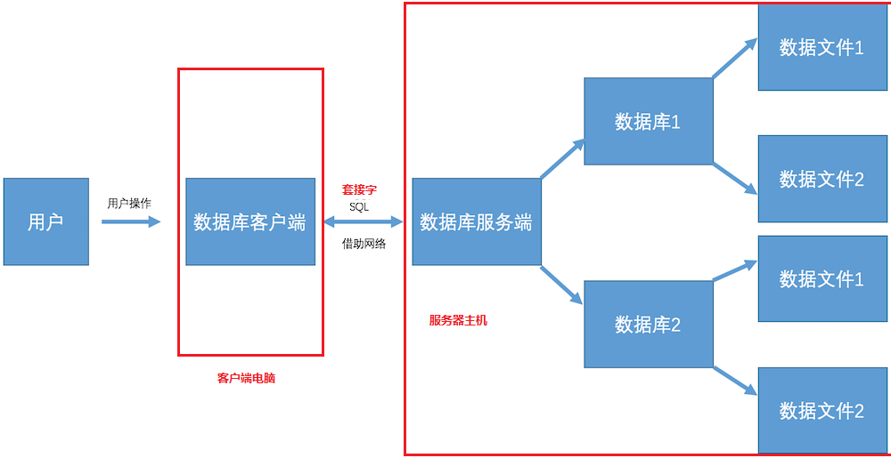
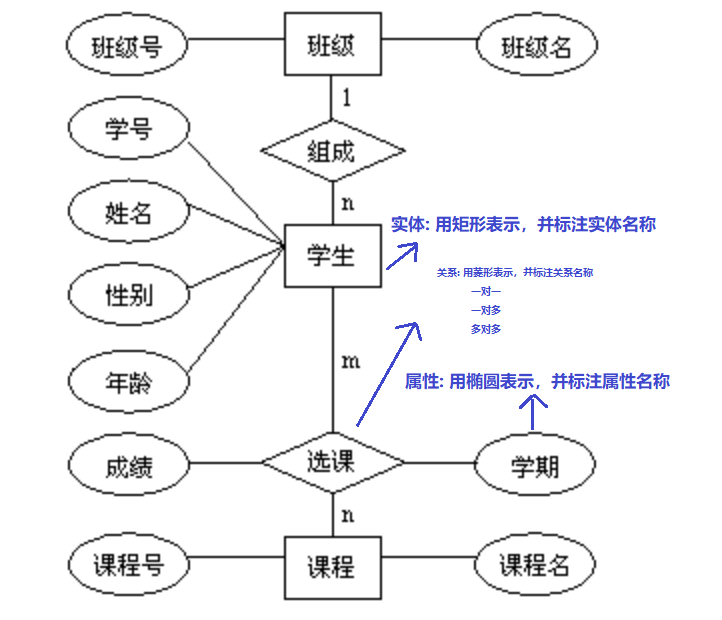

注意：我在存储过程，触发器中的分隔符写的不正确，`delimiter`前后都是需要加上空格的

```sql
delimiter //
...
delimiter ;
```

如果创建fk失败，注意refer的键必须是主键

mysql中没有`check`，只能使用enum或trigger替换

注意在subquery中不要用别名

***

`distinct`:

- 在对字段进行去重的时候，要保证`distinct`在所有字段的最前面
- 如果`distinct`关键字后面有多个字段时，则会对多个字段进行组合去重，只有多个字段组合起来的值是相等的才会被去重

***

`in`和`exists`的区别

- 使用上的区别：`exists`中放一个子查询有记录返回true，无记录返回false（NULL也算有记录），in中查询结果集只能有一个字段
- 性能上的区别：`in`要把缓存到内存中，`exists`不需要缓存结果
  - `in`适合B表比A表数据小的情况
  - `exists`适合B表比A表数据大的情况
  - 当A表数据与B表数据一样大时,`in`与`exists`效率差不多,可任选一个使用
  - 


[脚本之家](https://www.jb51.net/article/214052.htm)

***


# 数据库的介绍

数据库就是存储和管理数据的仓库，数据按照一定的格式进行存储，用户可以对数据库中的数据进行增加、修改、删除、查询等操作。

**数据库的特点**

1. 持久化存储
2. 读写速度极高
3. 保证数据的有效性

## 数据库的分类

- **关系型数据库**：是指采用了关系模型来组织数据的数据库，简单来说，关系模型指的就是二维表格模型，好比Excel文件中的表格，强调使用表格的方式存储数据。
  - 关系型数据库中核心元素
    - 数据行
    - 数据列
    - 数据表
    - 数据库(数据表的集合)
  - 常用的关系型数据库
    - Oracle
    - Microsoft SQL Server
    - MySQL
    - SQLite：手机端使用的数据库
- **非关系型数据库**：非关系型数据库，又被称为NoSQL（Not Only SQL )，意为不仅仅是SQL，对NoSQL 最普遍的定义是“非关联型的”，强调Key-Value的方式存储数据。
  - 常用的非关系型数据库:
    - MongoDB
    - Redis

## 关系型数据库管理系统

数据库管理系统（英语全拼：Relational Database Management System，简称RDBMS）是**为管理关系型数据库而设计的软件系统，如果大家想要使用关系型数据库就需要安装数据库管理系统，其实就是一个应用软件。**

关系型数据库管理系统可以分为:

- 关系型数据库服务端软件：主要负责管理不同的数据库，而每个数据库里面会有一系列数据文件，数据文件是用来存储数据的, 其实数据库就是一系列数据文件的集合。
- 关系型数据库客户端软件：主要负责和关系型数据库服务端软件进行通信, 向服务端传输数据或者从服务端获取数据.



说明:

1. 用户操作关系型数据库客户端，实现数据库相关操作。
2. 关系数据库客户端借助网络使用SQL语言和关系型数据库服务端进行数据通信
3. 关系型数据库服务端管理着不同的数据库，每个数据库会有一系列的数据文件，数据都保存在数据文件里面，每个数据库可以理解成是一个文件夹。

## E-R模型的介绍

E-R模型即实体-关系模型，E-R模型就是描述数据库存储数据的结构模型。

E-R模型的使用场景:

1. 对于大型公司开发项目，我们需要根据产品经理的设计，我们先使用建模工具, 如:power designer，db desinger等这些软件来画出实体-关系模型(E-R模型)
2. 然后根据三范式设计数据库表结构



**一对一的关系:**


- 关系也是一种数据，需要通过一个字段存储在表中
- 1对1关系，在表A或表B中创建一个字段，存储另一个表的主键值

**一对多的关系:**


- 1对多关系，在多的一方表(学生表)中创建一个字段，存储班级表的主键值

**多对多的关系:**


- 多对多关系，新建一张表C，这个表只有两个字段，一个用于存储A的主键值，一个用于存储B的主键值

## 三大范式

1. 第一范式（1NF）: 强调的是列的原子性，即列不能够再分成其他几列。
2. 第二范式（2NF）: 满足 1NF，另外包含两部分内容，一是表必须有一个主键；二是非主键字段必须完全依赖于主键，而不能只依赖于主键的一部分。
3. 第三范式（3NF）: 满足 2NF，另外非主键列必须直接依赖于主键，不能存在传递依赖。即不能存在：非主键列 A 依赖于非主键列 B，非主键列 B 依赖于主键的情况。

# 事务

事务就是用户定义的一系列执行SQL语句的操作, 这些操作要么完全地执行，要么完全地都不执行， 它是一个不可分割的工作执行单元。例如在日常生活中，有时我们需要进行银行转账，这个银行转账操作背后就是需要执行多个SQL语句，假如这些SQL执行到一半突然停电了，那么就会导致这个功能只完成了一半，这种情况是不允许出现，要想解决这个问题就需要通过事务来完成。

## 事务的四大特性(ACID)

- 原子性(Atomicity)
  - 一个事务必须被视为一个不可分割的最小工作单元，整个事务中的所有操作要么全部提交成功，要么全部失败回滚，对于一个事务来说，不可能只执行其中的一部分操作，这就是事务的原子性
- 一致性(Consistency)
  - 数据库总是从一个一致性的状态转换到另一个一致性的状态。（在前面的例子中，一致性确保了，即使在转账过程中系统崩溃，支票账户中也不会损失200美元，因为事务最终没有提交，所以事务中所做的修改也不会保存到数据库中。）
- 隔离性(Isolation)
  - 通常来说，一个事务所做的修改操作在提交事务之前，对于其他事务来说是不可见的。（在前面的例子中，当执行完第三条语句、第四条语句还未开始时，此时有另外的一个账户汇总程序开始运行，则其看到支票帐户的余额并没有被减去200美元。）
- 持久性(Durability)
  - 一旦事务提交，则其所做的修改会永久保存到数据库。

## 表的存储引擎

表的存储引擎就是提供存储数据一种机制，不同表的存储引擎提供不同的存储机制。在使用事务之前，先要确保表的存储引擎是 InnoDB 类型, 只有这个类型才可以使用事务，MySQL数据库中表的存储引擎默认是 InnoDB 类型。

- 常用的表的存储引擎是 InnoDB 和 MyISAM
- InnoDB 是支持事务的
- MyISAM 不支持事务，优势是访问速度快，对事务没有要求或者以select、insert为主的都可以使用该存储引擎来创建表

```mysql
-- 通过创表语句可以得知，goods表的存储引擎是InnoDB
show create table goods;
-- 修改表的存储引擎使用: alter table 表名 engine = 引擎类型;
alter table students engine = 'MyISAM';
```

## 事务的使用

- 开启事务后执行修改命令，变更数据会保存到MySQL服务端的缓存文件中，而不维护到物理表中
- MySQL数据库默认采用自动提交(autocommit)模式，也就是说修改数据(insert、update、delete)的操作会自动的触发事务,完成事务的提交或者回滚。如果没有显示的开启一个事务,那么每条sql语句都会被当作一个事务执行提交的操作。
- 当设置`autocommit=0`就是取消了自动提交事务模式，直到显示的执行`commit`和`rollback`表示该事务结束。
  - `set autocommit = 0`表示取消自动提交事务模式，需要手动执行`commit`完成事务的提交，`autocommit`标记是针对每个连接而不是针对服务器的
- pymysql里面的`conn.commit()`操作就是提交事务
- pymysql里面的`conn.rollback()`操作就是回滚事务
- 保留点（savepoint）指事务处理中设置的临时占位符（placeholder），你可以对它发布回退（与回退整个事务处理不同）
- 如果没有设置保留点，`ROLLBACK`会回退到`START TRANSACTION`语句处；如果设置了保留点，并且在`ROLLBACK`中指定该保留点，则会回退到该保留点
- 不能回退`SELECT`语句，回退`SELECT`语句也没意义；也不能回退`CREATE`和`DROP`语句。

```mysql
## 临时取消自动提交事务模式，手动提交修改数据操作
set autocommit = 0;
insert into students(name) values('刘三峰');
-- 需要执行手动提交，数据才会真正添加到表中, 验证的话需要重新打开一个连接窗口查看表的数据信息，因为是临时关闭自动提交模式
commit

## 开启事务
begin; 或者 start transaction;
SAVEPOINT delete1
// ...
ROLLBACK TO delete1
## 提交事务
-- 将本地缓存文件中的数据提交到物理表中，完成数据的更新。
commit;
#回滚事务
-- 放弃本地缓存文件中的缓存数据, 表示回到开始事务前的状态
rollback;
```

# 索引

索引在MySQL中也叫做“键”，它是一个特殊的文件，它保存着数据表里所有记录的位置信息，更通俗的来说，数据库索引好比是一本书前面的目录，能加快数据库的查询速度。当数据库中数据量很大时，查找数据会变得很慢，我们就可以通过索引来提高数据库的查询效率。

**主键列会自动创建索引**，查询主键速度会比较快。外键约束的字段也会自动创建索引

```mysql
## 索引的创建
-- 创建索引的语法格式
-- alter table 表名 add index 索引名[可选](列名, ..)
-- 给name字段添加索引
alter table classes add index my_index_name (name); -- 索引名不指定，默认使用字段名

## 查看
show index from Sells;
## 创建
create index price_idx on Sells(price);

## 索引的删除:
-- 删除索引的语法格式
-- alter table 表名 drop index 索引名
-- 如果不知道索引名，可以查看创表sql语句（key 'my_index_name' ('name')）
show create table classes;
alter table classes drop index my_index_name;

## 验证索引性能操作
-- 开启运行时间监测：
set profiling=1;
-- 查找第1万条数据ha-99999
select * from test_index where title='ha-99999';
-- 查看执行的时间：
show profiles;
-- 给title字段创建索引：
alter table test_index add index (title);
-- 再次执行查询语句
select * from test_index where title='ha-99999';
-- 再次查看执行的时间
show profiles;
```

## 联合索引

联合索引又叫复合索引，即一个索引覆盖表中两个或者多个字段，一般用在多个字段一起查询的时候。

联合索引的好处: 减少磁盘空间开销，因为每创建一个索引，其实就是创建了一个索引文件，那么会增加磁盘空间的开销。

**联合索引的最左原则**

在使用联合索引的时候，我们要遵守一个最左原则,即`index(name,age)`支持`name`、`name`和`age`组合查询,而不支持单独`age`查询，因为没有用到创建的联合索引。在使用联合索引的查询数据时候一定要保证联合索引的最左侧字段出现在查询条件里面，否则联合索引失效

```mysql
-- 创建联合索引
alter table teacher add index (name,age); -- 索引名不指定，默认使用第一个字段名
alter table teacher drop index name;
```

## MySQL中索引的优点和缺点和使用原则

- 优点：
  1. 加快数据的查询速度
- 缺点：
  1. 创建索引会耗费时间和占用磁盘空间（创建了索引文件），并且随着数据量的增加所耗费的时间也会增加
- 使用原则：
  1. 通过优缺点对比，不是索引越多越好，而是需要自己合理的使用。
  2. 对经常更新的表就避免对其进行过多索引的创建，对经常用于查询的字段应该创建索引，
  3. 数据量小的表最好不要使用索引，因为由于数据较少，可能查询全部数据花费的时间比遍历索引的时间还要短，索引就可能不会产生优化效果。
  4. 在一字段上相同值比较多不要建立索引，比如在学生表的"性别"字段上只有男，女两个不同值。相反的，在一个字段上不同值较多可是建立索引。

# 视图

视图是虚拟的表，本身不包含数据，也就不能对其进行索引操作。

对视图的操作和对普通表的操作一样。

视图具有如下好处：

- 简化复杂的 SQL 操作，比如复杂的连接；
- 只使用实际表的一部分数据；
- 通过只给用户访问视图的权限，保证数据的安全性；
- 更改数据格式和表示。

同样的视图也可以像真实的表一样更新数据，但是值得注意的是更新视图里的数据，也相当于对真实的表做了更新

对视图操作和对表操作相同，操作时把`drop/update table`换成`drop/update view`即可

```mysql
CREATE VIEW myview AS
SELECT Concat(col1, col2) AS concat_col, col3*col4 AS compute_col FROM mytable WHERE col5 = val;
```

# 存储过程

存储过程可以看成是对一系列SQL操作的批处理。

使用存储过程的好处：

- 代码封装，保证了一定的安全性
- 代码复用
- 由于是预先编译，因此具有很高的性能

命令行中创建存储过程需要自定义分隔符，因为命令行是以`;`为结束符，而存储过程中也包含了分号，因此会错误把这部分分号当成是结束符，造成语法错误。

包含`in`、`out`和`inout`三种参数

给变量赋值都需要用`select into`语句

每次只能给一个变量赋值，不支持集合的操作

```mysql
delimiter //
create procedure myprocedure(out ret int)
    begin
        declare y int;
        select sum(col1)
        from mytable
        into y;
        select y*y into ret;
    end //
delimiter;

call myprocedure(@ret);
select @ret;
```

# 游标

在存储过程中使用游标可以对一个结果集进行移动遍历。

游标主要用于交互式应用，其中用户需要对数据集中的任意行进行浏览和修改。

使用游标的四个步骤：

1. 声明游标，这个过程没有实际检索出数据；
2. 打开游标；
3. 取出数据；
4. 关闭游标；

```mysql
delimiter //
create procedure myprocedure(out ret int)
    begin
        declare done boolean default 0;

        declare mycursor cursor for
        select col1 from mytable;
        # 定义了一个 continue handler，当 sqlstate '02000' 这个条件出现时，会执行 set done = 1
        declare continue handler for sqlstate '02000' set done = 1;

        open mycursor;

        repeat
            fetch mycursor into ret;
            select ret;
        until done end repeat;

        close mycursor;
    end //
 delimiter ;
```

# 触发器

触发器会在某个表执行以下语句时而自动执行：`DELETE`、`INSERT`、`UPDATE`。

触发器必须指定在语句执行之前还是之后自动执行，之前执行使用`BEFORE`关键字，之后执行使用`AFTER`关键字。`BEFORE`用于数据验证和净化，`AFTER`用于审计跟踪，将修改记录到另外一张表中。

`INSERT`触发器包含一个名为**NEW**的虚拟表。

```mysql
CREATE TRIGGER mytrigger AFTER INSERT ON mytable
FOR EACH ROW SELECT NEW.col into @result;
SELECT @result; -- 获取结果
```

`DELETE`触发器包含一个名为**OLD**的虚拟表，并且是只读的

`UPDATE`触发器包含一个名为**NEW**和一个名为**OLD**的虚拟表，其中**NEW**是可以被修改的，而**OLD**是只读的

MySQL不允许在触发器中使用`CALL`语句，也就是不能调用存储过程

# 字符集

基本术语：

- 字符集为字母和符号的集合
- 编码为某个字符集成员的内部表示
- 校对字符指定如何比较，主要用于排序和分组

除了给表指定字符集和校对外，也可以给列指定

```mysql
CREATE TABLE mytable
(col VARCHAR(10) CHARACTER SET latin COLLATE latin1_general_ci )
DEFAULT CHARACTER SET hebrew COLLATE hebrew_general_ci;
```

可以在排序、分组时指定校对：

```sql
SELECT * FROM mytable ORDER BY col COLLATE latin1_general_ci;
```

# 权限管理

MySQL 的账户信息保存在**mysql**这个数据库中。

```mysql
USE mysql;
SELECT user FROM user;
-- 更改密码
-- 必须使用 Password() 函数进行加密。
SET PASSWROD FOR myuser = Password('new_password');

-- 创建账户，新创建的账户没有任何权限
CREATE USER myuser IDENTIFIED BY 'mypassword';
-- 修改账户名
RENAME USER myuser TO newuser;
-- 删除账户 
DROP USER myuser;

-- 查看权限  
SHOW GRANTS FOR myuser;
-- 授予权限，账户用username@host的形式定义，username@%使用的是默认主机名
GRANT SELECT, INSERT ON mydatabase.* TO myuser;
-- 删除权限
/*
GRANT和REVOKE可在几个层次上控制访问权限：
	- 整个服务器，使用GRANT ALL和 EVOKE ALL
	- 整个数据库，使用ON database.*
	- 特定的表，使用ON database.table
	- 特定的列
	- 特定的存储过程
*/
REVOKE SELECT, INSERT ON mydatabase.* FROM myuser;
```

# MySQL数据库

## SQL的介绍

SQL(Structured Query Language)是结构化查询语言，是一种用来操作RDBMS的数据库的语言。也就是说通过SQL可以操作 oracle,sql server,mysql,sqlite 等关系型的数据库。SQL语言不区分大小写。

SQL的作用是实现数据库客户端和数据库服务端之间的通信，SQL就是通信的桥梁。

SQL语言主要分为：

- DQL：数据查询语言，用于对数据进行查询，如`select`
- DML：数据操作语言，对数据进行增加、修改、删除，如`insert`、`update`、`delete`
- TPL：事务处理语言，对事务进行处理，包括`begin transaction`、`commit`、`rollback`
- DCL：数据控制语言，进行授权与权限回收，如`grant`、`revoke`
- DDL：数据定义语言，进行数据库、表的管理等，如`create`、`drop`

## 数据类型

数据类型是指在创建表的时候为表中字段指定数据类型，只有数据符合类型要求才能存储起来，使用数据类型的原则是:够用就行，尽量使用取值范围小的，而不用大的，这样可以更多的节省存储空间。

**常用数据类型如下:**

- 整数：`int`，`bit`
- 小数：`decimal`
  - `decimal`表示浮点数，如 `decimal(5, 2)` 表示共存5位数，小数占 2 位
- 字符串：`varchar`,`char`
  - `char`表示固定长度的字符串，如`char(3)`，如果填充`ab`时会补一个空格为`ab_ `，3表示字符数
  - `varchar`表示可变长度的字符串，如`varchar(3)`，填充`ab`时就会存储`ab`，3表示字符数
- 日期时间: `date`, `time`, `datetime`
- 枚举类型(`enum`)
- 字符串`text`表示存储大文本，当字符大于 4000 时推荐使用, 比如技术博客
  - text cant be primary key


对于图片、音频、视频等文件，不存储在数据库中，而是上传到某个服务器上，然后在表中存储这个文件的保存路径.

### 数据类型附录表

#### 整数类型

| 类型          | 字节大小 | 有符号范围(Signed)                         | 无符号范围(Unsigned)     |
| :------------ | :------- | :----------------------------------------- | :----------------------- |
| `TINYINT`     | 1        | -128 ~ 127                                 | 0 ~ 255                  |
| `SMALLINT`    | 2        | -32768 ~ 32767                             | 0 ~ 65535                |
| `MEDIUMINT`   | 3        | -8388608 ~ 8388607                         | 0 ~ 16777215             |
| `INT/INTEGER` | 4        | -2147483648 ~2147483647                    | 0 ~ 4294967295           |
| `BIGINT`      | 8        | -9223372036854775808 ~ 9223372036854775807 | 0 ~ 18446744073709551615 |

#### 字符串

| 类型       | 说明                        | 使用场景                     |
| :--------- | :-------------------------- | :--------------------------- |
| `CHAR`     | 固定长度，小型数据          | 身份证号、手机号、电话、密码 |
| `VARCHAR`  | 可变长度，小型数据          | 姓名、地址、品牌、型号       |
| `TEXT`     | 可变长度，字符个数大于 4000 | 存储小型文章或者新闻         |
| `LONGTEXT` | 可变长度， 极大型文本数据   | 存储极大型文本数据           |

#### 时间类型

| 类型        | 字节大小 | 示例                                                    |
| :---------- | :------- | :------------------------------------------------------ |
| `DATE`      | 4        | `'2020-01-01'`                                          |
| `TIME`      | 3        | `'12:29:59'`                                            |
| `DATETIME`  | 8        | `'2020-01-01 12:29:59'`                                 |
| `YEAR`      | 1        | `'2017'`                                                |
| `TIMESTAMP` | 4        | `'1970-01-01 00:00:01' UTC ~ '2038-01-01 00:00:01' UTC` |

## 数据约束

约束是指数据在数据类型限定的基础上额外增加的要求.

**常见的约束如下:**

- 主键`primary key`: 物理上存储的顺序。 MySQL 建议所有表的主键字段都叫`id`, 类型为`unsigned int`
- 外键`foreign key`: 对关系字段进行约束, 当为关系字段填写值时, 会到关联的表中查询此值是否存在, 如果存在则填写成功, 如果不存在则填写失败并抛出异常
- 非空`not null`: 此字段不允许填写空值
- 惟一`unique`: 此字段的值不允许重复
- 默认`default`: 当不填写字段对应的值会使用默认值，如果填写时以填写为准
- `check`

## MySQL的安装

MySQL配置文件路径为: `/etc/mysql/mysql.conf.d/mysqld.cnf`

主要配置信息说明:

- `port`表示端口号，默认为3306
- `bind-address`表示服务器绑定的ip，默认为127.0.0.1。这是本机的ip地址。如果要用其他客户端登录，需要：
  - 把默认的本集ip地址注释掉
  - 在**mysql**这个系统数据库下，修改**user**这张表，将**User: root**对应的**Host**改成`%`：`update user set host="%" where user = "root"`
  - `sudo service mysql restart;`重新启动mysql
- `datadir`表示数据库保存路径，默认为`/var/lib/mysql`
- `log_error`表示错误日志，默认为`/var/log/mysql/error.log`。dba去看

创建的数据库都会在`/var/lib/mysql`目录下

- `.frm`：数据表 ，只是表结构
- `.ibd`：数据存放的文件

MySQL的账户信息保存在**mysql**这个数据库中

在Ubuntu中打开终端，输入下面的命令:

```bash
sudo apt-get install mysql-server //安装命令行客户端
sudo apt-get install mysql-client //安装客户端
apt list | grep mysql-server //查看是否安装
apt-cache show mysql-server //显示MySQL服务端安装包信息
ps -aux | grep mysql //查看MySQL服务
sudo service mysql status // 查看MySQL服务状态
sudo service mysql start // 启动MySQL服务
sudo service mysql stop // 停止MySQL服务
sudo service mysql restart // 重启MySQL服务
./ // 执行
```

### 新建数据库

charset：必须指定`utf-8`，否则出现中文会有乱码

collation：`utf8_general_ci`是默认的排序规则，忽略大小写，例如查询时出现的'A'和'a'。`utf8_bin`是区分大小写的

## 命令行MySQL的使用

MySQL客户端的使用：`mysql -uroot -p`

- `-u`: 表示MySQL服务端的用户名
- `-p`: 表示MySQL服务端的密码, 如果不填写, 回车之后会提示输入密码
- `quit` 或者 `exit` 或者 `ctr + d` 表示退出

```bash
mysql> mysql --help # mysql命令的使用帮助
mysql> mysql -uroot -p # MySQL客户端连接MySQL服务端命令
mysql> mysql -uroot -pmysql -h 127.0.0.1 --port 3306
mysql> quit/exit/ctrl+d # 登出(退出)数据库
mysql> select now(); # 显示当前时间，如果记不住时间格式，可以用这个查看
mysql> system clear # 清屏，windows下只能exit退出后用cls命令来清屏
mysql> source Desktop/areas.sql; # 导入数据。source表示执行的sql文件

# aws上的ubuntu 20.04自动安装mysql，无法修改密码。通过如下命令创建一个用户
mysql> CREATE USER 'sammy'@'localhost' IDENTIFIED BY 'password';
# 修改密码
# 登录后
alter user root@'localhost' identified by '1djdgQL@'
set password = '123456'

```

### 数据库操作的SQL语句

```mysql
## 查看当前sql版本
select version();
## 查看MySQL数据库支持的表的存储引擎
show engines;
## 查看所有数据库
show databases;
## 创建数据库。charset不要省略！
create database 数据库名 charset=utf8;
## 使用数据库
use 数据库名;
## 删除数据库-慎重
drop database 数据库名;
## 查看当前使用的数据库
select database();
## 查看创库SQL语句
show create database 数据库名;
show create table table_name

source xxx.sql

# 注释
1. #
2. --
3. /* */
4. /*! */

##部分来自我的create table代码 
DROP DATABASE IF EXISTS self_practice;
CREATE DATABASE IF NOT EXISTS self_practice DEFAULT CHARSET utf8 COLLATE utf8_general_ci;
USE self_practice;
DROP TABLE IF EXISTS goods;
CREATE TABLE IF NOT EXISTS mytable (col VARCHAR(10) CHARACTER SET utf8 COLLATE utf8_general_ci)
DEFAULT CHARACTER SET hebrew COLLATE hebrew_general_ci;
SELECT * FROM mytable ORDER BY col COLLATE latin1_general_ci;
```

### 表结构操作的SQL语句

```mysql
## 查看当前数据库中所有表
show tables;
## 查看表结构, desc is drscribe, which is metadata
desc 表名; 
## 创建表
create table 表名(
字段名称 数据类型  可选的约束条件,
column1 datatype contrai,
...
);
create table students(
 id INT UNSIGNED PRIMARY KEY AUTO_INCREMENT NOT NULL,
 name VARCHAR(20) NOT NULL,
 -- 注意这个unsigned
 age TINYINT UNSIGNED DEFAULT 0,
 height DECIMAL(5,2),
 gender ENUM('男','女','人妖','保密'),
 check (age <= 100);
 -- primary key(a, b), 
 -- foreign key references table_b on update cascade
    
);

/*
check: validate data when attribute value is entered
*/
## 删除表
# could invoke a foreign key integrity violation error
drop table 表名;

## 删除所有行
truncate table 表名;

# changes in column's characteristics are permitted if changes do not alter the existing data type
# do not include the NOT NULL clause for new column
## 修改表-添加字段
alter table 表名 add 字段 类型 约束;
alter table Students add Birthday datetime;

## 修改表-删除字段
alter table 表名 drop 列名;
alter table Students drop Birthday;

## 修改表-修改字段类型
## modify只能修改字段类型或者约束，不能修改字段名
alter table 表名 modify 字段 类型 约束;
alter table Students modify Birthday date not null;
## 修改表-修改字段名和字段类型
## change既能对字段重命名又能修改字段类型还能修改约束
alter table 表名 change 原字段名 新字段名 类型及约束;
alter table Students change Birthday Birth datetime not null;

alter table Students add primary key(id);
alter table Students add foreign key(age) references Personal; 

# 查看创表SQL语句
show create table 表名;
```

### 表数据操作的SQL语句

```mysql
## 查询数据
/*
arithmetic operators: + - * / ^
where语句支持的运算符:
    1. 比较运算符：=, >, >=, <, <=, !=/<>
    2. 逻辑运算符：and, or, not
    	- 多个条件判断想要作为一个整体，可以结合()
    3. 模糊查询：like是模糊查询关键字
    	- '%'表示任意多个任意字符，类似通配符的*
    	- '_'表示一个任意字符，类似通配符的?
		- [ ]可以匹配集合内的字符，例如[ab]将匹配字符a或者b，用脱字符^可以对其进行否定，也就是不匹配集合内的字符
    4. 范围查询：between...and..., in, not in(checks whether attribute value matches any value within a value list), exists(checks if subquery returns any rows)
    5. 空判断：is null, is not null
    	- null 不等于 '' 空字符串
    	- 不能使用 where height = null 判断为空
		- 不能使用 where height != null 判断非空
*/

-- this will show you how sql plan to execute the query
explain select * from Sells;

select * from students where (not id between 3 and 8) and gender='男';
select * from contacts where phone_number like '%0_'
## 添加数据
/* 主键列是自动增长，但是在全列插入时需要占位，通常使用空值(0或者null或者default)
   在全列插入时，如果字段列有默认值可以使用 default 来占位，插入后的数据就是之前设置的默认值*/
-- 1. 全列插入：值的顺序与表结构字段的顺序完全一一对应
insert into 表名 values (...)
insert into Students values(0, 'xx', default, default, '男');
-- 2. 部分列插入：值的顺序与给出的列顺序对应
insert into 表名 (字段1,...) values(字段1,...)
insert into Students(name, age) values('王二小', 15);
-- 3. 全列多行插入
insert into 表名 values(...),(...)...;
insert into Students values(0, '张飞', 55, 1.75, '男'),(0, '关羽', 58, 1.85, '男');
-- 4. 部分列多行插入
insert into 表名(列1,...) values(值1,...),(值1,...)...;
insert into Students(name, height) values('刘备', 1.75),('曹操', 1.6);

## 将查询结果插入到其它表中（表已存在）
insert into good_cates(name) select cate_name from goods group by cate_name;

## 将一个表的内容插入到一个新表
## but lose fk, pk
create table new_table as select * from old_table;

-- 创建数据表并且同时插入数据：create table ...select
-- 创建商品分类表，注意: 需要对brand_name 用as起别名，创建表的字段名要和插入的字段名一致，否则name字段就没有值
create table good_brands (     
id int unsigned primary key auto_increment,     
name varchar(40) not null) select brand_name as name from goods group by brand_name;

## 修改连表查询后的数据，update .. join .. 语句
-- 把(goods g inner join good_cates gc on g.cate_name=gc.name)理解为一张虚表
update goods g inner join good_cates gc on g.cate_name=gc.name set g.cate_name=gc.id;

## 通过上一步操作g.cate_name(varchar)=gc.id(int)，但是类型仍然是varchar，通过alter table语句修改表结构
-- 在MySQL里，可以自动把整型转成字符串，也可以自动把字符串转成整型
-- alert table 可以同时修改多个字段信息
alter table goods change cate_name cate_id int not null, change brand_name brand_id int not null;

## 修改数据
update 表名 set 字段1=值1,字段2=值2... where 条件
update Students set age = 18, gender = '女' where id = 6;

## 删除数据
delete from 表名 where 条件
delete from Students where id=5;
## 上面的操作称之为物理删除，一旦删除就不容易恢复，我们可以使用逻辑删除的方式来解决这个问题。逻辑删除，本质就是修改操作
-- 添加删除表示字段，0表示未删除 1表示删除
alter table Students add isdelete bit default 0;
-- 逻辑删除数据
update Students set isdelete = 1 where id = 8;
```

### 查询

```mysql
## 格式化输出
select * from Student \G;

## as用法，学习自连接的时候，必须要对表起别名
select S.id a, S.name b from Student S;

## distinct用法，去除重复数据行
select distinct gender, count(*) as num from Student group by gender having num>=2;

## order by排序
/*
select * from 表名 order by 字段1 asc|desc [,字段2 asc|desc,...]
	- 先按照字段1进行排序，如果字段1的值相同时，则按照字段2排序，以此类推
	- asc从小到大排列，即升序（默认）
	- desc从大到小排序，即降序
	- 对于null value，不同的RDBMS处理方式不同
select * from 表名 limit start,count/select * from 表名 limit count offset start
    - limit是分页查询关键字
    - start表示开始行索引，默认是0
    - count表示查询条数
    
当limit后面跟两个参数的时候，第一个数表示要跳过的数量，后一位表示要取的数量,例如
select* from article LIMIT 1,3 就是跳过1条数据,从第2条数据开始取，取3条数据，也就是取2,3,4三条数据
当 limit后面跟一个参数的时候，该参数表示要取的数据的数量
例如 select* from article LIMIT 3  表示直接取前三条数据，类似sqlserver里的top语法。
当 limit和offset组合使用的时候，limit后面只能有一个参数，表示要取的的数量,offset表示要跳过的数量 。
例如select * from article LIMIT 3 OFFSET 1 表示跳过1条数据,从第2条数据开始取，取3条数据，也就是取2,3,4三条数据
*/
select * from Students order by age desc, height desc;
-- 已知每页显示m条数据，求第n页显示的数据
select * from students limit (n-1)*m,m
-- 从第2行开始，查询4行
SELECT * FROM Student LIMIT 1, 4;
SELECT * FROM Student LIMIT 4 OFFSET 1;

## 聚合函数
/*
    - count(col): 表示求指定列的总行数。对空值不统计，如果要指定列名，一般是主键字段
    - max(col): 表示求指定列的最大值
    - min(col): 表示求指定列的最小值
    - sum(col): 表示求指定列的和
    - avg(col): 表示求指定列的平均值
*/
-- 求男生的平均身高, 聚合函数默认忽略字段为null的记录 要想列值为null的记录也参与计算，必须使用ifnull函数对null值做替换。
select avg(height) from students where gender = 1;
-- 求男生的平均身高, 包含身高是null的，按0计算
-- ifnull函数: 表示判断指定字段的值是否为null，如果为空使用自己提供的值
select round(avg(ifnull(height,0)),2) from students where gender = 1;

## 分组查询
/*
分组查询就是将查询结果按照指定字段进行分组，字段中数据相等的分为一组。
注意！！！
	- GROUP BY子句出现在WHERE子句之后，ORDER BY子句之前
	- 除了汇总字段外，SELECT语句中的每一字段都必须在GROUP BY子句中给出
	- NULL的行会单独分为一组
	- 大多数SQL实现不支持GROUP BY列具有可变长度的数据类型
    - GROUP BY can only be used in concert with an aggregate function
分组查询基本的语法格式如下：
GROUP BY 列名 [HAVING 条件表达式] [WITH ROLLUP]
    - 列名: 是指按照指定字段的值进行分组。对指定字段分组了，就只能查询指定字段。
    - HAVING 条件表达式: 用来过滤分组后的数据。having作用和where类似都是过滤数据的，但having是过滤分组数据的，只能用于group by
    - WITH ROLLUP：在所有记录的最后加上一条记录，显示select查询时聚合函数的统计和计算结果
*/
-- group_concat(字段名): 统计每个分组指定字段的信息集合，每个信息之间使用逗号进行分割
SELECT gender, GROUP_CONCAT(stu_name) FROM Student GROUP BY gender WITH ROLLUP;

## 连接查询
/*
RDBMS creates Cartesian product of every table in the FROM clause
    - 内连接查询：查询两个表中符合条件的共有记录
    	select 字段 from 表1 inner join 表2 on 表1.字段1 = 表2.字段2
    - 左连接查询：以左表为主根据条件查询右表数据，如果根据条件查询右表数据不存在使用null值填充
    	select 字段 from 表1 left join 表2 on 表1.字段1 = 表2.字段2, same as 
    - tb1 natural left outer join tb2: inner + left dangling
    - 右连接查询：以右表为主根据条件查询左表数据，如果根据条件查询左表数据不存在使用null值填充
    	select 字段 from 表1 right join 表2 on 表1.字段1 = 表2.字段2, same as 
    - tb1 natural right outer join tb2: inner + right dangling
    - 自连接查询：左表和右表是同一个表，根据连接查询条件查询两个表中的数据。
    	自连接查询必须对表起别名
    	自连接查询就是把一张表模拟成左右两张表，然后进行连表查询。
		自连接就是一种特殊的连接方式，连接的表还是本身这张表
	- 自然连接：是把同名列通过等值测试连接起来的，同名列可以有多个。
		内连接和自然连接的区别：内连接提供连接的列，而自然连接自动连接所有同名列。
		等同于用逗号链接, cross join, join
		顺序有影响，左边的先显示
	- mysql不支持`outer join`, full outer join = inner + left + right dangling
*/
# recursive join example
SELECT S.id, S.name. M.name
FROM Student S, Student M
WHERE S.mentor = M.name
## 子查询
/*
在一个select语句中,嵌入了另外一个select语句, 那么被嵌入的select语句称之为子查询语句，外部那个select语句则称为主查询.
主查询和子查询的关系:
    - 子查询是嵌入到主查询中
    - 子查询是辅助主查询的,要么**充当条件,要么充当数据源**
    - 先执行子查询，子查询是可以独立存在的语句,是一条完整的select语句
*/
-- 查询年龄最大并且身高最高的学生，子查询简写方式
select * from students where (age, height) =  (select max(age), max(height) from students);
-- from subquery example
select distinct customer.cus_code, customer.cus_lname
from customer,
(select invoice.cus_code
from invoice natural join line where p_code = '13-q2/p2') cp1, 
(select invoice.cus_code
from invoice natural join line where p_code = '23109-hb') cp2
where customer.cus_code = cp1.cus_code and cp1.cus_code = cp2.cus_code;
-- all/any和子查询的使用
/* 
ALL operator
	- allows comparison of a single value with a list of values returned by the first subquery
	- uses a comparison operator other than equals
ANY operator
	- allows comparsion of a single value to a list of values and selects only the rows for which the value is greater than 	  or less than any value in the list 
	
all是对于对于前面的逐条结果，对subquery里的每一条结果都为true的结果集
all是对于对于前面的逐条结果，对subquery里的任意一条结果为true的结果集
*/
SELECT P_CODE, P_QOH*P_PRICE FROM PRODUCT WHERE P_QOH*P_PRICE>ALL
(SELECT P_QOH*P_PRICE FROM PRODUCT WHERE V_CODE IN (SELECT V_CODE FROM VENDOR WHERE V_STATE='FL'))
-- 自然连接
SELECT A.value, B.value FROM tablea AS A NATURAL JOIN tableb AS B;

## 组合查询
/*
    - 使用UNION来组合两个查询，如果第一个查询返回M行，第二个查询返回N行，那么组合查询的结果一般为M+N行
    - 每个查询必须包含相同的列、表达式和聚集函数。
    - **默认会去除相同行，如果需要保留相同行，使用UNION ALL**
    - 只能包含一个ORDER BY子句，并且必须位于语句的最后
    - union-compatible: number of attributes are the same and their corresponding data type are alike
    - INTERSECT: combine rows from two queries, returning only the rows that appear in both sets
    - EXCEPT(MINUS): combines rows from two queries and returns only the rows that appear in the first set
*/
SELECT col FROM mytable WHERE col = 1 UNION ALL
SELECT col FROM mytable WHERE col =2;

```


### 外键约束`foreign key`

对外键字段的值进行更新和插入时会和引用表中字段的数据进行验证，数据如果不合法则更新和插入会失败，保证数据的有效性

另一个表的主键或者unique的属性（可以包含空值）可以做外键

```mysql
/*
- RDBMS will automatically enforce referential integrity for foreign keys
- ON DELETE CASCADE/SET NULL/SET DEFAULT
ON UPDATE CASCADE and ON DELETE CASCADE - both affect [change] asecondary table (that has an FK), when a change is made in the primary table(with the corresponding PK). ON UPDATE will update the values in the secondary table when corresp. values in the primary table are changed; ON DELETE willdelete rows in the secondary table, when linked rows are deleted in the primary table.
*/

## 对于已经存在的字段添加外键约束
-- 为cls_id字段添加外键约束
alter table students add constraint fk_school_teacher foreign key(cls_id) references classes(id);

## 在创建数据表时设置外键约束
-- 创建学校表
create table school(
    id int not null primary key auto_increment, 
    name varchar(10)
);

-- 创建老师表
create table teacher(
    id int not null, 
    name varchar(10), 
    s_id int not null, 
    constraint fk_school_teacher foreign key(s_id) references school(id),
    primary key(id),
    foreign key(name) references some_table on update cascade
);

-- 需要先获取外键约束名称,该名称系统会自动生成,可以通过查看表创建语句来获取名称
show create table teacher;

## 删除外键约束
-- 获取名称之后就可以根据名称来删除外键约束
alter table teacher drop foreign key 外键名;
```

### 文本处理

|   函数    |      说明      |
| :-------: | :------------: |
|  LEFT()   |   左边的字符   |
|  RIGHT()  |   右边的字符   |
|  LOWER()  | 转换为小写字符 |
|  UPPER()  | 转换为大写字符 |
|  LTRIM()  | 去除左边的空格 |
|  RTRIM()  | 去除右边的空格 |
| LENGTH()  |      长度      |
| SOUNDEX() |  转换为语音值  |

```mysql
-- CONCAT()用于连接两个字段。许多数据库会使用空格把一个值填充为列宽，因此连接的结果会出现一些不必要的空格，使用TRIM()可以去除首尾空格
SELECT CONCAT(TRIM(col1), '(', TRIM(col2), ')') AS concat_col FROM mytable;
-- SOUNDEX()可以将一个字符串转换为描述其语音表示的字母数字模式
SELECT * FROM mytable WHERE SOUNDEX(col1) = SOUNDEX('apple')
```

### 日期和时间处理


- 日期格式：`YYYY-MM-DD`
- 时间格式：`HH:\<zero-width space\>MM:SS`

|     函 数     |             说 明              |
| :-----------: | :----------------------------: |
|   ADDDATE()   |    增加一个日期（天、周等）    |
|   ADDTIME()   |    增加一个时间（时、分等）    |
|   CURDATE()   |          返回当前日期          |
|   CURTIME()   |          返回当前时间          |
|    DATE()     |     返回日期时间的日期部分     |
|  DATEDIFF()   |        计算两个日期之差        |
|  DATE_ADD()   |     高度灵活的日期运算函数     |
| DATE_FORMAT() |  返回一个格式化的日期或时间串  |
|     DAY()     |     返回一个日期的天数部分     |
|  DAYOFWEEK()  | 对于一个日期，返回对应的星期几 |
|    HOUR()     |     返回一个时间的小时部分     |
|   MINUTE()    |     返回一个时间的分钟部分     |
|    MONTH()    |     返回一个日期的月份部分     |
|     NOW()     |       返回当前日期和时间       |
|   SECOND()    |      返回一个时间的秒部分      |
|    TIME()     |   返回一个日期时间的时间部分   |
|    YEAR()     |     返回一个日期的年份部分     |

### 数值处理

|  函数  |  说明  |
| :----: | :----: |
| SIN()  |  正弦  |
| COS()  |  余弦  |
| TAN()  |  正切  |
| ABS()  | 绝对值 |
| SQRT() | 平方根 |
| MOD()  |  余数  |
| EXP()  |  指数  |
|  PI()  | 圆周率 |
| RAND() | 随机数 |

# 查看MySQL数据库日志

查看mysql数据库日志可以查看对数据库的操作记录。 mysql日志文件默认没有产生，需要做如下配置：

```
sudo vi /etc/mysql/mysql.conf.d/mysqld.cnf
```

把57，58行前面的`#`去除，然后保存并使用如下命令重启mysql服务。

```
 57 # general_log_file        = /var/log/mysql/query.log
 58 # general_log             = 1
sudo service mysql restart
```

使用如下命令打开mysql日志文件。

```
tail -f /var/log/mysql/query.log  # 可以实时查看数据库的日志内容
# 如提示需要sudo权限，执行
# sudo tail -f /var/log/mysql/mysql.log
```